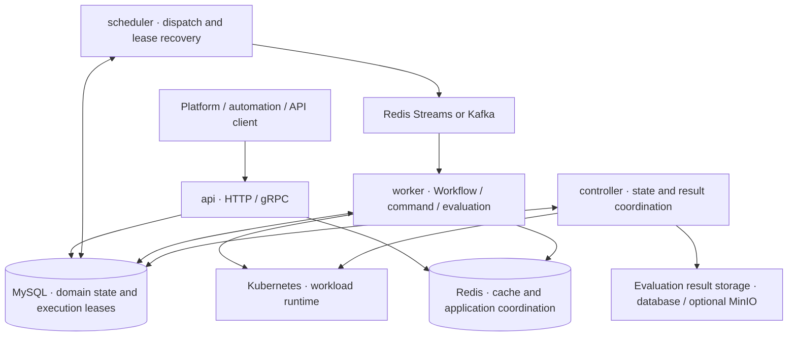

[English](./README.md) | [简体中文](./README_zh.md)

# Eruun

> Status: Current. This README describes the implementation available today; future work is listed separately under “Capability boundaries and roadmap.”

A distributed runtime for agents, models, and AI workloads.

Eruun currently provides **a Kubernetes application and workflow runtime, standalone command jobs, and Harbor evaluation through standalone jobs or application workflows**. You declare components, runtime configuration, and execution steps through the API. Eruun persists tasks, dispatches execution, reconciles Kubernetes resources, and exposes status, logs, and results.

It serves as an execution backend for self-hosted platforms, bringing application deployment, batch tasks, and evaluation under the same workspace authorization and task execution mechanisms. Its longer-term direction is an AI runtime; general-purpose agent sessions, MCP tool governance, and dedicated model-serving APIs remain planned work.

[Use cases](#use-cases) · [Core concepts](#core-concepts) · [Current capabilities](#current-capabilities) · [Runtime architecture](#runtime-architecture) · [Capability boundaries and roadmap](#capability-boundaries-and-roadmap) · [Quick start](#quick-start) · [Documentation](#documentation)

## Use cases

| Scenario | What Eruun provides | What you need to provide |
| --- | --- | --- |
| Self-hosted application platforms and internal developer platforms | Applications that group services, databases, configuration, and deployment workflows; authorization through personal or team workspaces | A Kubernetes cluster, application images, a platform UI, and your business processes |
| Multi-component application delivery and operations | Sequential or DAG workflows, approvals, version updates, start/stop operations, failure cleanup, status, and logs | Component declarations, execution steps, storage, and network configuration |
| One-off container tasks | Submit a `command` Job directly, inspect its status, or cancel it without creating an application | An image, command, and inputs compatible with the workspace security policy |
| LLM evaluation | Upload native Harbor task packages, declare `type: job` with `traits.eval` as a standalone Job or application component, and retain rewards, trajectories, logs, and artifacts | Prebuilt task images, verifiers, Runner configuration, and Secret-backed credentials when using a model |
| Bringing existing Kubernetes applications into Eruun | Read-only observation or explicit adoption through dry-run and signed plans | Clear resource ownership, a supported resource scope, and adoption key configuration |

If you only need to apply a few Kubernetes manifests, Eruun’s database, queue, and four-role deployment add operational cost. These dependencies become more useful when you need durable tasks, workspace authorization, multi-component execution, and a common query interface.

## Core concepts

Eruun uses an OAM-inspired “components + traits + workflows” model, with two execution entry points: application workflows and standalone workspace Jobs.

| Concept | The question it answers | Examples and boundaries |
| --- | --- | --- |
| **Workspace** | Who can access resources, and where do tasks run? | Personal and team workspaces associate membership permissions with a namespace, quotas, and network policies |
| **Application** | Which components belong to the same application? | Groups an API, database, and configuration under one deployment and authorization boundary |
| **Component** | What should run or be generated? | Long-running services, stateful services, Jobs, CronJobs, ConfigMaps, and Secrets |
| **Trait** | How should a component run? | Storage mounts, environment variables, resource declarations, and probes attached to a component |
| **Workflow** | In which steps should component operations execute? | StepByStep/DAG execution, approvals, cancellation, timeouts, failure policies, and terminal callbacks |
| **Standalone Job** | How do you run a one-off task outside an application? | `type: command` tasks and `type: job` with `traits.eval` belong directly to a workspace, return a `taskId`, and require no `appId` |

For example, an application can contain a `webservice` API and a `store` database, use traits to declare PVCs, environment variables, and probes, and organize deployment through a Workflow. Evaluation uses `type: job` with `traits.eval`, submitted directly as a workspace Job or declared as a top-level application component and referenced by a Workflow `jobType: deploy` step. Both paths reuse the existing scheduler, execution records, and database leases.

## Current capabilities

| Capability | Available today | Detailed contract |
| --- | --- | --- |
| Application lifecycle | Create, execute, update versions, start, stop, restart, and clean up resources; management mode constrains write access | [Create and execute](docs/create-and-exec-application-api.md), [Version updates](docs/version-update-api.md), [Management modes](docs/application-management-mode.md) |
| Workflows | StepByStep/DAG execution, approval pause/resume, cancellation, timeouts, failure cleanup, callbacks, and execution recovery | [Execution architecture](docs/workflow-architecture-guide.md), [Approvals](docs/workflow-approval-pause-resume.md), [Failure policies](docs/workflow-failure-policy.md) |
| Standalone tasks and evaluation | `command` container tasks; standalone or application-workflow Harbor evaluation using `traits.eval`, with task packages, execution progress, complete results, and independent storage destinations | [Workspace Job API](docs/workspace-jobs-api.md), [Evaluation example](examples/agent-evaluation/README.md) |
| Programmatic integration | HTTP `/api/v1`, gRPC v1, canonical JSON Schema, Try validation, editable specification retrieval, submission idempotency, and `allowedActions` | [Canonical JSON](docs/canonical-json-profile.md), [gRPC](docs/grpc-api.md) |
| Runtime diagnostics | Application/component/task status, container information, log streams, log archives, file export, and shell execution | [Status](docs/application-status-api.md), [Logs](docs/component-log-stream-api.md), [Files and execution](docs/component-pod-file-exec-api.md) |
| Accounts and workspaces | Login sessions, personal/team workspaces, member roles, resource ownership, and Kubernetes workspace security baselines | [Accounts and workspaces](docs/account-auth-workspaces.md) |
| Existing resource adoption | Read-only `observe` mode, explicit `adopted` ownership, and controlled reconciliation/cleanup | [Namespace import](docs/import-existing-namespace-api.md) |

### Components and traits

| Component type | Execution target |
| --- | --- |
| `webservice` | A Deployment for a long-running stateless service |
| `store` | A StatefulSet for a service requiring stable identity or persistent storage |
| `job` / `scheduledjob` | An application-owned Kubernetes Job / CronJob |
| `config` / `secret` | A ConfigMap / Secret |
| `cloudjob` | A registered Provider/Action extension in the engine; current workspace application policy rejects submission |

The component model includes the following trait fields. **A field’s presence does not authorize every workspace to use it.** The platform also checks workspace, network, storage, and container permissions.

| Trait | Purpose and Kubernetes mapping |
| --- | --- |
| `storage` | PVCs, ConfigMaps, Secrets, ephemeral volumes, and mount paths |
| `envs` / `envFrom` | Individual environment variables and bulk imports from Secrets/ConfigMaps |
| `resources` | CPU, memory, and `nvidia.com/gpu` requests/limits |
| `eval` | Harbor evaluation configuration for standalone or top-level application `job` declarations; shares validation and Runner construction |
| `probes` | Liveness, readiness, and startup probes |
| `securityPolicy` | Container `securityContext`, subject to the workspace Restricted policy |
| `targetWorkEnv` | Pod `nodeSelector` |
| `rollout` | Deployment/StatefulSet update strategies |
| `init` / `sidecar` | Init and sidecar containers, with a restricted subset of nested traits |
| `service` / `ingress` | Service exposure and Ingress routing, subject to workspace port and domain rules |
| `share` | Reuse and lifecycle policies for shared resources within a namespace |
| `rbac` | The engine can generate ServiceAccounts/Roles/Bindings; current workspace policy rejects additional RBAC and arbitrary ServiceAccounts |

Resource generation, reconciliation, and cleanup paths handle `service` and `share`; the shared evaluation builder handles `eval`. See the [architecture and trait documentation](docs/架构文档.md) for the other traits’ processing order, nesting rules, and permission boundaries. Standalone Jobs accept their own subset of traits; they cannot use a complete component configuration unchanged.

## Runtime architecture

The same `eruun-server` binary starts one role selected by `--role` or `ERUUN_ROLE`, defaulting to `api`. The complete runtime combines four roles.



This diagram shows the main execution and data paths. See the [architecture diagrams](docs/architecture-diagrams.md) for additional dependency details and recovery sequences.

| Role | Responsibility | Scaling model |
| --- | --- | --- |
| `api` | HTTP/gRPC, authentication and authorization, validation, domain reads/writes, and task submission | Multiple replicas receive requests |
| `controller` | Global Kubernetes observation, state projection, delayed task/result coordination, evaluation result storage, and expiry cleanup | Replicas compete for a separate Controller Leader Lease |
| `scheduler` | Claim waiting tasks, dispatch messages, and reclaim expired execution leases | Replicas compete for a separate Scheduler Leader Lease |
| `worker` | Consume dispatches, claim and renew execution ownership, and run Workflows and standalone Jobs | Replicas execute concurrently; each Worker uses a local workload observer |

The main execution path is: **API persists the task → Scheduler dispatches it → Worker claims a lease and operates on Kubernetes → Worker saves execution progress while Controller projects runtime state**. A successful submission means the task was accepted; query application readiness and task completion separately. Evaluation execution, result collection, and each storage destination also have separate states.

| Dependency | Responsibility | Boundary |
| --- | --- | --- |
| MySQL | Applications, tasks, accounts, configuration, and execution lease/generation/token | Source of truth for durable task state and execution ownership |
| Redis | Cache, application mutation locks, cancellation signals, and default Redis Streams messaging | Still required when using Kafka |
| Kafka (optional) | Replaces Redis Streams as the workflow message transport | Does not own task state or replace database leases |
| Kubernetes | Container execution, resource reconciliation, scheduling, and isolation | Provides actual resource state; business queries primarily read database projections |
| MinIO (optional) | Stores complete evaluation result files | Database-only storage is supported; failed storage destinations can be retried independently |

The queue delivers messages at least once. Database leases and generation/token fencing prevent stale executors from overwriting newer state; external side effects still need idempotency or compensation. Four roles do not automatically provide data availability: the chart’s bundled MySQL and Redis are single-replica development dependencies. See [Helm deployment](docs/helm-deployment.md) for production topology guidance.

## Capability boundaries and roadmap

- **Product delivery:** The repository ships the server runtime, Helm/manifests, and API examples. Clients integrate using `curl` or gRPC. Eruun does not ship a client command-line application; the integrating platform provides its UI and business approval system.
- **Kubernetes:** An existing cluster is required. Eruun is not currently a cluster installer, multi-cluster control platform, or general-purpose cloud resource manager. Existing CloudJob extensions do not make general-purpose AI Providers available.
- **Permissions:** Platform login permissions, workload Kubernetes identities, and container permissions are checked separately. Current workspace policy rejects privileged/host capabilities, cross-namespace requests, additional RBAC, CloudJob, and NodePort/LoadBalancer, among other restrictions. Network isolation requires a CNI that enforces NetworkPolicy. See the [workspace security contract](docs/account-auth-workspaces.md).
- **Workflows:** There is no general-purpose step output dataflow, `dependsOn`, or conditional branching contract today. Standalone `command` Jobs do not support cron, delayed execution, or automatic reruns on failure; application `scheduledjob` components and Workflow schedules have their own contracts.
- **Evaluation:** `traits.eval` uses a fixed Harbor adapter. The model is the object of evaluation; `agent` selects the harness that executes the task. The platform pulls prebuilt images; it does not build the Dockerfiles in task packages online or accept arbitrary evaluation frameworks or Python adapters. The trait is restricted to standalone or top-level application `job` declarations. Evaluation rewards and successful task execution are distinct outcomes.
- **AI capabilities:** Resource declarations and container execution do not imply support for agent sessions/memory, MCP authorization and auditing, dedicated vLLM deployment, or GPU-aware scheduling.

| Stage | Scope |
| --- | --- |
| Current | The Application/Workflow capabilities, four-role runtime, workspace authorization, standalone command Jobs, and Harbor evaluation through both execution entry points described here |
| Next | Self-hosted agent execution contracts, MCP/CLI tool bindings, credential delegation, tool permissions and auditing, and more evaluation frameworks |
| Later | Model serving, GPU-aware scheduling, vectorization, managed AI Providers, and cloud or multi-cluster execution |

The [AI runtime vision](docs/ai-runtime-vision.md) explains the direction of development. `Draft / Proposal` documents are not promises of existing APIs or deployment capabilities. Current behavior is defined by the implementation and the Current documents in the [documentation index](docs/README.md).

## Quick start

### 1. Deploy the four-role runtime

Prepare Bash, `kubectl`, OpenSSL, Helm, and access to a Kubernetes cluster. The cluster must support NetworkPolicy and Restricted v1.34 Pod Security, with storage available for the MySQL/Redis PVCs; see [Helm deployment](docs/helm-deployment.md). Installing published images requires neither Go nor Rust.

Prepare `/secure/eruun/accounts.json` from the [account configuration example](deploy/accounts.example.json). Replace credential and cluster network placeholders, and disable login providers you do not need. Keep the file outside the repository with mode `0600`. See [account and workspace deployment](docs/account-auth-workspaces.md) for the complete configuration contract.

Run from the repository root:

```bash
AUTH_CONFIG_FILE=/secure/eruun/accounts.json INSTALL_MODE=helm \
  ./deploy/all_in_one_install_quickstart.sh

kubectl -n eruun-system port-forward svc/eruun 8000:8000
```

The installer deploys all four roles plus MySQL and Redis. On the first installation, it generates random database/cache passwords when none are supplied and passes them through temporary files with mode `0600` and Kubernetes Secrets. Subsequent installations reuse existing credentials. Leave `port-forward` running and check from another terminal:

```bash
export ERUUN_URL=http://127.0.0.1:8000
curl --fail "$ERUUN_URL/api/v1/healthz"
curl --fail "$ERUUN_URL/api/v1/readyz"
```

### 2. Log in and submit a task

Follow the [account API examples](examples/account-auth-workspaces/README.md) to register/log in and obtain an access token and personal or team workspace ID. The bootstrap administrator must change their password and log in again first. Set `ACCESS_TOKEN` and `WORKSPACE_ID` in the current terminal; task submission requires the member role or higher in that workspace. Health checks do not require login; business APIs require a Bearer token and workspace authorization. Browser login, OAuth, and cookie refresh also require same-site HTTPS endpoints configured as described in the account documentation.

Submit a one-off command that runs in the workspace namespace:

```bash
curl --fail-with-body -X POST "$ERUUN_URL/api/v1/jobs" \
  -H "Authorization: Bearer $ACCESS_TOKEN" \
  -H "X-Eruun-Workspace-ID: $WORKSPACE_ID" \
  -H 'Content-Type: application/json' \
  --data-binary @- <<'JSON'
{
  "name": "hello-eruun",
  "type": "command",
  "spec": {
    "image": "busybox:1.37.0",
    "command": ["sh", "-c"],
    "args": ["echo hello-eruun"],
    "timeoutSeconds": 300
  },
  "traits": {
    "securityPolicy": {"runAsUser": 1000, "runAsNonRoot": true},
    "resources": {"cpu": "100m", "memory": "128Mi", "cpuLimit": "500m", "memoryLimit": "256Mi"}
  }
}
JSON
```

A successful submission returns HTTP 202, with `data.taskId` identifying this execution. Put that value in the command below and query until the task reaches a terminal state. Submitting again creates a new task.

```bash
TASK_ID='<returned data.taskId>'
curl --fail-with-body "$ERUUN_URL/api/v1/jobs/$TASK_ID" \
  -H "Authorization: Bearer $ACCESS_TOKEN" \
  -H "X-Eruun-Workspace-ID: $WORKSPACE_ID"
```

To try application deployment next, validate a declaration using [canonical Application JSON and Try](docs/canonical-json-profile.md), then call the [create-and-execute API](docs/create-and-exec-application-api.md). To try evaluation, first configure the Runner, task images, and task package following the [Harbor example](examples/agent-evaluation/README.md). The default installation does not enable evaluation automatically.

## Configuration and local development

Configure the server through flags or `ERUUN_` environment variables; for example, `--bind-addr` maps to `ERUUN_BIND_ADDR`. See the [default configuration](config/apiserver-default.yaml) and `go run ./cmd/main.go --help` for configuration details and the full flag list.

| Configuration | Purpose |
| --- | --- |
| `ERUUN_ROLE` | `api` / `controller` / `scheduler` / `worker`; defaults to `api`; there is no `all` role |
| `ERUUN_BIND_ADDR` / `ERUUN_GRPC_BIND_ADDR` | Local HTTP defaults to `127.0.0.1:8001`; API gRPC defaults to `127.0.0.1:9001`; cluster deployments use 8000 / 9000 respectively |
| `ERUUN_DATASTORE_URL` | The actual MySQL DSN; the password placeholder must be replaced |
| `ERUUN_CACHE_HOST` / `ERUUN_CACHE_PASSWORD` | Redis connection configuration |
| `ERUUN_MSG_TYPE` / `ERUUN_MSG_KAFKA_BROKERS` | Redis Streams by default; configure brokers when selecting Kafka, and retain Redis |
| `ERUUN_AUTH_CONFIG_FILE` | Account, session, and workspace policy JSON |
| `ERUUN_JOBS_CONFIG_FILE` | Enables the Harbor Runner and optional MinIO; use the same configuration for all four roles |

Local source development requires Go 1.27, plus GNU Make when using Make targets. Start and configure MySQL, Redis, and optional Kafka using the [local dependencies guide](docs/local-docker-dependencies.md), prepare account configuration and Kubernetes access, then start the API:

```bash
go run ./cmd/main.go --role=api
```

This starts only the API. End-to-end execution requires the other three roles, as described in [distributed deployment and role dependencies](docs/enterprise-distributed-runtime-design.md). Processes on the same machine need different HTTP listening ports, and Controller/Scheduler need the correct Leader Election namespace. Complete database schema migration before starting other roles in validation mode; see the [Helm schema contract](docs/helm-deployment.md).

Common development checks:

```bash
make build
go test ./... -race -cover
go vet ./...
```

`make build` verifies the build and discards the binary. To produce an executable, use `go build -o eruun-server ./cmd/main.go`. See [AGENTS.md](AGENTS.md) and the [documentation index](docs/README.md) for module routing, validation, and contribution rules.

## Documentation

| What you want to understand | Start here |
| --- | --- |
| Documentation status, current behavior, and code locations | [Documentation index](docs/README.md) |
| Domain model, traits, permissions, and module boundaries | [Architecture](docs/架构文档.md), [Cross-layer field contracts](docs/core-module-boundary-and-cross-layer-contracts.md) |
| Four roles, execution sequences, leases, and failure recovery | [Architecture diagrams](docs/architecture-diagrams.md), [Workflow architecture](docs/workflow-architecture-guide.md), [Distributed runtime](docs/enterprise-distributed-runtime-design.md) |
| API and automation integration | [Canonical JSON](docs/canonical-json-profile.md), [gRPC](docs/grpc-api.md), [Account examples](examples/account-auth-workspaces/README.md) |
| Deployment and workspace isolation | [Helm](docs/helm-deployment.md), [Accounts and workspaces](docs/account-auth-workspaces.md), [Local dependencies](docs/local-docker-dependencies.md) |
| Commands, evaluation, task packages, and results | [Workspace Job API](docs/workspace-jobs-api.md), [Evaluation example](examples/agent-evaluation/README.md), [Runner](pkg/apiserver/jobs/runners/harbor/README.md) |
| Future AI runtime direction | [Vision and roadmap (Draft / Proposal)](docs/ai-runtime-vision.md) |

## License

Eruun is licensed under the MIT License. See [LICENSE](LICENSE).
