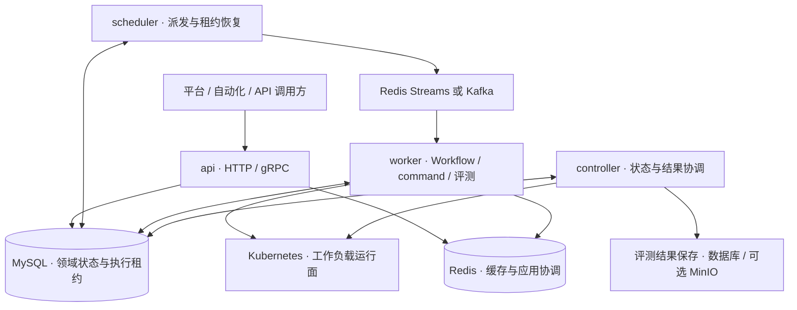

[English](./README.md) | [简体中文](./README_zh.md)

# Eruun

> 状态：Current。本文介绍当前实现；未来方向单独列在「能力边界与路线图」。

面向 Agent、模型与 AI 工作负载的分布式运行时。

Eruun 当前提供 **Kubernetes 应用与工作流运行时、独立命令任务，以及独立或应用 Workflow 内的 Harbor 评测**。你通过 API 声明组件、运行配置和执行步骤，Eruun 负责持久化任务、派发执行、调和 Kubernetes 资源，并提供状态、日志和结果查询。

它适合作为自托管平台的执行后端：把应用部署、批处理和评测接到同一套空间授权与任务执行机制上。长期方向是 AI Runtime；通用 Agent 会话、MCP 工具治理和模型服务专用 API 仍在规划中。

[适用场景](#适用场景) · [核心概念](#核心概念) · [当前能力](#当前能力) · [运行架构](#运行架构) · [能力边界与路线图](#能力边界与路线图) · [快速开始](#快速开始) · [文档导航](#文档导航)

## 适用场景

| 场景 | Eruun 提供什么 | 接入方需要准备什么 |
| --- | --- | --- |
| 自托管应用平台、内部开发平台 | 用 Application 管理服务、数据库、配置和部署流程；按个人或团队空间授权 | Kubernetes 集群、应用镜像、平台界面及自身业务流程 |
| 多组件应用发布与运维 | 串行或 DAG 工作流、审批、版本更新、启停、失败清理、状态与日志 | 组件声明、执行步骤、存储和网络配置 |
| 一次性容器任务 | 直接提交 `command` Job，查询状态或取消，无需先创建应用 | 可在空间安全策略下运行的镜像、命令和输入 |
| LLM 评测 | 上传 Harbor 原生任务包，以 `type: job` + `traits.eval` 声明独立 Job 或应用组件，保存奖励、轨迹、日志与制品 | 预构建任务镜像、verifier、Runner 配置；使用模型时提供 Secret 凭据 |
| 已有 Kubernetes 应用接入 | 只读观察，或经过 dry-run 与签名计划显式接管已有资源 | 明确资源归属、支持的资源范围及接管密钥配置 |

如果需求只是提交几份 Kubernetes 清单，Eruun 的数据库、队列和四角色部署会增加运维成本。需要任务持久化、空间授权、多组件执行和统一查询时，这些基础设施才更有价值。

## 核心概念

Eruun 采用 OAM 启发的「组件 + Traits + 工作流」模型，提供应用工作流和独立空间 Job 两种执行入口：

| 概念 | 回答的问题 | 示例与边界 |
| --- | --- | --- |
| **Workspace** | 谁可以访问资源，任务在哪里运行？ | 个人/团队空间关联成员权限、namespace、配额和网络策略 |
| **Application** | 哪些组件属于同一个应用？ | 将 API、数据库及配置作为一个部署与权限归属单元 |
| **Component** | 要运行或生成什么？ | 长期服务、持久化服务、Job、CronJob、ConfigMap、Secret |
| **Trait** | 组件怎样运行？ | 挂载存储、注入环境变量、声明资源与探针；附着于组件 |
| **Workflow** | 按什么步骤执行组件操作？ | StepByStep/DAG、审批、取消、超时、失败策略与终态回调 |
| **独立 Job** | 如何运行不属于应用的一次性任务？ | `type: command` 命令和 `type: job` + `traits.eval` 评测直接归属空间，返回 `taskId`，无需 `appId` |

例如，一个应用可以包含 `webservice` API 和 `store` 数据库，通过 Traits 声明 PVC、环境变量和探针，再由 Workflow 组织部署。评测使用 `type: job` + `traits.eval`，既可直接提交空间 Job，也可声明为应用顶层组件，由 Workflow 的 `jobType: deploy` 步骤引用。两条路径复用既有调度、执行记录和数据库租约。

## 当前能力

| 能力 | 当前支持 | 详细契约 |
| --- | --- | --- |
| 应用生命周期 | 创建、执行、版本更新、启停、重启、资源清理；写权限受管理模式约束 | [创建并执行](docs/create-and-exec-application-api.md)、[版本更新](docs/version-update-api.md)、[管理模式](docs/application-management-mode.md) |
| Workflow | StepByStep/DAG、审批暂停/继续、取消、超时、失败清理、回调与执行恢复 | [执行架构](docs/workflow-architecture-guide.md)、[审批](docs/workflow-approval-pause-resume.md)、[失败策略](docs/workflow-failure-policy.md) |
| 独立任务与评测 | `command` 容器任务；通过 `traits.eval` 声明独立或应用 Workflow 内的 Harbor 评测，支持任务包、执行进度、完整结果和独立保存目标 | [空间 Job API](docs/workspace-jobs-api.md)、[评测示例](examples/agent-evaluation/README.md) |
| 程序化接入 | HTTP `/api/v1`、gRPC v1、规范 JSON Schema、Try 校验、可编辑规范回读、提交幂等与 `allowedActions` | [Canonical JSON](docs/canonical-json-profile.md)、[gRPC](docs/grpc-api.md) |
| 运行诊断 | 应用/组件/任务状态、容器信息、日志流、日志归档、文件导出和 Shell 执行 | [状态](docs/application-status-api.md)、[日志](docs/component-log-stream-api.md)、[文件与执行](docs/component-pod-file-exec-api.md) |
| 账号与空间 | 登录会话、个人/团队空间、成员角色、资源归属和 Kubernetes 空间安全基线 | [账号与空间](docs/account-auth-workspaces.md) |
| 存量资源纳管 | `observe` 只读模式、显式 `adopted` 接管及受控调和/清理 | [Namespace 导入](docs/import-existing-namespace-api.md) |

### 组件与 Traits

| 组件类型 | 执行目标 |
| --- | --- |
| `webservice` | Deployment，承载长期运行的无状态服务 |
| `store` | StatefulSet，承载需要稳定身份或持久化存储的服务 |
| `job` / `scheduledjob` | 应用内 Kubernetes Job / CronJob |
| `config` / `secret` | ConfigMap / Secret |
| `cloudjob` | 引擎中的已注册 Provider/Action 扩展；当前空间应用策略拒绝提交 |

以下是组件模型已有的 Trait 字段。**字段存在不代表任意空间都获准使用**；平台会继续校验空间、网络、存储和容器权限。

| Trait | 用途与 Kubernetes 映射 |
| --- | --- |
| `storage` | PVC、ConfigMap、Secret、临时卷及挂载路径 |
| `envs` / `envFrom` | 单个环境变量及 Secret/ConfigMap 批量导入 |
| `resources` | CPU、内存和 `nvidia.com/gpu` requests/limits |
| `eval` | 独立或应用顶层 `job` 的 Harbor 评测配置；共用校验和 Runner 构建路径 |
| `probes` | liveness、readiness、startup 探针 |
| `securityPolicy` | 容器 `securityContext`，仍受空间 Restricted 策略约束 |
| `targetWorkEnv` | Pod `nodeSelector` |
| `rollout` | Deployment/StatefulSet 更新策略 |
| `init` / `sidecar` | Init 容器和 Sidecar，可使用受限制的嵌套 Traits |
| `service` / `ingress` | Service 暴露与 Ingress 路由，受空间端口和域名规则约束 |
| `share` | namespace 内共享资源的复用与生命周期策略 |
| `rbac` | 引擎可生成 ServiceAccount/Role/Binding；当前空间策略拒绝额外 RBAC 和任意 ServiceAccount |

`service` 和 `share` 由资源生成、调和与清理路径处理；`eval` 由共享评测构建路径处理。其他 Trait 的处理顺序、嵌套规则和权限边界见 [架构与 Trait 文档](docs/架构文档.md)。独立 Job 只接受自己的 Trait 子集，不能直接套用完整组件配置。

## 运行架构

同一个 `eruun-server` 二进制通过 `--role` / `ERUUN_ROLE` 启动一种角色；默认是 `api`。完整运行时由四种角色协作组成。



图中展示主要执行与数据路径；更多依赖说明和恢复时序见 [架构图](docs/architecture-diagrams.md)。

| 角色 | 职责 | 扩展方式 |
| --- | --- | --- |
| `api` | HTTP/gRPC、认证授权、校验、领域读写和任务入队 | 多副本接收请求 |
| `controller` | Kubernetes 全局观察、状态投影、延迟任务/结果协调、评测结果保存与过期清理 | 多副本竞争独立 Controller Leader Lease |
| `scheduler` | 认领等待任务、派发消息、回收过期执行租约 | 多副本竞争独立 Scheduler Leader Lease |
| `worker` | 消费派发、认领/续租执行身份，运行 Workflow 和独立 Job | 多副本并行执行；每个 Worker 使用本地 workload observer |

一次执行的主要过程是：**API 保存任务 → Scheduler 派发 → Worker 认领租约并操作 Kubernetes → Worker 保存执行进度，Controller 投影运行状态**。提交成功表示任务已接受，应用就绪与任务完成需继续查询；评测执行、结果采集和各保存目标也有各自状态。

| 依赖 | 负责什么 | 边界 |
| --- | --- | --- |
| MySQL | 应用、任务、账号、配置及 execution lease/generation/token | 持久化任务状态与执行所有权的事实源 |
| Redis | 缓存、应用变更锁、取消信号、默认 Redis Streams 消息 | 使用 Kafka 时仍需要 Redis |
| Kafka（可选） | 替代 Redis Streams 传输工作流消息 | 不持有任务状态，也不替代数据库租约 |
| Kubernetes | 运行容器、资源调和、调度和隔离 | 实际资源状态由 Kubernetes 提供，业务查询主要读取数据库投影 |
| MinIO（可选） | 评测结果的完整文件保存目标 | 可仅使用数据库保存；目标保存失败可单独重试 |

队列按至少一次语义交付。数据库租约与 generation/token fencing 防止旧执行者覆盖新状态；外部副作用仍需要幂等或补偿设计。四角色部署也不自动带来数据高可用：Chart 内置 MySQL、Redis 是单副本开发依赖，生产拓扑见 [Helm 部署](docs/helm-deployment.md)。

## 能力边界与路线图

- **产品交付**：仓库提供服务端运行时、Helm/Manifest 和 API 示例。客户端使用 `curl` 或 gRPC 接入；Eruun 不提供客户端命令行应用，平台界面与业务审批系统由接入方建设。
- **Kubernetes 边界**：需要已有集群。当前不是集群安装器、多集群控制平台或通用云资源管理平台；已有 CloudJob 扩展不代表通用 AI Provider 已可用。
- **权限边界**：平台登录权限、工作负载 Kubernetes 身份与容器权限分别校验。当前空间策略拒绝特权/宿主机能力、跨 namespace、额外 RBAC、CloudJob、NodePort/LoadBalancer 等请求；网络隔离依赖支持 NetworkPolicy 的 CNI。详见 [空间安全契约](docs/account-auth-workspaces.md)。
- **工作流边界**：当前没有通用步骤输出数据流、`dependsOn` 或条件分支契约。独立 `command` 不支持 cron、延迟执行或失败自动重跑；应用 `scheduledjob` 和 Workflow 调度有各自契约。
- **评测边界**：`traits.eval` 使用固定 Harbor 适配，模型是评测对象，`agent` 指定执行任务的 harness。平台拉取预构建镜像，不在线构建任务包中的 Dockerfile，也不接受任意评测框架或 Python adapter。该 Trait 仅适用于独立或应用顶层 `job`。评测奖励与任务执行成功是不同结果。
- **AI 能力边界**：已有资源声明和容器执行基础，不等于已有 Agent 会话/记忆、MCP 授权审计、vLLM 专用部署或 GPU 感知调度能力。

| 阶段 | 范围 |
| --- | --- |
| Current | 本文列出的 Application/Workflow、四角色运行时、空间授权、独立 command Job，以及两种执行入口中的 Harbor 评测 |
| Next | 自托管 Agent 执行契约、MCP/CLI 工具绑定、凭据委派、工具权限与审计、更多评测框架 |
| Later | 模型服务、GPU 感知调度、向量化、托管 AI Provider、云或多集群执行 |

[AI Runtime 愿景](docs/ai-runtime-vision.md) 说明演进方向。`Draft / Proposal` 不构成现有 API 或部署承诺；当前能力以 [文档索引](docs/README.md) 中的 Current 文档和实现为准。

## 快速开始

### 1. 部署四角色运行时

准备 Bash、`kubectl`、OpenSSL、Helm 和可访问的 Kubernetes 集群。集群需支持 NetworkPolicy 与 Restricted v1.34 Pod Security，并提供 MySQL/Redis PVC 所需存储；详见 [Helm 部署](docs/helm-deployment.md)。使用已有镜像安装不需要 Go 或 Rust 工具链。

按 [账号配置示例](deploy/accounts.example.json) 准备 `/secure/eruun/accounts.json`，替换密钥及集群网络等占位配置，停用不需要的登录提供方；文件应存于仓库外并限制为 `0600`。完整字段见 [账号与空间部署说明](docs/account-auth-workspaces.md)。

在仓库根目录执行：

```bash
AUTH_CONFIG_FILE=/secure/eruun/accounts.json INSTALL_MODE=helm \
  ./deploy/all_in_one_install_quickstart.sh

kubectl -n eruun-system port-forward svc/eruun 8000:8000
```

安装脚本部署四种角色及 MySQL、Redis；首次安装未提供数据库/缓存密码时会生成随机值，通过 `0600` 临时文件和 Kubernetes Secret 传递。后续安装复用已有凭据。`port-forward` 保持运行，在另一个终端检查：

```bash
export ERUUN_URL=http://127.0.0.1:8000
curl --fail "$ERUUN_URL/api/v1/healthz"
curl --fail "$ERUUN_URL/api/v1/readyz"
```

### 2. 登录并提交一个任务

按 [账号实操示例](examples/account-auth-workspaces/README.md) 完成注册/登录，取得访问 Token 和个人或团队空间 ID；初始管理员须先改密并重新登录。在当前终端设置 `ACCESS_TOKEN`、`WORKSPACE_ID`；提交任务需要该空间 member 或更高权限。健康检查不需要登录，业务 API 需要 Bearer Token 和空间授权。浏览器登录、OAuth 与 Cookie 刷新还需按账号文档配置同站 HTTPS 入口。

下面提交一个在空间 namespace 内运行的一次性命令：

```bash
curl --fail-with-body -X POST "$ERUUN_URL/api/v1/jobs" \
  -H "Authorization: Bearer $ACCESS_TOKEN" \
  -H "X-Eruun-Workspace-ID: $WORKSPACE_ID" \
  -H 'Content-Type: application/json' \
  --data-binary @- <<'JSON'
{
  "name": "hello-eruun",
  "type": "command",
  "spec": {
    "image": "busybox:1.37.0",
    "command": ["sh", "-c"],
    "args": ["echo hello-eruun"],
    "timeoutSeconds": 300
  },
  "traits": {
    "securityPolicy": {"runAsUser": 1000, "runAsNonRoot": true},
    "resources": {"cpu": "100m", "memory": "128Mi", "cpuLimit": "500m", "memoryLimit": "256Mi"}
  }
}
JSON
```

成功返回 HTTP 202，`data.taskId` 标识此次执行。将它填入下方命令，查询直到任务进入终态；再次提交会创建新任务：

```bash
TASK_ID='<返回的 data.taskId>'
curl --fail-with-body "$ERUUN_URL/api/v1/jobs/$TASK_ID" \
  -H "Authorization: Bearer $ACCESS_TOKEN" \
  -H "X-Eruun-Workspace-ID: $WORKSPACE_ID"
```

继续体验应用部署时，按 [规范 Application JSON 与 Try](docs/canonical-json-profile.md) 校验声明，再调用 [创建并执行 API](docs/create-and-exec-application-api.md)。体验评测时，先按 [Harbor 示例](examples/agent-evaluation/README.md) 配置 Runner、任务镜像和任务包；默认安装不会自动启用评测。

## 配置与本地开发

服务端参数通过 flags 或 `ERUUN_` 环境变量设置，例如 `--bind-addr` 对应 `ERUUN_BIND_ADDR`。完整参数见 [默认配置](config/apiserver-default.yaml) 和 `go run ./cmd/main.go --help`。

| 配置 | 用途 |
| --- | --- |
| `ERUUN_ROLE` | `api` / `controller` / `scheduler` / `worker`；默认 `api`，没有 `all` |
| `ERUUN_BIND_ADDR` / `ERUUN_GRPC_BIND_ADDR` | 本地 HTTP 默认 `127.0.0.1:8001`，API gRPC 默认 `127.0.0.1:9001`；集群分别使用 8000 / 9000 |
| `ERUUN_DATASTORE_URL` | 实际 MySQL DSN，必须替换密码占位符 |
| `ERUUN_CACHE_HOST` / `ERUUN_CACHE_PASSWORD` | Redis 连接配置 |
| `ERUUN_MSG_TYPE` / `ERUUN_MSG_KAFKA_BROKERS` | 默认 Redis Streams；选择 Kafka 时配置 Broker，仍保留 Redis |
| `ERUUN_AUTH_CONFIG_FILE` | 账号、会话与空间策略 JSON |
| `ERUUN_JOBS_CONFIG_FILE` | 启用 Harbor Runner 及可选 MinIO，四种角色使用相同配置 |

本地源码开发需要 Go 1.27；使用 Make 目标时需 GNU Make。先按 [本地依赖说明](docs/local-docker-dependencies.md) 启动并配置 MySQL、Redis 和可选 Kafka，准备账号配置及 Kubernetes 访问，再启动 API：

```bash
go run ./cmd/main.go --role=api
```

该命令只启动 API。端到端执行需按 [分布式部署与角色依赖](docs/enterprise-distributed-runtime-design.md) 运行其余三种角色；同机进程使用不同 HTTP 监听端口，Controller/Scheduler 还需正确配置 Leader Election namespace。数据库先完成 schema 迁移，再让其他角色以校验模式启动，具体规则见 [Helm 的 schema 契约](docs/helm-deployment.md)。

常用开发检查：

```bash
make build
go test ./... -race -cover
go vet ./...
```

`make build` 验证构建并丢弃二进制；需要可运行文件时使用 `go build -o eruun-server ./cmd/main.go`。维护者的模块定位、验证和贡献规则见 [AGENTS.md](AGENTS.md) 与 [文档索引](docs/README.md)。

## 文档导航

| 想了解什么 | 阅读入口 |
| --- | --- |
| 文档状态、当前事实与代码定位 | [文档索引](docs/README.md) |
| 领域模型、Traits、权限与模块边界 | [架构文档](docs/架构文档.md)、[跨层字段契约](docs/core-module-boundary-and-cross-layer-contracts.md) |
| 四角色、执行时序、租约与故障恢复 | [架构图](docs/architecture-diagrams.md)、[Workflow 架构](docs/workflow-architecture-guide.md)、[分布式运行时](docs/enterprise-distributed-runtime-design.md) |
| API 和自动化接入 | [Canonical JSON](docs/canonical-json-profile.md)、[gRPC](docs/grpc-api.md)、[账号示例](examples/account-auth-workspaces/README.md) |
| 部署与空间隔离 | [Helm](docs/helm-deployment.md)、[账号与空间](docs/account-auth-workspaces.md)、[本地依赖](docs/local-docker-dependencies.md) |
| 命令、评测、任务包和结果 | [空间 Job API](docs/workspace-jobs-api.md)、[评测示例](examples/agent-evaluation/README.md)、[Runner](runners/harbor/README.md) |
| AI Runtime 后续方向 | [愿景与路线图（Draft / Proposal）](docs/ai-runtime-vision.md) |

## 许可证

Eruun 使用 MIT License，详见 [LICENSE](LICENSE)。
