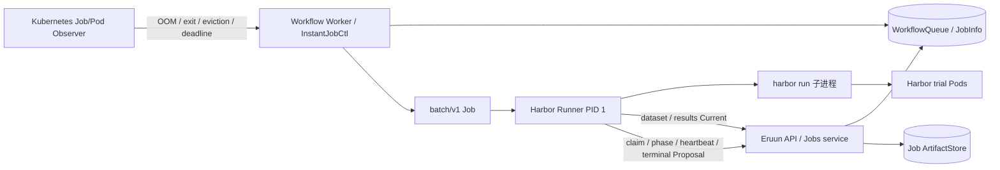

# Harbor Runner 单实例认领与阶段状态增量设计

> 状态：Draft / Proposal。`main` 已实现 Harbor 0.22.0 Runner、空间 `agent_evaluation` Job、任务包下载、最终结果上传和 ArtifactStore。本文只设计现有 Runner 的单实例认领、阶段、心跳与终态上报增强，不代表这些增强已经可用。

> 当前可执行契约以 [空间 Job API](workspace-jobs-api.md) 和 [Harbor Runner](../runners/harbor/README.md) 为准。本文中的事件名称、字段和入口均为概念设计，最终形式必须由实现、迁移和测试确定。

## 1. 定位与已确认决策

Harbor Runner 是 `agent_evaluation` Kubernetes Job Pod 中的主进程。它下载已验证的原生 Harbor 任务包，启动并监督 `harbor run`，收集原始输出，生成完整结果归档并通过 Eruun 内部 HTTP 接口上传。

Kubernetes 工作负载状态与评测业务状态并不等价：Pod `Running` 只说明 Runner 进程仍在运行，评测可能处于准备、执行或结果归档阶段，也可能已经发生可诊断的业务失败；Pod terminating 时还可能短暂出现 replacement Pod。增量协议先原子确定唯一执行者，再让 Runner 主动上报阶段状态；当整个 Runner OOM、崩溃、被驱逐或与节点一同丢失时，Eruun 仍使用 Kubernetes Job、Pod、容器终止状态和事件兜底。

| 决策 | 选择 |
| --- | --- |
| 使用范围 | 只扩展 `agent_evaluation`；不包装、不约束 `command` 用户镜像 |
| Kubernetes 载体 | 保持现有 `batch/v1 Job`，Pod `restartPolicy: Never`，Job `backoffLimit: 0` |
| 镜像 | 演进现有 `runners/harbor` 镜像，不创建新的通用基础镜像或 Runner 实体 |
| 进程模型 | Runner 作为容器主进程监督 Harbor 子进程，并主动向 Eruun 发出 HTTP 请求 |
| 业务状态 | 新增有界 phase/heartbeat/terminal 事件；不把 Pod Running 或 HTTP 成功单独当作最终 Job 状态 |
| 防重复执行 | 保留 Never 与零 backoff，并在启动 Harbor 前以现有执行身份和 Pod/Job UID 完成单实例 CAS 认领；认领写入现有 JobInfo/InternalInfo，不增加 claim 表或第二套状态机 |
| 结果 | 继续使用现有 results 接口和 ArtifactStore；状态事件不传输大型结果、日志或数据集正文 |
| 故障兜底 | Runner 能通信时提交业务证据；Runner 整体失效时由 Kubernetes 证据收敛 |

本设计不把 `config.JobType`、Kubernetes resource kind 和 Runner 协议混成一个分类。公开业务类型仍是 `agent_evaluation`，Kubernetes 载体仍由现有 builder 生成。

## 2. Current 基线与增量缺口

### 2.1 已实现能力

- `/api/v1/jobs` 接受 `agent_evaluation`，持久化认证空间的 WorkspaceID、服务端生成的 TaskID、JobSpec 和任务绑定能力。
- `pkg/apiserver/jobs/builder.go` 使用固定 Harbor Runner 镜像构建 `batch/v1 Job`，并设置执行 deadline 与结果归档宽限期。
- `runners/harbor/runner.py` 已作为容器主进程处理信号、启动 Harbor 子进程、判断原生结果、生成完整归档并重试上传。
- `GET /api/v1/job-runners/:taskID/dataset` 与 `POST /api/v1/job-runners/:taskID/results` 已提供任务包下载和最终结果上传。
- Runner 请求已绑定任务 Token、Pod 名称/UID、所属 Job UID、ExecutionKey、Job RunGeneration、Attempt 和当前恢复 checkpoint。
- 结果归档、内容摘要、完整性判断、MinIO/数据库保存、保留、下载与空间授权已经实现。
- Runner Pod 使用 namespace 级专用 ServiceAccount；当前 Role 为创建、观察、exec 和删除 trial Pods 提供 namespace 范围的 Pod 权限，且不允许读取 Secret。trial Pod 使用不挂载 API Token 的低权限身份。

### 2.2 尚未实现的增强

- Runner 主动上报 preparing、running、finalizing 等内部阶段。
- Runner 心跳、单调进度序号和控制面取消/停止响应。
- 子进程失败后、Runner 退出前可查询的脱敏诊断与 terminal 证据。
- replacement Pod 与原 Pod 可能并存时，启动 Harbor 前的单实例 CAS 认领。
- 状态事件的幂等、迟到写入隔离、持久化映射与运维指标。

首个增强不新增公共 Job 状态枚举、RunnerTask 表、消息队列消费者、反向 Pod RPC、Service 或 Ingress。claim owner 与事件游标写入现有 JobInfo/InternalInfo checkpoint；只有并发与故障测试证明这个事务边界仍不足时，才评估新的内部持久化结构。

## 3. 目标与非目标

目标：

- 在 Runner Pod 保持运行时表达评测准备、执行、结果整理和已知失败状态。
- 同一 execution identity/attempt 只允许一个 Pod UID 启动 Harbor，拒绝 replacement Pod 的重复业务执行。
- 采集 Harbor 子进程退出码、信号、有界错误摘要和结构化进度。
- 让 Eruun 持久化状态成为查询事实源，不依赖 Runner 内存或 Pod IP。
- 在控制面短暂不可用时幂等重试状态事件，不覆盖更新的执行或 attempt。
- 子进程失败时先尽可能保存诊断和终态，再让 Runner 以对应退出码结束。
- Runner 整体无法上报时，仍由 Kubernetes 终止状态、事件和 deadline 明确收敛。
- 保持评测业务结果、结果采集完整性和质量 verdict 相互可区分。

非目标：

- 不把 Runner 改为 Deployment、常驻服务、第二个 Worker 或 Kubernetes 控制器。
- 不改变 `command` Job 的镜像、入口、状态或结果语义。
- 不通过状态事件传输任务包、模型完整响应、无限日志或结果归档。
- 不让 terminal 事件绕过现有结果完整性校验和 Kubernetes Job 收敛。
- 不承诺外部模型调用或 Harbor trial 的 exactly-once。
- 不在 Proposal 中冻结新路由、数据库列、超时默认值或事件字段。

## 4. 总体架构



职责边界：

| 组件 | 负责 | 不负责 |
| --- | --- | --- |
| Jobs API/Domain | Runner 认证、事件校验与持久化、结果和制品授权 | 启动 Harbor、直接修改 Pod 内状态 |
| Workflow Worker / InstantJobCtl | 创建和观察当前身份的 Kubernetes Job，处理取消、超时和结果推进 | 解释每个 scorer 的业务结果 |
| Harbor Runner | 监督 Harbor、上报阶段和终态、上传结果、响应信号 | 选择 workspace、改变 execution ownership、直接写数据库 |
| Harbor/试验环境 | 执行 Agent、任务和 verifier，产生原始输出 | 决定 Eruun JobInfo 或 Workflow 最终状态 |
| Kubernetes Observer | 提供调度、镜像、Pod、容器、OOM、驱逐和节点故障证据 | 推断质量 verdict 或伪造业务进度 |
| ArtifactStore | 保存任务包、完整原始结果、摘要和目标副本 | 作为任务认证或运行状态事实源 |

Runner 只主动访问 Eruun，不需要 Eruun 连接短生命周期 Pod IP，也不需要为每个任务创建 Service、Ingress 或稳定 DNS。

## 5. 镜像与进程模型

现有 `runners/harbor/Dockerfile` 是 `agent_evaluation` 专用执行镜像。镜像以 UID/GID 1000 运行，入口为 `python /opt/eruun/runner.py`；Runner 是容器主进程，Harbor 是它监督的子进程。

如果后续引入 shell entrypoint，它只能校验只读启动文件并使用 `exec` 启动 Runner，不能承载状态机、HTTP 重试或子进程监督。例如：

```sh
#!/bin/sh
set -eu
exec python /opt/eruun/runner.py
```

增强后的主循环：

1. 校验 `ERUUN_JOB_CONFIG`、任务作用域凭据和本地写目录。
2. 通过内部状态协议 CAS 认领当前 execution identity/attempt；相同 Pod UID 重放幂等，其他 Pod 已认领时立即退出且不得启动 Harbor。
3. 使用现有 dataset 接口下载并核验任务包摘要。
4. 幂等提交 preparing 事件；事件失败按 deadline 内的有界退避处理。
5. 启动 `harbor run` 子进程，并转发 SIGTERM/SIGINT。
6. 在子进程运行期间提交 heartbeat 与有界 progress，不阻塞日志和结果采集。
7. 子进程结束后进入 finalizing，检查 Harbor 原生结果与采集完整性。
8. 使用现有 results 接口上传完全相同的最终归档字节，取得持久化确认。
9. 提交 terminal 事件；相同 terminal 可幂等重放，冲突 terminal 必须失败。
10. 按业务结果和采集完整性返回进程退出码，让 Kubernetes Job 正常收敛。

Runner 不在 terminal ACK 后常驻等待资源删除。最终生命周期仍由 Kubernetes Job 状态、现有 Worker 和 TTL/清理策略管理。

## 6. 状态模型与事实优先级

### 6.1 内部阶段

阶段只用于说明正在发生什么，不增加公共 Job 状态枚举：

| Runner phase | 含义 | 对外粗粒度状态 |
| --- | --- | --- |
| preparing | 校验配置、下载任务包、准备 Harbor 配置 | running |
| running | Harbor 正在运行任务和 verifier | running |
| finalizing | 子进程已停止，Runner 正在核验、归档和上传 | running |

succeeded/failed 属于 terminal outcome，不是可反复更新的 phase；即使收到 terminal，对外仍需等待结果完整性和 Kubernetes Job 收敛。取消和超时继续使用现有公共状态；Runner 可以在停止期间上报 phase/terminal 证据，但不能赢过已经持久化的取消或 timeout CAS。

### 6.2 事实优先级

1. `WorkflowQueue`、`JobInfo` 和 execution identity 是任务状态与 ownership 事实源。
2. 已持久化的结果归档是评测原始数据和采集完整性的事实源。
3. terminal 事件是可提前查询的业务终态证据，不能单独把 Job 标记为 completed。
4. Kubernetes Job/Pod 状态负责 Runner OOM、崩溃、驱逐、镜像拉取和调度失败等兜底。
5. phase 与 heartbeat 只表示进度和存活，缺失时不能推断成功。

最终成功至少要求：结果归档成功持久化、归档声明采集完整、Runner 成功退出且 Kubernetes Job 成功。任一关键证据缺失都不能因为曾收到 succeeded terminal 而标记成功。reward 为 0 可以是有效评测结果，不等于执行失败；质量门禁是独立的后续能力。

## 7. HTTP 状态协议

### 7.1 通信与认证

新状态操作复用当前 Runner 的出站 HTTP 和认证边界：

- 任务 Token 只用于 Eruun dataset/results/status 请求，不传给 Harbor 子进程或 trial Pod。
- 请求继续携带 `X-Eruun-Runner-Pod-Name` 与 `X-Eruun-Runner-Pod-UID`。
- 服务端重新读取任务、workspace、JobInfo、Pod 和 owner Job，校验 TaskID、Pod UID、ExecutionKey、RunGeneration、Attempt 与 live Job UID。
- workspace、execution identity 和权限从服务端记录派生，不相信请求体声明。
- 状态入口必须版本化、限制请求体大小，并复用当前 URL 安全和超时策略。

为避免端点膨胀，首个实现优先使用一个版本化内部事件入口承载 claim、phase、heartbeat、progress 和 terminal；具体路径与方法由实现 PR 确定，现有 dataset/results 接口保持不变。

### 7.2 概念事件

```json
{
  "protocolVersion": "concept-v1",
  "sequence": 12,
  "kind": "progress",
  "phase": "running",
  "observedAt": "runner diagnostic time",
  "progress": {
    "completedTrials": 2,
    "totalTrials": 5
  },
  "diagnostic": {
    "reason": "bounded stable reason code",
    "message": "redacted bounded summary"
  }
}
```

TaskID 和 Pod identity 已在 URL、认证与请求头中携带，不需要在请求体复制并信任。claim 以当前 execution identity、attempt 和 Pod UID 作为 owner；同一 owner 重放幂等，不同 Pod UID 的 claim 返回权威冲突。claim 成功后的 `sequence` 在该 owner 内单调递增；服务端接收时间用于排序和审计，Runner 时间只作诊断。

terminal 事件可以补充 outcome、子进程 exit code/signal、结果归档摘要或已确认 artifact ID，以及独立 quality verdict。大型结果、完整日志、提示词、模型响应、Secret 和 Token 不进入事件体。

### 7.3 幂等与 ACK

- 相同 sequence 与相同内容重复提交，返回相同接受结果。
- 更旧 sequence 忽略或拒绝，并返回最后已确认序号。
- 同一 execution identity/attempt 的 claim 以 CAS 只接受一个 Pod UID；同一 owner 重放返回原结果，不同 Pod 不得夺取仍有效的认领。
- 相同 terminal 重放幂等；不同 terminal、不同归档摘要或已被取代的执行返回权威冲突。
- 服务端只在事件已经持久化后 ACK；数据库失败、超时或不明确 5xx 不能当作成功。
- Runner 在绝对 deadline 内有界重试；重试不能延长任务期限，也不能重新启动 Harbor。
- 任务已取消、超时或 execution identity 已被替换时，响应要求 Runner 停止新工作并进入现有收尾路径。

`restartPolicy: Never` 只禁止 kubelet 重启已退出容器，`backoffLimit: 0` 只禁止 Job 在失败已计数后继续重试；当前 Job 未配置可消除 terminating replacement 窗口的额外单实例机制。因此 claim 是本增强的前置门禁，而不是可选优化。服务端在现有 JobInfo/InternalInfo 事务边界保存 owner Pod UID 及其 execution identity/attempt，不新建 claim 表或 RunnerTask 实体。

## 8. 执行与恢复时序

### 8.1 正常执行

```text
POST /api/v1/jobs (agent_evaluation)
  -> persist WorkspaceID / TaskID / JobSpec / task capability
  -> Scheduler and Worker establish execution ownership
  -> persist JobInfo ExecutionKey / RunGeneration / Attempt
  -> create batch/v1 Job
  -> Runner claims the execution for its Pod UID
  -> Runner downloads verified dataset
  -> phase(preparing)
  -> start harbor run
  -> heartbeat / progress(running)
  -> child exits; phase(finalizing)
  -> upload native result archive through current results API
  -> terminal(succeeded or failed)
  -> Runner exits
  -> Kubernetes Job settles
  -> Eruun exposes final status and starts configured result deliveries
```

### 8.2 Worker 或控制面恢复

- Runner 的任务 Token 与 Job execution identity 不等同于 Worker 的 lease token；Worker 换代本身不使仍有效的 Runner 请求失效。
- 新 Worker 通过持久化 JobInfo 和 live Job UID 恢复观察；旧 Worker 不能凭本地快照推进状态或删除资源。
- 状态 API/数据库短暂不可用时，Runner 继续监督子进程并有界重试事件；最终结果仍通过现有 results 事务校验。
- 已持久化结果或 terminal 的重放必须幂等；被新 execution identity/attempt 取代的迟到事件和结果拒绝写入。
- 若 Kubernetes 在旧 Pod terminating 时创建 replacement Pod，只有已持久化 claim 的 owner 可以继续执行；replacement claim 冲突后必须退出，不能启动第二个 Harbor。

### 8.3 Pod、Runner 与显式重试

- `restartPolicy: Never` 禁止 kubelet 重启已退出容器；`backoffLimit: 0` 禁止 Job 在失败已计数后继续重试，但不单独排除 terminating replacement Pod。
- Runner 未取得 claim 时不得下载敏感任务数据、启动 Harbor 或产生外部业务副作用；认领冲突时立即退出。
- 已认领 Runner 在启动 Harbor 前失败时，当前 attempt 依据 Kubernetes 证据失败；replacement Pod 不能夺取同一 claim 隐式继续。
- Runner 在 Harbor 启动后整体失败时，当前 attempt 依据 Kubernetes 证据失败；只有显式新 execution identity/attempt 才能重新认领并执行。
- 只有 Eruun 的显式恢复或重试策略建立新的 execution identity/attempt 后才能重新执行，并继续受原任务 deadline 与预算约束。

## 9. 失败处理矩阵

| 场景 | 主要证据 | 必须行为 |
| --- | --- | --- |
| Harbor 子进程非零退出或原生 trial error | Runner wait 与 Harbor 原生结果 | 进入 finalizing，尽可能归档，提交 failed terminal，再以失败退出 |
| 只有子进程被 SIGKILL | Runner wait signal | 无可靠 cgroup 证据时报告 killed，不仅凭 137 宣称 OOM |
| Runner 容器 OOMKilled | Pod container termination 与 claim | 无法要求最后一次 HTTP；当前 attempt 失败，replacement Pod 的同一 attempt claim 被拒绝，保留此前已持久化证据 |
| Pod Evicted、节点丢失或 Pod 消失 | Job/Pod condition 与 Event | Kubernetes 兜底失败；不把最后 heartbeat 当作成功 |
| 镜像拉取、挂载、调度或启动失败 | Pod condition/Event 与 deadline | 明确基础设施失败，不创建伪业务 phase/terminal |
| heartbeat 中断但 Pod 仍 Running | 最后服务端接收时间、Pod 状态、deadline | 标记状态陈旧并继续诊断；不能推断成功或擅自延长 deadline |
| 状态 HTTP 暂时失败 | 请求结果与最后 ACK | 有界退避重试；不重启 Harbor，不影响 Kubernetes 故障兜底 |
| result 已提交但 terminal ACK 丢失 | ArtifactStore 记录与事件幂等键 | 重放相同 terminal；不能生成第二份冲突结果 |
| terminal succeeded 但归档缺失或不完整 | terminal、artifact 与 collectionComplete | 最终不得成功；按采集失败处理并保留诊断 |
| terminal 已存但 Runner 随后 OOM | 已存 terminal 与 Pod termination | 不覆盖已存业务证据，但最终状态仍按结果完整性和 Job 收敛规则计算 |
| 取消或超时 | WorkflowQueue 状态、deadline、Job 删除 | 权威停止路径继续生效；Runner 在 termination grace 内尽量上传部分诊断 |
| 旧 Pod 或旧 attempt 迟到上报 | Pod UID、Job UID、ExecutionKey、RunGeneration、Attempt | fail-closed，当前状态、制品和 verdict 不变 |
| 旧 Pod terminating 时出现 replacement Pod | 当前 claim owner 与 replacement Pod UID | 只有原 owner 可以执行；replacement 在启动 Harbor 前收到冲突并退出 |

HTTP 增强只能缩小业务状态盲区，不能保证硬 OOM、节点丢失或进程被强杀前一定产生最后事件。不可丢失的数据仍必须在运行期间分批持久化；该 checkpoint 能力不属于首个阶段协议的默认承诺。

## 10. 日志、结果与 checkpoint

- 现有 Runner 继续将 Harbor 原始输出写入 `/work/evaluation-*/outputs`，最终打包为受限制的 tar.gz 并通过 results API 上传。
- 阶段事件只携带有界计数、稳定 reason code 和脱敏摘要；完整日志与原始结果不复制进 JobInfo。
- 现有结果大小、条目、路径和链接安全限制继续生效；状态协议不得绕过 `collectionComplete` 或 diagnostic-only 语义。
- Runner 分别保留子进程退出信息和有界日志尾部用于诊断，不记录任务 Token、模型凭据或未授权正文。
- 如果后续增加阶段性 checkpoint，应复用 ArtifactStore、内容摘要和 workspace 授权，并绑定 TaskID、ExecutionKey、RunGeneration、Attempt；相同 checkpoint 重试不得产生不可追踪副本。
- 节点丢失时只能保证此前已经上传或持久化的数据，Pod 本地 emptyDir 不是持久保存。

## 11. 取消、超时与信号

- WorkflowQueue 的取消状态与持久化绝对 deadline 是权威来源，Runner 本地计时不能延长预算。
- Worker 的 fenced Job 删除继续是权威停止机制；heartbeat 响应可以更早通知 Runner 停止新 trial。
- Runner 收到 SIGTERM/SIGINT 后向 Harbor 进程组转发优雅终止，宽限期耗尽再强制结束，并尝试上传允许的部分诊断。
- 评测 timeout 继续包含现有结果归档宽限期；状态重试必须与上传共享有界 finalization 预算，不能无限阻止 Pod 退出。
- 外部取消或 timeout 已赢得状态 CAS 后，迟到 succeeded/failed terminal 不能覆盖它。

## 12. Kubernetes Job 与安全契约

外层 `agent_evaluation` Job 保持以下 Current 约束：

- 使用 `batch/v1 Job`，Pod `restartPolicy: Never`，Job `backoffLimit: 0`。
- 名称、labels、annotations、owner Job UID 和清理条件绑定 TaskID 与执行身份。
- 使用平台配置的显式 Runner 镜像和 `python /opt/eruun/runner.py`，用户不能覆盖 Runner 镜像、命令或 Pod 模板。
- 使用 non-root UID/GID 1000、禁止提权、drop ALL capabilities、RuntimeDefault seccomp、只读根文件系统和可写 `/work` emptyDir。
- 明确 requests/limits、`activeDeadlineSeconds`、termination grace 和 `ttlSecondsAfterFinished`；阶段协议不改变这些值的 Current 来源。
- 不创建 Service、Ingress、PDB、HPA 或稳定网络身份。
- 资源删除和恢复必须匹配 live Job UID 与持久化 execution identity，不删除同名 replacement；执行资格另由 claim owner 决定。

Runner Pod 使用 `eruun-evaluation-runner` ServiceAccount，并为该 Pod 显式挂载 API Token，因为 Harbor ACK backend 需要在本 namespace 创建、观察、exec 和删除 trial Pods。对应 Role 只允许：

- Pods：`get/list/watch/create/delete`。
- Pods/exec：`get/create`。

该身份不具有 Secret 读取权限，但 Kubernetes RBAC 不能按 label 把上述 create/delete/exec 动作限制到“本任务 trial Pods”，所以当前 Role 的 Pod 权限实际覆盖整个 namespace；“只操作 trial Pods”目前是 Runner 行为约束，不是 RBAC 强制边界。模型凭据由平台按已授权 Secret 引用注入 Runner 环境；任务 Token 与 Kubernetes Token 相互独立。trial Pod 使用另一低权限 ServiceAccount，禁止挂载 API Token，并继承 Restricted Pod Security、资源上限、namespace 和执行 deadline。用户不能通过 Job 输入覆盖两类 ServiceAccount、RBAC 或 NetworkPolicy。若产品要求平台强制 trial-only，必须另行验证 admission、受控 Pod 代理或更强 namespace 隔离方案，状态协议本身不能宣称提供该隔离。

## 13. 可观察性

新增观测面最终名称由实现确定，至少覆盖：

- 当前 phase、最后接受 sequence、最后 heartbeat 接收时间和状态陈旧时长。
- progress/terminal 成功、幂等重放、冲突和旧执行拒绝计数。
- Harbor 子进程启动次数；同一 Job attempt 超过一次必须告警并使验收失败。
- 子进程退出码/信号、Runner OOM、Pod 驱逐和镜像/调度失败分类。
- 状态上报延迟、重试次数、请求大小和服务端拒绝原因。
- 结果归档成功、采集不完整、上传失败以及 terminal 与归档不一致计数。

指标 label 不包含 TaskID、Pod UID、目标 URL、提示词或其他高基数/敏感数据。单任务调查通过受控日志、Job 查询与审计记录完成。

## 14. 与现有模块的映射

| 需求 | 现有位置 | 增量边界 |
| --- | --- | --- |
| 公共提交、查询与内部 Runner API | `pkg/apiserver/interfaces/api/jobs.go`、`pkg/apiserver/jobs` | 在内部协议中增加状态事件，不改变公共 Job 请求 |
| 身份与持久化 | `WorkflowQueue`、`JobInfo`、jobs service/repository | 复用 ExecutionKey、RunGeneration、Attempt 和事务 fencing，在 JobInfo/InternalInfo 中保存 claim owner 与事件 checkpoint |
| Kubernetes Job 构建与观察 | `pkg/apiserver/jobs/builder.go`、`pkg/apiserver/event/workflow/job` | 保持 InstantJobCtl、Never、零 backoff 和现有清理 |
| Runner 进程 | `runners/harbor` | 在现有监督、上传和信号路径中插入有界事件客户端 |
| Runner SA/RBAC/NetworkPolicy | `pkg/apiserver/infrastructure/workspace/evaluation.go` | 保持现有权限；状态 API 不扩大 Kubernetes RBAC |
| 结果与制品 | `pkg/apiserver/jobs/artifacts` | 继续使用现有归档和保存路径；状态事件只引用已确认结果 |

不新增用户 CLI、新 Job 类型、通用 Runner 框架或第二套 ArtifactStore。

## 15. 实施阶段

### 阶段一：最小事件闭环

- 在现有 Runner 配置中加入概念上的状态入口，并实现 claim、preparing/running/finalizing/terminal。
- 复用当前 Runner identity 完成鉴权、单实例 CAS 认领、严格解码、请求大小限制和幂等 sequence。
- 保持 dataset/results、Runner 退出码和 Kubernetes Job 行为不变。

### 阶段二：心跳与恢复

- 增加 heartbeat、状态陈旧判断和 continue/cancel/stop 响应。
- 验证 API/DB 暂时故障、响应丢失、重复事件、Worker 接管和迟到旧 Pod。
- 确认状态重试不延长 deadline、不重新启动 Harbor。

### 阶段三：故障注入与运维

- 验证 Harbor 子进程失败、Runner OOM、Pod 驱逐、节点故障、取消和超时。
- 增加状态、冲突、上传完整性和兜底来源的指标、日志与告警。
- 只有真实需求证明必要时，再设计 checkpoint 或更细粒度进度。

## 16. 验收测试矩阵

| 类别 | 场景 | 通过条件 |
| --- | --- | --- |
| Current 回归 | 正常 Harbor 评测 | dataset/results、完整归档、退出码、保存目标和 Job 终态不变 |
| 状态阶段 | 固定评测成功 | phase 单调推进，最终结果确认后才提交 succeeded terminal |
| 子进程失败 | Harbor 非零或原生 trial error | Runner 仍能上报 finalizing/failed、上传诊断并以失败退出 |
| 自动防重 | 原 Pod terminating 时出现 replacement Pod | Never 与零 backoff 保持生效；同一 execution identity/attempt 只有一个 Pod UID claim 成功，其他 Pod 在启动 Harbor 前退出 |
| 事件幂等 | ACK 丢失后重试 | 相同 sequence/terminal 返回相同结果，不重复改变状态 |
| 事件冲突 | 同 sequence 不同内容或冲突 terminal | 请求拒绝并留审计，当前状态不变 |
| 旧执行隔离 | 旧 Pod、Job UID 或 attempt 迟到 | 鉴权失败，当前状态、结果和 verdict 不变 |
| HTTP 故障 | 状态入口超时或 5xx | 有界重试，不重启 Harbor，不阻止 deadline 兜底 |
| DB 故障 | 服务端无法持久化事件 | 不返回成功 ACK；恢复后相同事件可重放 |
| OOM | Runner 容器 OOMKilled | 无 terminal 仍由 Kubernetes 失败收敛；replacement Pod 不能用同一 attempt claim 重新执行 |
| 结果门禁 | succeeded terminal 但结果缺失/不完整 | 最终 Job 不成功，保留可诊断差异 |
| 取消/超时 | running 或 finalizing 时停止 | 终止子进程、尽量上传部分诊断，迟到 terminal 不覆盖权威状态 |
| 权限 | 伪造 token、Pod UID、Job UID 或 workspace | fail-closed，不泄露任务或敏感诊断 |
| Kubernetes RBAC | Runner 与 trial Pod | 准确验证 Runner 具有 namespace 范围的 Pod/pods-exec 权限且不能读取 Secret；trial Pod 无 API Token；若要求 trial-only，另有可执行的强制边界 |
| 范围回归 | `command` Job | 镜像、入口、执行、状态和清理完全不受状态协议影响 |

真实集群验收至少覆盖一次 Runner OOM、Pod 删除、控制面重启和网络中断。仅使用 fake client 不足以证明 Kubernetes 生命周期和事件顺序。

## 17. 升级为 Current 的门禁

本文的单实例认领与阶段状态增强升级为 Current 前必须具备：

1. Runner 事件客户端和服务端接收实现，协议有明确版本、大小和超时边界。
2. 事件认证、claim CAS、sequence/terminal 幂等、执行 fencing、replacement Pod 和迟到写入隔离测试。
3. Current dataset/results、ArtifactStore、保存策略和完整性判断的回归证据。
4. Never、零 backoff、deadline、取消、超时和显式重试语义的回归证据。
5. Harbor 子进程失败、Runner OOM、Pod/节点故障、API/DB 恢复的故障注入证据。
6. Runner SA、trial SA、NetworkPolicy、Secret 脱敏和日志安全验证。
7. 公共查询映射、运维指标、告警、升级与回滚文档。

未满足这些门禁前，Current 文档不能声称支持 phase、heartbeat 或 terminal 查询；但也不能否认已经存在的 Harbor Runner、内部 dataset/results 接口和结果制品能力。
