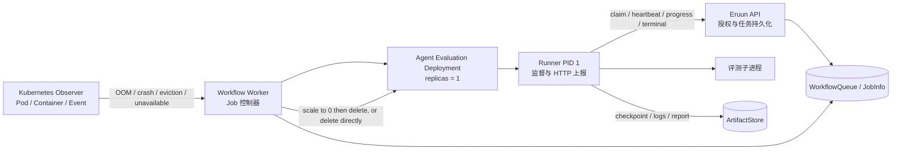

# Eruun Agent Evaluation Runner 小型进程服务设计

> 状态：Draft / Proposal。本文定义 Agent 评测 Runner 的目标架构、执行不变量和实施门禁，不代表当前已经存在 Runner 镜像、内部 HTTP 路由、数据库字段、制品存储实现或公开 API。

> 示例说明：文中的状态名、字段名、HTTP 操作和镜像启动片段都是概念示例，不可直接作为已冻结契约。实现 PR 必须根据代码、迁移、测试和部署证据确定最终形式。

## 1. 定位与已确认决策

Agent Evaluation Runner 是运行在评测 Deployment 中的小型监督进程。它启动真正的评测子进程，持续采集业务进度、结果和错误，并通过出站 HTTP 把这些信息提交给 Eruun 控制面。它遵循 [AI Runtime 总纲](ai-runtime-vision.md)的任务身份和 Job 类型边界，并为 [Agent 评测任务](agent-evaluation-job-design.md)提供具体的数据面运行协议。

Runner 解决的是 Kubernetes 工作负载状态与评测业务状态不等价的问题：Pod `Running` 或 `Ready` 只说明 Runner 载体可用；评测可能仍在准备、运行、上传结果，也可能已经失败。反过来，Runner 或整个容器发生 OOM、崩溃或失联时，HTTP 可能无法上报，Eruun 仍须通过 Kubernetes Pod、容器状态和事件完成基础设施兜底。

本设计确认以下边界：

| 决策 | 设计选择 |
| --- | --- |
| 使用范围 | Runner 只用于 `agent_evaluation`；不包装、不约束 `custom` 用户镜像 |
| Kubernetes 载体 | 每个需要独立载体的评测 Job 创建一个 Deployment，初始副本数为 1 |
| 进程模型 | Runner 作为容器主进程监督一个评测子进程；入口脚本只负责校验和 `exec` Runner |
| 业务状态 | Runner 主动通过 HTTP 向 Eruun 上报；Pod Ready 不是评测完成信号 |
| 防重复执行 | 评测开始前必须原子认领当前执行身份；同一 attempt 只允许一个 Runner 实例启动评测 |
| 终态收敛 | Runner 终态证据持久化后，控制器先将对应 Deployment 缩容到 0 再按 UID 删除，或直接按 UID 删除，并等待资源消失 |
| 数据持久化 | HTTP 状态只携带有界摘要和制品引用；日志、checkpoint 和大型结果进入受控 ArtifactStore |
| 当前代码关系 | 复用现有 Workflow、JobInfo、generation/token fencing、调度、取消、超时和 Kubernetes 观察链路，不新增平行任务实体或状态机 |

该 Runner 是 Eruun 数据面的执行适配，不是新的顶层产品实体、公共任务类型或独立调度器。`agent_evaluation` 仍通过现有 `config.JobType -> JobTask.JobType -> JobInfo.Type` 链路选择对应控制器。

## 2. 目标与非目标

### 2.1 目标

- 在 Pod 保持运行时表达评测的准备、执行、收尾和失败状态。
- 捕获评测子进程的退出码、信号、标准输出/错误摘要和结构化结果。
- 让 Eruun 持久化的任务状态成为事实源，不依赖某个 Pod 的内存或 IP。
- 通过执行身份认领阻止容器重启或 ReplicaSet 重建 Pod 后重复运行同一 attempt。
- 在控制面短暂不可用时重试进度和终态上报，不因一次网络失败丢失最终结果。
- 在 Runner 无法上报时，用 Pod/容器状态、事件、心跳超时和执行 deadline 收敛任务。
- 在任务运行期间阶段性保存 checkpoint、日志和结果，降低 Pod 丢失造成的数据损失。
- 保持评测业务 verdict 与执行成功、失败、取消、超时相互独立。

### 2.2 非目标

- 不为 `custom` Job 注入 entrypoint、sidecar、脚本或镜像继承要求。
- 不把 Runner 做成第二个 Eruun Worker、Scheduler、消息队列消费者或 Kubernetes 控制器。
- 不让 Runner 直接更新 Eruun 数据库、消息队列或 Kubernetes Deployment。
- 不把 Pod Ready、HTTP 健康探针或进程退出码单独当作评测业务终态。
- 不通过状态 HTTP 传输数据集正文、模型完整响应、大型日志或报告文件。
- 不承诺外部 Agent、模型调用或 Judge 副作用 exactly-once。
- 不在 Proposal 阶段冻结公共路由、请求字段、超时默认值、镜像地址或数据库结构。

## 3. 当前能力与缺口

当前 Eruun 已有以下可复用能力：

- `WorkflowQueue.TaskID` 标识一次整体执行，`JobInfo` 保存 Job 类型、状态、WorkspaceID、TaskID、ExecutionKey、Job 执行代 `RunGeneration` 和 Attempt。
- Workflow Worker 使用 `WorkflowQueue.RunGeneration`、`RunToken` 和 `WorkerID` 作为数据库 lease ownership fence；控制器中的 `OwnerRunGeneration` 与 `JobInfo.RunGeneration` 分离，因为新 Worker 可能恢复旧执行代中已经提交的 Job。
- Job 控制器能够创建、观察和清理 Deployment。
- Kubernetes 诊断能够从当前或上一次容器终止状态识别 `OOMKilled`、`Error` 和非零退出码，并采集相关日志。
- 取消、超时、调度准入、结果 outbox 和回调已有统一执行链路。

仍需实现的缺口包括：

- Agent 评测专用 Deployment 控制器和固定 Runner 镜像。
- Runner 与 Eruun 之间经过授权、可重试、受 fencing 保护的 HTTP 协议。
- 同一 attempt 的持久化原子认领与重复实例拒绝。
- Runner 终态证据、阶段性进度及制品清单的持久化映射。
- 终态证据持久化、Deployment 停止并最终删除、JobInfo 终态和父 Workflow 推进之间的恢复协议。
- ArtifactStore、保留策略、下载授权和删除闭环。

当前普通 Deployment 控制器以工作负载 Ready 为完成条件，不能直接作为评测 Job 的终态判断。Agent 评测必须拥有单独的控制器分支，但应复用已有 Deployment 构建、身份标记、观察和精确清理基础。

## 4. 总体架构



职责边界：

| 组件 | 负责 | 不负责 |
| --- | --- | --- |
| API/Domain | Runner 身份认证、claim CAS、事件校验、持久化、制品授权 | 启动评测进程、直接修改 Pod 内状态 |
| Workflow Worker / Job 控制器 | 创建和观察当前身份的 Deployment，处理取消/超时，终态后停止并最终删除 | 解释每个 scorer 的业务结果 |
| Runner | 启动并监督评测子进程，上报阶段/终态，上传制品，响应取消 | 选择 workspace、改变 Job ownership、修改数据库或 Deployment |
| 评测子进程 | 读取已验证输入，执行数据集和 scorer，生成结构化结果 | 直接决定 Eruun JobInfo 或 Workflow 终态 |
| Kubernetes Observer | 提供 Pod、容器、OOM、调度、镜像和节点侧故障证据 | 推断评测质量 verdict |
| ArtifactStore | 保存 checkpoint、逐 case 结果、日志和报告 | 作为任务授权或状态事实源 |

## 5. Runner 镜像与进程模型

### 5.1 镜像范围

首个 Runner 镜像是 Eruun 管理的 Agent 评测执行镜像。镜像包含：

- 一个小型 Runner 可执行进程。
- 评测程序或经过版本固定的评测启动入口。
- 最小 CA、时区或运行时依赖；不包含集群管理工具和长期控制面凭据。
- 一个只负责启动 Runner 的精简 entrypoint 脚本。

入口脚本应使用 `exec` 让 Runner 成为 PID 1。脚本不实现业务状态机、HTTP 重试或子进程监督，避免信号处理、僵尸进程回收和错误传播分散在 shell 中。概念启动形式如下：

```sh
#!/bin/sh
set -eu
exec /usr/local/bin/agent-evaluation-runner
```

最终二进制名、路径和镜像地址由实现 PR 确定。Runner 是运行时进程，不是用户命令行应用。

### 5.2 Runner 主循环

Runner 的主路径应保持直接：

1. 校验本地启动配置和只读凭据文件。
2. 启动仅供 Kubernetes 探针和本 Pod 诊断使用的本地 HTTP 服务。
3. 使用当前执行身份向 Eruun 发起 claim。
4. claim 成功后获取或校验不可变评测输入与受限制品上传授权。
5. 创建隔离工作目录并启动评测子进程，不默认经过 shell 拼接命令。
6. 并行处理子进程输出、心跳、进度和取消指令。
7. 子进程结束后进入结果收尾，上传制品并形成终态证据。
8. 重试提交终态，直到 Eruun 明确接受、返回权威冲突，或 Pod 被控制器终止。
9. 终态已确认时保持轻量等待，不再次启动子进程；由 Eruun 先缩容到 0 再删除 Deployment，或直接删除 Deployment。

Runner 应使用一个根 `context.Context` 管理本地 HTTP、心跳、上传和子进程，使用 `errgroup` 或等价结构等待 goroutine，并正确转发 `SIGTERM`。取消时先请求子进程优雅停止，超过实现时确定的有界宽限期后再强制终止。

### 5.3 本地健康端点

Runner 可以提供概念上的 liveness、readiness 和只读诊断端点，但默认不创建 Kubernetes Service，也不把端点暴露给用户：

- liveness 只表示 Runner 事件循环仍可工作。
- readiness 只表示 Runner 已完成启动并能够参与控制协议。
- 本地状态可以显示当前 phase、最后成功上报序号和最后心跳时间，但不是持久化事实源。
- 评测失败不能让 liveness 失败；否则 Kubernetes 重启 Runner 会掩盖真实业务终态。

## 6. 双层状态模型

Kubernetes 状态与评测状态必须分别解释：

| Kubernetes 观察 | Runner/评测状态示例 | Eruun 解释 |
| --- | --- | --- |
| Pod Pending | 尚未 claim | 调度、拉镜像、挂载或准入阶段，不推断评测失败 |
| Pod Running，Runner Ready | preparing/running/finalizing | Runner 可通信；具体评测阶段来自持久化 Runner 事件 |
| Pod Running，Runner Ready | failed/succeeded | 评测已经结束但 Runner 正等待终态确认或 Deployment 清理 |
| Pod Running，Runner NotReady | 任意或未知 | Runner 服务异常；结合心跳、探针和 deadline 判断，不推断成功 |
| 容器 OOMKilled/Error | 无法继续上报且未持久化终态证据 | Kubernetes 基础设施证据触发失败或显式新 attempt 策略 |
| Pod Failed/Evicted/消失 | 未持久化终态 | 当前 attempt 不得由 replacement Pod 自动重放；按恢复策略收敛 |

Runner phase 是内部进度，不要求增加新的公共 Job 状态枚举。建议按以下方式映射到现有粗粒度 JobInfo 状态：

| Runner 阶段或证据 | JobInfo 状态方向 |
| --- | --- |
| claiming/preparing | `prepare` 或 `running`，由实现统一选择 |
| running/finalizing | `running` |
| succeeded terminal 已持久化、资源未收敛 | cleanup-pending 内部 checkpoint；不能被当作 settled Job 跳过 |
| failed terminal 已持久化、资源未收敛 | cleanup-pending 内部 checkpoint；不能被当作 settled Job 跳过 |
| cancelled/timed_out terminal 已持久化、资源未收敛 | cleanup-pending 内部 checkpoint；不能被当作 settled Job 跳过 |
| succeeded 且资源已收敛 | `completed` |
| failed 且资源已收敛 | `failed` |
| cancelled 且资源已收敛 | `cancelled` |
| timed_out 且资源已收敛 | `timeout` |

Runner 的 terminal 被接受，只表示终态证据已经可靠持久化，不表示 Job 已完成资源收敛。证据持久化到 Deployment 确认消失之间，JobInfo 必须保存可恢复的 cleanup-pending 内部检查点，并保持能被 Agent 评测控制器恢复；可以使用非终态粗粒度状态配合版本化内部 checkpoint，或由该类型显式识别尚未清理的终态 checkpoint，但不能被现有通用终态短路逻辑跳过。只有 Deployment 与所属 Pod 已消失，才能提交表中的最终 JobInfo 状态并推进父 Workflow。

`finalizing` 表示子进程已经停止、Runner 正在上传和核验结果。它仍属于运行态；不能在关键制品尚未落盘时提前对外显示 `completed`。质量 `verdict` 单独保存，不能用 `failed` 代替阈值未通过，除非调用方显式启用质量门禁。

## 7. 执行身份与原子认领

### 7.1 稳定身份

Runner 协议至少绑定以下已有概念：

- TaskID：一次整体任务执行。
- ExecutionKey：当前 Job 在 TaskID 下的稳定执行身份。
- Job RunGeneration：`JobInfo.RunGeneration`，标识当前被恢复或继续观察的已提交 Job 执行；Workflow Worker 接管后，它可以小于当前 `WorkflowQueue.RunGeneration`。
- Attempt：Eruun 明确授权的执行尝试。
- WorkspaceID：授权、配额和制品归属，由服务端确定。

Job 执行身份与 Workflow Worker ownership 是两层独立 fence。Runner 请求由 API 对照持久化的 `JobInfo` 执行身份、Attempt 和 claim owner 校验，不能因为 Worker 接管使 `WorkflowQueue.RunGeneration` 增加，就拒绝仍属于当前已提交 Job 的 Runner。控制器推进 Job/Workflow 状态、缩容或删除 Deployment 时，则必须同时持有当前 `WorkflowQueue.RunGeneration`、`RunToken` 和 `WorkerID`，并匹配 Job 执行身份与资源 UID；旧 Worker 不能凭旧 ownership 或本地 Job 快照执行这些操作。

Runner 不应获得或复用 Workflow Worker 的数据库 lease token。控制面应签发仅允许当前评测执行进行 claim、状态上报和制品授权的有界任务凭据，并把凭据绑定到 workspace、TaskID、ExecutionKey、Job RunGeneration、Attempt 和允许的操作。凭据的 `not-after` 必须覆盖服务端持久化的绝对任务 deadline 和有界 finalization 窗口，确保 Runner 能在任务期限内完成 terminal ACK；它不能依赖某个短于任务期限的固定 TTL。若实现选择更短周期的凭据，heartbeat 必须在旧凭据有效时安全轮换下一凭据，服务端只接受当前或有界重叠期内的凭据，且轮换不能延长任务 deadline。制品上传授权可以更短，但 Runner 必须能使用仍有效的任务凭据按需换取新的受限上传授权。

### 7.2 Runner 实例身份

每次 Runner 进程启动生成一个进程生命周期内稳定的 boot ID，并读取 Downward API 注入的 Pod UID。概念实例身份由 Pod UID 与 boot ID 组成：

- 同一进程因网络不确定重复 claim 时携带相同实例身份，服务端幂等返回原结果。
- 同一 Pod 中的容器重启生成新的 boot ID，不能冒充原实例。
- ReplicaSet 创建的新 Pod 拥有新的 Pod UID，不能接管同一 attempt。

boot ID 不写入跨重启共享位置。它用于区分执行实例，不代替服务端认证。

### 7.3 Claim CAS 规则

服务端必须通过持久化事务或条件更新完成 claim：

1. 任务、Job、Job 执行代和 attempt 必须存在，匹配服务端当前保留的已提交 Job 执行身份，且仍允许执行。
2. workspace 和任务凭据必须匹配服务端持久化归属。
3. 尚未被认领时，记录当前 Runner 实例并返回 accepted。
4. 已由同一实例认领时，幂等返回 accepted。
5. 已由不同实例认领时，返回权威冲突；新实例保持空闲并等待清理，不启动评测。
6. Job 已取消、超时、终态，或该 Job 执行身份已被明确取代时，拒绝 claim 并返回停止指令；Workflow Worker ownership 单独换代不使已提交 Job 执行身份失效。

同一 attempt 不进行自动 claim 转移。Runner 或 Pod 在 claim 后丢失时，本次 attempt 按基础设施失败收敛；只有控制面依据显式策略增加 Attempt 并创建新的执行载体后，评测才能再次运行。这样保证同一 attempt at-most-once，但不声称外部调用 exactly-once。

claim 状态应复用现有 JobInfo 执行记录和 repository 事务边界。是否需要新增列或使用版本化 InternalInfo checkpoint，由实现时的并发写入和查询证据决定；不得先创建新的 RunnerTask 表或平行任务实体。

## 8. HTTP 控制协议

### 8.1 通信方向

业务状态采用 Runner 主动访问 Eruun 的出站 HTTP：

- 不为每个评测创建 Service、Ingress 或稳定 Pod DNS。
- 不要求 API/Worker 主动连接短生命周期 Pod IP。
- workspace NetworkPolicy 只需允许 Runner 访问必要的 Eruun 控制端点、评测目标、数据集和 ArtifactStore。
- 取消、deadline 或停止指令可以随 heartbeat 响应返回，避免新增反向控制通道。

所有请求使用 TLS 和任务作用域凭据。身份从认证上下文与服务端记录取得，不能信任请求体单独声明的 workspace 或权限。

### 8.2 概念操作

首个协议只需要四类操作，不设计通用插件 RPC：

| 操作 | 用途 | 幂等要求 |
| --- | --- | --- |
| claim | 原子认领当前 attempt，获得权威执行许可 | 同一 Runner 实例重复请求返回相同结果 |
| heartbeat | 证明 Runner 存活并接收 continue/cancel/stop 指令 | 可重复；不得推进终态 |
| progress | 提交单调序号、阶段、有界进度和摘要 | 相同序号幂等；旧序号忽略或拒绝 |
| terminal | 提交成功、失败、取消或超时证据与制品清单 | 相同终态幂等；不同终态或旧执行冲突 |

具体路由、HTTP 方法和版本前缀由实现 PR 决定。协议必须显式版本化，未知主版本 fail-fast，不做无证据的兼容猜测。

### 8.3 概念事件信封

以下字段只说明最小语义：

```json
{
  "protocolVersion": "concept-v1",
  "taskId": "task identity",
  "executionKey": "job execution identity",
  "runGeneration": 1,
  "attempt": 1,
  "podUid": "kubernetes pod uid",
  "runnerBootId": "per-process random id",
  "sequence": 12,
  "phase": "running",
  "observedAt": "runner observation time",
  "progress": {
    "completedCases": 24,
    "totalCases": 100
  }
}
```

服务端接收时间是状态排序和审计的可靠时间来源；Runner 时间只作为诊断信息。`sequence` 在每个 execution identity + attempt + Runner instance 内单调递增。服务端只接受当前 claim owner 的事件，不能让旧实例用更大的客户端时间戳覆盖当前状态。

terminal 概念载荷还可以包含：

- outcome：succeeded、failed、cancelled 或 timed_out。
- 稳定 reason code、经过脱敏的简短 message、子进程 exit code 和 signal。
- 已上传制品的引用、摘要、大小和内容类型。
- case/指标/用量摘要，以及独立的质量 verdict。
- 最后一个成功 checkpoint 的引用。

请求体必须有严格大小限制。原始提示、模型完整响应、数据集内容、Secret、访问 Token 和无限日志不能进入状态载荷。

### 8.4 ACK 与冲突

响应至少能表达：

- 当前事件已持久化并被接受。
- 相同事件此前已经持久化，可安全视为成功。
- sequence 过旧，服务端返回已确认序号。
- claim owner、执行代、attempt 或终态冲突，Runner 必须停止评测。
- 当前任务已取消、超时或无权继续，Runner 必须进入停止流程。
- 临时不可用，Runner 在 deadline 内按有界退避重试。

Runner 只有收到终态已持久化的明确 ACK 后，才进入等待 Deployment 清理状态。连接断开、超时和不明确的 5xx 都不能当作成功，也不能导致重新启动评测子进程。服务端已经持久化终态但 ACK 响应丢失时，当前 Runner 凭据在有界确认窗口内仍须允许提交完全相同的 terminal 并获得幂等 ACK；它不能继续提交新进度、替换制品清单或改变终态。

## 9. 完整执行时序

### 9.1 正常执行

```text
API authorize request
  -> persist WorkflowQueue and versioned agent_evaluation Job intent
  -> Scheduler claims dispatch and establishes Workflow RunGeneration/RunToken
  -> Worker claims that workflow execution generation
  -> controller derives ExecutionKey/Job RunGeneration/Attempt
  -> controller atomically persists the committed agent_evaluation JobInfo identity
  -> controller creates identity-bound Deployment
  -> Runner starts and claims the attempt
  -> Runner starts evaluation child process
  -> heartbeat + progress + checkpoint/artifact upload
  -> child exits
  -> Runner finalizes and verifies required artifacts
  -> Eruun persists terminal evidence idempotently
  -> controller scales Deployment to 0 and deletes it, or deletes it directly
  -> controller waits until the identity-bound Deployment is absent
  -> controller commits/exposes final Job and Workflow result
```

API 提交阶段在同一接受事务中持久化父 WorkflowQueue 与版本化的 typed Job intent，不新增顶层 intent 实体。具体字段和存储映射由实现 PR 确定；如果选择先复用 JobInfo 保存 intent，该记录必须处于明确的未提交、不可认领状态，并在 Workflow execution generation 和 Worker ownership 建立后通过 CAS 转为 committed execution identity。只有 committed JobInfo 已包含 ExecutionKey、Job RunGeneration 和 Attempt 后，才能创建 Deployment 或签发 Runner 凭据。

Runner 终态证据必须先于资源清理持久化，避免 Deployment 删除后失去唯一结果。此时写入的是可恢复的 cleanup-pending 内部 checkpoint，不是已经完全收敛的最终 JobInfo 状态。缩容到 0 只是阻止继续运行的中间步骤，不是最终清理结果；首个实现不永久保留已缩容的 Deployment。父 Workflow 不应在必要终态证据尚未持久化或任务 Deployment 尚未删除时提前成功。后续若需要为诊断暂时保留 Deployment，必须提供显式的有界保留期限、可恢复 GC 和 workspace 删除联动，不能无限累积对象。

### 9.2 Worker 或控制面重启

- Runner 继续使用已经认领的 attempt 上报，不因 Worker 进程更换而重启评测。
- 新 Worker 从 JobInfo 的 claim、最后序号、终态证据和 Deployment UID 恢复观察。
- 已持久化终态但尚未清理时，新 Worker 只继续缩容并删除或直接删除，再等待资源消失，不重新执行。
- Runner 事件由 API 根据持久化的 `JobInfo` 执行身份、Attempt 和 claim owner 独立校验；Workflow Worker ownership 换代本身不使仍在运行的 Runner 失效。
- 新 Worker 对 Job/Workflow 的状态推进、Deployment 缩容和删除仍须使用当前 `WorkflowQueue.RunGeneration`、`RunToken` 和 `WorkerID` 通过 ownership fence，并同时匹配持久化的 Job 执行身份和 Deployment UID。
- ownership 已变化的旧 Worker 不能凭本地快照提交终态、缩容或删除 Deployment。

### 9.3 Pod 或 Runner 重启

- claim 前崩溃没有运行评测；控制器可在 deadline 和显式策略内处理启动故障。
- claim 后 Runner 崩溃、容器重启或 Pod 重建时，新实例对同一 attempt 的 claim 必须失败，因此不能重新运行评测。
- 控制器将已认领但失联的 attempt 记录为基础设施失败；若策略允许重试，必须先收敛旧 Deployment，再增加 Attempt 并创建新的 Deployment。
- 同名 Deployment 或 Pod UID 不匹配时 fail-closed，不能收养未知对象或对其执行删除。

## 10. 失败处理矩阵

| 场景 | 主要证据 | 必须行为 |
| --- | --- | --- |
| 评测子进程返回非零退出码 | Runner `wait` 结果 | 收集有界 stderr/退出码，上传已有制品，上报 failed；Runner 保持存活等待 ACK |
| 评测程序返回结构化业务错误 | Runner 协议 | 保存稳定 reason code 和脱敏摘要，不依赖 Pod 失败 |
| 子进程 panic/信号退出 | Runner 进程监督 | 上报 failed；不得因 Runner 仍 Ready 而标记成功 |
| 整个容器 OOMKilled | Kubernetes 容器终止状态与同一执行的持久化终态证据 | 尚无终态证据时，Observer 以当前 Deployment/Pod UID 为证据收敛基础设施失败；已有终态证据时保留原 outcome，只恢复资源清理，不能用后续 OOM 覆盖 |
| 只有子进程被内核杀死、Runner 存活 | 子进程 signal，必要时结合可验证的 cgroup 证据 | 没有可靠 OOM 证据时标记为进程被杀，不能仅凭 137 推断 OOM；仍以 failed 收敛 |
| 镜像拉取、挂载、调度或启动失败 | Pod condition/Event | Runner 尚未 claim；控制器按启动 deadline 失败，不创建伪业务终态 |
| Runner 心跳中断但 Pod 仍 Running | 最后心跳、探针、Pod 状态 | 在有界窗口内诊断；超过 deadline 后 fence 当前 attempt 并清理，不能推断成功 |
| Runner 到 Eruun 网络中断 | HTTP 重试与最后 ACK | 保留子进程状态，终态上报持续重试；未收到明确 ACK 前不退出并不重跑 |
| 任务凭据接近过期或发生轮换 | 服务端 deadline、凭据 not-after 和轮换版本 | 凭据覆盖 deadline 与 finalization；短周期凭据在旧凭据有效时轮换，不能因固定 TTL 导致终态无法上报，也不能借轮换延长任务期限 |
| Eruun 数据库暂时不可用 | API 返回临时失败 | 不 ACK 未持久化事件；恢复后相同 sequence/terminal 幂等重试 |
| 终态已持久化但控制器崩溃 | JobInfo 内部终态证据 | 新 Worker 继续停止并删除同 UID Deployment，再推进最终状态 |
| Deployment 清理失败 | Kubernetes API 错误与资源 UID | 保留可恢复清理状态并有界重试；禁止删除同名 replacement，也不能把永久缩容到 0 当作清理成功 |
| 被取代的 Runner 迟到上报 | Job 执行身份、attempt 或 claim owner 不匹配 | 拒绝且不改变当前 JobInfo、制品清单或 verdict；不能仅因 Workflow ownership 换代而拒绝仍有效的 Runner |
| 目标端点或凭据失效 | Runner 的受控错误分类 | failed 收敛；不切换到其他目标版本或凭据 |

HTTP 状态增强了可观察性，但不能保证在硬 OOM、节点丢失或进程被强杀前获得最后一条业务事件。对不可丢失的数据，唯一可靠策略是运行期间阶段性持久化。

## 11. 日志、Checkpoint 与制品

### 11.1 工作目录

Runner 为当前 execution identity 和 attempt 创建唯一工作目录，评测子进程只能在分配的路径中写入。目录可以基于 `emptyDir` 或容器临时文件系统，但两者都不能作为 Pod 丢失后的持久保存保证。

工作目录不得用未校验的 TaskID、case ID 或文件名直接拼接宿主路径。Runner 应限制单文件大小、总大小、文件数量和允许上传的内容类型，并拒绝符号链接逃逸。

### 11.2 阶段性上传

- checkpoint、逐 case 结果和长日志按有界批次上传，不等到所有 case 完成后一次性保存。
- Runner 使用任务作用域上传授权，不持有对象存储主凭据。
- 每个制品记录内容摘要、大小、类型、所属 execution identity/attempt 和逻辑名称。
- terminal 只提交已经确认上传的制品清单；未成功上传的必需制品使任务保持 finalizing 或明确失败。
- 相同制品重试上传必须使用稳定对象身份或内容摘要，避免产生不可追溯副本。
- 部分结果的保留、删除和下载继续按任务所属 workspace 授权，不因目标 AppID 改变。

### 11.3 日志

Runner 分别采集 stdout 和 stderr，保留有界尾部用于错误摘要，并将完整日志按策略流式上传。日志不得包含任务凭据、数据集正文、模型完整响应或未经策略允许的敏感内容。

如果整个容器终止，Eruun 继续使用现有 Pod 日志和容器诊断作为兜底。Deployment 删除前应完成必要日志采集；节点丢失时只能保证此前已经上传或持久化的内容。

## 12. 取消、超时与信号

- Eruun 持久化的取消和绝对 deadline 是权威来源，Runner 本地计时不能延长任务预算。
- heartbeat 响应可以返回 continue、cancel 或 stop 指令；Runner 收到取消后停止启动新 case，并向子进程转发优雅终止信号。
- 宽限期耗尽后 Runner 强制结束子进程，上传可恢复 checkpoint，并上报 cancelled 或 timed_out 证据。
- Runner 与控制面失联且本地可验证 deadline 已到时，必须停止子进程；恢复连接后再提交超时证据。
- 控制器在取消或超时路径中仍精确匹配 Deployment UID 和执行身份，先缩容到 0 再删除或直接删除，并等待 Deployment 与 Pod 消失。
- 外部取消已经赢得状态 CAS 时，迟到的 succeeded/failed 事件不能覆盖 cancelled。

## 13. Deployment 契约

Agent 评测 Deployment 至少需要满足以下目标约束：

- namespace 由已授权 WorkspaceID 解析，不接受 Runner 或调用方选择任意 namespace。
- 名称、selector、labels 和 annotations 绑定 TaskID、ExecutionKey、RunGeneration、Attempt 及 Eruun 管理身份。
- 副本数固定为 1；不配置 HPA，不允许用户通过评测输入改变副本数。
- 使用明确镜像 tag，发布时进一步固定 digest；拉取凭据通过 Secret 引用提供。
- 使用 Restricted Pod Security 可接受的非 root、最小 capability、seccomp 和只读根文件系统配置。
- 默认 `automountServiceAccountToken: false`；Runner 不需要调用 Kubernetes API。
- resources requests/limits、临时存储限制和有界 termination grace period 必须显式设置。
- liveness/readiness 只探测 Runner 服务，不读取评测质量或把任务完成解释为不健康。
- 默认不创建 Service、Ingress、PDB 或持久网络身份。
- 成功、失败、取消或超时的终态证据持久化后，控制器先将该 Deployment 缩容到 0 再按 UID 删除，或直接按 UID 删除，并等待 Deployment 与所属 Pod 消失；首个实现不把永久保留零副本 Deployment 当作完成。
- 清理只能作用于持久化名称、UID 和执行身份都匹配的对象；同名 replacement 必须拒绝。

这些规则只适用于 `agent_evaluation` Deployment，不修改普通应用组件、常驻 Agent 或 `custom` Deployment 的重启与调和策略。防重复执行依赖 claim/fencing，而不是假设 Deployment 不会重启容器或重建 Pod。

## 14. 安全边界

### 14.1 Runner 凭据

- 使用服务端签发、有效期覆盖绝对任务 deadline 与有界 finalization、任务作用域且受众受限的凭据；不得使用短于任务期限且无法轮换的固定 TTL。
- 凭据只允许当前 execution identity/attempt 的 claim、heartbeat、progress、terminal 和制品授权操作。
- 通过只读文件挂载获得凭据，避免出现在命令行、普通日志或状态响应中。
- 服务端校验凭据后仍从数据库重新读取 workspace、任务状态和执行代，不能只相信 token 或请求体。
- 终态持久化后，凭据只在有界确认窗口内保留相同 terminal 的幂等 ACK 权限，随后失效；任务取消或超时时，凭据只在有界 finalization 窗口内允许停止上报和匹配权威状态的 terminal，不允许继续执行或提交新进度。旧凭据不能访问新 attempt。
- 采用短周期凭据时，轮换必须绑定当前 claim owner 和执行身份，保留有界重叠以处理响应丢失，并拒绝用轮换延长任务 deadline。

### 14.2 输入与网络

- 评测目标、数据集、Judge、ArtifactStore 和凭据引用分别授权。
- 出站网络采用 allowlist，只开放实际需要的控制面和数据端点。
- 外部 URL 继续复用 Eruun URL 安全策略，防止 SSRF、重定向越界和内网探测。
- Runner 不执行来自服务端错误消息、目标响应或数据集内容中的命令。
- 评测命令使用参数数组启动；确需 shell 时必须作为显式受限能力设计。

### 14.3 状态完整性

- 状态转换由服务端校验，不允许 Runner 从未 claim 直接提交成功。
- sequence、claim owner、Job 执行代和 attempt 同时匹配后才能更新进度；该校验不把 Workflow ownership generation 当作 Runner generation。
- terminal 只能写入一次；相同内容幂等，不同内容冲突并记录审计。
- verdict、指标和制品引用必须绑定同一 execution identity，不能跨任务拼接。
- 用户可见错误信息脱敏；详细诊断进入受权限控制的日志或制品。

## 15. 可观察性

Runner 和控制面至少需要提供以下观测面，最终名称由实现确定：

- 当前 Runner phase、最后接受的 event sequence 和最后 heartbeat 时间。
- claim 成功、幂等重放、冲突和旧执行拒绝计数。
- 评测子进程启动次数；同一 attempt 超过 1 必须告警并使验收失败。
- progress/terminal 上报延迟、重试次数和服务端拒绝原因。
- 子进程退出码、信号和经过验证的 OOM 分类。
- checkpoint、日志、报告上传次数、字节数和失败次数。
- 从 Runner 终态到 Deployment 最终删除完成的延迟。
- 心跳失联、Pod 重建、容器重启、清理冲突和同名 UID 不匹配事件。

指标 label 不包含 TaskID、case ID、目标 URL、提示词或其他高基数/敏感内容。需要按任务调查时通过受控日志和审计查询定位。

## 16. 与 Eruun 现有模块的映射

| 需求 | 目标位置 | 复用边界 |
| --- | --- | --- |
| `agent_evaluation` 分发 | `pkg/apiserver/config`、`pkg/apiserver/event/workflow/job` | 扩展现有 JobType 分发，不增加第二分类字段 |
| 独立任务创建与授权 | API/DTO/assembler/domain service | 复用 WorkspaceID、TaskID 和现有响应约定；不创建占位 Application |
| claim 与事件持久化 | domain service/repository | 复用 JobInfo、事务和 fencing；API handler 不直接写 DB |
| Deployment 构建/观察/清理 | `pkg/apiserver/event/workflow/job`、infrastructure Kubernetes adapter | 复用 Deployment 基础，使用评测专用完成条件 |
| OOM/容器诊断 | `pkg/apiserver/event/workflow/job/workload_diagnostics.go` | 扩展到任务身份过滤，不复制 Pod 诊断实现 |
| 结果推进与回调 | 现有 Job 结果、outbox 和 Workflow 状态链路 | 终态证据持久化和资源收敛后再推进父任务 |
| 大型制品 | 后续 ArtifactStore 边界 | 数据库只保存摘要和引用；不把对象正文放入 JobInfo |

Runner 自身可以作为一个独立构建产物，但不注册为用户 CLI。代码放置、镜像构建和发布流程需要在实现 PR 中同时满足 Go 质量门禁、镜像安全扫描、显式版本和部署兼容性要求。

## 17. 实施阶段

### 阶段一：协议骨架

- 实现 Runner 启动、健康探针、claim、heartbeat、子进程监督和 terminal ACK。
- 使用固定的本地评测程序和小数据集完成单 Job 闭环。
- 证明 Pod Ready 与任务状态分离，终态后 Deployment 能先缩容再删除或直接删除，并确认资源消失。
- 暂不加入 Judge、并发 case、复杂 checkpoint 或自动重试。

### 阶段二：恢复与故障注入

- 验证 Worker 重启、API/DB 短暂故障、HTTP 响应丢失和重复事件。
- 验证 Runner 崩溃、容器重启、Pod 重建、节点驱逐、镜像拉取失败和心跳超时。
- 验证同一 attempt 的子进程启动次数始终不超过 1。
- 验证已持久化终态后的清理恢复和 UID 冲突保护。

### 阶段三：制品与安全

- 接入受控 ArtifactStore，完成 checkpoint、日志、逐 case 结果和报告上传。
- 完成任务凭据有效期或安全轮换、网络 allowlist、Secret 脱敏、下载授权和保留/删除策略。
- 在 Restricted Pod Security 和默认不挂载 Kubernetes Token 的集群中验收。

### 阶段四：评测能力扩展

- 增加 scorer、Judge、质量门禁、预算、并发和明确的新 attempt 策略。
- 用真实负载确定心跳、批量进度、上传、内存和日志限制，不在文档阶段猜测默认值。
- 完成运维告警、容量评估和版本升级/回滚验证后，才考虑将文档升级为 Current。

## 18. 验收测试矩阵

| 类别 | 场景 | 通过条件 |
| --- | --- | --- |
| 正常路径 | 固定评测成功 | claim 一次、子进程启动一次、进度单调、制品可查、终态后 Deployment 最终删除 |
| 业务失败 | 子进程非零退出 | Pod 可继续 Running，Job 明确 failed，错误摘要和已有制品可查 |
| 质量失败 | 执行成功但 verdict 未通过 | execution 与 verdict 分离；只在显式 gate 下影响父 Workflow |
| Claim 幂等 | claim 响应丢失后重试 | 同一实例获得相同结果，只启动一次子进程 |
| 重复实例 | 容器重启或 ReplicaSet 新建 Pod | 新实例 claim 冲突，不能启动相同 attempt |
| 被取代的 Job 执行 | 已不再是当前已提交 Job 身份的 generation/attempt 迟到 progress/terminal | 请求被拒绝，当前状态、制品和 verdict 不变 |
| HTTP 故障 | progress/terminal 请求超时或 5xx | 有界退避重试；未 ACK 终态不丢失、不重跑 |
| DB 故障 | 服务端无法持久化 terminal | 不返回成功 ACK；恢复后相同 terminal 幂等写入 |
| 凭据生命周期 | 任务运行超过短周期凭据 TTL，且一次轮换响应丢失 | Runner 仍能在绝对 deadline 与 finalization 窗口内认证并提交终态；旧凭据在有界重叠后失效，任务期限不延长 |
| Worker 恢复 | Workflow ownership generation 增加；已提交 Job 执行代保持不变，或 terminal 已存但 Deployment 未清理 | Runner 仍能按原 Job 执行身份上报；新 Worker 只有通过当前 generation/token/worker ownership fence 后才能继续状态推进和精确清理，最终结果不重复提交 |
| OOM | 整个容器 OOMKilled | 未持久化终态时，Kubernetes 证据绑定当前 Pod UID，任务失败收敛且不自动重跑；已持久化终态时 outcome 不变，只恢复精确清理 |
| 子进程被杀 | 只有子进程收到 SIGKILL | Runner 上报可证明的原因；没有证据时不误报 OOM |
| 取消 | running/finalizing 时取消 | 停止新工作、终止子进程、保存允许的部分结果、Deployment 收敛 |
| 超时 | 控制面或本地观察到 deadline | 旧结果不能覆盖 timeout，任务资源被精确清理 |
| 制品 | Pod 在中途丢失 | 已确认上传的 checkpoint/结果仍可访问；未上传部分明确缺失 |
| 权限 | 伪造 workspace、TaskID、attempt 或 token | fail-closed，不泄露任务是否存在及敏感诊断 |
| 清理冲突 | 同名 Deployment UID 已变化 | 不删除 replacement，任务以可诊断冲突收敛 |
| 范围回归 | 普通 Deployment 与独立的 custom Job 路径 | 普通 Deployment 的现有重启、Ready、调和和清理行为不受影响；custom 不被强制使用本 Runner |

真实集群验收必须覆盖至少一次容器 OOM、Pod 删除重建、控制面重启和网络中断。仅使用 fake client 或单元测试不足以证明 Pod 生命周期、事件顺序和日志保留行为。

## 19. 升级为 Current 的门禁

本文升级为 Current 前必须同时具备：

1. Runner 代码、固定版本镜像和可复现构建。
2. Agent 评测提交、授权、JobInfo 持久化和 JobType 分发实现。
3. claim/progress/terminal 协议的认证、版本化、fencing 和幂等测试。
4. Deployment 身份、单副本、探针、安全上下文、资源、停止、最终删除和 UID 清理测试。
5. OOM、进程失败、Pod 重建、Worker/API/DB 恢复、取消和超时故障注入证据。
6. ArtifactStore、制品授权、保留、删除、脱敏和容量限制。
7. 状态、日志、指标、审计和运维告警说明。
8. 与普通 Deployment、应用 Workflow 和 `custom` Job 的回归验证。
9. 最终 API、配置、数据库迁移、Helm 权限和版本文档同步。

未满足这些门禁前，不得把 Runner 路由、字段、镜像或状态名称写入 Current 用户文档，也不能把 Pod Ready 描述成 Agent 评测完成。
