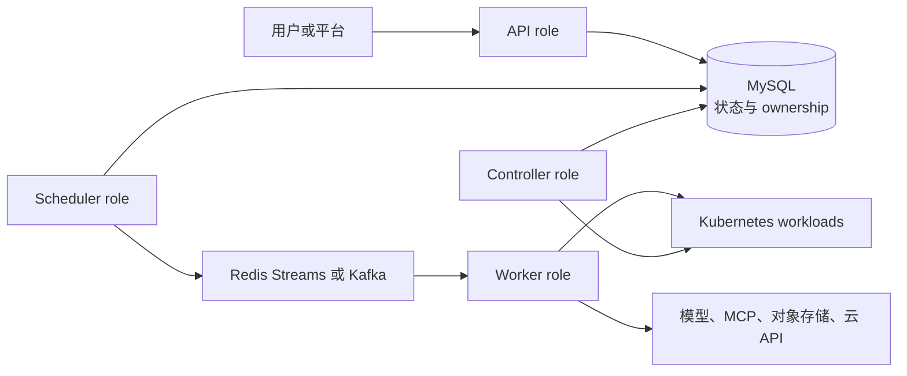

# Eruun AI Runtime 愿景与演进边界

> 状态：Draft / Proposal。本文说明 Eruun 的产品方向、能力分层和实施门禁。`main` 已提供独立 `command` Job 与共享 `traits.eval` 评测；本文其余 Agent、MCP、向量化、模型服务和通用 AI 云平台能力仍是后续方向。

> 示例说明：本文图示仅用于表达概念边界，不是可执行部署清单或公共契约。

## 1. 为什么需要这份总纲

Eruun 已经是一套可运行的 Kubernetes 应用与工作流运行时，但“能够调度容器”并不等于“已经是 Agent Runtime”。Agent 会长期或按任务运行，调用本地 CLI、远程 MCP Server 和模型服务，处理用户数据与凭据，并产生需要审计的外部副作用。模型服务和评测又引入 GPU、制品、配额、成本和可重复性问题。

这份文档用于约束演进方向：先复用现有 Application、Component、Traits、Workflow 和 Job，只有证据表明现有边界无法表达需求时，才引入新的公共实体。复用 Workflow/Job 执行链路不要求每次独立任务都先创建 Application 或 Component。专题 Proposal 可以探索实现，但不得越过本文把探索字段描述成稳定契约。

## 2. 当前事实与目标能力

| 能力面 | `main` 当前事实 | 目标方向 |
| --- | --- | --- |
| 控制面 | API/controller/scheduler/worker 四角色；MySQL 保存 Workflow 状态和执行 ownership | 继续作为 Agent、评测与模型任务的统一控制面 |
| 工作负载 | `webservice`、`store`、`job`、`scheduledjob`、`cloudjob`、`config` 和 `secret` 组件；Service 由 Trait 声明 | 表达常驻 Agent、一次性 Agent 任务和模型服务，但暂不冻结新组件类型 |
| 扩展能力 | 已实现 storage、env、resources、securityPolicy、RBAC、probes、init、sidecar、ingress、service、share、rollout 等 Traits | 增加 Agent 所需能力前先判断能否组合已有 Trait，避免按产品名新增专用 Trait |
| 安全 | 账号与空间授权、Kubernetes RBAC、容器 SecurityContext、Secret/ConfigMap 引用和 URL 安全策略 | 增加工具授权、出站访问、凭据委派、审批、审计和撤销的一致边界 |
| 执行 | Workflow 支持 StepByStep/DAG、审批、取消、超时、回调、租约和 fencing | 承载 Agent 任务、评测、数据处理及模型制品准备 |
| AI 专用能力 | 已有独立 command Job、独立与应用 Workflow 内评测、任务包和结果制品；尚无通用 Agent、MCP、向量化、vLLM 或托管模型 API | 在现有空间 Job 和 Harbor Runner 上增量演进，其余能力按路线图逐层实现并标记 Current |

## 3. 六类目标能力

### 3.1 Agent 执行

Eruun 应能承载三种执行形态：提供网络端点的常驻 Agent、由事件或 API 触发的一次性 Agent 任务，以及按计划运行的 Agent 任务。每种形态都需要明确镜像、命令、输入输出、生命周期、资源、终止和重试语义。

近期不创建独立顶层 Agent 数据库实体。设计应先证明现有 Application/Component/Workflow 无法表达某项稳定需求，再决定是否增加公共类型。

### 3.2 MCP 与 CLI 工具

工具声明至少要回答：工具在哪里运行、如何发现、允许调用哪些能力、输入输出如何校验、凭据由谁持有、调用是否需要审批，以及产生哪些审计证据。

MCP Server 和 CLI 是两种运行绑定，不是权限本身：

- 远程 MCP 可能使用 HTTP 传输和独立授权服务器；本地 MCP 或 CLI 可能作为主容器、sidecar、init container 或受控子进程运行。
- 工具名称、描述和注解都属于不可信输入，不能据此自动授予文件、网络、Kubernetes 或云权限。
- 运行时不得把访问 Eruun 的登录 Token 直接传给 MCP Server 或下游 API；下游访问应使用面向目标资源的独立凭据。
- 高风险、副作用或越出既定能力边界的调用需要可配置的人类审批，而不是依赖模型自行判断。

具体公共字段、Trait 名称和传输支持矩阵要在实现 PR 中根据测试场景确定，本文不预先冻结。

### 3.3 权限、凭据与隔离

Agent 权限必须分层描述，不能用一个笼统的“permissions”开关覆盖所有边界：

| 层次 | 需要控制的内容 | 可复用基础 |
| --- | --- | --- |
| 平台授权 | 谁可以创建、执行、观察、取消或审批工作负载 | Eruun 账号、空间和角色授权 |
| Kubernetes 身份 | Pod 可访问哪些 Kubernetes API 和资源 | ServiceAccount、RBAC Trait、namespace 隔离 |
| 容器权限 | 用户、Linux capabilities、只读文件系统、权限提升 | SecurityPolicy Trait 与 Pod Security |
| 数据与凭据 | 哪个执行可以读取哪个 Secret、ConfigMap、数据集或制品 | 引用式挂载、短期凭据、按任务作用域授权 |
| 网络访问 | 允许访问的 MCP、模型、对象存储和外部 API | NetworkPolicy、URL 策略、出口代理或策略执行点 |
| 工具调用 | 可发现和调用的工具、参数范围、副作用级别、审批要求 | 待设计的能力策略与审计事件 |

默认策略应为拒绝未声明能力、最小权限、凭据不进入普通日志或任务载荷、任务终止后可撤销。集群级权限、宿主机挂载、特权容器和任意命令执行不能由一个普通 Agent 声明自动获得。

### 3.4 模型服务与 GPU

Eruun 的目标是同时支持外部模型端点和 Kubernetes 内自托管模型。自托管模型需要处理模型制品准备、不可变 revision、GPU/显存资源、单节点或多节点拓扑、健康检查、服务暴露、扩缩、升级和故障诊断。

vLLM、HAMi、Ray/KubeRay、LeaderWorkerSet 或其他 operator 都是可选择的实现与适配对象，不是 Eruun 的领域实体。公共契约应表达所需能力，具体 adapter 再把能力映射到已安装平台。任何依赖 CRD 的方案都必须先完成能力发现，并在缺失时明确失败。

### 3.5 LLM 评测

当前命令与 `traits.eval` 评测使用统一的空间 Job 生命周期，在所属空间的同一 namespace 中执行。这里的 Eruun Job 是任务执行单位，两类任务当前都构建 Kubernetes `batch/v1 Job`，Pod 使用 `restartPolicy: Never` 且 Job `backoffLimit: 0`；评测由固定 Harbor Runner 镜像驱动任务环境、采集框架原始结果并通过内部 HTTP 上传。Runner 已提供单实例认领、阶段、心跳、进度和终态证据。模型是测评对象，harness 是测评条件；原生任务包中的指令、环境与 verifier 共同定义测评内容。

评测的输入校验、执行配置和结果解释由 `traits.eval` 规格及共享构建路径表达，持久化、调度和生命周期继续使用统一 Workflow/Job 链路。公共入口与 Harbor 当前边界以 [空间 Job API](workspace-jobs-api.md) 为准；已实现的阶段状态协议见 [Agent Evaluation Runner 小型进程服务](agent-evaluation-runner-service-design.md)。

### 3.6 数据、向量化与云平台

向量化是“读取数据 → 解析和切分 → 调用 embedding → 写入目标存储 → 产出可审计摘要”的批处理能力。Eruun 不应把某个文档库、embedding 服务或向量数据库写死为产品边界。

云平台集成用于提供模型 API、对象存储、GPU/计算资源和其他 AI 服务。现有 CloudJob 可以作为异步外部副作用和 checkpoint 的实现参考，但当前内置能力不等于通用 AI Provider。Provider 设计必须覆盖凭据隔离、能力发现、幂等、状态恢复、取消/补偿、成本与审计。

## 4. 控制面与数据面边界

- API 负责身份、授权、输入校验和任务持久化，不直接执行 Agent 工具。
- Scheduler 负责 Workflow Run 的派发和过期租约恢复；消息队列不拥有任务状态。
- Worker 执行 Workflow/Job，并通过 `WorkflowQueue` generation/token/worker ownership fence 防止失去 lease 的旧 Worker 覆盖新状态；Job 自身的已提交执行代单独标识 Runner 或工作负载执行。
- Kubernetes 承载容器和资源隔离；外部系统的副作用仍需幂等键或补偿，不能宣称 exactly-once。
- Controller 观察 Kubernetes 并更新运行状态，不替代 Worker 的执行控制。

### 4.1 任务执行身份与应用归属

当前实现同时支持应用 Workflow 与独立空间 Job。应用 Workflow 生成 `WorkflowQueue.TaskID`，其中多个 Job 共享 TaskID 并以 `JobInfo` 执行身份区分；独立命令与评测则通过 `/api/v1/jobs` 提交，服务端持久化 WorkspaceID、生成 TaskID，且不要求 AppID、Component 或占位 Application。对应事实见 [空间 Job API](workspace-jobs-api.md)、[Job 服务](../pkg/apiserver/jobs/service.go)和 [Job 模型](../pkg/apiserver/domain/model/job.go)。

以下身份规则已经用于独立空间 Job；向量化等后续批处理能力应复用这些规则。表中不新增 API、表结构或 Runner 环境变量：

| 信息 | 设计要求 | 语义与边界 |
| --- | --- | --- |
| TaskID | 每次新任务执行必需，由服务端生成，持久化成功后返回 | 标识一次整体执行，用于状态、取消、日志和结果关联；不是 Workflow 定义 ID，也不是每个子 Job 单独生成的 ID |
| WorkspaceID 与调用者身份 | 必需；由服务端根据认证和授权上下文确定 | 独立任务直接持久化空间归属，供后台调度、授权、配额和清理使用；不能依赖 AppID 反查或相信未经授权的客户端值 |
| AppID | 应用工作流必需；独立任务不强制要求 | 表达任务的应用归属；不能为了满足执行器字段而创建占位应用 |
| WorkflowID、组件及其他业务信息 | 按任务语义提供 | 独立空间 Job 不创建持久化 Workflow 定义、Component，也不填写占位 ProjectID/ProductID；类型专属输入仍须完整、版本化且可校验 |
| Job 执行明细身份 | 复用现有 Job 身份机制 | 一个 TaskID 可以关联多个 Job；不因为评测或向量化就增加平行的顶层 Task、Run 或专用队列表 |

同一任务的执行重试或租约恢复沿用 TaskID。`JobInfo.RunGeneration` 标识已提交的 Job 执行，Workflow Worker 接管时可以继续恢复该执行；`WorkflowQueue.RunGeneration`、`RunToken` 和 `WorkerID` 则约束当前 Worker ownership，不能与 Job 执行代混为一个 fence。Job attempt 管理明确授权的执行尝试。恢复不能重置任务预算或截止时间；用户主动再次运行，即使输入相同，也属于新的 TaskID。如果提供提交幂等能力，同一个已接受请求的重复提交应返回原 TaskID，作用域和输入冲突规则必须在实现中明确。TaskID 本身不保证外部副作用只发生一次，也不是访问凭据。

独立任务可以通过目标引用关联某个应用及其版本，但该引用不改变任务的空间归属。当前模型中的 AppID 用于应用所有权，不能直接把它当作无生命周期影响的展示关联；目标引用的具体承载方式留给实现验证。任务操作须校验空间权限，执行时还须校验实际访问的目标、数据和凭据；缺少有效空间归属时应拒绝执行，不能退到默认空间。

生命周期应跟随归属：应用工作流继续遵循现有应用删除与任务取消规则；独立任务只清理本次执行拥有的资源，不能因取消任务而清理被引用应用。引用的应用被删除或失去访问权限时，应明确报告目标不可用或无权访问，并按任务策略收敛；已产生的结果仍由任务所在空间和制品保留策略管理。任务的空间归属不能通过修改目标引用而改变。

独立任务仍受空间生命周期约束。当前空间删除会拒绝未完成任务并清理终态任务记录；新提交路径须与空间删除协调，防止在已删除空间中创建任务，并验证外部制品的保留与清理。资源导入提交时锁定空间记录是现有实现参考。

独立空间 Job 已完成入口校验、Job 构建、空间解析、持久化授权、调度准入、状态查询、取消和清理闭环，并复用现有调度器、队列与状态机。后续类型仍须逐项核对这些路径，关联持久化父任务，并遵循已有 ownership/fencing、调度准入和 deadline；不能仅增加枚举或放宽 AppID 校验就宣称可用。Runner 的当前内部输入和传输协议以 [Harbor Runner](../pkg/apiserver/jobs/runners/harbor/README.md) 为准。

### 4.2 同一命名空间中的 Job 类型

当前普通命令使用公共 `type: command`；评测使用 `type: job` 与 `traits.eval`，且支持应用 Workflow 的顶层 Job 组件。它们在同一空间 namespace 中共享 WorkflowQueue、JobInfo、调度、执行租约、取消、超时、重试和清理机制，不按类型另建 namespace 或任务实体。namespace 由服务端从已授权 WorkspaceID 解析，调用方不能任意选择；首次运行所需的安全基线也由空间路径完成，不依赖占位应用。

| Job `type` | 类型专属职责 | 共用执行边界 |
| --- | --- | --- |
| `command` | 校验用户声明的镜像、命令、参数和允许的 Traits，以进程退出及 Kubernetes Job 状态形成执行结果 | WorkspaceID、TaskID/Job 身份、`batch/v1 Job`、调度和生命周期 |
| `job` + `traits.eval` | 校验 env、任务包、模型、harness 和结果策略，选择固定 Runner 镜像，解释评测结果与制品 | WorkspaceID、TaskID/Job 身份、`batch/v1 Job`、调度和生命周期 |

两类任务都由 [Job builder](../pkg/apiserver/jobs/builder.go) 构建 `batch/v1 Job`，复用 [InstantJobCtl](../pkg/apiserver/event/workflow/job/job_instant.go) 生命周期。Pod 使用 `restartPolicy: Never`，Job 使用 `backoffLimit: 0`：前者禁止 kubelet 重启已退出容器，后者禁止 Job 在已计入失败后继续重试；它们不能单独排除 Pod terminating 时出现 replacement Pod 的并发窗口。Job 名称和追踪元数据绑定 TaskID，Runner 的数据与结果请求还绑定任务能力、Pod 名称和 UID。当前评测 Runner 在启动 Harbor 前以 execution identity/attempt 与 Pod UID 原子认领，限制同一 attempt 只有一个 Pod owner；Worker 接管仍须遵循既有 Job 执行代和 ownership 恢复契约。

`config.JobType` 是内部控制器分派键。评测的公开声明使用 `type: job` + `traits.eval`，共享构建路径将其映射为内部 `JobEval` 执行动作；公开声明与内部执行类型不能混用。Kubernetes 资源 `kind` 是 builder 的执行输出。缺失、未知或无权使用的类型明确拒绝，不能静默按 `command` 执行；请求快照保留公开声明，JobTask、JobInfo 和恢复路径保持一致的内部执行类型。

当前 Harbor Runner 作为 Job Pod 的主进程，在启动 Harbor 前原子认领当前 execution identity/attempt，并通过 HTTP 上报 preparing、running、finalizing 阶段、心跳、进度和终态证据。API 的 `runnerStatus` 暴露这些状态，Kubernetes 负责 OOM、容器退出、调度和节点故障兜底。评测成功需要完整结果、成功终态 ACK、Runner 零退出及 Kubernetes Job 成功同时成立；具体门禁见 [空间 Job API](workspace-jobs-api.md)。该协议仅用于评测 Runner，不改变 `command` 镜像入口或普通应用 Deployment 的生命周期。

## 5. 路线图与进入条件

### Phase 1：自托管 Agent 基线

- 选定最小 Agent 执行场景，验证现有组件与 Workflow 是否足够表达。
- 以容器镜像、命令、输入输出、生命周期、资源和终止语义完成单集群闭环。
- 在 namespace 隔离和 Restricted Pod Security 下验证部署、执行、取消和清理。

### Phase 2：权限与工具

- 明确 MCP/CLI 的运行位置、工具 allowlist、Secret 引用、出站网络、审计和审批边界。
- 对平台授权、Kubernetes 身份、容器权限、数据凭据、网络访问和工具调用分别实施默认拒绝策略。

进入下一阶段前，必须能够回答一次工具调用由谁授权、使用什么身份、访问什么资源、产生什么审计记录，以及失败或取消后如何收敛。

### Phase 3：评测与可观测性

- 已实现基线：Harbor `traits.eval` 的单实例认领、阶段、心跳、进度和终态证据；后续扩展保持原始结果上传与质量结果语义。
- 在同一空间 namespace 中同时运行 `command` 和带 `traits.eval` 的 `job`，验证两者复用 `batch/v1 Job` 调度与生命周期且执行资源互不混淆。
- 继续验证不创建 Application 的独立评测能够生成 TaskID、持久化空间归属并完成调度、取消和清理；应用 Workflow 内评测沿用所属应用和父任务，以 Job executionKey 区分结果，并验证取消与清理边界。
- 验证敏感输入与逐 case 制品的访问控制、保留和删除策略。
- 保持现有 Job 类型和输入映射，用真实数据决定是否需要进一步扩展阶段查询、质量门禁或抢占能力。

### Phase 4：模型服务与 GPU

- 先支持单节点、单 Pod 的模型服务，再根据真实模型规模选择多节点 adapter。
- 增加通用资源、调度和 operator-backed workload 能力时，不以 vLLM 或某个 GPU 插件命名公共实体。
- 以固定模型 revision、服务就绪、失败诊断、更新和清理作为验收闭环。

### Phase 5：数据流水线与云 Provider

- 让向量化和云动作复用统一任务状态、凭据边界与制品治理。
- 从一个真实 Provider/Action 开始验证通用边界，不先建设无调用者的插件市场或热插拔框架。
- 多集群、跨地域和复杂成本调度只有在单集群闭环稳定后再进入设计。

## 6. Proposal 的写作和升级规则

- Proposal 必须在标题后直接标记 `Draft / Proposal`，并列出当前可复用能力与缺口。
- 未实现的路由、环境变量、JSON 字段、表字段、默认值和时间参数不得写成既定契约；必须删除或明确标成不具约束力的概念示例。
- Current 文档中的命令和请求必须能从 `main` 的代码、配置或测试找到事实源。
- 专题设计达到 Current 前，至少需要实现、测试、运维和安全证据，并同步文档索引。
- 外部项目的参数和资源名要标注核验版本/日期，不能直接升级为 Eruun 的稳定 API。

## 7. 外部事实核验

本文于 2026-09-04 核验以下官方资料；它们会继续演进，实施时仍需重新确认：

- [MCP Authorization 2025-06-18](https://modelcontextprotocol.io/specification/2025-06-18/basic/authorization)：HTTP 授权、资源受众约束和禁止 Token passthrough。
- [MCP Tools draft](https://modelcontextprotocol.io/specification/draft/server/tools)：工具发现、调用与用户控制的协议边界。
- [vLLM serve CLI](https://docs.vllm.ai/en/latest/cli/serve/) 与 [vLLM online serving](https://docs.vllm.ai/en/stable/serving/online_serving/)：服务参数和分布式执行后端持续演进，Eruun 不固定唯一后端。
- [HAMi configuration v2.5.1](https://project-hami.io/docs/v2.5.1/userguide/configure)：GPU、显存和核心资源名属于该版本的平台配置，不是 Eruun 固有字段。
