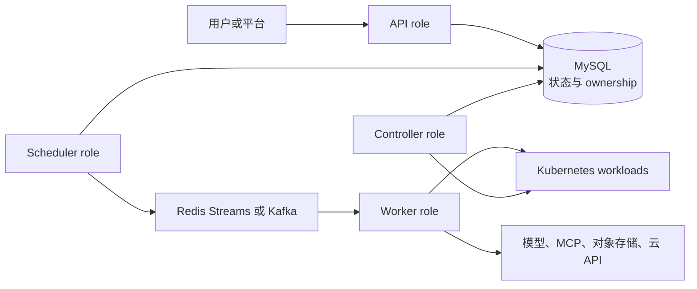

# Eruun AI Runtime 愿景与演进边界

> 状态：Draft / Proposal。本文说明 Eruun 的产品方向、能力分层和实施门禁，不代表 `main` 已经提供 Agent、MCP、评测、向量化、模型服务或通用 AI 云平台 API。

> 示例说明：本文图示仅用于表达概念边界，不是可执行部署清单或公共契约。

## 1. 为什么需要这份总纲

Eruun 已经是一套可运行的 Kubernetes 应用与工作流运行时，但“能够调度容器”并不等于“已经是 Agent Runtime”。Agent 会长期或按任务运行，调用本地 CLI、远程 MCP Server 和模型服务，处理用户数据与凭据，并产生需要审计的外部副作用。模型服务和评测又引入 GPU、制品、配额、成本和可重复性问题。

这份文档用于约束演进方向：先复用现有 Application、Component、Traits、Workflow 和 Job，只有证据表明现有边界无法表达需求时，才引入新的公共实体。专题 Proposal 可以探索实现，但不得越过本文把探索字段描述成稳定契约。

## 2. 当前事实与目标能力

| 能力面 | `main` 当前事实 | 目标方向 |
| --- | --- | --- |
| 控制面 | API/controller/scheduler/worker 四角色；MySQL 保存 Workflow 状态和执行 ownership | 继续作为 Agent、评测与模型任务的统一控制面 |
| 工作负载 | `webservice`、`store`、`job`、`scheduledjob`、`cloudjob`、`config` 和 `secret` 组件；Service 由 Trait 声明 | 表达常驻 Agent、一次性 Agent 任务和模型服务，但暂不冻结新组件类型 |
| 扩展能力 | 已实现 storage、env、resources、securityPolicy、RBAC、probes、init、sidecar、ingress、service、share、rollout 等 Traits | 增加 Agent 所需能力前先判断能否组合已有 Trait，避免按产品名新增专用 Trait |
| 安全 | 账号与空间授权、Kubernetes RBAC、容器 SecurityContext、Secret/ConfigMap 引用和 URL 安全策略 | 增加工具授权、出站访问、凭据委派、审批、审计和撤销的一致边界 |
| 执行 | Workflow 支持 StepByStep/DAG、审批、取消、超时、回调、租约和 fencing | 承载 Agent 任务、评测、数据处理及模型制品准备 |
| AI 专用能力 | 尚无 Agent、MCP、评测、向量化、vLLM 或通用托管模型 API | 按本文路线图逐层设计、实现和标记 Current |

## 3. 六类目标能力

### 3.1 Agent 执行

Eruun 应能承载三种执行形态：提供网络端点的常驻 Agent、由事件或 API 触发的一次性 Agent 任务，以及按计划运行的 Agent 任务。每种形态都需要明确镜像、命令、输入输出、生命周期、资源、终止和重试语义。

近期不创建独立顶层 Agent 数据库实体。设计应先证明现有 Application/Component/Workflow 无法表达某项稳定需求，再决定是否增加公共类型。

### 3.2 MCP 与 CLI 工具

工具声明至少要回答：工具在哪里运行、如何发现、允许调用哪些能力、输入输出如何校验、凭据由谁持有、调用是否需要审批，以及产生哪些审计证据。

MCP Server 和 CLI 是两种运行绑定，不是权限本身：

- 远程 MCP 可能使用 HTTP 传输和独立授权服务器；本地 MCP 或 CLI 可能作为主容器、sidecar、init container 或受控子进程运行。
- 工具名称、描述和注解都属于不可信输入，不能据此自动授予文件、网络、Kubernetes 或云权限。
- 运行时不得把访问 Eruun 的登录 Token 直接传给 MCP Server 或下游 API；下游访问应使用面向目标资源的独立凭据。
- 高风险、副作用或越出既定能力边界的调用需要可配置的人类审批，而不是依赖模型自行判断。

具体公共字段、Trait 名称和传输支持矩阵要在实现 PR 中根据测试场景确定，本文不预先冻结。

### 3.3 权限、凭据与隔离

Agent 权限必须分层描述，不能用一个笼统的“permissions”开关覆盖所有边界：

| 层次 | 需要控制的内容 | 可复用基础 |
| --- | --- | --- |
| 平台授权 | 谁可以创建、执行、观察、取消或审批工作负载 | Eruun 账号、空间和角色授权 |
| Kubernetes 身份 | Pod 可访问哪些 Kubernetes API 和资源 | ServiceAccount、RBAC Trait、namespace 隔离 |
| 容器权限 | 用户、Linux capabilities、只读文件系统、权限提升 | SecurityPolicy Trait 与 Pod Security |
| 数据与凭据 | 哪个执行可以读取哪个 Secret、ConfigMap、数据集或制品 | 引用式挂载、短期凭据、按任务作用域授权 |
| 网络访问 | 允许访问的 MCP、模型、对象存储和外部 API | NetworkPolicy、URL 策略、出口代理或策略执行点 |
| 工具调用 | 可发现和调用的工具、参数范围、副作用级别、审批要求 | 待设计的能力策略与审计事件 |

默认策略应为拒绝未声明能力、最小权限、凭据不进入普通日志或任务载荷、任务终止后可撤销。集群级权限、宿主机挂载、特权容器和任意命令执行不能由一个普通 Agent 声明自动获得。

### 3.4 模型服务与 GPU

Eruun 的目标是同时支持外部模型端点和 Kubernetes 内自托管模型。自托管模型需要处理模型制品准备、不可变 revision、GPU/显存资源、单节点或多节点拓扑、健康检查、服务暴露、扩缩、升级和故障诊断。

vLLM、HAMi、Ray/KubeRay、LeaderWorkerSet 或其他 operator 都是可选择的实现与适配对象，不是 Eruun 的领域实体。公共契约应表达所需能力，具体 adapter 再把能力映射到已安装平台。任何依赖 CRD 的方案都必须先完成能力发现，并在缺失时明确失败。

### 3.5 Agent 评测

评测应作为可持久化、可观察的批处理任务进入统一 Workflow 运行链路。它需要版本化数据集、目标 Agent/模型引用、确定性评分器、可选 Judge、进度、用量、延迟、逐 case 结果、报告和质量门禁。

评测与普通部署的关键差异是结果制品和可重复性，而不是必须拥有第二套顶层队列。是否需要独立 API、任务类型或可抢占协议，要在最小实现和真实负载验证后决定。

### 3.6 数据、向量化与云平台

向量化是“读取数据 → 解析和切分 → 调用 embedding → 写入目标存储 → 产出可审计摘要”的批处理能力。Eruun 不应把某个文档库、embedding 服务或向量数据库写死为产品边界。

云平台集成用于提供模型 API、对象存储、GPU/计算资源和其他 AI 服务。现有 CloudJob 可以作为异步外部副作用和 checkpoint 的实现参考，但当前内置能力不等于通用 AI Provider。Provider 设计必须覆盖凭据隔离、能力发现、幂等、状态恢复、取消/补偿、成本与审计。

## 4. 控制面与数据面边界

- API 负责身份、授权、输入校验和任务持久化，不直接执行 Agent 工具。
- Scheduler 负责 Workflow Run 的派发和过期租约恢复；消息队列不拥有任务状态。
- Worker 执行 Workflow/Job，并通过 generation/token 防止旧执行覆盖新状态。
- Kubernetes 承载容器和资源隔离；外部系统的副作用仍需幂等键或补偿，不能宣称 exactly-once。
- Controller 观察 Kubernetes 并更新运行状态，不替代 Worker 的执行控制。

## 5. 路线图与进入条件

### Phase 1：自托管 Agent 基线

- 选定最小 Agent 执行场景，验证现有组件与 Workflow 是否足够表达。
- 以容器镜像、命令、输入输出、生命周期、资源和终止语义完成单集群闭环。
- 在 namespace 隔离和 Restricted Pod Security 下验证部署、执行、取消和清理。

### Phase 2：权限与工具

- 明确 MCP/CLI 的运行位置、工具 allowlist、Secret 引用、出站网络、审计和审批边界。
- 对平台授权、Kubernetes 身份、容器权限、数据凭据、网络访问和工具调用分别实施默认拒绝策略。

进入下一阶段前，必须能够回答一次工具调用由谁授权、使用什么身份、访问什么资源、产生什么审计记录，以及失败或取消后如何收敛。

### Phase 3：评测与可观测性

- 以一个小型、确定性数据集完成提交、执行、进度、报告和质量门禁闭环。
- 验证敏感输入与逐 case 制品的访问控制、保留和删除策略。
- 用真实数据决定是否需要新的任务类型、API 或抢占能力。

### Phase 4：模型服务与 GPU

- 先支持单节点、单 Pod 的模型服务，再根据真实模型规模选择多节点 adapter。
- 增加通用资源、调度和 operator-backed workload 能力时，不以 vLLM 或某个 GPU 插件命名公共实体。
- 以固定模型 revision、服务就绪、失败诊断、更新和清理作为验收闭环。

### Phase 5：数据流水线与云 Provider

- 让向量化和云动作复用统一任务状态、凭据边界与制品治理。
- 从一个真实 Provider/Action 开始验证通用边界，不先建设无调用者的插件市场或热插拔框架。
- 多集群、跨地域和复杂成本调度只有在单集群闭环稳定后再进入设计。

## 6. Proposal 的写作和升级规则

- Proposal 必须在标题后直接标记 `Draft / Proposal`，并列出当前可复用能力与缺口。
- 未实现的路由、环境变量、JSON 字段、表字段、默认值和时间参数不得写成既定契约；必须删除或明确标成不具约束力的概念示例。
- Current 文档中的命令和请求必须能从 `main` 的代码、配置或测试找到事实源。
- 专题设计达到 Current 前，至少需要实现、测试、运维和安全证据，并同步文档索引。
- 外部项目的参数和资源名要标注核验版本/日期，不能直接升级为 Eruun 的稳定 API。

## 7. 外部事实核验

本文于 2026-09-04 核验以下官方资料；它们会继续演进，实施时仍需重新确认：

- [MCP Authorization 2025-06-18](https://modelcontextprotocol.io/specification/2025-06-18/basic/authorization)：HTTP 授权、资源受众约束和禁止 Token passthrough。
- [MCP Tools draft](https://modelcontextprotocol.io/specification/draft/server/tools)：工具发现、调用与用户控制的协议边界。
- [vLLM serve CLI](https://docs.vllm.ai/en/latest/cli/serve/) 与 [vLLM online serving](https://docs.vllm.ai/en/stable/serving/online_serving/)：服务参数和分布式执行后端持续演进，Eruun 不固定唯一后端。
- [HAMi configuration v2.5.1](https://project-hami.io/docs/v2.5.1/userguide/configure)：GPU、显存和核心资源名属于该版本的平台配置，不是 Eruun 固有字段。
