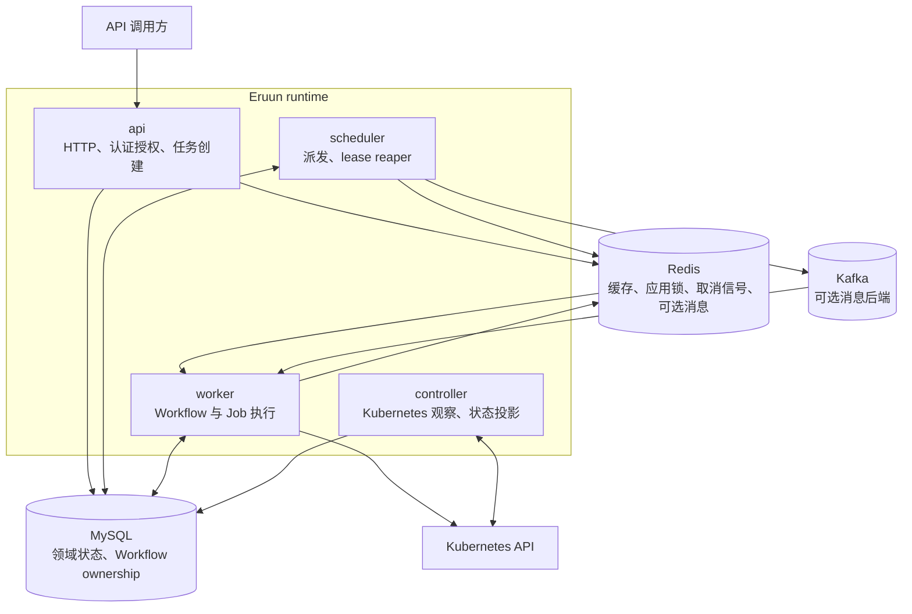
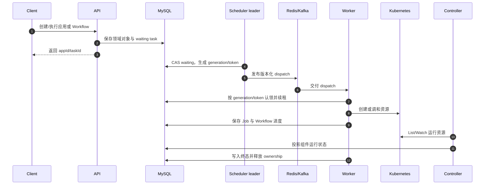
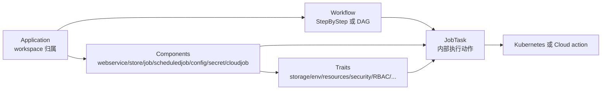
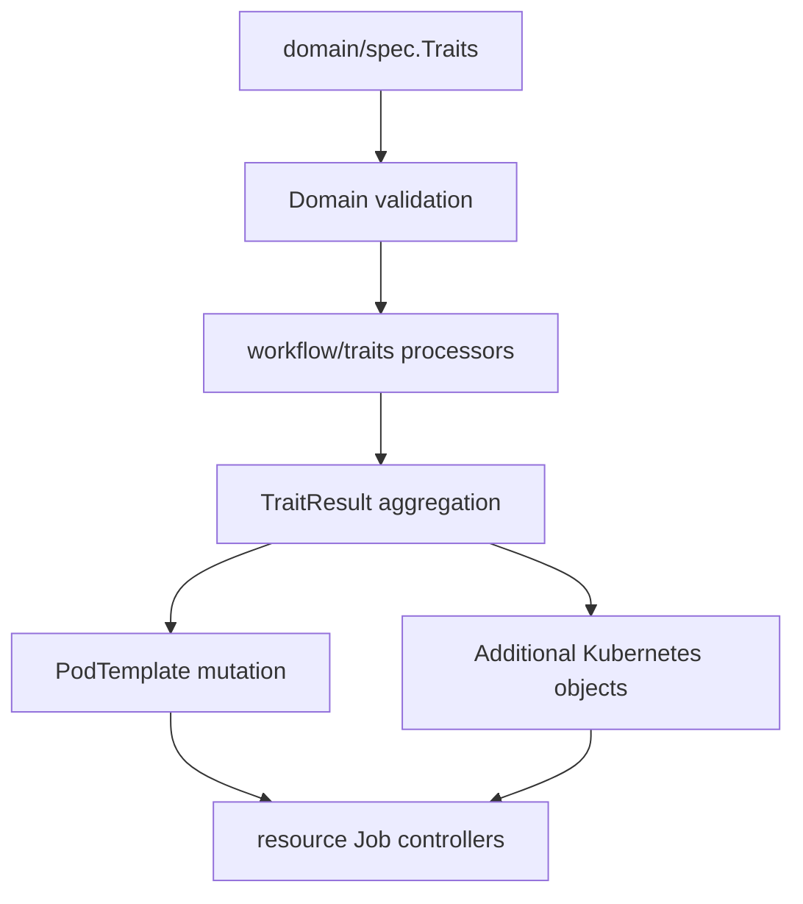
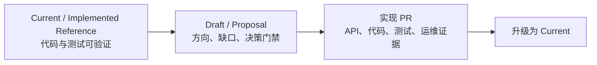

# Eruun 当前架构图

> 状态：Implemented Reference。图中只展示 `main` 已实现的运行关系；未来 AI Runtime 能力见 [AI Runtime 愿景](ai-runtime-vision.md)。

## 1. 四角色与依赖

关键边界：

- Scheduler 而不是 Worker 扫描并派发 waiting Workflow。
- Worker 消费 dispatch 后仍需通过数据库 ownership 条件认领执行。
- MySQL 是 Workflow 状态和 lease 的事实源；Redis/Kafka 只承载协调或消息。
- Controller 负责全局 Kubernetes 状态投影，Worker 使用本地 observer 等待自己创建的 workload。

## 2. Workflow 执行与恢复

故障恢复遵循以下原则：

1. 队列允许重复交付，Worker 只接受当前 generation/token。
2. Worker 运行期间按数据库时间续租。
3. Scheduler 回收过期且身份完整的执行租约，并把任务恢复为 waiting。
4. 旧 generation 的迟到结果不能覆盖新执行。

## 3. Application、Component、Trait 与 Workflow

- Component 描述要运行或生成的对象。
- Trait 为 Component 增加正交能力；它不是独立运行实体。
- Workflow 引用 Component 并定义执行顺序、审批和失败策略。
- JobTask 是内部执行记录，不是新的用户侧顶层队列。

## 4. Trait 到 Kubernetes 的映射

| Trait 结果 | 当前目标 |
| --- | --- |
| volumes / mounts | PodTemplate、PVC 或 volumeClaimTemplate |
| env / envFrom | 主容器、init container 或 sidecar |
| resources / probes / securityContext | 容器字段 |
| nodeSelector / ServiceAccount / rollout | Pod 或 workload 字段 |
| ingress / RBAC 等 AdditionalObjects | 独立 Kubernetes 资源 Job |
| service / share | Service 生成及资源调和/清理路径 |

## 5. 当前与未来的文档分界

Agent、MCP/CLI、评测、向量化、vLLM/HAMi 和通用 AI Provider 当前都位于 Proposal 一侧。示意图不能让它们越过实现与验证门禁。
