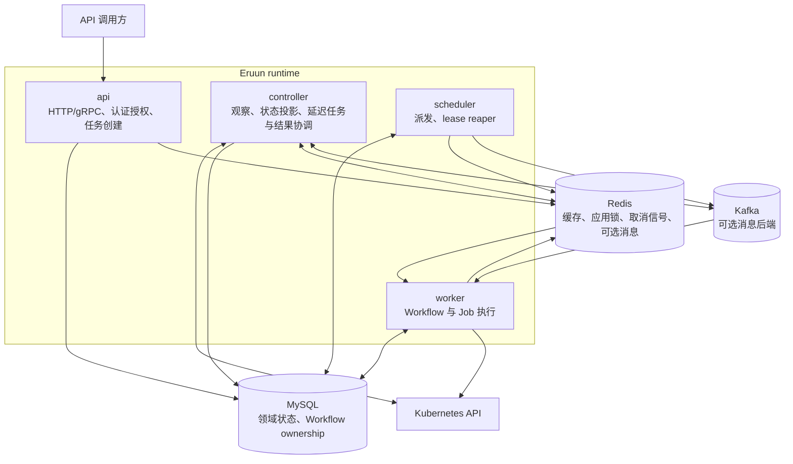
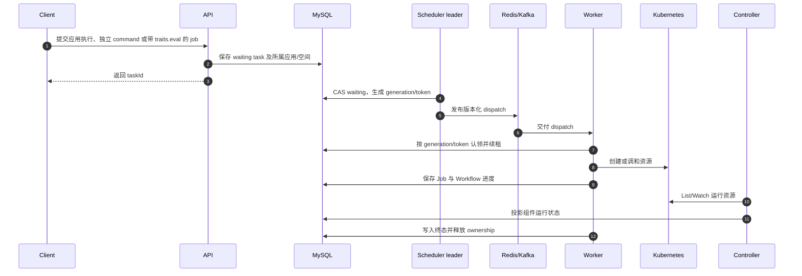
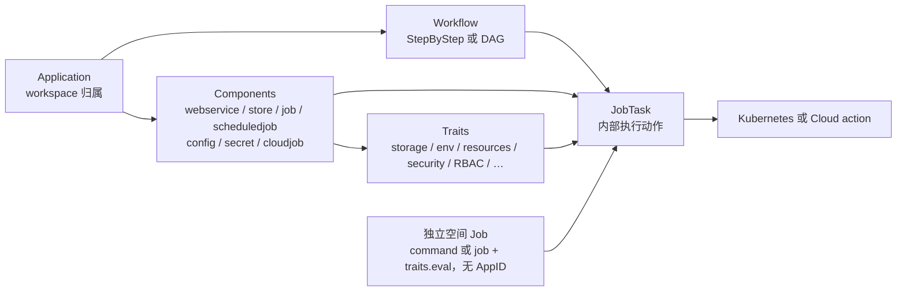
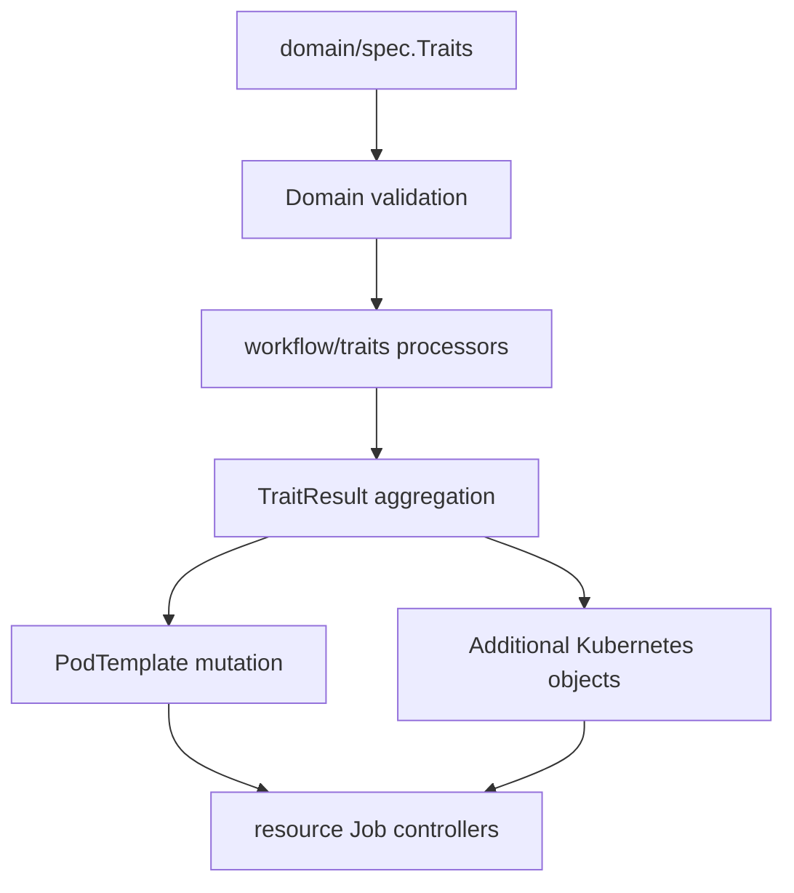
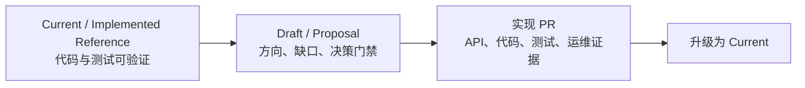

# Eruun 当前架构图

> 状态：Implemented Reference。图中只展示 `main` 已实现的运行关系；未来 AI Runtime 能力见 [AI Runtime 愿景](ai-runtime-vision.md)。

## 1. 四角色与依赖

关键边界：

- Scheduler 扫描并派发 waiting task，应用 Workflow 与独立空间 Job 共用该链路。
- Worker 消费 dispatch 后仍需通过数据库 ownership 条件认领执行。
- MySQL 是 Workflow 状态和 lease 的事实源；Redis/Kafka 只承载协调或消息。
- Controller 负责全局 Kubernetes 状态投影、延迟任务和结果协调；Worker 使用本地 observer 等待自己创建的 workload。Controller 与 Scheduler 分别使用独立 Kubernetes Lease 选主。
- Redis Streams 与 Kafka 是可选消息后端；选择 Kafka 后，Redis 仍承担缓存、应用锁和取消信号。上图展示主要依赖，非完整网络访问矩阵。

## 2. Workflow 执行与恢复

故障恢复遵循以下原则：

1. 队列允许重复交付，Worker 只接受当前 generation/token。
2. Worker 运行期间按数据库时间续租。
3. Scheduler 回收过期且身份完整的执行租约，并把任务恢复为 waiting。
4. 旧 generation 的迟到结果不能覆盖新执行。

独立空间 Job 不创建 Application 或 Component，由 Worker 将任务声明构建为 Kubernetes Job。评测使用 `type: job` + `traits.eval`，也可作为应用 Workflow 的顶层 `job` 组件执行。Harbor Runner 在 Pod 内先认领执行，再下载任务包、运行评测、上报阶段/心跳/终态并上传完整原始结果。API 保存源结果后，Controller 独立执行 MinIO/数据库目标保存与过期清理；保存失败不改变已完成的评测事实，重试保存也不会重跑评测。同一应用任务内的评测结果以 Job `executionKey` 区分。见 [空间 Job API](workspace-jobs-api.md)。

上图展示立即执行主路径；延迟 Job 由 Worker 写入数据库检查点，Controller 到期后创建 Kubernetes Job，结合 delay/result 消息与 outbox 恢复执行进度。

## 3. Application、Component、Trait 与 Workflow

- Component 描述要运行或生成的对象。
- Trait 为 Component 增加正交能力；它不是独立运行实体。
- 图中包含引擎内部扩展；空间业务路径拒绝 CloudJob、额外 RBAC、任意 ServiceAccount、host/跨 namespace 操作及 NodePort/LoadBalancer，不能仅凭类型或 Trait 的存在判断可用权限。
- Workflow 引用 Component 并定义执行顺序、审批和失败策略。
- 独立空间 Job 直接声明任务规格，复用相同的调度、执行租约和 Job 生命周期。
- JobTask 是内部执行计划，JobInfo 保存执行明细；它们不形成新的用户侧顶层队列。

## 4. Trait 到 Kubernetes 的映射

| Trait 结果 | 当前目标 |
| --- | --- |
| volumes / mounts | PodTemplate、PVC 或 volumeClaimTemplate |
| env / envFrom | 主容器、init container 或 sidecar |
| resources / probes / securityContext | 容器字段 |
| nodeSelector / ServiceAccount / rollout | Pod 或 workload 字段 |
| ingress / RBAC 等 AdditionalObjects | 独立 Kubernetes 资源 Job |
| service / share | Service 生成及资源调和/清理路径 |

## 5. 当前与未来的文档分界

独立 `command` Job、独立与应用 Workflow 内的 Harbor `traits.eval` 评测、Runner 阶段协议与结果保存属于已实现能力。通用 Agent 生命周期、MCP/CLI 工具管理、更多评测框架、向量化、vLLM/HAMi 和通用 AI Provider 仍位于 Proposal 一侧。示意图不能让它们越过实现与验证门禁。
