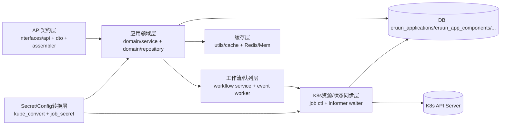

# 核心模块边界图与跨层字段契约（运行主链）

> 状态：Implemented Reference。本文作为跨 API/Domain/DB/Cache/K8s 字段语义的维护基线。

## 背景

在 Eruun 中，`app_id`、组件状态、Secret 引用等字段会跨 `API/Domain/DB/Cache/K8s` 多层流转。
如果缺少统一契约，容易出现“接口返回值正确但底层状态不一致”或“回写时编码语义错误”的问题。

本文定义运行主链 6 个核心模块的职责边界，并给出高风险核心字段的跨层契约表（表示、编码、脱敏、优先级）。

## 运行主链模块边界图

## 模块职责与写入边界

| 模块 | 主要职责 | 可写边界 | 只读依赖 | 禁止越界 |
| --- | --- | --- | --- | --- |
| API 契约层 | 路由、参数校验、DTO 组装 | 不直接写 DB/K8s（仅调用 Domain） | Domain 返回对象 | 不在 handler 拼接跨层优先级逻辑 |
| 应用领域层 | 应用查询、组件聚合、契约归一 | `min_*` 表、缓存失效/回填 | K8s 状态回写结果 | 不直接拼接 K8s 编码细节到 API |
| 工作流/队列层 | 任务入队、调度、执行状态推进 | `eruun_workflow_queue`、`eruun_job` | 应用/组件元数据 | 不绕过 Domain 直接改 API 响应契约 |
| 缓存层 | `app:list:v3`、`app:template:list:v4`、`app:components:v6:<appId>` 读写 | 仅缓存键空间 | Domain 序列化对象 | 不成为事实源（Source of Truth） |
| K8s 资源/状态同步层 | 资源创建/更新、Informer 状态回写 | K8s 对象、组件运行态字段回写 DB | 组件标签映射、任务上下文 | 不直接改业务主数据（名称、版本等） |
| Secret/Config 转换层 | K8s YAML <-> 组件模型转换、Secret 输入标准化 | 组件 `properties.conf/secret` 与 K8s ConfigMap/Secret 载荷 | URL 拉取与安全策略 | 不引入“自动猜测编码”造成语义漂移 |

## 跨层字段契约总表（高风险核心字段）

说明：
- `Domain/DB` 列中的表名默认 `min_` 前缀。
- “优先级”表示读取同一业务语义时的事实源顺序，不代表调用链顺序。

| 字段 | API 表示 | Domain/DB 表示 | Cache 表示 | K8s 表示 | 编码/脱敏规则 | 事实源与优先级 |
| --- | --- | --- | --- | --- | --- | --- |
| `appId` | 路径参数 `:appID`；响应 `appId` | `Applications.ID`，组件侧 `ApplicationComponent.AppID`（`eruun_applications.id` / `eruun_app_components.app_id`） | `app:components:v6:<appId>` | 标签 `eruun.io/app-id` | 原样字符串；不脱敏 | DB 主事实源；K8s 标签用于关联与状态同步 |
| `componentId` | 组件响应 `id` | `ApplicationComponent.ID`（`eruun_app_components.id`） | 缓存内组件对象 `id` | 标签 `eruun.io/component-id` | 数字转标签字符串 | DB 主事实源；K8s 标签仅回写校验 |
| `componentName` | 路径参数 `:componentName`；响应 `name` | `ApplicationComponent.Name`（`eruun_app_components.name`） | 缓存内组件对象 `name` | 标签 `eruun.io/component-name` | RFC1123 名称在生成资源名时处理 | DB 主事实源；K8s 标签用于 informer 定位 |
| `namespace` | 应用/组件响应 `namespace` | `Applications.Namespace`、`ApplicationComponent.Namespace` | 缓存内组件对象 `namespace` | 对象 metadata.namespace | 原样字符串 | DB 主事实源；K8s 为运行落地位置 |
| `workflowId` | 响应 `workflowId` | `Workflow.ID`、`WorkflowQueue.WorkflowID` | 列表缓存中会携带默认 workflow ID | 无直接标签 | 原样字符串 | DB 主事实源 |
| `taskId` | 执行/取消/查询链路返回 `taskId` | `WorkflowQueue.TaskID`，`JobInfo.TaskID` | 无常驻缓存键 | Job 注解 `eruun.job/taskId`（间接） | 原样字符串 | `eruun_workflow_queue` 主事实源，`eruun_job` 为执行明细 |
| `component.status` | 组件响应 `status` | `ApplicationComponent.Status`（`eruun_app_components.status`） | 缓存会存储纠正后的状态快照 | Informer 依据 Pod 快照推导 Running/Pending/Failed/Unknown | 非敏感，不脱敏 | 读路径以 DB 为准；Informer 仅回写运行态 |
| `component.readyReplicas` | 组件响应 `readyReplicas` | `ApplicationComponent.ReadyReplicas` | 缓存随组件对象缓存 | 由 Pod Ready 数推导 | 整型，不脱敏 | DB 主事实源（由 informer 回写） |
| `component.lastAbnormal` | 组件响应 `lastAbnormal` | `ApplicationComponent.LastAbnormal` | 缓存随组件对象缓存 | 从 Pod 异常摘要提取 | 可包含敏感上下文，日志需谨慎 | DB 主事实源（由 informer 回写） |
| `workflow_queue.status` | 任务状态相关 API 输出 | `WorkflowQueue.Status`（`eruun_workflow_queue.status`） | 无 | 无 | 非敏感 | `eruun_workflow_queue` 主事实源 |
| `workflow_queue.cancel_source` | 取消任务响应可见 | `WorkflowQueue.CancelSource`（`eruun_workflow_queue.cancel_source`） | 无 | 无 | 非敏感 | `eruun_workflow_queue` 主事实源 |
| `templateEnabled` | `ApplicationBase.templateEnabled` | `Applications.TemplateEnabled`（`eruun_applications.tmp_enable`） | `app:list:v3` / `app:template:list:v4` | 无 | 布尔值 | DB 主事实源，缓存只做加速 |
| `properties.secret[*]` | 组件 `properties.secret`（`secret` 组件） | `ApplicationComponent.Properties` JSON 内 `secret` map | 缓存中的组件 `properties.secret` | `Secret.StringData/Data` | 仅文本语义；不自动 base64 解码 | Domain/DB 为输入事实源；K8s 由 API server 完成字节化 |
| `credentials.value` | `components[].credentials[].value` | 由 assembler 从同应用同命名空间 `secret` 组件推导，不单独落库 | 随组件列表缓存 | 不直接来自实时 K8s Secret 读取 | 明文返回，必须按敏感信息处理 | Domain 组装结果；来源仍是 DB 中 `properties.secret` |
| `credentials.resolved` | `components[].credentials[].resolved` | 运行时推导布尔值，不单独落库 | 随组件列表缓存 | 无 | `value` 为空或缺失则 `false` | Domain 组装结果 |
| `traits.envs[].valueFrom.secret` | 组件 traits 内 secret key 引用 | `ApplicationComponent.Traits` JSON | 随组件列表缓存 | 最终映射为容器 `EnvVarSource.SecretKeyRef` | 仅引用，不携带值 | Traits 配置为事实源，值解析依赖 `secret` 组件 |
| `traits.envFrom[].sourceName(type=secret)` | 组件 traits 内整包 Secret 引用 | `ApplicationComponent.Traits` JSON | 随组件列表缓存 | 最终映射为 `EnvFrom.SecretRef` | 仅引用，不携带值 | Traits 配置为事实源 |
| `traits.storage[].sourceName(type=secret)` | 组件 traits 存储引用 | `ApplicationComponent.Traits` JSON | 随组件列表缓存 | 最终映射为 `Volume.Secret.SecretName` | 仅引用，不携带值 | Traits 配置为事实源 |
| `k8s secret payload` | API 不直接暴露该底层形态 | `SecretInput.Data`（字符串 map） | 无 | 创建时主要通过 `Secret.StringData`，落地后 K8s 存为 `Data` 字节 | K8s API 自动进行 base64 传输层处理 | Domain 输入语义优先；K8s 为承载格式 |
| `app:list:v3` 缓存键 | 列表接口响应 | 来源 `Applications` + 默认 workflow 推导 | 键 `app:list:v3` | 无 | JSON 序列化缓存 | DB 优先，缓存可失效重建 |
| `app:template:list:v4` 缓存键 | 模板列表接口响应 | 来源 `Applications.TemplateEnabled` + workflow 推导 + `resources` 摘要 | 键 `app:template:list:v4` | 无 | JSON 序列化缓存 | DB 优先，缓存可失效重建 |
| `app:components:v6:<appId>` 缓存键 | 组件列表接口响应 | 来源 `ApplicationComponent` + 读路径纠正状态 | 键 `app:components:v6:<appId>` | 状态变更时由 informer 触发失效 | JSON 序列化缓存 | DB 优先，缓存仅加速 |
| `adoptionSnapshot.resources[].pendingRecreation.token` | 不作为公共 API 字段返回 | `Applications.AdoptionSnapshot`（`eruun_applications.adoption_snapshot` JSON）内的写前重建声明 | 无 | 同值写入待创建对象注解 `eruun.io/adopted-recreation-token` | opaque UUID，不承载 Secret；仅用于匹配一次重建声明与替代对象 | DB 中的 pending claim 是声明事实源；K8s 注解只有与当前 pending token 一致时才可用于恢复/完成重建 |

## Adopted 资源重建的一致性契约

`ResourceSnapshot.PendingRecreation` 不是第二套 Kubernetes ownership：资源所有权仍由 adoption snapshot 中的 `source.uid` 约束。它是缺失的 adopted 资源在重建期间使用的 write-ahead claim，用于跨重试、进程重启和 `Create` 结果不确定场景，将一份已持久化意图与一个替代对象绑定起来。

| 阶段 | DB / Domain 状态 | Kubernetes 状态 | 一致性要求 |
| --- | --- | --- | --- |
| Prepare | 先按 app ID + resource identity 获取可续期的分布式 recreation lease，再在锁内重新加载 canonical application snapshot；仅允许 `ownership=exclusive`、`disposition=managed`、具有旧 `source.uid` 和可重建 manifest 的资源。若没有 claim，先通过 application `update_time` CAS 写入非空 token；已有 claim 时复用其 token | 尚未创建替代对象；候选对象复制原注解并写入 `eruun.io/adopted-recreation-token=<token>` | lease 不可用时 fail closed；claim 持久化成功后才能调用 Kubernetes `Create`，且当前 recreate 调用持有 lease 直到 Create、`AlreadyExists` 恢复与 finalize 结束。等待 lease 的旧执行者取得锁后必须先重读 canonical UID；CAS、UID 或前置校验失败时不得写 K8s |
| Create / recover | pending claim 保留，旧 `source.uid` 仍是 ownership baseline | `Create` 成功、返回 `AlreadyExists`，或下一次 reconcile 发现同名对象时，均可进入恢复 | `AlreadyExists` 恢复复用当前 recreate 已持有的 lease；后续 reconcile 的恢复先获取同一 resource lease，且不会重新执行 `Create`。只有对象的 namespace/name 符合 snapshot、UID 非空且不同于旧 UID、未处于 terminating，并且 annotation token 等于当前 pending token，才能将其视为本次重建结果 |
| Finalize | 在同一 resource lease 内重新加载 canonical snapshot 并再次校验 claim；把 `source.uid`、`resourceVersion`、`specDigest` 更新为替代对象，随后清除 `pendingRecreation`。Workload 同一事务更新 `ApplicationComponent.SourceWorkloadUID`；Secret 同一事务更新相关加密数据；普通依赖更新 application snapshot | 替代对象继续存在 | 事务/CAS 成功只确认 ownership 迁移；任务仍须按当前 desired state 完成本类型的正常调和后才能成功。若另一执行者已经提交相同对象 UID 且 claim 已清除，恢复路径将其视为已完成，而不是重复写入；任何推进 UID 或清除 claim 的路径都不得绕过该 lease |
| Persistence failure | 明确确认未提交时保留旧 `source.uid` 与 pending claim；若提交结果不明确，则回读 canonical snapshot 与 workload 绑定，回读也失败时 DB 状态保持 unknown（可能仍 pending，也可能已经完成） | 已创建的替代对象保留，不执行补偿删除 | 采用 no-rollback：删除可能误删已被另一执行者确认的对象。后续 reconcile 重读 canonical 状态：仍 pending 时按同一 token 恢复，已写入替代 UID 时按已完成处理；无法确认时返回可观测错误，仍不删除对象 |

Finalize 清除的是 DB snapshot 中的 `pendingRecreation`。替代对象上的 recreation token 注解不会在 finalize 中主动删除，但 claim 清除后它不再构成有效的重建授权；生成 snapshot manifest 或计算 `specDigest` 时会剥离该注解，因此它不会污染期望配置或制造永久 drift。

版本兼容边界如下：

- Snapshot v1 与 v2 都可读取和校验；v1 不允许携带 `pendingRecreation`。
- 新建 adoption snapshot 使用 v2。历史 v1 snapshot 在没有 pending claim 时与等价 v2 snapshot 按同一导入契约比较，不要求为了读取而立即回写迁移。
- 首次为历史 snapshot 持久化 recreation claim 时，写入版本升级为 v2；空 token、缺少旧 `source.uid`、非 exclusive/managed 资源或缺少 manifest 都会校验失败。
- v2 的新增语义仅是 write-ahead recreation claim。Token 不是 Secret，也不是长期 ownership 事实；它只授权当前 pending transition。Finalize 校验当前 token、对象 identity、非 terminating 状态以及非空且不同于旧值的新 UID，成功后由写回的 Kubernetes UID 继续承担 ownership 约束；谁可创建或修改带 token 的对象仍由 Kubernetes RBAC 与 exclusive management 边界控制。

## 关键优先级规则（必须保持）

1. 组件查询读取优先级  
`Cache(app:components:v6:<appId>) -> DB(eruun_app_components)`；未命中或缓存损坏时回源 DB。  
K8s 不是组件查询实时事实源，而是通过 informer 异步回写 DB。

2. 组件状态保护规则  
当 DB 状态为 `Not Deploy` 或 `Cleaning` 时，informer 同步不得随意覆盖；`Cleaning` 在副本清零后才转 `Not Deploy`。

3. Secret 值语义规则  
`properties.secret` 与 `credentials.value` 按文本字面量处理；即使看起来像 base64，也不在读路径自动解码。  
导入/转换 K8s Secret 时仅接受可表示为 UTF-8 文本的数据。

4. 标签关联规则  
`eruun.io/app-id`、`eruun.io/component-id` 与 `eruun.io/component-name` 必须完整参与 K8s 资源关联与状态同步定位，缺一则不能视为可回写目标。

5. 缓存一致性规则  
组件状态更新、应用增删改等会触发对应缓存失效；缓存失败不影响主流程正确性，DB 保持事实源。

6. Adopted 重建声明规则
必须先取得按 app/resource 隔离的可续期 lease，并在锁内重读 canonical UID、持久化 `pendingRecreation.token`，再创建带同值注解的替代对象；当前 recreate 调用持有 lease 到绑定完成，后续 reconcile 也必须取得同一 lease 才能推进 UID 或清除 claim。创建后的 DB 写入失败始终保留 live object：明确未提交时保留 claim 供重试恢复，提交状态无法确认时由后续 reconcile 在 lease 内重读 canonical UID/claim 收敛；两种情况都不做补偿删除。

## 变更前检查清单（面向新增/调整返回字段）

- 是否明确该字段在 `API/Domain/DB/Cache/K8s` 五层的表示与命名？
- 是否定义了编码语义（明文/UTF-8/base64 由谁处理）？
- 是否定义了脱敏策略（返回、日志、埋点）？
- 是否定义了事实源优先级与冲突处理？
- 是否补充了跨层回归用例（至少覆盖读路径 + 状态同步/回写路径）？

## 相关实现锚点

- 组件读路径与缓存：`pkg/apiserver/domain/service/application_query.go`、`pkg/apiserver/domain/service/application_cache.go`
- 组件 API 组装与 credential 解析：`pkg/apiserver/interfaces/api/assembler/v1/component.go`
- 状态同步：`pkg/apiserver/infrastructure/informer/waiter.go`、`pkg/apiserver/server.go`
- Secret 落地与编码边界：`pkg/apiserver/event/workflow/job/job_secret.go`
- Adoption snapshot 版本、校验与 digest 归一化：`pkg/apiserver/domain/adoption/snapshot.go`
- Adopted 重建 claim、恢复与 finalize：`pkg/apiserver/event/workflow/job/job_adopted_source.go`
- Recreation token annotation 常量：`pkg/apiserver/config/consts.go`
- 模型与表映射：`pkg/apiserver/domain/model/*.go`
