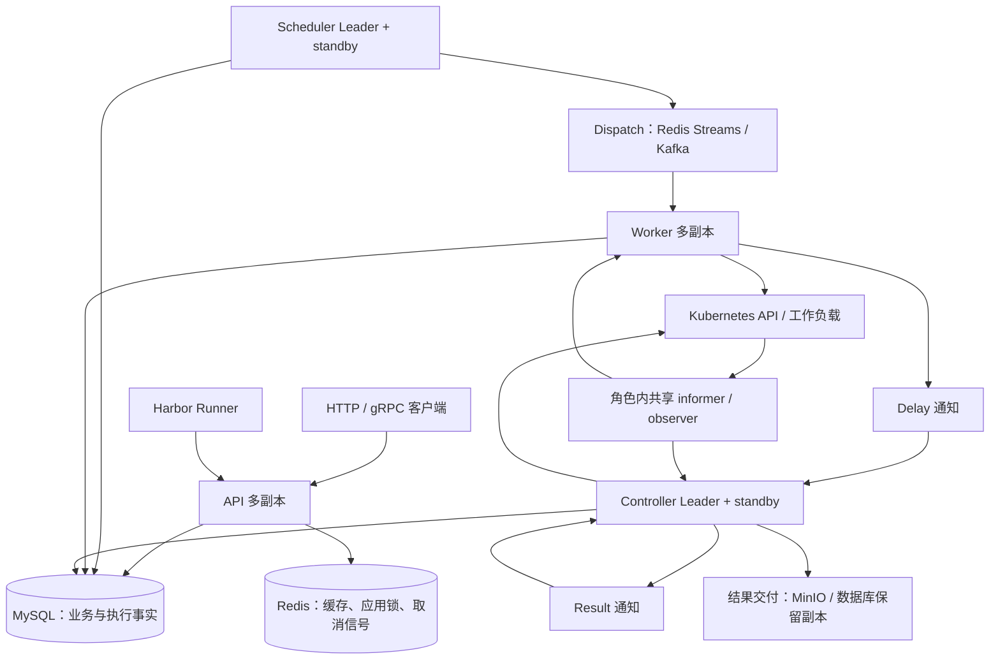
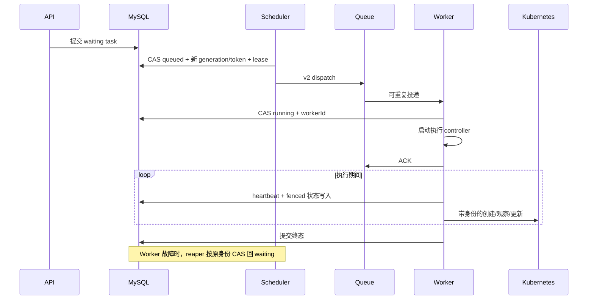

# 分布式设计审核：现状、取舍与优化方向（2026-10-06）

> 状态：Historical / Audit。审查基线为远端 `main@63d4a4c583502c6604468b1150a3a802e5ce895f`（冻结日期：2026-10-06）。第 2–7 节保留该版本的设计审核快照，固定源码链接说明修复前的机制与缺口。PR #139 随后实施 D1–D5 的修复，处置详情与验证边界见第 8 节；容量建议仍待测量，不代表已经实施。

## 1. 审核结论与范围

Eruun 当前是单 Kubernetes 集群内的分布式 Application/Workflow Runtime：同一 Go 二进制按 API、Controller、Scheduler、Worker 四种角色运行，MySQL 保存业务与执行所有权，Redis/Kafka 传输通知，Kubernetes 管理实际工作负载。API/Worker 可以并行处理工作；Controller/Scheduler 各有一个有效 Leader，其额外副本主要提供接管能力。

这个分工有合理基础：复用已有数据库事务处理业务一致性，避免再增加一套执行锁或协调服务；把观察、派发和执行分开，减小角色间的生命周期耦合。但四角色多副本不等于整个系统已经生产高可用，也不等于对外部副作用提供 exactly-once。

冻结基线确认的风险（D1–D5 的本 PR 处置见第 8 节）：

- **应用级互斥失效窗口**：Redis 锁续期失败不会通知业务回调；同应用的不同任务可能绕开原本依赖该锁的串行约束。
- **结果链路恢复缺口**：已入队的结果通知丢失后，现有 outbox 扫描没有补投递入口；结果消费者还存在先删除 Kubernetes 成功证据、后提交数据库结果的窗口。
- **时钟来源不完全统一**：Workflow 执行租约使用数据库时间，但定时任务到期筛选和 Harbor 恢复的前置截止判断仍使用进程时间。
- **容量需实测**：全局准入事务扫描、Runner 权威鉴权读取、每进程 informer、结果 chunk 事务和恢复批次，都会限制横向扩展收益。

以上区分“静态确认的代码行为”“满足特定故障条件时的影响推演”“尚未测量的容量风险”。初次文档审查仅有静态证据；后续修复增加了第 8 节列出的回归与真实 MySQL 验证，仍不把历史集群测试算作本次验收。

### 1.1 覆盖程度

| 范围 | 本轮审查方式 | 主要入口 |
| --- | --- | --- |
| 角色、双 Leader、装配、readiness、排空 | 直接阅读实现和相关测试 | `server_assembly.go`、`server_runtime_leader.go`、`server_workers.go` |
| Workflow 派发、claim、heartbeat、reaper、取消、Job 准入 | 追踪主调用链、状态和事务条件 | `event/workflow`、`domain/repository/workflow_lease.go`、`job_scheduler.go` |
| Redis/Kafka、延迟检查点、结果 outbox、callback | 直接阅读生产者、消费者、恢复和 ACK 路径 | `infrastructure/messaging`、`event/workflow/job` |
| Harbor claim、事件、结果、checkpoint/recovery | 直接阅读关键身份及提交门禁 | `jobs/service.go`、`runner_events.go`、`checkpoint*.go`、`recovery.go` |
| 资源导入、状态投影、部署迁移 | 抽样主路径和关键写入保护 | `resourceimport`、`infrastructure/informer`、Helm templates |
| 所有资源执行器、云 Provider、生产拓扑与容量 | 未逐项或实地验证 | 不据此声称全仓无缺陷、跨地域多活或生产 SLA |

当前使用说明仍以[运行时设计](enterprise-distributed-runtime-design.md)、[Leader 与租约恢复](leader-informer-recovery.md)、[Workflow 架构](workflow-architecture-guide.md)、[Helm 部署](helm-deployment.md)为入口。此前的[分布式加固记录](distributed-runtime-hardening-merge-guide.md)用于理解已完成的修复，不能将其中的历史问题直接重复报告为现存问题。

## 2. 系统如何分布

### 2.1 拓扑与角色



图中的观察器是各角色进程内实例，不是额外部署的中心服务。Kubernetes 集群本身的控制面一致性、节点调度与存储可靠性由集群提供；Eruun 没有另实现共识算法。

| 角色 | 实际工作 | 扩容含义与依赖 |
| --- | --- | --- |
| API | HTTP/gRPC、鉴权、提交/取消、查询、Runner 事件与结果接收 | 无 Leader；多副本共享数据库和 Redis。没有 Workflow 消息 topic 依赖，仍有 Kubernetes 与鉴权/锁依赖 |
| Controller | 状态投影、延迟 Job、结果消费/outbox、结果交付与清理、导入协调 | 仅当前 Controller Leader 推进这些协调任务；额外副本不线性增加它们的吞吐 |
| Scheduler | Workflow 派发、Cron 派发、执行租约回收、全局 Job 准入 | 独立 Scheduler Lease；一个有效调度者，额外副本用于接管 |
| Worker | 消费 dispatch、持久化 claim、执行 Workflow/Job、心跳与资源等待 | 无角色 Leader；依靠每任务 DB ownership 防重复执行，可增加执行槽位 |

[角色装配][e01]只初始化实际使用的队列：API 无；Controller 使用 delay/result；Scheduler 使用 dispatch；Worker 使用 dispatch/delay。**Kafka 只替换消息后端，不消除 Redis**：当前普通运行角色仍装配 Redis 客户端，应用锁、认证单次挑战和取消通知等仍使用它。[Readiness][e02]会检查数据库时间查询，API 额外 PING Redis，其他队列按角色检查；Follower 可以 Ready，Ready 不意味着它正在领导或所有业务功能均可完成。

### 2.2 谁说了算

| 数据/行为 | 权威来源 | 其他系统的作用 |
| --- | --- | --- |
| 应用、Workflow 意图、取消状态 | MySQL | Redis 锁协调请求；缓存加速查询 |
| task 是否可执行、当前 owner | `WorkflowQueue` 的 status/generation/token/worker/lease | dispatch 只触发领取，消息本身不授予执行权 |
| Job 准入、空间并发和预算 | MySQL `JobInfo` 调度字段与 policy 事务 | Worker 本地 semaphore 控制进程负载；Kubernetes 决定实际节点放置 |
| Job/Pod 是否存在、是否完成 | Kubernetes API 的真实对象、UID、状态 | informer 是有延迟的观察副本，关键动作仍须权威核验 |
| 延迟执行意图 | `JobInfo` 中完整 delay checkpoint | 队列用于及时唤醒，DB 扫描提供恢复入口 |
| Harbor Runner 身份与已接受事件 | MySQL claim、执行身份、sequence/digest，结合实时 Pod/Job 身份 | Runner token 是凭据；taskID 或同名 Pod 不足以证明所有权 |
| 完整评测结果与交付进度 | 原始 artifact/chunk、digest 和各目标 delivery 记录 | MinIO/数据库保留副本分别推进；数据库副本仍在同一数据库中，独立的是保留生命周期 |
| 页面中的组件状态 | Kubernetes 观察经领域规则投影到 DB，再供查询 | 这是最终一致视图，不能代替执行 ownership |

要区分三类“代次”：Workflow 的 `runGeneration/runToken` 防旧 Worker 写入；Job 的 `executionKey` 等身份区分执行与恢复；informer 的进程内 generation 防旧观察回调污染新任期。它们保护不同对象，不应合成一个含义不清的全局版本号。

## 3. 一次任务从提交到恢复

### 3.1 正常执行

1. API 鉴权并核对空间。在应用级锁内读取业务状态、按幂等键识别重试，把任务写入 MySQL 为 `waiting`。同一个幂等键的重试与不同请求间的互斥是两个契约，不能互相替代。
2. Scheduler 先推进 Job 准入，再按数据库查询取最多 100 条到期 Waiting task。对任务 CAS：`waiting → queued`，增加 generation、生成 token、设置 dispatch lease，然后发 v2 消息。
3. Worker 校验消息身份，重读数据库，以 CAS 写入 `workerId` 并进入 `running`。旧消息或重复消息没有 claim 成功就不会获得新的执行权。
4. Worker 启动 controller 后 ACK dispatch，**不是任务完成后才 ACK**。后续恢复依赖数据库租约，而非一直把消息留在 pending。
5. 执行期间独立 heartbeat 续租。Workflow/子 Job 的受保护写入核对 owner；共享全局准入约束 Job 执行，具体资源仍交 Kubernetes。
6. 完成后写入终态，推进相应结果和 callback 路径；回调接收方仍须实现幂等。

代码入口：[Scheduler 派发][e03]、[Worker claim 与 ACK][e37]、[claim 与心跳][e04]、[ownership 事务][e05]。



### 3.2 接管、取消和停机

- **租约不是定时 kill。** 默认 heartbeat 10 秒、lease 30 秒、reaper 10 秒且每轮 100 条。租约到期使任务可被回收；真正转移 ownership 的是数据库 CAS。续租报错时 Worker 停止执行；CAS 未续上且无错误时，重读权威状态，区分本 owner 已终态、用户取消和 ownership 丢失。
- **节点时钟不决定 lease ownership。** lease 写入和回收使用 MySQL UTC 微秒时间；数据库不可用时不能凭本机时间猜测接管。此保证不覆盖所有定时业务判断，见 D4。
- **用户取消与基础设施中止不同。** 用户取消先入库，再发 Redis 信号；失去 owner、进程退出等基础设施中止应留给恢复，不伪造用户 `cancelled`。取消后的实际 workload 尚未清理时，准入 reservation 不能立即当成已释放。
- **优雅停机有界。** Worker intake 与 execution context 分开，先停止新领取，再默认排空最多 60 秒；超时中止剩余执行，由持久化机制接管。Chart 默认终止宽限 90 秒。[排空实现][e06]与[默认值][e07]。
- **Leader 任期也有生命周期。** 两个 Lease 独立；`ReleaseOnCancel=false`，先停止角色工作再显式释放自己的 Lease，重新成为 Leader 时重建 informer runtime。[双 Leader][e08]和[informer 重建][e09]。这减少正常交接的重叠，但不能把租约选举当成所有外部写入的 fencing。

## 4. 为什么采用这些设计

以下是根据当前代码得到的设计解释；没有把审查者的推断写成原作者的历史决策记录。

| 选择 | 解决的问题 | 付出的代价与边界 |
| --- | --- | --- |
| 单二进制四角色 | 复用模型/执行器，同时让 API、观察、调度、执行独立部署 | 发布仍需协议兼容；共同数据库/Redis 故障仍可能影响多个角色 |
| Controller/Scheduler 双 Leader | 各自串行推进协调逻辑，独立接管，不让观察与派发共用一次任期 | 单角色吞吐有中心上限；增加 standby 不等于增加有效处理者 |
| MySQL ownership + CAS | DB 已保存业务事实，事务内可一起检查父任务身份和写入子状态 | DB 是关键依赖；数据库 fencing 不会撤回已经发出的 Kubernetes/HTTP/云 API 请求 |
| at-least-once 消息 + durable state | 接受重复通知，用持久化身份判断能否执行，恢复不依赖某个进程内存 | 每条链路都必须有完整恢复入口；仅“使用 outbox”不足以证明无丢失，见 D2/D3 |
| 全局 Job 准入 policy 行锁 | 同一事务统计全局/空间占用并选择候选，避免 Leader 交接时重复放行 | 公平性与计数一致依赖扫描和锁；单页有界不等于整轮有界 |
| 进程内共享 informer | 多个等待器复用 List/Watch，Worker 不依赖 Controller 的内存 waiter | 每个 Worker 仍各有缓存/Watch；总成本随副本与对象数增长；权威身份读取仍保留 |
| Harbor Runner 独立 claim | 区分 Workflow 控制者与真正运行评测的 Pod，防止重复/旧 Runner 提交 | 请求需要实时身份核验和 DB 事务；高频心跳可能先触及控制面容量 |
| 完整 checkpoint 后再恢复 | 只有材料和所有必要快照完整，才发布可用恢复点；新身份隔离旧执行 | 需要严格的旧 UID 终止证据；节点失联时宁可拒绝恢复，自动恢复可用性受限 |

### 4.1 消息、延迟、结果和 callback 的差异

[Redis Streams][e10]使用 consumer group、显式 ACK、带游标的 AutoClaim；丢失 group 时从仍保留的 backlog 重建。[Kafka][e11]手工提交每 partition 的连续已 ACK offset 前缀，避免已完成的高 offset 记录越过尚未完成的低 offset 记录；其 AutoClaim 是进程内 pending 重领，进程丢失后的恢复仍依赖 group 与未提交 offset。

[延迟 Job][e47]先提交完整 payload 和到期 checkpoint，再发简短通知；Controller 回读 DB、核对身份，且按游标扫描到期 checkpoint，因此**延迟通知丢失不等于执行意图丢失**。[Delay 恢复][e12]已存在，不能再次作为“尚待设计”的方案。

结果 outbox 在 Kubernetes Job 创建或读回确认存在后建立；主要状态为：

```text
result_pending → result_dispatching → result_queued
                                         ↓
                              result_processing_queue
                                         ↓
                              完成处理 → 删除 outbox → ACK
```

[当前恢复扫描][e13]覆盖 pending、dispatching、processing_local；queued/processing_queue 依赖队列重投递，恢复强度与 delay checkpoint 不同。

Callback 使用稳定执行身份，默认发送 `Idempotency-Key`（显式配置的同名 header 不会被覆盖）。[回调实现][e14]不能保证接收方只执行一次；已提交失败的尝试也不能笼统描述为自动可靠重试。[取消 callback 的持久化 pending 恢复][e41]是恢复未完成尝试；[已完成的失败尝试][e42]不会因此无限重试。

### 4.2 Harbor 与结果数据

[Runner 事件][e15]在 DB 事务中锁父任务和 JobInfo：首事件为 sequence=1 的 claim，绑定 Pod UID/Job UID；旧 sequence 不推进，相同 sequence 必须同 digest，较大的 sequence 可以有间隔，phase/progress 不回退。因此这是状态推进协议，并非保证所有中间事件都持久化的完整事件日志。

成功终态必须引用同空间、任务和 executionKey 的 artifact，digest、采集完整性与结果摘要一致。Kubernetes Job 退出成功不能单独证明评测结果成功。[每次请求的权威鉴权][e16]仍 GET Runner Pod 和 Job。

[恢复实现][e17]显式启用、仅处理可恢复的基础设施失败、最多 3 次，继承原 deadline；提交新 executionKey、新 token 和恢复点引用，并撤销旧 token。[恢复前][e43]必须证明源 Runner/Sandbox 的同一 Pod UID 已终止；NotFound、UID 改变、网络失联或心跳超时都不能替代停止证据。[Checkpoint 提交][e18]需要完整成员与材料，观察可有界并发、写入仍须校验 claim/lease。真实 ACS 快照/克隆验证仍属于[实验能力边界](harbor-runtime-recovery.md)。

[Artifact 发布][e19]将原始归档、元数据和目标 delivery 记录在事务中提交，同 digest 重放幂等；[独立交付][e20]再用每条 delivery 的 DB lease/token 推进 MinIO/数据库目标。结果已接受不代表每个目标都交付成功，也不代表后续回调已成功。

### 4.3 观察、导入和部署

Controller 投影组件状态时保护 NotDeploy、Stopped、Cleaning 等业务状态，并用条件写入拒绝陈旧快照，再使查询缓存失效。[状态投影][e21]是最终一致机制。

资源导入的 Scan/Manage 复用持久化 Workflow 任务；[Manage][e44]校验扫描快照和资源身份，[namespace 级锁][e45]续期失败会取消操作。Controller 的 PodCoordinator 仅为 adopted 绑定按 owner UID 链更新 Pod metadata，patch 携带 UID/resourceVersion 条件；observe 绑定仅输出只读观察事件，不改 workload PodTemplate。[导入协调][e22]是抽样核查范围，不能推导全部资源类型已经验收。

Chart 的[四角色配置][e23]默认 API/Controller/Scheduler/Worker 为 2/2/2/3 副本；内置 [MySQL][e24]、[Redis][e25]仍各为单副本。PDB 和 topology spread 不能替代数据库、消息服务与存储的 HA、备份和恢复验证。

数据库迁移使用 MySQL 命名锁、完成 marker 和 schema 校验。Helm 首装由 API 初始化，升级使用 [pre-upgrade migration Job][e26]，常驻角色按模板选择 migrate/validate。升级迁移期间旧 Pod 可能继续运行，因此仍需兼容旧版本读写；一个 migration Job 不提供跨系统原子升级或任意回滚保证。

## 5. 冻结基线的问题与最小优化

优先级用于本次审核排序：P1 是明确故障条件下影响互斥、任务收敛或成功结果；P2 是时间语义等有界问题。以下正文保留冻结 main 的问题描述及原验收目标；本 PR 的修复状态列在表中并于第 8 节展开，没有把静态推演写成生产事故。

| 编号 | 优先级/性质 | 触发与影响 | 处置状态 |
| --- | --- | --- | --- |
| D1 | P1，应用互斥 | 长临界区续租失败且锁到期，旧请求仍继续；同应用可能出现两条独立任务 | 已修复：续租失败取消 + app 行锁事务 |
| D2 | P1，恢复完整性 | result 通知已入队后被裁剪/丢失，outbox 可停在 queued/processing_queue | 已修复：DB lease / claim token / 过期补投 |
| D3 | P1，提交顺序 | 完成 Job 删除成功、DB 结果提交前故障，重试失去成功证据和日志 | 已修复：先提交结果与日志，再按 UID 重试清理 |
| D4 | P2，定时语义 | Scheduler/Worker 时钟偏差，定时任务提前/延后，或过早放弃可恢复评测 | 已修复：到期与评测恢复直接链路使用 DB 时间 |
| D5 | 防御性契约缺口 | 非终态空 token 的底层 helper 允许无 fencing 持久化；正常 dispatch 有入口校验 | 已收紧：非终态缺少身份即拒绝；终态仍校验父快照 |

### D1：应用锁续期失败没有传播到业务写入

[应用锁][e27] TTL 为 2 分钟，每 40 秒续期；[AutoExtend][e28]在续期失败后仅记录日志并退出。调用者继续执行 `fn(ctx)`，不会收到锁丢失信号。

可达例子是 [ExecWorkflowTaskForApp][e29]：在 Redis 锁内开普通 DB 事务，先 `EnsureAppWorkflowIdle`，再按随机 taskID 插入任务。A 已读到 idle 后暂停，续期失败、原锁过期；B 使用空或不同幂等键获得锁并提交；A 恢复时原 context 仍可用，也可能提交自己的任务。普通查询和不同主键 INSERT 不能替代 app 级串行化；后续按 taskID 的 Worker fencing 无法合并这两条业务任务。

最小方向：让续期失败明确取消并返回到操作方；同时在既有 app 记录或持久化业务条件上建立事务内的行锁/CAS，约束“检查 idle + 创建任务”。单独取消 context 只能缩短窗口，不能保证撤销已发出的外部请求。不需要再添加第三套分布式锁。

验收：真实 MySQL + 可控 Redis 下暂停 A 于 idle 检查后，令续租失败并让 B 进入，恢复 A；验证同应用业务约束、不同幂等键、已成功提交重试，以及外部副作用失败收尾。原审核仅静态确认机制；新增复现与验证见第 8 节。

### D2：结果 outbox 的已入队状态缺少丢消息补偿

[Outbox processOnce][e13]不扫描 `result_queued/result_processing_queue`；[Delay 回放][e30]遇到它们也直接返回。Redis [默认 `MAXLEN=50000`][e38]，并[应用于各条 Stream][e39]，未按消费完成状态保护保留范围；[Kafka producer][e40]当前使用 `RequireOne`，故障容忍还依赖 broker 的复制/保留配置。

若 result 消费停顿期间积压超出保留范围，或已确认消息后来不可恢复，DB outbox 虽在，仍没有独立补投递路径。AutoClaim 只能帮助仍可读取的消息，不能恢复已经丢失的 payload。

最小方向：在现有 outbox 增加 queued/processing 的过期恢复判定，配合 CAS 和处理 owner/租约，区分“消息丢失”与“消费者仍在工作”；按同一 execution identity 安全重投。增加最老未完成 outbox 年龄告警，并明确 broker 保留/持久化要求。仅调大 MAXLEN 不能关闭此窗口。

验收：成功 enqueue 并提交 queued 后丢弃消息，重启 Controller；以及 processing 期间崩溃、旧消费者迟到、重新投递后同名新 UID 出现。断言最终收敛且旧结果不能覆盖新执行。本轮未执行 broker 故障注入。

### D3：延迟结果先清理 Kubernetes 对象，再提交成功结果

[processJobResult][e31]的完成分支先采集日志、`deleteCompletedJobAndPods`，然后 `updateJobInfoStatus`。如果清理已成功而数据库写入失败或进程崩溃，重试时成功对象已不存在；[等待函数][e32]将 NotFound 当作继续等待，可能最终记录 Timeout，并失去未提交日志。

此项只针对 Delay/ResultDispatcher 链路，不泛化到所有 Job 或 Harbor artifact 提交流程。现有 UID/resourceVersion 删除保护能防删错对象，不能修复先删后记的提交顺序。

最小方向：先按执行身份持久化 terminal status 和日志，再做可重试清理；重放先识别已提交终态，补清理即可。保留幂等、旧 UID 拒绝和失败重试，避免为了清理而重跑成功工作。

验收：在“删除成功/DB 写失败”与“DB 提交成功/清理失败”分别注入故障；检查终态和日志保留、ACK 时机、重复消息以及同名 Job 替换。修复阶段已新增这两类注入测试，见第 8 节。

### D4：把 lease 的数据库时钟保证延伸到业务到期判断

[WaitingTasks][e33]用进程 `time.Now().Unix()` 过滤 `execute_at`；[Harbor 恢复][e17]在进入事务前以进程时间判定剩余 deadline，事务内却使用数据库时间验证恢复点。前者可能随 Scheduler 换节点提前/延迟，后者可能因 Worker 时钟超前而提前放弃恢复。

最小方向：到期/剩余窗口等跨进程业务判断复用已有数据库时钟，并让一次决策使用一致的时间快照；本地耗时、退避仍可使用进程计时。不延长原始 deadline 来掩盖时钟差异。

验收：保持 DB 时钟不变，模拟节点正负偏移与 Leader 交接；边界前不提前触发、边界后可执行，合法恢复窗口不被节点偏差截断。数据库 lease 的既有 UTC 回归应继续保留。

### D5：底层 ownership helper 仍保留空 token 放行分支

[WithWorkflowTaskOwnership][e05]对非终态且空 `RunToken` 直接执行 persist，不校验 TaskID/代次/worker，也不进入事务 fencing；[现有测试][e34]还明确接受该分支。正常 Worker v2 dispatch 和 Job admission 已检查完整身份，所以本轮没有证明外部请求能沿正常入口绕过 fencing。

最小方向：核对所有真实调用者后，拒绝非终态空身份；保留“API 在 Worker claim 前产生终态”的合法路径，并继续按完整父快照加锁。将旧兼容测试改为拒绝断言，不能只删除测试隐藏契约缺口。

## 6. 容量、可用性与后续优化顺序

以下是实现约束或待测风险，不在缺少测量时判为必须重构的缺陷。

| 位置 | 已确认的边界 | 应先测什么 | 达到瓶颈后再做什么 |
| --- | --- | --- | --- |
| [全局准入][e35] | policy 行锁内按 100 条分页遍历全部 queued/admitted；每次选择最佳候选，单轮至多准入 100 个；与 Workflow 派发串行 | 1k/10k 积压下 SQL、锁等待、事务时长、内存、dispatch p95/p99 | 优化查询/候选选择和增量统计，同时保留 aging、空间公平及恢复 reservation；再评估是否真的需要分片 |
| [租约默认批次][e07] | reaper 默认每 10 秒最多 100 条 | 集中故障后的到期、回收、再派发、准入和资源重新关联各阶段 | 按 DB 锁/连接余量调整批次；10000 条同时过期约需 100 轮回收，不能承诺 60 秒恢复 |
| [Result outbox][e13] / [默认值][e07] | 默认轮询 3 秒、每批 10 条，逐条 enqueue | oldest pending age、单轮耗时、积压增长 | 在修复 D2 后调整批次或连续排空，保留退避和公平性 |
| [Runner 鉴权][e16] | 心跳名义 15 秒，每次至少 Pod/Job 两个权威 GET，还要 DB 查询与事务 | N 个 Runner 的请求需求约 `2N/15` GET/s；10000 个约 1333/s，仅为估算 | 测进程共享限流等待和控制面预算；有证据后复用已有观察结果，关键身份撤销/终态写入仍须权威核验 |
| [角色内 observer][e01] | 每个 Worker 有自己的共享缓存，增加副本会增加 List/Watch、RSS 和重连成本 | 对象数、副本数、initial sync、重连风暴、API 限流 | 优化 selector/缓存字段，再评估 namespace 或执行分片；避免另建中心观察服务 |
| [Artifact 存储][e19] | 发布 chunk、读取整份 chunk/本地暂存持 Workspace 行锁，同空间操作可互相等待 | 归档大小、DB/磁盘吞吐、事务时长、空间锁等待、临时磁盘容量 | 有测量后缩小锁范围或复用不可变结果快照，保留完整性与清理协调 |
| [内置依赖][e24] / [Redis][e25] | 单副本数据库和 Redis；角色多副本无法弥补其丢失或不可用 | 依赖故障、备份恢复、实际 RPO/RTO、共享存储故障域 | 通过部署方案采用并验证 HA/备份，避免在业务代码重造复制机制 |
| 队列和运行指标 | Redis Stats 是 Stream 长度（含已 ACK 条目）/PEL；Kafka 是 lag/本地 pending；Worker stats 为进程累计采样 | DB waiting age、delay overdue、outbox age、heartbeat 失败、owner 冲突、claim 到启动耗时 | 明确不同指标语义，增加直方图与分阶段延迟；不能把队列长度或累计平均值当业务在途量/p99 |

Artifact 的 HTTP/gRPC 下载已经先落本地临时文件，再发送到网络客户端；因此上表**不是“慢下载客户端长期持有数据库锁”**。应评估的是准备文件时的数据库和本地 I/O。[HTTP staging][e36]、[gRPC staging][e46]。

建议顺序：

1. 先为 D1–D3 建立故障窗口回归并完成最小修复，分别验证 app 互斥、通知丢失恢复和成功结果保留。
2. 收敛 D4 的时间语义与 D5 的底层身份契约；不改变正常任务/终态回调的公共行为。
3. 建立分阶段指标、真实 MySQL 并发测试及多节点故障矩阵，确定实际恢复目标。
4. 按测量结果调扫描、批次、SQL 和缓存。只有单 Leader 或共享数据库成为已测瓶颈时再讨论分片，不提前增加协调服务、消息中间件或跨集群架构。

## 7. 故障场景与验收标准

这张表是完整的隔离环境验收目标；本 PR 实际执行的子集见第 8 节，未执行项不视为通过。

| 故障/交错 | 现有机制或缺口 | 应记录的可观察断言 |
| --- | --- | --- |
| DB claim 成功、enqueue 前 Scheduler 退出 | lease reaper 恢复 | 已提交 task 最终可执行；新 generation 唯一，旧 dispatch 无法 claim |
| Worker ACK 后被杀，旧进程迟到续租/写状态 | DB owner + lease CAS | 新 owner 收敛，旧写被拒；区分复用现存工作负载与启动新执行 |
| Controller/Scheduler Leader 更替 | 各自任期 context、停止后释放、观察器重建 | 旧回调不污染新任期；另一角色不随之停摆 |
| Redis/Kafka 通知重复、重建 group、长时间停顿 | queue ACK、身份校验；结果消息丢失见 D2 | delay、dispatch、result 分别验证，不能用一条链路通过代表全部 |
| Kubernetes create/update 成功但响应丢失 | 确定性身份、读回/UID 检查，具体执行器各自负责 | 不盲目重复创建或误删新 UID；无法确认时可见失败 |
| 用户取消与 lease 接管、Kubernetes 删除交错 | DB 取消、信号、取消清理和 reservation | 用户取消不被恢复成普通运行；容量不早于真实资源停止释放 |
| MySQL 不可用/切换 | ownership 决策失败时停止推进 | 恢复后 DB、队列和 K8s 能重新对齐，不以本机缓存冒充权威 |
| 旧 Runner 失联、Pod 被替换、checkpoint clone 响应丢失 | exact UID 停止证据、新身份、完整恢复点 | 不出现两个可写执行；无法证明停止时拒绝恢复并可诊断 |
| 结果部分交付成功、Controller 重启 | 每目标 DB lease/token、确定性目标键 | 已成功目标不被旧 owner 覆盖，失败可见、可按契约重试 |
| schema migration 失败或半完成，旧 Pod 尚在线 | 命名锁、marker、升级 hook | 新 Pod 拒绝未完成 schema；旧版本读写仍兼容 |
| backlog 与节点故障同时发生 | 单 Leader 扫描、批次和 DB 压力 | 恢复阶段的 p95/p99、最老积压、失败率可解释，而非只看最终全部完成 |

每次验收应记录提交 SHA、部署配置、依赖版本、副本/并发量、故障起止、task/execution/UID 关联和实际耗时；不记录 run token、Runner token 或连接凭据。恢复时间至少分为：检测、ownership 回收、重派发、准入、资源重新关联、结果收敛。

## 8. PR #139 修复处置与验证边界

本 PR 在同一审核分支修复 D1–D5，不新增协调服务，不改变四角色部署拓扑。上文固定 SHA 的链接继续用于解释原问题；以下相对链接指向包含修复的代码。

### 8.1 已实施的行为

| 编号 | 处置与理由 | 代码与回归入口 |
| --- | --- | --- |
| D1 | 应用锁每 40 秒续期，单次续期最多 5 秒；失败取消业务 context，并向调用者保留错误。手动执行、Cron、数据库重置、自动执行新版本都在既有 app 行上获取锁，以 READ COMMITTED 包住检查与提交，避免 Redis 租约失效后双提交。已完成提交遇到响应不确定时仍应按原幂等键重试 | [应用事务](../pkg/apiserver/domain/repository/application_scheduling.go)、[续租](../pkg/apiserver/domain/service/internal/schedulelock/app_schedule_lock.go)、[MySQL 并发回归](../pkg/apiserver/domain/service/workflow/workflow_scheduling_mysql_test.go) |
| D2 | outbox 的 queued/processing 等状态也参加到期恢复；按租约到期优先扫描，DB 时间租约、独立处理 token 与 CAS 把通知丢失和仍存活的消费者区分开。消费中定期续租，失去身份后不能提交结果或删除 outbox；数据库保留的载荷可以重新投递 | [outbox 调度与租约](../pkg/apiserver/event/workflow/job/job_result_outbox.go)、[结果消费](../pkg/apiserver/event/workflow/job/job_result.go) |
| D3 | 先按执行身份和结果 claim 在数据库提交终态与日志，再执行带 UID 约束的清理。DB 失败保留 Job/Pod；清理失败保留 outbox，重放识别已提交终态后只补清理。同名替换对象不能充当原结果的清理目标 | [结果处理](../pkg/apiserver/event/workflow/job/job_result.go)、[故障窗口回归](../pkg/apiserver/event/workflow/job/result_recovery_regression_test.go) |
| D4 | WaitingTasks 由 DB 时间筛选到期任务；Harbor 恢复在 ownership 事务内用同一个 DB 时间样本判断执行期限和 checkpoint 资格；后续构建与 Job retry 检查点、退避也使用 DB 时间；恢复时换算成本机单调计时剩余预算，保留原绝对 deadline。数据库时钟不可用时停止推进，不用节点时间兜底 | [到期筛选](../pkg/apiserver/domain/repository/workflow.go)、[恢复](../pkg/apiserver/jobs/recovery.go)、[恢复任务构建](../pkg/apiserver/jobs/builder.go)、[时钟回归](../pkg/apiserver/jobs/recovery_clock_test.go)、[重试控制器](../pkg/apiserver/event/workflow/job/job_retry.go)、[节点偏差回归](../pkg/apiserver/event/workflow/job/deadline_recovery_test.go) |
| D5 | 非终态写入必须提供 taskID、正代次、非空 token 和 worker，缺少任一项就拒绝执行持久化回调。Worker claim 前发生的 API 终态回调仍合法，但必须在事务内锁定包括空字段在内的完整父状态快照 | [ownership helper](../pkg/apiserver/domain/repository/workflow_lease.go)、[拒绝与终态回归](../pkg/apiserver/domain/repository/workflow_ownership_test.go) |

D1 的行锁只串行化同一应用的提交，不改变允许登记多个未来定时任务的契约，也不能撤销已成功送达外部系统的请求。D5 同时更新了缺少身份的旧业务测试夹具，原有业务写入故障注入、清理与缓存断言继续保留。

### 8.2 数据与升级

`JobResultOutbox` 增加可空的 `lease_expires_at` 和记录清理对象的 `job_uid`，通过现有 schema migration/validate 流程增加列，无需新表或手工全表状态重置。`message_id` 在 queued 状态记录 broker ID，在 dispatching/processing 状态记录该次 claim token，外部消息载荷不增加字段。

升级后首次遇到旧的空租约行，先用 DB 时间登记宽限期，不立即抢占；旧 processing 的宽限期包含完整 Job timeout、删除及保存余量。旧终态记录若没有已保存 UID，保留 Kubernetes 对象，避免将同名新对象误当作旧执行进行删除。混合版本窗口仍应遵守现有迁移流程；相关旧进程必须排空并升级后，才能完整依赖新协议。旧 API 不获取新的 app 行锁，旧结果消费者也不执行新 token/lease 校验，增加列与登记宽限不能为这些旧进程补上全部 D1–D5 防护。这不是任意版本回滚保证。已保存的旧 Deadline/RetryAt 原值保留，不追溯校正旧节点写入时的时钟偏差。

### 8.3 回归证据

修复先以回归复现旧行为，再验证新行为。使用 Go 1.27.1 和独立临时 GOCACHE，已完成：

- 全仓 `go test -race -cover -p 2 ./...`：65 个测试包通过；可选 Docker Compose smoke（`ERUUN_TEST_LOCAL_DEPS=1`）未开启，未算外部依赖验收。复核后的结果恢复小修另重跑受影响 Job 包和故障窗口回归。
- `go vet ./...`、`go build -trimpath -o <临时目录>/eruun-server ./cmd/main.go` 通过。
- 独立 MySQL 8.4.11：应用并发提交（空、不同及相同幂等键）、合法未来定时任务、应用不存在；结果 claim 锁与迟到 owner、续期、事务回滚、旧空租约宽限后补投；原表加列及 schema 校验；既有并发 Job 准入和无 Worker 终态回调。
- 本地故障注入：续租失败取消、结果通知丢失/重复、活跃处理保护、过期批次推进、结果保存/日志读取/清理失败、提交响应不确定、同名新 UID 保护、临时 K8s 读取失败及父 context 取消、节点 ±24h 偏差与 deadline 边界、缺失执行身份拒绝。
- 文档本地链接、代码围栏及 47 处冻结 SHA 源码行号、`gofmt`、`git diff --check` 通过。

真实 MySQL 测试通过 `MYSQL_TEST_DSN` 指向各自独占的临时库；不连接开发/生产数据，也不在文档或日志记录凭据。可选用以下命令复跑相应组（须先按测试要求提供独占测试库，分组不共享并发 schema）：

```bash
go test -race -tags=integration ./pkg/apiserver/domain/service/workflow \
  -run TestWorkflowSubmissionMySQLSerializesAfterApplicationLockLoss -count=1
go test -race -tags=integration ./pkg/apiserver/event/workflow/job \
  -run TestResultRecoveryMySQL -count=1
go test -race -tags=integration ./pkg/apiserver/infrastructure/datastore/mysql \
  -run TestResultOutboxSchemaMigrationIntegration -count=1
go test -race -tags=integration ./pkg/apiserver/domain/repository \
  -run 'TestJobSchedulerMySQL(TerminalCallbacksWithoutWorker|ConcurrentAdmission)$' -count=1
```

D1 的数据库并发测试使用失效锁的可控替身，续租取消另外由虚拟时间测试验证；它不等同于真实 Redis 主从切换。测试早期因沙箱禁止临时监听端口中断的命令未算通过，最终全仓在允许临时端口的环境运行。

### 8.4 未验证的边界

本地故障注入与数据库并发测试不等于真实多节点验收。尚未执行真实 Redis/Kafka 裁剪与故障切换、Kubernetes 多节点 Leader 交接、生产 MySQL HA、MinIO 或 ACS 快照/恢复演练。MySQL 测试引擎为临时独立实例 8.4.11，与 Chart 内置默认镜像 8.0.37 不同，不能替代目标环境验收。

容量表与第 7 节未执行的故障矩阵继续作为后续测量任务；没有把全部本地业务计时、Python Runner 时钟或其他服务的时钟同步宣称为本 PR 已解决。

## 9. 固定基线的源码索引

下列链接固定在本报告的 main 基线；第 2–7 节引用它们说明冻结版本机制或风险，不引用浮动分支作为证据。

1. [角色与依赖装配][e01] — `pkg/apiserver/server_assembly.go`。
2. [角色 readiness][e02] — `pkg/apiserver/interfaces/api/health.go`。
3. [Workflow 派发及 Worker][e03] — `pkg/apiserver/event/workflow/dispatcher.go`。
4. [Worker claim 与 heartbeat][e04] — `pkg/apiserver/event/workflow/workflow.go`。
5. [事务 ownership helper][e05] — `pkg/apiserver/domain/repository/workflow_lease.go`。
6. [Worker 排空][e06] — `pkg/apiserver/server_workers.go`。
7. [运行时默认值][e07] — `pkg/apiserver/workflow/config/runtime.go`。
8. [双 Leader 任期][e08] — `pkg/apiserver/server_runtime_leader.go`。
9. [Informer 重建][e09] — `pkg/apiserver/infrastructure/informer/manager.go`。
10. [Redis Streams][e10] — `pkg/apiserver/infrastructure/messaging/redis_streams.go`。
11. [Kafka ACK 与重领][e11] — `pkg/apiserver/infrastructure/messaging/kafka.go`。
12. [Delay DB 恢复][e12] — `pkg/apiserver/event/workflow/job/delay_dispatcher.go`。
13. [Result outbox 状态扫描][e13] — `pkg/apiserver/event/workflow/job/job_result_outbox.go`。
14. [Callback 幂等键][e14] — `pkg/apiserver/event/workflow/job/job_callback.go`。
15. [Runner claim、事件与终态][e15] — `pkg/apiserver/jobs/runner_events.go`。
16. [Runner 权威鉴权][e16] — `pkg/apiserver/jobs/service.go`。
17. [Harbor 恢复][e17] — `pkg/apiserver/jobs/recovery.go`。
18. [Checkpoint 调和提交][e18] — `pkg/apiserver/jobs/checkpoint_runtime.go`。
19. [Artifact 发布和读取][e19] — `pkg/apiserver/jobs/artifacts/store.go`。
20. [Artifact 目标交付][e20] — `pkg/apiserver/jobs/artifacts/delivery.go`。
21. [组件状态投影][e21] — `pkg/apiserver/domain/service/application/component_status_sync.go`。
22. [导入 Pod 协调][e22] — `pkg/apiserver/domain/service/resourceimport/runtime/pod_coordinator.go`。
23. [角色副本与默认配置][e23] — `deploy/helm/eruun/values.yaml`。
24. [内置 MySQL][e24] — `deploy/helm/eruun/templates/mysql-statefulset.yaml`。
25. [内置 Redis][e25] — `deploy/helm/eruun/templates/redis-statefulset.yaml`。
26. [Schema migration Job][e26] — `deploy/helm/eruun/templates/schema-migration-job.yaml`。
27. [应用调度锁][e27] — `pkg/apiserver/domain/service/internal/schedulelock/app_schedule_lock.go`。
28. [锁续期失败处理][e28] — `pkg/apiserver/infrastructure/locker/redis.go`。
29. [应用 Workflow 提交临界区][e29] — `pkg/apiserver/domain/service/workflow/workflow.go`。
30. [Delay 对现存 outbox 的处理][e30] — `pkg/apiserver/event/workflow/job/delay_dispatcher.go`。
31. [先清理后提交结果][e31] — `pkg/apiserver/event/workflow/job/job_result.go`。
32. [NotFound 等待语义][e32] — `pkg/apiserver/event/workflow/job/job_batch.go`。
33. [Waiting task 到期筛选][e33] — `pkg/apiserver/domain/repository/workflow.go`。
34. [空身份已有断言][e34] — `pkg/apiserver/domain/repository/workflow_ownership_test.go`。
35. [全局 Job 准入与扫描][e35] — `pkg/apiserver/domain/repository/job_scheduler.go`。
36. [HTTP 下载暂存][e36] — `pkg/apiserver/interfaces/api/jobs.go`。

37. [Worker claim 与 dispatch ACK][e37] — `pkg/apiserver/event/workflow/dispatcher.go`。
38. [消息后端默认配置][e38] — `pkg/apiserver/config/config.go`。
39. [Redis Stream 创建参数][e39] — `pkg/apiserver/server_assembly.go`。
40. [Kafka producer 确认配置][e40] — `pkg/apiserver/infrastructure/messaging/kafka.go`。
41. [取消 callback 待办恢复][e41] — `pkg/apiserver/domain/service/workflow/workflow.go`。
42. [已完成 callback 尝试收敛][e42] — `pkg/apiserver/domain/service/workflow/workflow.go`。
43. [源执行 exact UID 终止门禁][e43] — `pkg/apiserver/jobs/recovery.go`。
44. [导入 Manage 快照校验][e44] — `pkg/apiserver/domain/service/resourceimport/jobs.go`。
45. [导入 namespace 锁][e45] — `pkg/apiserver/domain/service/resourceimport/management_lock.go`。
46. [gRPC 下载暂存][e46] — `pkg/apiserver/interfaces/grpc/jobs.go`。
47. [延迟 checkpoint 先于通知][e47] — `pkg/apiserver/event/workflow/job/job_instant.go`。

[e01]: https://github.com/PixelCores/Eruun/blob/63d4a4c583502c6604468b1150a3a802e5ce895f/pkg/apiserver/server_assembly.go#L112-L197
[e02]: https://github.com/PixelCores/Eruun/blob/63d4a4c583502c6604468b1150a3a802e5ce895f/pkg/apiserver/interfaces/api/health.go#L55-L131
[e03]: https://github.com/PixelCores/Eruun/blob/63d4a4c583502c6604468b1150a3a802e5ce895f/pkg/apiserver/event/workflow/dispatcher.go#L59-L120
[e04]: https://github.com/PixelCores/Eruun/blob/63d4a4c583502c6604468b1150a3a802e5ce895f/pkg/apiserver/event/workflow/workflow.go#L401-L583
[e05]: https://github.com/PixelCores/Eruun/blob/63d4a4c583502c6604468b1150a3a802e5ce895f/pkg/apiserver/domain/repository/workflow_lease.go#L216-L271
[e06]: https://github.com/PixelCores/Eruun/blob/63d4a4c583502c6604468b1150a3a802e5ce895f/pkg/apiserver/server_workers.go#L187-L233
[e07]: https://github.com/PixelCores/Eruun/blob/63d4a4c583502c6604468b1150a3a802e5ce895f/pkg/apiserver/workflow/config/runtime.go#L57-L96
[e08]: https://github.com/PixelCores/Eruun/blob/63d4a4c583502c6604468b1150a3a802e5ce895f/pkg/apiserver/server_runtime_leader.go#L79-L184
[e09]: https://github.com/PixelCores/Eruun/blob/63d4a4c583502c6604468b1150a3a802e5ce895f/pkg/apiserver/infrastructure/informer/manager.go#L73-L213
[e10]: https://github.com/PixelCores/Eruun/blob/63d4a4c583502c6604468b1150a3a802e5ce895f/pkg/apiserver/infrastructure/messaging/redis_streams.go#L54-L212
[e11]: https://github.com/PixelCores/Eruun/blob/63d4a4c583502c6604468b1150a3a802e5ce895f/pkg/apiserver/infrastructure/messaging/kafka.go#L346-L548
[e12]: https://github.com/PixelCores/Eruun/blob/63d4a4c583502c6604468b1150a3a802e5ce895f/pkg/apiserver/event/workflow/job/delay_dispatcher.go#L297-L369
[e13]: https://github.com/PixelCores/Eruun/blob/63d4a4c583502c6604468b1150a3a802e5ce895f/pkg/apiserver/event/workflow/job/job_result_outbox.go#L80-L297
[e14]: https://github.com/PixelCores/Eruun/blob/63d4a4c583502c6604468b1150a3a802e5ce895f/pkg/apiserver/event/workflow/job/job_callback.go#L159-L197
[e15]: https://github.com/PixelCores/Eruun/blob/63d4a4c583502c6604468b1150a3a802e5ce895f/pkg/apiserver/jobs/runner_events.go#L254-L445
[e16]: https://github.com/PixelCores/Eruun/blob/63d4a4c583502c6604468b1150a3a802e5ce895f/pkg/apiserver/jobs/service.go#L463-L534
[e17]: https://github.com/PixelCores/Eruun/blob/63d4a4c583502c6604468b1150a3a802e5ce895f/pkg/apiserver/jobs/recovery.go#L80-L218
[e18]: https://github.com/PixelCores/Eruun/blob/63d4a4c583502c6604468b1150a3a802e5ce895f/pkg/apiserver/jobs/checkpoint_runtime.go#L98-L238
[e19]: https://github.com/PixelCores/Eruun/blob/63d4a4c583502c6604468b1150a3a802e5ce895f/pkg/apiserver/jobs/artifacts/store.go#L204-L345
[e20]: https://github.com/PixelCores/Eruun/blob/63d4a4c583502c6604468b1150a3a802e5ce895f/pkg/apiserver/jobs/artifacts/delivery.go#L112-L288
[e21]: https://github.com/PixelCores/Eruun/blob/63d4a4c583502c6604468b1150a3a802e5ce895f/pkg/apiserver/domain/service/application/component_status_sync.go#L40-L141
[e22]: https://github.com/PixelCores/Eruun/blob/63d4a4c583502c6604468b1150a3a802e5ce895f/pkg/apiserver/domain/service/resourceimport/runtime/pod_coordinator.go#L531-L570
[e23]: https://github.com/PixelCores/Eruun/blob/63d4a4c583502c6604468b1150a3a802e5ce895f/deploy/helm/eruun/values.yaml#L34-L110
[e24]: https://github.com/PixelCores/Eruun/blob/63d4a4c583502c6604468b1150a3a802e5ce895f/deploy/helm/eruun/templates/mysql-statefulset.yaml#L40-L60
[e25]: https://github.com/PixelCores/Eruun/blob/63d4a4c583502c6604468b1150a3a802e5ce895f/deploy/helm/eruun/templates/redis-statefulset.yaml#L67-L83
[e26]: https://github.com/PixelCores/Eruun/blob/63d4a4c583502c6604468b1150a3a802e5ce895f/deploy/helm/eruun/templates/schema-migration-job.yaml#L1-L42
[e27]: https://github.com/PixelCores/Eruun/blob/63d4a4c583502c6604468b1150a3a802e5ce895f/pkg/apiserver/domain/service/internal/schedulelock/app_schedule_lock.go#L16-L54
[e28]: https://github.com/PixelCores/Eruun/blob/63d4a4c583502c6604468b1150a3a802e5ce895f/pkg/apiserver/infrastructure/locker/redis.go#L204-L236
[e29]: https://github.com/PixelCores/Eruun/blob/63d4a4c583502c6604468b1150a3a802e5ce895f/pkg/apiserver/domain/service/workflow/workflow.go#L511-L565
[e30]: https://github.com/PixelCores/Eruun/blob/63d4a4c583502c6604468b1150a3a802e5ce895f/pkg/apiserver/event/workflow/job/delay_dispatcher.go#L997-L1015
[e31]: https://github.com/PixelCores/Eruun/blob/63d4a4c583502c6604468b1150a3a802e5ce895f/pkg/apiserver/event/workflow/job/job_result.go#L544-L559
[e32]: https://github.com/PixelCores/Eruun/blob/63d4a4c583502c6604468b1150a3a802e5ce895f/pkg/apiserver/event/workflow/job/job_batch.go#L649-L685
[e33]: https://github.com/PixelCores/Eruun/blob/63d4a4c583502c6604468b1150a3a802e5ce895f/pkg/apiserver/domain/repository/workflow.go#L245-L273
[e34]: https://github.com/PixelCores/Eruun/blob/63d4a4c583502c6604468b1150a3a802e5ce895f/pkg/apiserver/domain/repository/workflow_ownership_test.go#L96-L106
[e35]: https://github.com/PixelCores/Eruun/blob/63d4a4c583502c6604468b1150a3a802e5ce895f/pkg/apiserver/domain/repository/job_scheduler.go#L287-L501
[e36]: https://github.com/PixelCores/Eruun/blob/63d4a4c583502c6604468b1150a3a802e5ce895f/pkg/apiserver/interfaces/api/jobs.go#L179-L205
[e37]: https://github.com/PixelCores/Eruun/blob/63d4a4c583502c6604468b1150a3a802e5ce895f/pkg/apiserver/event/workflow/dispatcher.go#L337-L391
[e38]: https://github.com/PixelCores/Eruun/blob/63d4a4c583502c6604468b1150a3a802e5ce895f/pkg/apiserver/config/config.go#L184-L191
[e39]: https://github.com/PixelCores/Eruun/blob/63d4a4c583502c6604468b1150a3a802e5ce895f/pkg/apiserver/server_assembly.go#L410-L418
[e40]: https://github.com/PixelCores/Eruun/blob/63d4a4c583502c6604468b1150a3a802e5ce895f/pkg/apiserver/infrastructure/messaging/kafka.go#L81-L89
[e41]: https://github.com/PixelCores/Eruun/blob/63d4a4c583502c6604468b1150a3a802e5ce895f/pkg/apiserver/domain/service/workflow/workflow.go#L1791-L1843
[e42]: https://github.com/PixelCores/Eruun/blob/63d4a4c583502c6604468b1150a3a802e5ce895f/pkg/apiserver/domain/service/workflow/workflow.go#L1940-L1967
[e43]: https://github.com/PixelCores/Eruun/blob/63d4a4c583502c6604468b1150a3a802e5ce895f/pkg/apiserver/jobs/recovery.go#L258-L434
[e44]: https://github.com/PixelCores/Eruun/blob/63d4a4c583502c6604468b1150a3a802e5ce895f/pkg/apiserver/domain/service/resourceimport/jobs.go#L278-L369
[e45]: https://github.com/PixelCores/Eruun/blob/63d4a4c583502c6604468b1150a3a802e5ce895f/pkg/apiserver/domain/service/resourceimport/management_lock.go#L17-L108
[e46]: https://github.com/PixelCores/Eruun/blob/63d4a4c583502c6604468b1150a3a802e5ce895f/pkg/apiserver/interfaces/grpc/jobs.go#L570-L604
[e47]: https://github.com/PixelCores/Eruun/blob/63d4a4c583502c6604468b1150a3a802e5ce895f/pkg/apiserver/event/workflow/job/job_instant.go#L198-L220
