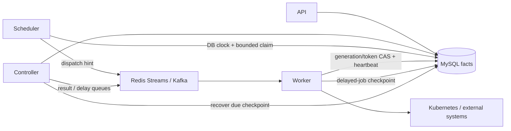

# 分布式运行时加固方案与合并指南

> 状态：Current。PR #9–#15 已按第 5 节顺序合并，本文按 `main@f46f685a25b46de91fbcba864d543ad255f9fb10` 校准实现说明；原始问题基线为 `main@3df077a2fa94ed331add8c4f739b4582bd559408`。代码整合与本地回归已完成，第 6 节真实集群验收仍待执行；Current 不代表生产 HA 或集群验收已经通过。

## 1. 结论

Eruun 已经具备分布式运行时的基本骨架：API、Controller、Scheduler、Worker 四类独立角色，Controller/Scheduler 双 Leader Election，Redis Streams 或 Kafka 的 at-least-once 消息传输，以及 MySQL 中的 workflow generation/token/lease fencing。

原始基线的问题不在“有没有拆成多个 Pod”，而在以下权威边界混杂；本批已合并代码针对这些问题收敛职责：

1. Workflow lease 的过期判断使用各节点本机时间，数据库 ownership 却是跨节点共享事实。
2. 延迟任务把消息队列当成了唯一计时器，队列裁剪、consumer group 丢失或进程退出可能让已 ACK/未恢复的数据失去执行入口。
3. Scheduler 周期性读取过多未到期记录，任务增长后会把固定频率轮询放大为数据库压力。
4. 同一任务同时使用数据库 ownership 和 Redis task-run mutex，形成两套可能分歧的执行所有权。
5. 每种角色都构造全部消息队列和 informer，使无关依赖故障扩大到不使用它的角色。
6. 每个常驻 Pod 启动时都执行 schema 迁移，数据库写入所有权不明确。
7. Controller 获得了 API/Worker 的完整资源管理权限；静态 manifest 甚至直接绑定内置 `cluster-admin`。

本次方案的核心不是增加更多协调实体，而是收敛权威来源：

- MySQL 决定 workflow ownership、lease 时间和延迟任务恢复状态。
- Redis/Kafka 负责低延迟通知与 at-least-once 传输，不单独承担业务事实。
- Kubernetes API 决定资源真实状态；generation/token 和确定性资源身份阻止旧执行覆盖新执行。
- 每个进程只初始化、探测并授权自己实际使用的依赖。
- Schema 变更属于显式部署阶段，不属于所有普通 Pod 的启动副作用。



## 2. 问题与 PR 对应关系

| 原始优先级 | 基线问题与代码证据 | 已合并处理方案 | 已合并 PR |
| --- | --- | --- | --- |
| P0 | `pkg/apiserver/domain/repository/workflow_lease.go` 的 claim、renew、expire、reaper 使用进程 `time.Now()` | 引入 datastore 数据库时钟；所有 lease 写入和回收使用同一 MySQL UTC 时间 | [#9](https://github.com/PixelCores/Eruun/pull/9) |
| P0 | `pkg/apiserver/event/workflow/job/delay_dispatcher.go` 依赖延迟队列内存堆与消息存活；Redis Streams 允许 MAXLEN 裁剪 | 先把延迟 checkpoint 持久化到 `JobInfo`，队列只用于唤醒；Controller 周期恢复 DB 中到期记录 | [#11](https://github.com/PixelCores/Eruun/pull/11) |
| P0 | 数据库 generation/token ownership 之外，`task_run_lease.go` 又用 Redis mutex 决定同一任务能否运行 | 删除每任务 Redis mutex，以数据库 CAS、worker identity 和 heartbeat 作为唯一执行所有权 | [#12](https://github.com/PixelCores/Eruun/pull/12) |
| P1 | `WaitingTasks` 和 schedule dispatch 会读取未到期记录后在 Go 中过滤；扫描频率固定 | SQL 侧按到期时间过滤、每批 100 条并补组合索引 | [#10](https://github.com/PixelCores/Eruun/pull/10) |
| P1 | `pkg/apiserver/server_assembly.go` 为所有角色构造 dispatch/delay/result 队列、Controller manager 和 Worker observer | 建立显式角色依赖矩阵，只初始化并检查该角色实际使用的队列与 observer | [#13](https://github.com/PixelCores/Eruun/pull/13) |
| P1 | `mysql.New` 在每个角色、每个副本启动时执行 AutoMigrate 和数据迁移 | 增加 `migrate/validate/migrate-only`；升级使用独立 migration Job，常驻 Pod 只校验 | [#14](https://github.com/PixelCores/Eruun/pull/14) |
| P0 | Helm Controller 与 API/Worker 共享资源管理 ClusterRole；`deploy/eruun-stack.yaml` 绑定 `cluster-admin` | Controller 使用职责所需的专用角色；静态 manifest 改用显式规则；Quickstart 在限定安装路径清理遗留高权限 Binding | [#15](https://github.com/PixelCores/Eruun/pull/15) |

## 3. 为什么这样解决

### 3.1 数据库时钟统一 lease 判断

PR #9 给 datastore 增加 `DatabaseClock` 能力，MySQL 使用 `TIMESTAMPDIFF(MICROSECOND, '1970-01-01 00:00:00', UTC_TIMESTAMP(6))` 返回 UTC 微秒时间，避免会话时区及夏令时重复小时影响。Scheduler claim、Worker claim/heartbeat、主动 expire 和 reaper 都从数据库取得时间；数据库时钟不可用时 fail-closed，不猜测 lease 已过期。

这样做的好处：

- 消除节点 NTP 偏差导致“仍在运行的 Worker 被另一节点提前回收”的风险。
- lease 的状态和比较时间来自同一事务系统，因果关系更容易审计。
- 故障语义明确：数据库不可用时暂停 ownership 转移，不产生双执行。

代价是每次 lease 操作多一次轻量数据库时钟查询。相比错误接管引起的外部副作用，这个成本更可控；后续如果需要优化，应在数据库层用同一语句/事务表达时间，而不是重新缓存节点时间。

### 3.2 Scheduler 查询有界化

PR #10 把 `execute_at <= now`、`next_run <= now` 下推到 SQL，dispatch 和 schedule 每次最多读取 100 条，并为 workflow queue 的 `status + execute_at` 增加组合索引。Cron 扫描按 `next_run, id` 稳定分页，在不足一页或空页后回绕，避免首批失败或锁竞争的记录永久阻挡后续到期工作。后续轮询会继续处理剩余批次，因此这是吞吐整形，不是丢弃任务。

这样做的好处：

- 未到期的长期任务不再被每 3 秒反复传输和反序列化。
- 单轮内存、锁持有和 SQL 返回规模可预测，避免任务表增长后突发抖动。
- 索引与实际 where 条件一致，减少全表扫描概率。

100 是当前保守批大小，不应直接宣传为系统最大吞吐。生产容量需要结合轮询间隔、单轮耗时和数据库执行计划调优。

### 3.3 延迟队列降级为加速通道

PR #11 在 `JobInfo` 中增加内部 delay state、执行时间和 payload checkpoint，并建立 `status + delay_state + delay_execute_at` 索引。发送队列消息前先保存 checkpoint；Controller 即使没有收到、无法 claim 或已经丢失队列消息，也会周期扫描到期记录并重建执行。相同 execution key 的入堆/执行路径做去重。

这样做的好处：

- Redis consumer group 从 `$` 创建、Stream MAXLEN 裁剪、Kafka offset 变动或 Controller 重启都不再是延迟任务的唯一恢复依据。
- 消息队列短暂不可用时，数据库恢复循环仍保留 eventual execution 入口。
- 队列继续提供低延迟唤醒，不需要把所有到期判断都变成高频数据库扫描。

这仍是 at-least-once：崩溃可能导致同一 execution key 再次被投递，因此 Job 执行仍必须依赖 generation/token、execution key 和资源级幂等。

### 3.4 删除双重任务锁

PR #12 删除 `task_run_lease.go` 的 Redis per-task mutex 及其 IoC 依赖。Worker 只有在数据库 `taskId + generation + token` CAS 成功后才执行，并通过 `workerId` heartbeat 续租；重复 dispatch 未取得数据库 ownership 时直接 ACK。

这样做的好处：

- 不再出现“Redis 认为 A 持锁、MySQL 认为 B 拥有任务”的双权威分歧。
- Redis 锁 TTL、释放失败或网络分区不会阻止数据库 lease reaper 恢复任务。
- 删除一整套锁续期/释放生命周期，失败路径更少、测试面更集中。

这不会删除应用级操作锁。应用版本更新、清理、重置等跨请求临界区仍可使用 Redis app-scoped lock；本 PR 只删除与数据库 execution lease 重复的每任务锁。

### 3.5 按角色裁剪运行依赖

PR #13 固化以下队列矩阵：

| 角色 | Dispatch | Delay | Result | Kubernetes observer |
| --- | --- | --- | --- | --- |
| API | 无 | 无 | 无 | 无 |
| Controller | 无 | 使用 | 使用 | Controller manager |
| Scheduler | 使用 | 无 | 无 | 无 |
| Worker | 使用 | 使用 | 无 | Worker readiness observer |

Kafka topic 初始化与 `/readyz` 也使用相同矩阵，避免“角色没有使用某个 topic，却因为该 topic 不可用而 NotReady”。

该矩阵只描述 workflow 消息队列。API 等角色仍可能因缓存和应用级操作锁使用 Redis；PR #12 删除的是与数据库 execution lease 重复的每任务锁，不是全部 Redis 用途。

这样做的好处：

- API 不会仅因未使用的 workflow topic 故障而启动失败或 NotReady；共享的 datastore、缓存、Kubernetes client 和应用锁依赖仍然存在。
- Controller、Scheduler、Worker 的故障域与职责一致，排障时可以从角色直接推导依赖。
- 不再在每个 Pod 内无意义地建立所有队列客户端和 informer cache。

### 3.6 显式 schema migration 所有权

PR #14 增加三种模式：

- `migrate`：迁移后继续启动；保留为直接运行二进制的默认值。
- `validate`：只检查版本 marker、必需表和列，不修改 schema。
- `migrate-only`：只连接 MySQL，迁移完成后退出，不构造 Kubernetes、Redis/Kafka、HTTP 或业务服务。

Helm 首次安装时，Chart 内置 MySQL 还不存在，不能安全使用 `pre-install` hook，因此只有 API Deployment 使用 `migrate`，其他角色使用 `validate`。Helm 升级时使用 `pre-upgrade` migration Job，升级后的全部常驻角色只校验。版本 marker 只在全部结构与数据迁移成功后写入，半完成状态不会被新 Pod 接受。

这样做的好处：

- 使用 `validate` 的 Pod 扩容、重启不再修改数据库；首次 Helm 安装、静态 manifest 和直接运行的 API 仍可能使用 `migrate`。
- 迁移失败会阻止 rollout，错误集中在一个可诊断 Job 中。
- migration Job 没有 Kubernetes ServiceAccount token，权限和依赖面更小。

升级 hook 执行时旧 Pod 仍可能服务，因此数据库变更必须遵循 expand/backfill/contract。删列、改义和不可逆转换不能在同一次在线升级中破坏旧版本读写。

### 3.7 角色级 Kubernetes 权限

PR #15 保留 API/Worker 的显式资源管理 ClusterRole，把 Controller 收敛到：

- Pod：`get/list/watch/patch/delete`；
- Pod 日志：`get`；
- Job：`get/create/update/delete`；
- ReplicaSet：`get`。

Controller 还参与 namespace-scoped Leader Election。它负责延迟 Job 分发、结果处理和 outbox 恢复，因此必须保留 Job 创建/复用、日志读取及已完成 Job/Pod 清理能力，不能描述为纯观察者。

Scheduler 只有 namespace-scoped Lease 权限。静态 manifest 不再引用内置 `cluster-admin`；Quickstart 仅在 manifest 模式、`eruun-system` namespace 且使用脚本同目录默认 `eruun-stack.yaml` 时，于新权限对象成功应用后删除固定遗留 Binding `eruun-platform-cluster-admin`。Helm、自定义 manifest 或其他 namespace 不自动清理；这些迁移应先确认旧绑定的全部身份具有替代权限，再由管理员删除。外部 ServiceAccount 配置也会拒绝 Controller 与 API/Worker 共用身份、Scheduler 与任何其他角色共用身份。

这样做的好处：

- Controller 的专用角色不授予 Secret 读取、Pod exec、Deployment/StatefulSet 管理或 RBAC `bind/escalate`，但仍具有上述 Job/Pod 权限，不能宣称它没有 workload 写能力。
- Helm 与静态 manifest 使用同一权限语义，避免不同安装路径产生安全差异。
- 遗留 Binding 有明确清理路径，不只修复新安装。

## 4. 不能宣称“完全解决”的边界

### 4.1 外部副作用不是 exactly-once

数据库 fencing 可以阻止旧 execution 继续写 Eruun 状态，但不能与 Kubernetes、HTTP callback 或云 API 建立跨系统原子提交。当前代码已经使用确定性资源名、UID/resourceVersion 检查、execution key，并在 callback 中发送 `Idempotency-Key`；接收方和云 provider 仍必须按 execution key 幂等或提供补偿。

因此正确承诺是“数据库 ownership + at-least-once + fenced/idempotent side effects”，不是 exactly-once。若将来需要更强保证，应为具体 provider 定义幂等 token、查询恢复和补偿协议，而不是增加一个本地锁来模拟分布式事务。

### 4.2 Worker informer 基数仍随副本增长

`pkg/apiserver/infrastructure/informer/kubernetes_observer.go` 为每个 Worker 维护一份带 `eruun.io/app-id` selector 的 Pod informer。其缓存规模近似 `Worker 副本数 × Eruun Pod 数`。本次没有把它直接改成每 Job 轮询，因为那会把内存问题换成 `活跃 Job 数 × 轮询频率` 的 Kubernetes API 压力；也没有让 Worker 依赖 Controller 进程内 cache，因为这会破坏 Worker 的独立恢复能力。

当前应监控 Worker RSS、watch 数、首次 cache sync 时间和带 Eruun 标签的 Pod 数。进一步演进需要先选择并验证一种明确模型：按 execution shard 分片观察，或把 generation-aware readiness checkpoint 持久化后由 Controller 集中投影。没有容量数据前不应同时保留两套观察实体。

### 4.3 Chart 内置数据面不是生产 HA

默认 MySQL 和 Redis StatefulSet 都是单副本，适合开发和演示，不构成多可用区数据面。代码层 fencing 不能消除数据库/消息基础设施的单点。生产部署必须使用经过验证的外部 HA MySQL、HA Redis 或多 Broker Kafka，并验证备份恢复、故障切换、一致性和延迟指标。

本批 PR 改善了依赖故障的隔离与恢复语义，但没有把内置依赖包装成未经验证的“生产 HA”。

## 5. 已完成的代码合并顺序

7 个代码 PR 最初从同一 `main` 提交独立创建，现已按以下顺序整合并合并到 `main`。这些分支存在交叉修改，下列顺序和冲突热点保留为本批变更的整合记录。

1. [#9：数据库 lease 时钟](https://github.com/PixelCores/Eruun/pull/9)
2. [#10：有界 Scheduler 查询](https://github.com/PixelCores/Eruun/pull/10)
3. [#11：数据库恢复延迟任务](https://github.com/PixelCores/Eruun/pull/11)
4. [#12：数据库唯一任务 ownership](https://github.com/PixelCores/Eruun/pull/12)
5. [#13：角色级运行依赖](https://github.com/PixelCores/Eruun/pull/13)
6. [#14：显式 schema migration](https://github.com/PixelCores/Eruun/pull/14)
7. [#15：角色级 Kubernetes RBAC](https://github.com/PixelCores/Eruun/pull/15)
8. 本文档 PR 作为实现说明与集群验收清单收尾。

主要冲突热点：

- #9、#11、#12 都会触达 workflow 执行/测试，需要确认 execution identity 与恢复语义同时保留。
- #12、#13、#14 都会触达 `server_assembly.go` 或配置测试，应按“先删除重复锁，再裁剪角色依赖，再拆迁移阶段”重放。
- #14、#15 都会触达 Helm helper、模板测试、静态 manifest 和部署文档，重放时必须同时保留 schema mode 与角色级 RBAC 断言。

每次重放后都应审阅最终 diff，不能只解决文本冲突后直接合并。

## 6. 验证与验收

各代码 PR 的独立验证证据见对应 PR。整合后的 `main@f46f685` 已使用 Go 1.25.8 通过全量竞态测试、静态检查、服务端构建及 `go mod tidy -diff`；运行时代码验证命令为：

```bash
go test ./... -race -cover
go vet ./...
go build -o /private/tmp/eruun-server ./cmd/main.go
```

部署权限 PR #15 执行了 `go test ./deploy -count=1`、`go vet ./deploy` 和 shell 语法检查；部署相关 PR 还记录了以下验证（具体参数见对应 PR）：

```bash
deploy/all_in_one_install_quickstart_test.sh
HELM_BIN=/path/to/helm deploy/helm/eruun/helm_template_test.sh
helm lint deploy/helm/eruun --values /path/to/secure-values.yaml
```

本地静态/单元测试不能替代真实集群验收。以下验收尚未完成，生产部署前至少还要执行：

1. `helm install` 新数据库，确认仅 API 初始化 schema，其他角色最终 Ready。
2. `helm upgrade`，确认 migration hook 成功后才 rollout，失败 hook 会阻止新 Pod。
3. 分别删除 Controller Leader、Scheduler Leader 和运行中的 Worker，确认无提前 lease 接管、过期任务可恢复。
4. 在延迟任务等待期间重启 Controller、裁剪/重建消息 consumer group，确认 DB checkpoint 最终触发任务且没有重复终态。
5. 短暂停止 Redis/Kafka/MySQL，确认只有依赖该能力的角色降级，恢复后可继续处理。
6. 使用 `kubectl auth can-i --as=system:serviceaccount:<namespace>:<name>` 验证 Controller 不能读取 Secret、执行 Pod exec、管理 Deployment/StatefulSet 或创建 RBAC；同时验证其必要的 Job 创建/更新/删除、Pod 清理和日志读取能力，以及 Scheduler 只能操作目标 namespace 的 Lease。
7. 验证默认 manifest 升级成功后清理 `ClusterRoleBinding/eruun-platform-cluster-admin`；Helm、自定义 manifest 或其他 namespace 的迁移先确认替代权限，再人工清理遗留绑定。
8. 采集 Worker informer 的 watch 数、RSS、cache sync 时间，形成后续分片阈值。

## 7. 预期收益

代码已落实以下改进，其真实集群故障恢复与容量表现仍须按第 6 节验收：

- 正确性：lease 不再受节点时钟偏差影响；延迟任务不再依赖单一队列记录；任务 ownership 只有一个事实源。
- 可恢复性：队列丢消息、Worker 崩溃、Leader 切换都能沿数据库 checkpoint/lease 找到恢复入口。
- 可扩展性：Scheduler 查询有界，角色不再构造无关队列与 informer。
- 可运维性：schema migration 有单独阶段和失败对象；readiness 与角色依赖一致。
- 安全性：Controller/Scheduler 权限最小化，静态安装不再授予 `cluster-admin`。
- 可解释性：每类故障都能映射到唯一权威系统，减少“Redis、MySQL、内存状态谁说了算”的排障歧义。

这套方案没有通过引入额外协调服务来隐藏问题，而是把已有 MySQL、消息队列和 Kubernetes 的职责边界写清并落实到代码、部署与测试中。
