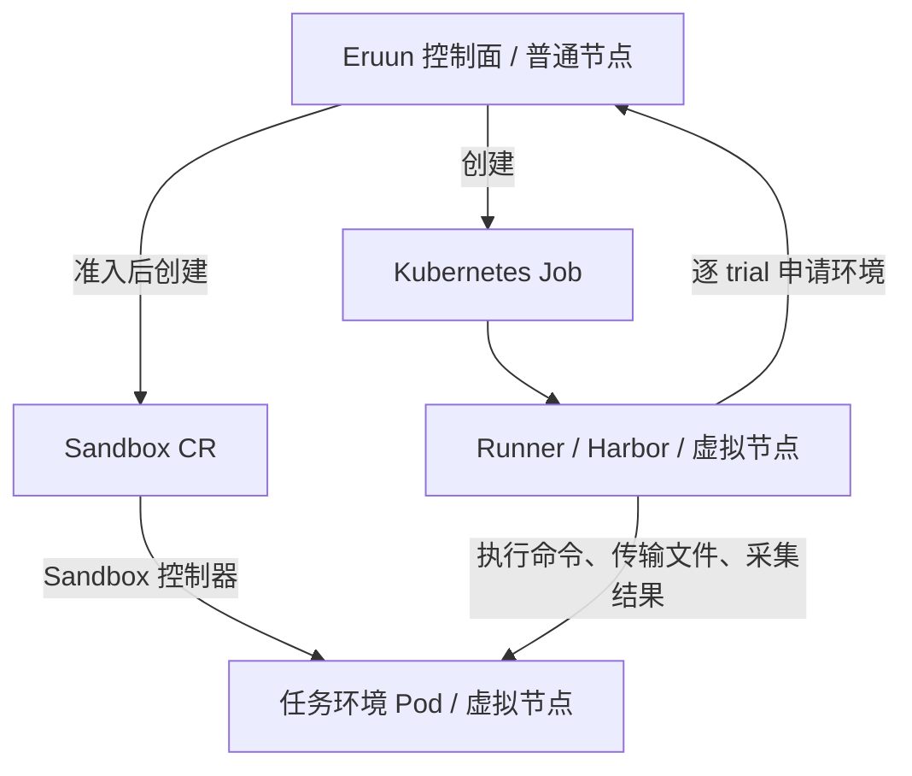

# 第一阶段方案讨论纪要：Harbor 编排、Sandbox 生命周期与万级容量

> 状态：Draft / Proposal。整理日期：2026-09-20。本文记录阶段一方案讨论中的已确认需求、代码与官方资料核查、推荐方案及待答问题，并非逐字聊天记录。推荐方案尚未全部冻结，不能据此声称功能已经实现或万级容量已经通过验证。
>
> 所属：[阶段一主 PR #59](https://github.com/PixelCores/Eruun/pull/59)。实施工作包及验收总表仍由[第一阶段计划](harbor-runtime-stage1-plan.md)维护；本文保存该计划后续细化的依据。第二阶段见[主 PR #60](https://github.com/PixelCores/Eruun/pull/60)。

## 1. 已确认的需求

| 主题 | 已确认内容 |
| --- | --- |
| 集群关系 | Eruun 部署在 ACK 内，管理同一个 ACK 集群；目前没有多集群或运行中切换集群连接的需求 |
| 部署分工 | 用户补充：所有 LLM 评测负载使用虚拟节点，Workflow 服务放在普通节点；方案据此将 Runner 与 trial 环境放在虚拟节点 |
| 容量目标 | 至少 10,000 个 Harbor eval Job 同时实际运行；不能用排队任务数、累计创建量或 Pod 总数替代 |
| 执行时长 | 常见任务为 1–2 小时，复杂任务可能持续数周；具体最大时长尚待冻结 |
| 创建节奏 | 接受分批提交和创建，启动延迟要求不严格，稳定性优先 |
| 镜像服务 | 用户将 ACR 500 QPS 作为环境约束；实际实例规格、计量和镜像拉取压力仍须验证 |
| Sandbox 管理 | 优先通过 Sandbox CRD 管理和读取生命周期；不需要预热池作为前提 |
| Job 内部规模 | 用户不预设固定 task 数，也不固定串行或并行方式；需根据 Harbor 的执行配置支持变化 |
| 第二阶段恢复 | 使用文件系统 Checkpoint，启动新进程从已保存的任务进度继续；不要求原进程和内存原地续跑 |

用户最后明确：task 数量及串并行方式取决于 Harbor 的执行方式，应研究官方 task 和编排模型。该项已从“要求用户提供固定数值”的待确认问题中移除；正式压测的具体负载组合仍要逐轮记录。

## 2. 外部参考对话与当前 Eruun 的区别

补充材料讨论了另一个 Harbor demo，其内容可用于识别需求和故障边界，但不能直接替代当前 Eruun 的实现事实。

- 材料中的“约 2,000 个任务”是外部讨论背景，本任务仍采用已确认的 10,000 个同时运行 Job 目标。
- 外部对话描述 Harbor 0.23.0 经 SandboxSet/SandboxClaim 领取环境；Eruun 当前固定 Harbor 0.22.0，配置 `use_sandbox_claim=False`，沿用直接 Pod 后端。[依赖版本](../runners/harbor/requirements.txt)、[Runner 配置](../runners/harbor/runner.py)。
- 当前 trial Pod 的 `ownerReferences` 指向 Runner Pod 的名称与 UID。不能把外部 demo 中“资源没有自动所有权关联”的说法套用到 Eruun。迁移到 Sandbox CR 后，需要重新验证 CR 与 Pod 的所有权和删除传播。
- 当前自定义环境适配已经保护采集：成功复制到 Runner 后才删除 trial 源环境，采集失败则保留源；它并非无条件执行 Harbor 的正常删除行为。[环境适配](../runners/harbor/eruun_environment.py)。
- 外部对话建议共享预热池，但用户已说明不需要预热池，因此第一阶段不引入共享 SandboxSet 库存管理。
- “15K Sandbox/分钟”等供应商指标不构成当前集群或 Eruun 的容量证据；本文不将其用作已验证吞吐。

ACR 的“500 / 7 ≈ 71 个镜像/秒”只是参考材料中的简化吞吐估算，既不是并发上限，也不是可直接采用的 Job 创建速率。镜像层数、缓存、实际请求、带宽和额外容器镜像都会改变压力；500 QPS 也需要对应实际 ACR 规格。[ACR 规格说明](https://help.aliyun.com/zh/acr/product-overview/billing-description)。

## 3. Harbor 的执行模型及任务实例

### 3.1 概念和计数

| 概念 | 含义 | 在 Eruun 中的对应关系 |
| --- | --- | --- |
| Task | 题目及其指令、环境和验证逻辑 | 上传任务包中的原生 Harbor task |
| Dataset | 多个 task 的集合 | 一次评测可以包含多个 task；不要求固定数量 |
| Trial | 一个 agent 对一个 task 的一次评测尝试 | 需要独立关联其执行身份和实际环境 |
| Harbor Job | 一组 trials 的执行与结果汇总 | 在 Runner 内运行，保留 Harbor 自身的编排 |
| Kubernetes Job | Kubernetes 工作负载对象 | 当前用于承载 Runner，不等同于每一个 trial |

依据：[Harbor 核心概念](https://docs.harborframework.com/core-concepts)。

普通评测的计划数量为：

```text
计划 trial 数 = 选中的 task 数 × agent/model 配置数 × n_attempts
```

`n_concurrent_trials` 控制并发 trial 上限；设为 1 时逐个执行。`n_attempts` 是计划内重复评测，`retry.max_retries` 则控制异常重试。重复评测、Harbor 异常重试和 Eruun 执行重试必须保持不同语义，不能仅凭同名的 attempt 字段推断资源身份。[Job 配置](https://docs.harborframework.com/core-concepts/jobs/configs)、[v0.22.0 Job 展开](https://github.com/harbor-framework/harbor/blob/v0.22.0/src/harbor/job.py)、[TrialQueue](https://github.com/harbor-framework/harbor/blob/v0.22.0/src/harbor/trial/queue.py)。

Eruun 当前只传入一个 agent/model 配置，`attempts` 范围为 1–10，`concurrency` 为 1–16，二者默认均为 1；Harbor 内部异常重试明确设置为 0。这些是当前适配限制，不代表 Harbor 自身的全部能力。[规格校验](../pkg/apiserver/domain/spec/job.go)、[配置映射](../runners/harbor/runner.py)。

以下为容量计算示例，假定一个 agent/model、每 trial 一个环境，暂不计失败保留、重试和清理中的实例：

| task 数 | 每题尝试次数 | 并发配置 | 计划 trial 数 | 活跃 trial 环境上限 |
| --- | --- | --- | --- | --- |
| 1 | 1 | 1 | 1 | 1 |
| 100 | 1 | 1 | 100 | 1 |
| 100 | 3 | 8 | 300 | 8 |
| 500 | 2 | 8 | 1,000 | 8 |

每个例子中的 Runner 通常贯穿整次 eval 执行。并发槽位还覆盖环境准备、验证和收尾等阶段，不能将配置上限直接当成正在调用模型或实际执行任务的数量。

### 3.2 官方任务实例

| 实例 | 任务内容 | 对方案的启示 |
| --- | --- | --- |
| [hello-world](https://github.com/harbor-framework/harbor/tree/main/examples/tasks/hello-world) | 创建文件并验证内容 | 可作为创建、执行、验证和收集的功能基线 |
| [Terminal-Bench：caffe-cifar-10](https://github.com/harbor-framework/terminal-bench-2-1/tree/main/tasks/caffe-cifar-10) | 安装 Caffe 并使用 CPU 训练 CIFAR-10 | 相同 trial 数可能对应明显不同的资源和时长需求；应固定任务及镜像版本 |
| [SWE-bench Verified](https://hub.harborframework.com/datasets/swe-bench/swe-bench-verified) | 官网列出 500 个真实仓库问题修复任务 | 一个 Job 可以展开大量 trial，再按并发配置逐步执行 |

这些实例用于解释执行模型，不表示原始数据集已经满足 Eruun 的镜像、用户权限、包大小和任务格式要求。当前 Eruun 用已校验的 eval 资源配置生成 trial Pod，不能声称已经逐 task 应用官网中的全部资源配置。

### 3.3 任务内部步骤与额外环境

Harbor 的 multi-step task 按声明顺序执行，环境及文件系统可跨步骤保留；不能把 step 数直接乘成 Sandbox 数。独立 verifier 会使用额外环境，多容器任务则可能包含数据库或其他服务，其资源数量取决于实际拓扑和 provider。[Multi-step](https://docs.harborframework.com/core-concepts/tasks/multi-step)、[Separate verifier](https://docs.harborframework.com/core-concepts/tasks/separate-verifier)、[Multi-container](https://docs.harborframework.com/core-concepts/tasks/multi-container)。

当前 Eruun 明确拒绝 multi-step、独立 verifier 和多容器任务。讨论中的建议是先在现有单容器、共享验证环境的范围内完成规模化；扩大任务格式支持范围属于单独的范围决策，尚未确认。资源关联应记录真实环境身份，避免将“所有 Harbor task 永远只有一个环境”写成通用前提。

## 4. 推荐方案：Eruun 统一管理实际创建与回收

**状态：讨论中的推荐路线，尚未冻结逐 trial 协议和持久化结构。**

阶段一初稿将 Harbor 环境适配层作为 Sandbox 创建者，Eruun 负责观察和异常兜底。进一步讨论全局真实创建预算后，建议改为：Eruun 创建 Runner Job 和 trial Sandbox，Harbor 保留试验编排，通过现有环境适配层逐 trial 申请、使用并请求释放环境。

若 Harbor 直接写 CRD，仍需向 Eruun 申请全局额度，并处理许可响应丢失、创建结果不确定、额度释放和重启恢复。把实际创建集中到 Eruun，可以减少跨进程许可交接；但数据库与 Kubernetes 操作仍非原子，创建意图、幂等和对账不可省略。沿用现有角色和领域边界，不为此新增独立调度服务。



按需 Sandbox 可以通过 CR 直接创建，无需预热池；目标 API 为 `agents.kruise.io/v1alpha1`，实际安装版本及行为仍须通过 ACS 环境验证。[官方 Sandbox CR 示例](https://help.aliyun.com/zh/cs/user-guide/clone-agent-sandbox-using-checkpoint)。

| 环节 | 建议责任与行为 |
| --- | --- |
| 申请 | Harbor 适配层携带当前执行及 trial 身份申请环境；沿用已有 task、execution 和执行隔离机制 |
| 准入 | Eruun 检查任务归属、取消状态、资源配额和启动预算；等待期间可取消 |
| 创建 | 持久化创建意图，创建 Sandbox，保存 namespace/name/UID 和实际 Pod 关联 |
| 执行 | 环境就绪后，Harbor 执行命令、传输文件并采集；Eruun 持续观察基础设施状态 |
| 释放 | Harbor 上报采集事实和释放请求，Eruun 依据保留策略决定删除或继续保留 |
| 回收 | 按 UID 确认对应资源消失后释放容量；删除调用已受理不等于资源已释放 |

关键约束：

- 重复申请找回同一次环境分配；创建响应丢失时先核对实际资源，不直接重复创建或返还容量。
- 复用现有 WorkflowQueue/JobInfo、执行身份和 Runner 鉴权；逐 trial 分配/释放协议当前不存在，需在实现前明确，不能描述成仅配置一个 attach 参数。
- Harbor 正常释放与 Eruun 异常清理必须服从同一策略；不能各自独立决定删除。
- CR 与 Runner 的 ownerReference 需匹配保留策略。若要求 Runner 删除后保留 Sandbox，就不能设置会将其立即级联删除的所有权链；也不能只移除关联而不实现回收对账。[Kubernetes 垃圾回收](https://kubernetes.io/docs/concepts/architecture/garbage-collection/)。
- 第一阶段处理健康执行的控制面接管；Runner 或环境本身丢失时给出可信失败证据，尚不保证恢复未保存的计算进度。

## 5. 创建预算与共享 List-Watch

### 5.1 容量、启动中数量和速率分别管理

| 维度 | 需要计量和约束的对象 |
| --- | --- |
| 运行与占用容量 | Runner、活跃 trial 环境及其 CPU/内存等已校验资源规格；保留和清理中资源单列但仍计入实际占用 |
| 启动中容量 | 等待调度、镜像拉取或就绪的实例，防止大量 Pending 对象堆积 |
| 创建速率及突发额度 | Runner Job 和每次 trial Sandbox 的创建请求，包括重试与恢复重建 |

预算需要跨 Eruun 副本共享。仅限制提交 API 或最初一批 Runner 不足以约束后续 trial 的创建；Harbor 内部并发配置是单 Job 的上限，不能替代全局配额。按实际请求准入，避免为整个 dataset 一次预建全部环境，并保留空间公平性。

10,000 个实际运行 Job 的目标保持不变。如果每个 Job 都有足够待执行任务且期望并发 8 个 trial，需求可能达到 80,000 个 trial 环境，另加 Runner。该数字只是需求估算；超过实际预算的 trial 应等待，不能把等待中的 Job 计成正在实际执行。验收必须同时报告实际 Job、trial、Sandbox/Pod 数及资源规格。

准入限制约束 Eruun 发起的创建。Kubernetes/Sandbox 控制器的自主 Pod 重建、镜像缓存和拉取行为仍需观测；不能声称 CR 创建限速就严格保证了 ACR 请求 QPS。发现镜像拉取、Pending、429 或结果保存积压时，应对新创建施加可解释的背压。

### 5.2 等待额度不能混入环境启动超时

Harbor v0.22.0 对环境 `start()` 使用环境启动超时。若适配层直接在其中等待全局额度，正常排队也可能被判为环境启动失败。[Trial 源码](https://github.com/harbor-framework/harbor/blob/v0.22.0/src/harbor/trial/trial.py)。

因此需分别定义等待准入、创建并等待就绪、实际执行、收尾上传的时间预算，以及它们与 Job 总时限的关系。具体如何衔接 Harbor 生命周期仍待实现设计；不能仅延长一个超时或无限等待掩盖该问题。

### 5.3 观察与连接

- 集群内复用 ServiceAccount 连接；原生 Job/Pod 使用 typed informer，限定资源类型的 Sandbox 使用 dynamic informer。dynamic 用于访问 CRD，不意味着需要动态切换集群。
- 每个进程按资源类型共享观察，建立 namespace/name、UID 和执行归属索引；事件触发相关任务的有界协调，并合并重复通知。
- 正常等待移除每任务固定频率的远程 GET；Watch 重建和周期性对账采用有界批次，不能转成另一种全量忙扫。
- 初始缓存未同步、Watch 断线或状态陈旧时，不能将缺失对象判为任务成功或授权通过。破坏性操作继续校验当前执行归属及 UID。
- 保留 DB 的业务状态与执行租约权威；Informer 的最终一致快照不替代业务事实源，也不构成无遗漏事件审计。

具体接入点及验证要求继续使用计划中的 P1-02/P1-03，连接现状见[Kubernetes client](../pkg/apiserver/infrastructure/clients/kube.go)。

### 5.4 Kubernetes QPS/Burst 的作用范围

用户补充指出：仅讨论 ACR 限速不足以覆盖控制平面压力，Kubernetes 客户端 QPS/Burst 和大规模生命周期同步必须进入阶段一方案。这涉及三个不同的预算：镜像仓库请求、客户端访问 kube-apiserver 的请求，以及 Eruun 消费状态变化并写入数据库的处理能力，不能共用一个 QPS 数值。

client-go 的默认限流模型是令牌桶：QPS 表示令牌持续补充速率，Burst 表示桶容量，允许已有令牌支撑短时突发；Burst 不等于最大在途并发，也没有必须为 QPS 两倍的通用规则。显式提供 `RateLimiter` 时，其行为覆盖 QPS/Burst。[rest.Config](https://github.com/kubernetes/client-go/blob/v0.35.0/rest/config.go)。

Eruun 当前默认 `KubeQPS=100`、`KubeBurst=300`，对应 `--kube-api-qps` 和 `--kube-api-burst`。这些值不是已经验证的万级容量配置，更不是集群或整个 Eruun 服务的总请求上限。[配置](../pkg/apiserver/config/config.go)。

当前 client 的限流作用域存在需要解决的边界：基础配置只设置数值，没有显式设置共享 `RateLimiter`；API 包装 client 和 Workflow 的 `TenantClient` 会复制配置并调用 `NewForConfig`。当传入配置的 limiter 为空时，client-go 会在构造过程的局部副本里创建新桶，因此不同派生 client 可以各自拥有 100/300 的预算。相同配置对象、相同数值或复用底层连接，都不等于共享限流状态。[基础 client](../pkg/apiserver/infrastructure/clients/kube.go)、[API client](../pkg/apiserver/infrastructure/workspace/request.go)、[租户 client](../pkg/apiserver/infrastructure/workspace/namespace.go)、[Workflow 接入](../pkg/apiserver/event/workflow/controller.go)、[client-go 构造逻辑](https://github.com/kubernetes/client-go/blob/v0.35.0/kubernetes/clientset.go)。

实施时需明确基础、租户、typed/dynamic client 的预算归属：同一进程内需要共享的请求显式共享 limiter，并保留租户 impersonation 和 namespace 约束；多个进程仍各自拥有本地状态，副本数、角色及额外 client 的总预算需要单独核算。Runner 的 Python Kubernetes client 也不会自动继承 Go 服务的 QPS/Burst。

### 5.5 LIST、WATCH 和本地同步不能按同一种 QPS 计算

以下按 Eruun 当前依赖的 client-go v0.35.0 区分；升级依赖或变更 ACK 服务端版本后需重新核对。

| 操作 | 与客户端 QPS/Burst 的关系 | 仍需承担的成本 |
| --- | --- | --- |
| 普通 LIST、GET、CREATE、PATCH、DELETE 等请求 | 正常 REST 请求路径在发出前等待 limiter | 请求延迟、服务端处理、鉴权与存储；一个大 LIST 可能返回大量对象，不能只看请求次数 |
| 发起 WATCH | `Request.Watch()` 的首次尝试刻意跳过普通请求的 limiter；部分 HTTP 重试路径仍会经过 limiter | 连接、服务端初始化、认证及后续事件分发；不能依赖 QPS/Burst 完整控制重连风暴 |
| 已建立 WATCH 中的 ADDED/MODIFIED/DELETED 等事件 | 每条事件不会变成一个新的 HTTP 请求，也不会逐条扣除 QPS token | 带宽、解码、缓存更新、回调、状态协调及 DB 写入 |
| informer 的本地 resync | 重放本地缓存，不等于定期全量远程 LIST | 可能再次触发大量回调和协调；是否产生远程请求取决于回调执行的工作 |
| 初始同步或失效 resourceVersion 后重建 | 传统 LIST 路径受请求限流；WatchList 流式初始化属于 WATCH 路径，需检查实际启用情况 | 数据总量、对象大小、初始化 CPU/RSS 和多副本同时重建 |

依据：[REST 请求与 Watch](https://github.com/kubernetes/client-go/blob/v0.35.0/rest/request.go)、[HTTP 重试](https://github.com/kubernetes/client-go/blob/v0.35.0/rest/with_retry.go)、[Reflector 的 List/Watch/Resync](https://github.com/kubernetes/client-go/blob/v0.35.0/tools/cache/reflector.go)。

因此，`QPS=100` 不代表只能观察 100 个 Job，也不代表每秒最多接收 100 个状态变化。共享 Watch 可以承载大量对象的变化；实际瓶颈可能转移到事件分发、缓存和后续写入。现有逐任务每两秒查询在 10,000 个运行任务下产生约 5,000 次 Job GET/s 的理想需求，而事件驱动的目标是移除这类稳定重复读，不是把客户端 QPS 提到 5,000。[当前轮询](../pkg/apiserver/event/workflow/job/job_retry.go)。

客户端本地等待和服务端 API Priority and Fairness（APF）应分别观察。APF 管理请求排队和并发，包含 WATCH 初始化；大 LIST 成本和 Watch 事件向多个观察者分发也会影响服务端预算。不能因 WATCH 跳过普通客户端 limiter 就认为其对控制平面没有成本。[Kubernetes APF](https://kubernetes.io/docs/concepts/cluster-administration/flow-control/)。

### 5.6 万级生命周期同步的并发模型

建议使用下面的处理链路，复用现有领域状态和执行租约；本图描述拟实现行为。

```text
少量共享 LIST/WATCH 流
  → informer 本地缓存及资源身份索引
  → 轻量回调，仅标记相关执行需要重新协调
  → 按执行键合并重复通知
  → 固定上限的协调 worker
  → 读取最新快照并校验 UID / 当前执行归属
  → 仅持久化有意义的状态变化，使用数据库条件更新
```

当前应用组件状态同步已经有按组件键合并的 lane 和 2 个 worker、256 个 executor 队列项，可作为复用边界的参考；这条路径尚不是独立 eval 的 Job/Sandbox 观察实现，而且 executor 队列长度不限制全部 lane 的数量。实现应先评估现有机制和 tracker 的全量扫描成本，再决定最小修改，不能简单宣称现有队列已具备万级容量。[组件状态同步](../pkg/apiserver/infrastructure/informer/waiter.go)、[写库路径](../pkg/apiserver/server_status_sync.go)。

- **按资源集合观察。** 不为每个 Job 单独建立 Watch。同一资源类型、观察范围和过滤条件尽量复用流；也不能把全量数据每次事件都重新遍历一遍。
- **回调快速返回。** 不在 informer 回调中等待数据库、上传制品或同步执行清理；不为每个事件无上限地创建 goroutine。
- **同一执行有序，不同执行并行。** 同一逻辑执行的协调不同时运行；执行过程中收到新变化，完成后再协调一次。跨资源事件不能假设有全局顺序，旧 UID 的删除事件不得终止同名新实例。
- **按状态收敛，不依赖逐条业务重放。** 读取最新 Job/Sandbox/Pod 快照，再与 DB 权威状态进行幂等协调。允许重复通知与可合并的中间变化，终态、取消和执行隔离继续受领域规则与 CAS 保护；需要保留的 Runner 结果事实继续走已有上报和持久化路径。
- **处理并发和队列规模都要有预算。** client-go workqueue 的去重和重试退避不等于队列有硬容量上限。需要结合已准入资源规模限制待处理键数量，监控最老待处理时间；超限时停止新准入并保留可重新对账的依据，不能用静默丢通知或阻塞 Watch 回调解决积压。[workqueue 实现](https://github.com/kubernetes/client-go/blob/v0.35.0/util/workqueue/queue.go)。
- **按存储能力增加 worker。** 调高本地协调并发之前，先测量 DB 连接、锁等待及单次协调耗时。稳定运行要求合并后的任务到达速率低于持续处理能力，并为集中完成留有余量；增加 goroutine 本身不能消除 DB 瓶颈。

例如在每 Job 一个活跃 trial、没有遗留资源时，10,000 个 Runner Job、10,000 个 Sandbox 和 20,000 个 Pod 已约为 40,000 个对象。一个进程可能只需按 Job、Sandbox、Pod 维持少量资源流，但多个进程若重复观察全量范围，缓存和事件分发仍会随观察者增加。观察连接数主要由资源类型、范围/过滤条件、分片和进程数决定，不能用“只有三种资源”推断全服务始终只有三个 Watch。

每进程共享只是第一步。应测量 Worker 副本扩容后的重复观察成本；需要时按 namespace 或稳定任务归属缩小观察范围，并定义分片迁移和接管重叠。跨进程的 DB 写入仍需现有 ownership/CAS 限制，不能让所有观察者重复写相同状态，也不提前引入新的事件总线。

### 5.7 重连、冷启动和状态延迟验收

普通断线尽量由 Reflector 从有效 resourceVersion 继续观察；历史版本失效时重新建立一致快照。继承 client-go 的退避、抖动及服务端 Retry-After 处理，避免额外叠加立即重试。分批启动观察者，限制同时初始化/重建的数量；分页 LIST 或 WatchList 应按实际客户端、ACK 版本和开关验证，不能假定所有初始化都采用流式方式。[API List/Watch 语义](https://kubernetes.io/docs/reference/using-api/api-concepts/)。

重建期间只说明观察状态尚未收敛，不能因缓存中暂时没有对象而标为执行失败、完成或可以删除。降低新建准入时仍需为取消、清理、必要身份校验和控制面租约等操作保留请求预算；具体角色分配与额度在实测后冻结，不统一套用 Burst=2×QPS。

P1-01/P1-02/P1-06 需要分别记录以下指标并验收：

| 层次 | 指标与场景 |
| --- | --- |
| 客户端请求 | 按角色、client 作用域及资源/动词统计请求率、在途量、本地限流等待、deadline、429/5xx；核实真实 limiter 数量 |
| LIST/WATCH | 初始快照对象/字节量、流数量、事件率、断线和 410、重建时长、同时重建数量；观测多副本重复分发 |
| 本地协调 | 缓存 RSS、解码/回调耗时、去重后待处理键数、最老等待时间、worker 利用率、DB 延迟及条件更新冲突 |
| 业务可见性 | Kubernetes 状态变化到 Eruun API 可见状态的端到端 p95/p99、取消收敛和完成波峰排空时长 |
| 故障与规模 | 目标对象规模下冷启动、多个 Worker 滚动重启、Watch 断线/失效版本、服务端限流、慢 DB 和集中完成；证明不误报、不重复副作用、不持续积压 |

已有计划的状态收敛 p99 ≤15s 仍是待冻结的建议值，并非已经确认或达成的 SLA。QPS/Burst、观察流数和 worker 数需结合上述证据选择；本次没有改动默认参数或执行真实集群压测。

## 6. 执行结果、采集和清理的边界

三个维度分别推进：评测执行结果、结果采集/持久化、资源清理。Sandbox Running/Ready 或 Kubernetes Job Complete 都不能单独代表完整评测结果已保存；模型获得零分也可以是一次正常完成的评测。

当前路径为：

```text
trial 环境内产生数据
  → 完整复制到 Runner
  → 满足采集门槛后可删除 trial 源环境
  → Runner 制作归档并上传
  → 平台记录完整结果并交付保存目标
```

因此，“已采集到 Runner”和“已持久化到平台”是不同时间点。当前环境适配检查采集状态及 manifest 后才释放源环境；正常完成/失败的 Runner 清理还受可信 terminal 和完整源归档约束，取消/超时另有停止路径。[采集适配](../runners/harbor/eruun_environment.py)、[Runner 归档上传](../runners/harbor/runner.py)、[Runner 清理门槛](../pkg/apiserver/event/workflow/job/job_instant.go)。

推荐保持以下行为边界：

- 结果已保存而 Sandbox 删除失败时，保留结果事实，继续重试并暴露清理积压。
- 采集失败时明确标记不完整，按待确定策略保留源；保留实例继续占用实际资源。
- 文件仅在 Runner 本地时，Runner 丢失仍可能导致数据丢失。不能因源 Sandbox 曾经采集成功就宣称具备持久恢复能力。
- 控制面中断后的状态补报、取消传播、健康执行接管，以及终态期间的上传重试预算，需要与下节的业务选择一致。

第二阶段还须保存 Agent/Harbor 的应用进度及 Runner 侧必要状态。Sandbox 文件系统 Checkpoint 本身不能保存 Runner 进程内存或自动恢复完整业务执行。[Checkpoint 能力边界](https://help.aliyun.com/zh/cs/user-guide/clone-agent-sandbox-using-checkpoint)。

## 7. 待答问题和待冻结设计

以下两个问题已经提出，但用户尚未回答；推荐选项不能写成已接受要求。

| 待答业务问题 | 当前讨论建议 | 尚未确定的影响 |
| --- | --- | --- |
| Eruun API 或数据库不可用 10 分钟，而 Runner、Sandbox、模型服务健康时，已开始的 trial 如何处理？ | 建议继续当前执行，暂停新建环境，恢复后补报；尚未确认 | 可容忍中断时间、已分配与未分配 trial 的处理、租约失效后的控制权、结果暂存与取消时效 |
| trial 结束但采集失败时，Sandbox 应保留多久？ | 建议有限保留；24 小时只是讨论起点，尚未确认 | 自动补采、人工排查、保留配额、到期处理和资源成本 |

另外还需在 P1-01/P1-04/P1-05 中冻结技术细节：逐 trial 稳定身份与最小存储结构、创建/释放的幂等协议、所有权与删除传播、准入等待超时、最大任务时长、ACS 版本/配额，以及混合并发下的公平性和资源预算。上述技术选择应优先复用现有结构；涉及新的业务取舍时再继续提问。

“每个 Job 固定多少 task、必须串行还是并行”已不再是设计阻塞项。正式验收仍需覆盖串行、并行、重复评测、混合任务时长、集中完成及失败保留的负载组合。

## 8. 对阶段一工作包的补充

| 工作包 | 本轮讨论补充 |
| --- | --- |
| P1-01 | 固定 Harbor 版本与 task 格式范围；分别定义 Job/trial/环境计数，记录可变任务量与并发组合、Kubernetes client/limiter 作用域及状态延迟预算，完成待答业务边界 |
| P1-02 | 共享观察覆盖独立 eval 和 Sandbox；明确请求限流、Watch 初始化/重建预算、按键合并及有界协调；将创建、关联、保留及删除状态纳入按执行身份的协调 |
| P1-03 | 保持 DB ownership/fencing、空间公平和控制面接管语义；不复制 Harbor 内部 task 编排 |
| P1-04 | 评估并冻结 Eruun 统一创建、Harbor 申请并使用环境的推荐路线；处理逐 trial 身份、采集和所有权 |
| P1-05 | 与 P1-04 一起设计实际创建预算及等待协议，再实现限速、背压和结果保存吞吐；不能把配额作为事后补记账 |
| P1-06 | 保留 10,000 个实际运行 Job 验收；额外验证目标对象规模的冷启动/重建与集中完成状态延迟，记录内部 trial 并发、命令/文件传输、结果保存和遗留资源压力 |

本次仅增加讨论纪要和导航，不修改运行时、API、数据库、RBAC 或部署行为，不包含集群压测结果。下一步继续确认故障期间行为及保留策略，再将冻结后的决策同步回实施计划。
