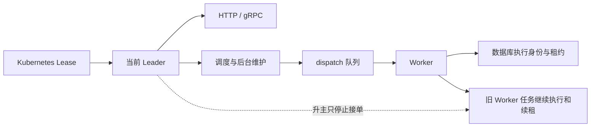
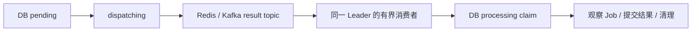

# Leader/Worker 优化后的复杂度审核

> 状态：Historical / Audit。基线为 `main@2a99ad3539e445cb70e18b93a0007be24d376df9`（2026-10-07，PR [#139](https://github.com/PixelCores/Eruun/pull/139) 合并后）。本文记录分析和后续建议，未实施其中的代码或协议变更。当前运行契约见 [分布式运行时设计](enterprise-distributed-runtime-design.md)。

## 1. 判断

**仍有局部可以简化的实现，但没有证据支持推翻 Leader/Worker 模型或继续删除分布式正确性保障。** 四类部署和两份选举已收敛；剩余负担主要是旧状态没有随职责合并而消失、两代取消机制并存，以及开发阶段仍维护旧内部协议。

| 编号 | 结论 | 建议 |
| --- | --- | --- |
| A1 | Worker 同时保存运行实例、存在标志和取消函数副本 | 优先删除两份可推导状态 |
| A2 | 同步启动结果仍通过两个共享 atomic 字段传递 | 改成直接返回启动结果 |
| A3 | 连接已按任期关闭，请求层仍维护额外的 I/O 中断机制 | 以连接关闭统一 I/O 生命周期；完成边界回归后再改 |
| A4 | 当前生产者只写新内部协议，消费者仍接受多种旧路径 | 按“开发阶段无需迁移”的约定收缩协议 |

这些是维护成本判断，不是新增故障报告或已测得的性能瓶颈。PR #139 相比父提交 `63d4a4c` 净增加 608 行非测试 Go、3,432 行 Go 测试；它同时包含 D1–D5 修复，不能把这部分增量全部归因于角色合并，也不能仅凭行数判定过度设计。

## 2. 当前复杂度中应保留的部分

部署只有两种运行身份，不等于内部只能有两个函数或两个 context。以下机制有不同的事实源和失效边界：

| 机制 | 仍然必要的原因 | 证据 |
| --- | --- | --- |
| 选举任期、消费和已领取任务的不同 context | 升主停接单，但不能取消已经认领的任务；进程退出才限时排空 | [Worker 启动][worker-start]、[升主与排空][promotion] |
| client-go 回调串行屏障 | `OnStartedLeading` 异步执行，迟到的启动不能越过停止或下一任期 | [选举循环][election] |
| `drainingWorkerRuns`、实例身份判断、共享并发额度 | 多次切主期间可能同时存在旧任务与新消费者，不能重发配额或让旧回调改新实例状态 | [运行实例回调][worker-start]、[共享额度][workflow-life] |
| `leading` 与有效 `leaderCtx` | 已当选但仍初始化，需要报告 Leader 未就绪；不能只用一个布尔值表达 | [角色与 readiness][server-state] |
| Service selector CAS、Pod UID 和本地业务门禁 | Service 更新与选举不是事务；旧连接和旧 EndpointSlice 路由仍需拒绝业务 | [Service 发布与撤销][service]、[连接任期][transport] |
| 应用行锁、执行租约、结果 claim | 单 Leader 内 API 与 Cron 仍并发；任务执行和结果收尾也不是同一生命周期 | [应用调度事务][app-tx]、[结果认领与提交][result-claim] |
| 终态 CAS、日志身份校验、先提交后清理 | 防止并发取消被覆盖、同名新 Pod 被误读/误删，以及保存失败后现场丢失 | [结果提交顺序][result-commit]、[日志读取][pod-logs] |

Worker observer 与 Leader Informer 也不能直接合并：前者服务仍在执行的任务，后者承担任期内的全局投影。IoC、平台/租户 Kubernetes 客户端的权限边界，以及 schema 初始化/校验和持久卷凭据保护均应保留。旧参数明确报错也不是兼容别名，不建议改成静默忽略。

## 3. 可安排的精简

### A1. Worker 生命周期重复保存可推导状态

[当前字段][server-state]包括 `workersStarted`、`workersCancel`、`workersRun`。生产赋值路径始终在同一把 `workersMu` 下维护 `workersStarted == (workersRun != nil)`，而 `workersCancel` 只是 `workersRun.cancel` 的副本。启动、自然退出、停止和升主暂停都要同步更新三者；[`stopWorkers` 的末尾 fallback][worker-stop]还处理生产路径不会生成的“没有 run、仍有 cancel”组合。

建议以 `workersRun` 为唯一运行实例，直接调用其停止方法，删除两个镜像字段。**保留 `workersReady` 和 `workersRun == run` 校验**：存在实例不等于订阅已就绪，旧实例的回调也不能影响新实例。这是早于 #139 的重复状态，统一节点后仍被沿用。

验收：重复启动、ready/stopped 回调乱序、自然退出、升主后旧任务完成、失主重新消费、退出超时。不得顺手删除 shutdown 中第二次 `stopWorkers`：它覆盖失主回调在第一次暂停之后才重启消费者的交错。

### A2. 把同步启动结果从共享状态改为函数返回值

`controllerReady` / `schedulerReady` 原本由 readiness 读取；统一后 [RuntimeReady][server-state] 已依据 `leading` 和任期 context 判断。这两个 atomic 的生产读取只剩 [startLeader][leader-start] 在调用启动函数返回后检查，写入和复位仍散布在 [Controller/Scheduler 启停][control-start] 中。

这把两个同步调用结果伪装成持续健康状态，增加了读写点和复位责任。建议启动函数直接返回 `error` 或明确的成功结果，`startLeader` 顺序判断；保留后台错误通道。这里可删的是共享字段，**不是 Informer 初始同步、EnsureGroup 或 Scheduler ready 屏障**。

验收：Informer/队列初始化失败、准备期间失主、Scheduler 在 ready 前退出、错误通道等待期间取消，以及全部准备完成后才允许 API。该简化机会直接来自 #139 对 readiness 读取路径的收敛。

### A3. 将 I/O 中断责任收敛到任期连接

当前生产 HTTP/gRPC listener 都使用 [leaderConn][transport]；失主会关闭已经绑定任期的连接，包含空闲连接。同一版代码又保留 [HTTP 请求级 deadline/body-close 回调][http-io]，以及 [gRPC 每次 SendMsg/RecvMsg 新建 channel 和 goroutine][grpc-io]。

这些逻辑最初用于解决“只取消业务 context 不能解除传输阻塞”，但 #139 后续已经补上连接级关闭。现在一次请求要协调请求 context、I/O 回调、连接回调；流式每条消息还要额外协调 goroutine。确认存在职责重叠，尚未测量其吞吐或延迟成本。

建议保留任期准入、请求 context、取消原因及 gRPC stream 的 `Context()` 包装，让连接关闭负责实际 I/O 中断，评估删除请求层的第二套中断逻辑。不能删除 Worker 的 HTTP `Connection: close`、gRPC 拒绝新连接或连接关闭后的回调解绑，否则会重现旧连接滞留问题。

本次临时 Go overlay 删除上述 HTTP 回调和 gRPC Send/Recv 覆盖方法，保留生产 listener/ConnContext 装配后，慢上传、阻塞 gRPC 接收、unary 取消及既有 7 项连接回归均通过 race。实验未写入生产代码。落地前仍需补阻塞发送、客户端主动取消、正常多消息流和关闭后资源释放；现有绕开生产 listener 的中间件测试也需调整装配，不能仅删除失败断言。

### A4. 开发阶段收缩旧结果和延迟协议

当前结果通知生产链是 `DelayDispatcher → DB outbox → ResultOutboxDispatcher → ResultDispatcher`。[仓库内唯一生产入队调用][result-producer]使用 [jobResultPayloadFromOutbox][result-payload]，始终填写 `OutboxID`，但消费者还维护：

- [无 OutboxID 的直处理入口][result-consumer]及可选 `RunToken/WorkerID` 父执行身份分支；当前 outbox 载荷不填这两个字段。
- 无生产写入者的 `result_processing_local` 状态，以及 outbox 模型中当前构造/转换不读写的 `RunToken/WorkerID`。
- [旧 active 记录 NULL lease 的宽限回填][legacy-lease]，需要按旧完整 Job timeout 推迟接管。
- 延迟消息只生产 [v2 身份通知][delay-producer]，却仍接受 [无 version 的完整 Job][delay-decode]、双格式比较和 [旧 workspace 回填][delay-compat]。

成本是两套结果入口、额外 ownership 表达、不可由当前代码生成的状态，以及旧记录兼容测试矩阵。除 NULL lease 宽限由 #139 新增外，上述旧路径主要继承自更早版本；不能把它们全部算成本次优化引入。

按已经确定的开发期契约，建议分两步只支持当前 result/outbox 与 delay/v2 协议，删除旧入口和回填，缺 ID、缺 workspace、未知版本及 active 状态缺租约均明确拒绝并可诊断。**Pending 状态租约为空仍合法**；结果 claim token、DB 时间与续租、代次/UID、并发取消 CAS、提交后清理均不能删除。缺少 OutboxID 是无效格式；outbox 已完成并删除后的重复通知仍保留现有幂等 ACK 语义。这里不建议取消数据库 schema 管理，也不涉及清理现存数据。

验收：当前协议成功、缺失/不存在 ID、旧/未知版本、重复及迟到通知、消费早于发布确认、续租/回收交错、数据库失败、清理重放、workspace 不一致和同名新 UID。协议边界变更需同步状态说明、测试和错误处置。

## 4. 收益可能更大，但暂不作为直接删除项

### B1. 结果收尾是否还需要同一 Leader 内的 broker 往返

[StartController][workflow-life]在同一任期同时启动 outbox 发布器和结果消费者，当前路径为：

可以评估直接由有界处理池在 DB 认领 pending，保留 durable outbox 与处理租约，省去 result 发布/排队状态、ReadGroup/AutoClaim/ACK 和消息 ID 竞争窗口。它是更早设计的延续，并非 #139 新增。

这会改变恢复协议，不能只删消息队列调用。先比较数据库认领公平性、索引与扫描成本、16 槽背压、长任务占槽、切主接管和失败重试；没有这些证据，不承诺更快或更简单。Worker 的跨节点 dispatch 队列及真正支持 Redis/Kafka 的 `msg-type` 不在此建议范围内。

### B2. Controller/Scheduler 可共用任期运行容器，但无需再建框架

[现有两套 begin/stop][control-start]分别维护 `controllerRun`、`schedulerRun`，内部还有生命周期锁；生产入口已经由 [统一选举循环][election]串行控制，未发现独立重启 Controller 或 Scheduler 的生产路径。完成 A1/A2 后，可评估复用一个现有 `workerRun` 管理任期内后台工作，保留两类业务函数和初始化顺序。

合并容器前必须证明半途初始化失败、迟到 start、连续切主和 shutdown 交错都能退出，并保证释放 Lease 前所有旧循环结束。收益是减少生命周期管理点，不是再引入通用 supervisor 或重新划分业务层。

## 5. 附带清理与实施顺序

小范围清理可随所属模块处理，不应另包装成一轮架构重写：

- [ResultOutboxDispatcher 的 Kubernetes client][outbox-deps]仅构造和检查非空，没有 Kubernetes 调用；可收缩构造依赖。`HasExternalQueue` 无调用、固定三个主题后的空列表分支也可删除。
- [datastore-type/cache-type][backend-config]只有 MySQL/Redis 一个合法值，可评估删除伪选择器；但这是 flags/env 配置契约变更，需要同时更新部署与示例。真正可选的消息后端应保留。
- [installer 旧 cluster-admin binding 删除][legacy-installer]早于 #139，属于旧权限迁移。在不支持旧安装的约定下可移除；当前 RBAC、Secret 和持久卷凭据保护不能随之删除。静态清单与 Helm 是否合并生成，尚缺两条安装路径等价的证据。

建议顺序：先 A1/A2 的状态收敛，再分批清除 A4 的旧协议和无效依赖；A3 补齐传输边界测试后单独处理。B1/B2 在前述小改完成后再决定，避免同时改任务恢复和进程生命周期。

## 6. 覆盖与验证边界

| 范围 | 本次深度 |
| --- | --- |
| 启动、任期、Worker 排空、API 门禁、Service 与连接 | 直接检查生产调用链、状态读写及相关回归；A3 做临时删除实验 |
| 结果/延迟恢复 | 直接检查生产者、消费者、状态写入点、ownership 和清理顺序；对照兼容测试 |
| 调度事务、执行租约和容量准入 | 检查与统一 Leader 直接相关的责任边界；未重做完整 SQL 并发审计 |
| 配置、IoC、健康、Helm、静态清单和 installer | 静态检查当前消费者、重复校验与旧路径；未真实安装 |
| 其他领域、完整 Harbor 链、外部 Go 消费者、容量与真实集群 | 未全面审查或实测 |

本 PR 只新增本文并更新文档索引。验证包括固定 SHA 的代码引用、生产调用/写入搜索、临时 overlay 的定向 race、Markdown 链接和 diff 检查。没有修改 Go/部署代码，因此不以重复运行全仓测试代替设计证据；真实 MySQL、Kubernetes 切主/分区和性能仍未验证。

<!-- 以下链接固定在审核基线，避免 main 前进后改变证据。 -->
[server-state]: https://github.com/PixelCores/Eruun/blob/2a99ad3539e445cb70e18b93a0007be24d376df9/pkg/apiserver/server.go#L58-L103
[worker-start]: https://github.com/PixelCores/Eruun/blob/2a99ad3539e445cb70e18b93a0007be24d376df9/pkg/apiserver/server_workers.go#L99-L184
[worker-stop]: https://github.com/PixelCores/Eruun/blob/2a99ad3539e445cb70e18b93a0007be24d376df9/pkg/apiserver/server_workers.go#L187-L215
[promotion]: https://github.com/PixelCores/Eruun/blob/2a99ad3539e445cb70e18b93a0007be24d376df9/pkg/apiserver/server_runtime_leader.go#L177-L208
[election]: https://github.com/PixelCores/Eruun/blob/2a99ad3539e445cb70e18b93a0007be24d376df9/pkg/apiserver/server_runtime_leader.go#L131-L174
[leader-start]: https://github.com/PixelCores/Eruun/blob/2a99ad3539e445cb70e18b93a0007be24d376df9/pkg/apiserver/server_runtime_leader.go#L53-L81
[control-start]: https://github.com/PixelCores/Eruun/blob/2a99ad3539e445cb70e18b93a0007be24d376df9/pkg/apiserver/server_workers.go#L315-L424
[workflow-life]: https://github.com/PixelCores/Eruun/blob/2a99ad3539e445cb70e18b93a0007be24d376df9/pkg/apiserver/event/workflow/workflow.go#L90-L138
[service]: https://github.com/PixelCores/Eruun/blob/2a99ad3539e445cb70e18b93a0007be24d376df9/pkg/apiserver/server_leader_service.go#L16-L105
[transport]: https://github.com/PixelCores/Eruun/blob/2a99ad3539e445cb70e18b93a0007be24d376df9/pkg/apiserver/server_leader_transport.go#L9-L89
[http-io]: https://github.com/PixelCores/Eruun/blob/2a99ad3539e445cb70e18b93a0007be24d376df9/pkg/apiserver/server_leader_api.go#L60-L78
[grpc-io]: https://github.com/PixelCores/Eruun/blob/2a99ad3539e445cb70e18b93a0007be24d376df9/pkg/apiserver/server_leader_api.go#L126-L161
[app-tx]: https://github.com/PixelCores/Eruun/blob/2a99ad3539e445cb70e18b93a0007be24d376df9/pkg/apiserver/domain/repository/application_scheduling.go#L11-L35
[result-claim]: https://github.com/PixelCores/Eruun/blob/2a99ad3539e445cb70e18b93a0007be24d376df9/pkg/apiserver/event/workflow/job/job_result_outbox.go#L482-L515
[result-commit]: https://github.com/PixelCores/Eruun/blob/2a99ad3539e445cb70e18b93a0007be24d376df9/pkg/apiserver/event/workflow/job/job_result.go#L577-L615
[pod-logs]: https://github.com/PixelCores/Eruun/blob/2a99ad3539e445cb70e18b93a0007be24d376df9/pkg/apiserver/event/workflow/job/job_pod_logs.go#L91-L198
[result-producer]: https://github.com/PixelCores/Eruun/blob/2a99ad3539e445cb70e18b93a0007be24d376df9/pkg/apiserver/event/workflow/job/job_result_outbox.go#L181-L238
[result-payload]: https://github.com/PixelCores/Eruun/blob/2a99ad3539e445cb70e18b93a0007be24d376df9/pkg/apiserver/event/workflow/job/job_result_outbox.go#L255-L300
[result-consumer]: https://github.com/PixelCores/Eruun/blob/2a99ad3539e445cb70e18b93a0007be24d376df9/pkg/apiserver/event/workflow/job/job_result.go#L257-L284
[legacy-lease]: https://github.com/PixelCores/Eruun/blob/2a99ad3539e445cb70e18b93a0007be24d376df9/pkg/apiserver/event/workflow/job/job_result_outbox.go#L118-L163
[delay-producer]: https://github.com/PixelCores/Eruun/blob/2a99ad3539e445cb70e18b93a0007be24d376df9/pkg/apiserver/event/workflow/job/delay_queue.go#L51-L75
[delay-decode]: https://github.com/PixelCores/Eruun/blob/2a99ad3539e445cb70e18b93a0007be24d376df9/pkg/apiserver/event/workflow/job/delay_dispatcher.go#L383-L407
[delay-compat]: https://github.com/PixelCores/Eruun/blob/2a99ad3539e445cb70e18b93a0007be24d376df9/pkg/apiserver/event/workflow/job/delay_dispatcher.go#L581-L666
[outbox-deps]: https://github.com/PixelCores/Eruun/blob/2a99ad3539e445cb70e18b93a0007be24d376df9/pkg/apiserver/event/workflow/job/job_result_outbox.go#L34-L76
[backend-config]: https://github.com/PixelCores/Eruun/blob/2a99ad3539e445cb70e18b93a0007be24d376df9/pkg/apiserver/config/config.go#L192-L227
[legacy-installer]: https://github.com/PixelCores/Eruun/blob/2a99ad3539e445cb70e18b93a0007be24d376df9/deploy/all_in_one_install_quickstart.sh#L492-L503
