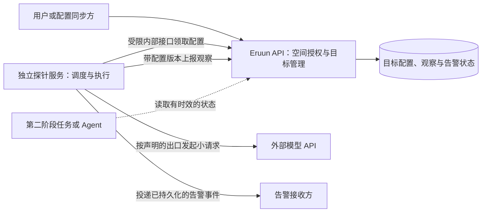

# 外部 LLM 端点动态监测与告警设计

> 状态：Draft / Proposal。本文记录使用场景、两阶段预案、候选实现和待决策问题，不表示 Eruun 已提供模型端点注册、探针或任务门禁能力，也不选择最终技术方案。下文的字段名称、状态名称和流程均为设计语义，不是可直接调用的 API、数据库或部署契约。

## 1. 场景与分期

用户运行的 Agent 可能自行配置模型 API 地址、模型名和凭据。长任务会持续调用该目标；地址不可达、鉴权失效、限流、响应变慢、服务端将请求路由到非预期模型，或模型能力发生变化，都可能影响后续输出。单纯在部署时检查 URL 不能覆盖运行期间的变化。

本需求分两期：

| 阶段 | 交付目标 | 明确边界 |
| --- | --- | --- |
| 第一阶段 | 动态登记监测目标；主动探测并保存带时效的结果；对异常和恢复发出告警 | 不阻止任务启动，不暂停 Agent，不自动切换模型，不把外部端点状态接入 Eruun 的就绪检查 |
| 第二阶段 | 由任务启动与 Agent 运行路径消费第一阶段的结果，按显式策略决定准入、暂停与恢复 | 只有在找到安全的执行边界、状态时效规则和恢复语义后实施；本文不将现有 Workflow 审批暂停等同于运行中 Agent 暂停 |

第一阶段的成功标准是：使用者能登记其实际使用的目标，看到从明确网络位置和凭据身份得到的近期探测结论，在目标异常或恢复时收到可追踪的通知，并能识别探针自身失联导致的“未知”状态。**探针减少盲区，但不能保证下一次真实请求一定成功，也不能从黑盒回答证明底层模型身份。**

## 2. 当前 Eruun 边界

- [文档索引](README.md)和 [AI Runtime 愿景](ai-runtime-vision.md)将通用 Agent 与托管模型能力列为后续方向。普通 Application 可以通过环境变量把地址传给用户镜像，但 Eruun 当前不理解该变量的模型端点语义，也无法自动发现所有 Agent 的有效配置。
- [空间 Job 与 Harbor 评测](workspace-jobs-api.md)已有 `traits.eval` 的模型标识和 Secret 凭据引用；评测规格没有任意模型 API 地址字段。Harbor 评测是任务级测评，不是周期性端点探针。
- [健康检查实现](../pkg/apiserver/interfaces/api/health.go)的 `healthz/readyz` 表示 Eruun 进程及必要依赖的状态；[容器 probes Trait](../pkg/apiserver/workflow/traits/probe.go)检查工作负载容器。两者都不判断外部 LLM 的业务能力。
- [空间鉴权](account-auth-workspaces.md)由 Eruun API 校验登录身份与空间角色。登录 Token 不是可交给长期探针保存的机器身份。新增目标管理必须有明确的空间授权；不能相信客户端填写的空间 ID。
- [空间网络策略](../pkg/apiserver/infrastructure/workspace/namespace.go)按 namespace 限制出站访问。中心探针可达不意味着 Agent 所在网络位置可达。[现有出站 URL 安全策略](url-security-policy.md)只覆盖其文档列出的回调、远程配置和文件拉取链路，新探针不会自动受到该策略保护。
- [Workflow 审批暂停](workflow-approval-pause-resume.md)发生在审批步骤；它不是对任意运行中 Agent 的检查点、暂停和恢复机制。

这些是 `main` 的现状；下文均为拟议能力。此文档 PR 只记录方案，不添加当前可执行路由或示例。

## 3. 需要观测什么

监测目标应对应 Agent 的**有效调用配置**，而不只是一个 URL。概念上至少要区分所属空间、API 基址、请求协议、指定模型、凭据或路由身份，以及探测出口。同一地址可以按模型参数、凭据、请求头或网络入口走向不同后端；其中任何一项变化都可能使旧探测结论失效。目标有稳定身份和配置版本，供历史结果关联及第二阶段引用。

| 检查层次 | 第一阶段可提供的证据 | 不能由该证据推出的结论 |
| --- | --- | --- |
| 传输 | DNS、连接、TLS、HTTP 状态、耗时 | 业务请求一定可用 |
| 真实小请求 | 指定协议、模型和凭据在该探测出口完成一次请求；响应结构、首字节与完成耗时；鉴权、限流及服务端错误类别 | Agent 下一次请求也会成功；其他凭据或网络位置同样可用 |
| 模型声明 | 协议提供模型标识时，请求模型与响应标识是否一致；可保留服务端请求 ID 供排查 | 响应字段能够证明真实底层模型或权重版本 |
| 能力样本 | 低频、多题、可重复的任务结果与固定参考基线是否明显偏离 | 单题失败等于“降智”；黑盒样本能够鉴定模型身份 |

质量样本只使用合成输入，不上传真实用户提示词或长任务上下文。题集、采样参数和参考分布应版本化并冻结；模型或题集变更后另建基线，避免只用滚动均值吸收渐进退化。质量异常标记为“疑似退化”，需要重复采样、统计阈值和复核；可用性与质量分开展示，避免一次质量波动把端点误报为不可达。模型标识比较还应按协议处理合法别名或版本映射，不能机械地比较字符串。若业务要求强保证实际模型身份，需要可信提供方证明、自托管模型制品与运行环境的可验证绑定，或受控路由链路；旁路探针无法独立完成这一保证。

## 4. 一种候选实现：Eruun 管理面与独立探针服务

### 4.1 管理面与探测执行分离

一种可供评估的拆分是：由 **Eruun API 管理目标登记、空间授权、配置版本、结果投影和告警状态**，由独立的**探针服务**负责调度、有限并发的真实请求和告警投递。探针通过专用的最小权限服务身份领取目标、上报观察和取得待投递告警；它不保存用户登录 Token，不直接读写 Eruun 业务数据库。状态变更和待发告警应先持久化，再进行外部投递，使重启或网络故障后可以恢复。

在这个候选实现里，“独立”指探测请求和调度不进入 Eruun API、Scheduler 或 Worker 的请求热路径。图中的数据库是 Eruun 现有持久化边界的概念表示，不要求创建一个独立数据库服务。第一阶段可以让单个探针进程承担调度和执行；只有真实负载或网络隔离要求证明需要时，才增加按网络位置部署的执行器。也不为每个目标创建常驻 Pod。

这个划分可复用 Eruun 已有空间身份，避免独立服务再复制用户、角色和空间管理。它还让第二阶段在 Eruun 的任务准入点读取本地持久化的结果，不必同步依赖一个外部探针进程。代价是第一阶段要为目标和观察增加 Eruun 管理接口与持久化，并明确内部机器身份及凭据交付路径。是否采用这项拆分，取决于第一阶段需要的独立程度、跨平台复用和故障隔离目标。

### 4.2 动态登记与变更

管理接口在第一阶段需要表达创建、查询、更新、停用和删除目标，但本文不冻结路由或 JSON 字段。创建时同步校验身份、空间、协议支持、地址安全和凭据引用格式；**上游暂时不可访问不应阻止登记**，而应使目标进入待检测或异常状态。登记后尽快执行首次探测。

Eruun 的空间 namespace 在首次实际部署时才初始化。尚未建立 namespace 或 Secret 的空间可以先登记目标，但不能声称完成了真实鉴权探测；状态应说明凭据待就绪，并在资源出现后重试。登记不得暗中初始化空间，也不得改为接收明文 API key。对于已有空间，首次探测前仍需验证 Secret 的存在、归属和授权。

每次影响请求语义的登记更新，包括地址、模型、凭据引用或探测位置变化，都生成新配置版本，并使旧版本的健康结果不再适用。原地轮换同名 Secret 不会改变登记字段，因此有效版本还需包含可观察的凭据版本；实现时要明确如何发现轮换及其最大延迟，并在发现后将旧结果置为未知。迟到的旧观察不能覆盖新版本。停用停止新探测；删除还需明确历史和告警的保留期限。相同目标被多个 Agent 使用时可以共享探测，但不跨空间或不同凭据/出口盲目去重。

空间删除也是目标生命周期的一部分。拟议实现必须在空间删除的权威事务边界阻止仍在探测的目标继续运行：可选择先要求停用目标，或随空间删除原子停用并清理目标、待投递告警和受保留策略约束的观察记录。删除后应拒绝迟到的探测结果。具体删除策略尚待确认，但不能留下继续请求外部 API 的无主目标。

由于当前 Eruun 不掌握通用 Agent 的模型地址，第一阶段需要显式登记，或者由真正产生 Agent 有效配置的流程同步登记。若两处独立手工填写，界面和告警必须说明探针目标未被证明与 Agent 当前配置一致。第二阶段绑定目标前应校验该一致性。

### 4.3 调度、状态与告警

探测使用有界超时、并发、频率、输出长度和每空间请求/费用预算，并加入分散启动时间以避免同时请求同一提供方。协议须显式选择并有对应适配器；不能仅凭 URL 猜测请求路径、鉴权形式或流式协议。首版可先覆盖一个经过验收的协议，其他协议按实际需求增加。

观察记录至少保留配置版本、探测出口、开始/结束时间、最近成功时间、延迟、失败类别和必要的脱敏证据。失败类别应区分 DNS/TLS/连接/超时、鉴权、限流、服务端错误、响应结构错误、模型声明不符以及质量疑似下降。状态投影可表达健康、降级、不可用和未知；连续失败、恢复次数与有效期由实测确定，不在 Proposal 中写死。没有新观察、探针失联或结果超期必须显示为**未知**，不能继续沿用绿色状态。状态读取方应根据观测时间和有效期自行判定过期，避免探针完全停止后无人主动更新状态。

告警由状态变化产生，并能对同一目标与配置版本去重、抑制抖动、重试投递及记录投递失败；恢复也产生对应事件。告警正文使用目标 ID、空间、时间和脱敏原因，不包含 Secret、认证头、完整模型回答或用户数据。探针服务自身的存活和结果新鲜度也需要外部观察；仅靠它自己发告警无法覆盖其完全停止的故障。第一阶段的告警渠道与接收人归属仍需确认，不能把现有 Workflow 终态回调当成通用模型告警。

### 4.4 出口、凭据与 URL 安全

首版如只监测公网 HTTPS 目标，可以从单一受限出口开始，并在每条结果中明确记录探测位置。若目标在私网、集群内，或 Agent 的 NetworkPolicy、代理、DNS、凭据路由与中心服务不同，应在相同网络区域执行探测；“集中管理”不要求所有请求来自同一个 Pod。即使探针位于同一 namespace，只要 Pod 标签或出口策略不同，也不能宣称路径完全相同。

凭据只以引用形式登记和展示。独立服务不应默认获得读取所有空间 Secret 的宽泛权限。下面三种路径互斥或可按目标组合；**选定并验证其中一条，是该候选架构发出真实模型请求的前提**：

| 凭据路径 | 能验证的范围 | 代价与前提 |
| --- | --- | --- |
| 明确委派的专用探测密钥 | 该密钥的鉴权、配额和路由 | 不代表 Agent 的真实密钥；用户须管理独立凭据及轮换，结果标记凭据差异 |
| 在受限的空间内执行器中引用 Agent 的 Secret | 更接近 Agent 实际凭据及网络路径 | 需要空间内执行身份、部署/清理和 Secret 最小权限；仍需核对 Pod 出口差异 |
| 由 Eruun 控制面受限地交付短期凭据给中心探针 | 可在中心探针使用同一凭据 | 控制面与传输链路接触密钥，需严格身份、内存/日志保护、期限和吊销；不解决出口差异 |

现有 Eruun 评测只在当前空间引用已有 Secret，不能直接赋予新探针跨空间读取权。若使用与 Agent 不同的探测密钥，结果必须标记该差异，因为鉴权、配额及按密钥路由可能不同。任何路径均须核对集群 RBAC、Secret 原地轮换、吊销和目标删除后的清理。

对用户可填写的地址，限制协议、主机、端口、解析 IP 和重定向目标；校验与实际拨号使用同一批通过策略的解析结果，并限制响应大小、超时与重定向次数。私网目标需要单独授权和可达出口。Eruun 的[现有 URL 策略](url-security-policy.md)可作实现参考，但目前未覆盖本功能；实现时必须显式接入或提供同等约束。告警 Webhook 自身也属于出站目标，适用相同安全原则。

## 5. 备选方案与取舍

| 方案 | 优点 | 主要限制 | 适用条件与待验证点 |
| --- | --- | --- | --- |
| 完全独立的探针服务，自有注册 API、身份与存储 | 可脱离 Eruun 独立运营，故障域清晰 | 重复空间授权和凭据生命周期；Eruun 的登录 Token 不能直接作为长期探针身份；第二阶段还要解决状态同步与一致性 | 适合跨多套平台复用的独立产品；需评估身份映射和状态可信度 |
| Eruun 管理目标，独立服务在中心出口执行 | 复用空间鉴权，第一阶段组件少，第二阶段状态可直接消费 | 只代表中心出口；需要内部服务认证和凭据路径 | 可作为公网目标的候选起点；需验证出口覆盖范围 |
| Eruun 集中管理，按空间或网络区域执行 | 私网和租户网络路径更接近真实 Agent | 部署、机器身份、Secret 读取与执行器协调更复杂 | 私网或出口差异明显时可能需要从第一阶段就采用 |
| 将模型请求统一经过出站网关，并结合真实流量遥测 | 能看到实际请求、路由和错误，第二阶段可在调用路径执行策略 | 改变所有 Agent 调用路径；网关承载提示词、凭据和可用性风险；空闲时仍需主动探测 | 要求逐请求控制时值得评估；仍需主动探测空闲目标 |
| 复用 Eruun Job/Cron 或 Harbor 评测 | 可借鉴现有执行隔离和低频基准结果 | 独立 command Job 无内建周期重跑；Harbor 评测有任务包与较重的执行链；缺少目标登记与持续告警语义 | 可作低频深度测评补充，不作为高频探针主路径 |
| 只用通用 HTTP 黑盒探测与监控系统 | 部署简单，可覆盖 TLS/HTTP 与自监控 | 通常不知道用户模型、凭据、响应语义与空间归属 | 可复用为传输层观测和告警出口，不能独自满足本需求 |

在方案评审中优先确认：是否需要**同一 Agent 凭据与同一网络出口**的强一致探测。如果答案为是，按空间/网络区域执行的方案可能应直接进入第一阶段，而非等到第二阶段。若首版主要面向公网 OpenAI 兼容地址且只要求早期告警，中心出口的简单实现足够开始验证。

## 6. 第二阶段预留的消费契约

第一阶段只需保存稳定目标身份、配置版本、观测时间、有效期、探测出口、分维度结论和可追踪原因，不增加任务状态转换。第二阶段另行定义 Agent/任务如何绑定目标，以及对健康、降级、不可用、未知各状态的准入策略。

新任务应在**实际启动的权威边界**再次读取与目标配置版本匹配、未过期且出口可比的结果；只在提交时检查会受到排队期间状态变化影响。运行中的 Agent 只能在明确的安全点停止发起后续模型请求，持久化上下文与外部副作用进度后暂停；已经发送的请求和已经产生的输出不能被探针撤回。恢复需重新检查新鲜状态，并处理重试幂等、并发执行身份和人工覆盖审计。现有 Workflow 审批步骤不直接提供上述通用能力。

如果未来要求每次模型调用均被强制校验或动态改路由，应再次比较 Agent SDK/sidecar 与出站网关。该决策将改变数据面、凭据暴露面、延迟和故障域，不在第一阶段提前锁定。

## 7. 验收与故障演练建议

| 范围 | 应证明的行为 |
| --- | --- |
| 登记与权限 | 有权用户可动态创建、更新、停用和删除所属空间目标；跨空间与无权访问被拒绝；上游不可达仍可登记；无效或被策略禁止的 URL 被拒绝 |
| 版本与历史 | 登记配置变化使旧健康结果失效；同名 Secret 原地轮换在规定延迟内被发现并使旧结果失效；旧版本迟到观察不能覆盖新版；重启后目标、当前状态及待发送告警可恢复 |
| 空间生命周期 | 删除空间时按选定策略停用或清理目标与待发告警；不会留下继续探测的无主目标；迟到上报被拒绝 |
| 探测 | 对网络、鉴权、限流、模型声明不符、慢响应、格式错误、超时和服务端错误分别留下脱敏证据；探测有频率、并发和费用上限 |
| 状态 | 连续异常与恢复有稳定转换；过期或无样本转未知；每条结果标明出口与凭据覆盖范围；质量疑似下降与不可达区分展示 |
| 告警 | 异常与恢复只生成需要的事件；重复观察不刷屏；投递失败可重试并可查询；监测停摆可由外部系统发现 |
| 安全 | SSRF、重定向、DNS 重绑定、私网目标、恶意大响应和告警 Webhook 均受限；日志、API 响应与通知不泄漏凭据或用户提示词 |
| 真实集群 | 选择至少一个公网目标验证出口；若支持私网，分别从中心与 Agent 所在网络位置验证可达差异及凭据作用域 |

## 8. 尚待共同决定

以下问题会改变实现位置或公开行为，文档 PR 暂不替使用者决定：

1. 第一阶段是否覆盖私网/集群内地址？若覆盖，需要哪些空间或网络区域的探测位置？
2. 首批协议是仅 OpenAI 兼容接口，还是还有其他明确的请求与流式格式？
3. 注册由用户手工操作、Agent 启动时上报，还是由产生 Agent 有效配置的流程自动同步？如何证明登记配置与真实调用一致？
4. 探针应使用 Agent 同一凭据、独立探测凭据，还是两者都支持并明确标注覆盖范围？凭据由谁读取、发现原地轮换并吊销？
5. 首批告警出口与接收人由谁管理？需要平台内通知、Webhook、现有监控系统，还是组合？
6. 可用性、质量和模型声明不符各自的告警阈值、样本频率、结果有效期与费用预算是什么？
7. 空间删除时要求先停用监测目标，还是在删除事务中一并停用和清理？观察与告警要保留多久？
8. 第二阶段对“未知”和“疑似质量退化”应放行、阻止还是要求人工决定？Agent 的安全暂停点在哪里？

这些答案确定后，再把 Proposal 中的概念字段、路由、持久化结构与部署拓扑收敛为可执行契约，并按 API → Domain → 存储 → 探针执行 → 安全 → 文档/示例的路径实施。第一阶段上线前应完成真实集群网络与 Secret 权限验收。
