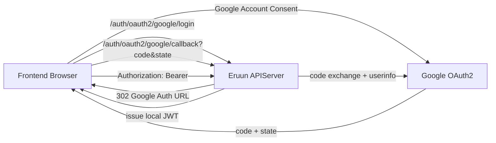
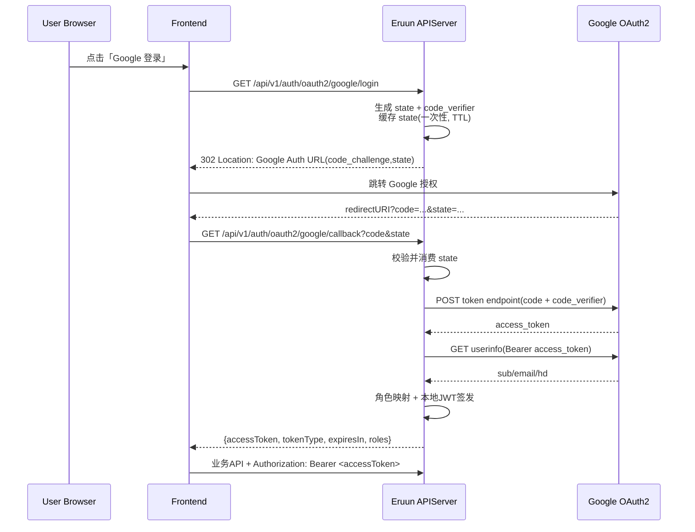
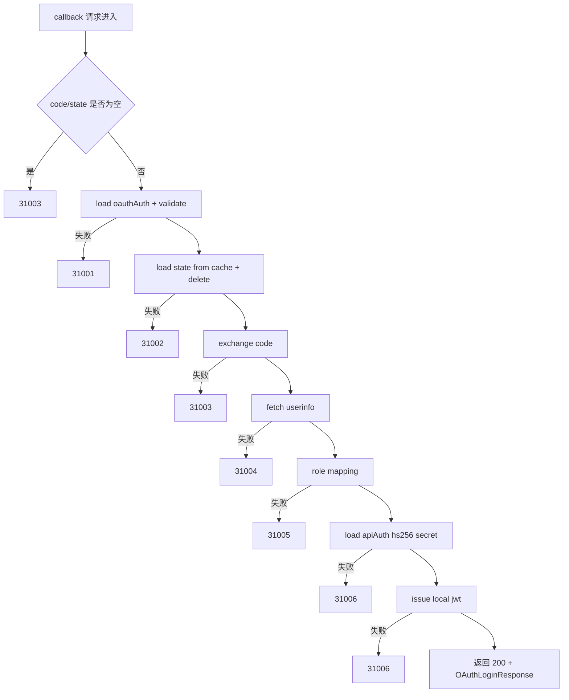

# OAuth2（Google）完整接入指南（前端 + 后端）

> 状态：Implemented Reference。当前 OAuth 后端流程已实现，但 `/api/v1/auth/oauth2/google/*` 路由在 `master` 未注册，访问返回 `404`。

> 你提到的 “Auto2” 这里统一指 **OAuth2**。
>
> 注意：当前 `master` 临时不暴露 OAuth 路由（`/api/v1/auth/oauth2/google/login`、`/api/v1/auth/oauth2/google/callback`），访问返回 `404`。本文档保留为后续恢复启用时的接入参考。

## 1. 能力范围（当前实现）
- 协议：OAuth2 Authorization Code + PKCE（S256）
- Provider：Google
- 恢复启用登录路径：`GET /api/v1/auth/oauth2/google/login`
- 恢复启用回调路径：`GET /api/v1/auth/oauth2/google/callback`
- 回调结果：返回本地 JWT（Bearer），供现有鉴权链路使用
- 角色来源：`oauthAuth.roleMapping` 静态映射
- JWT 签发密钥：复用 `apiAuth.jwt.hs256.secret`

> 当前 `master` 不暴露上述 OAuth2 路由，直接访问会返回 `404`。不要根据本文为当前前端实现可用登录 UI；本文仅用于后续恢复路由注册后的接入参考。

## 2. 总体架构


## 3. 两种回调模式

### 模式 A：后端回调（调试友好）
- `oauthAuth.providers.google.redirectURI` 配置成后端地址  
  例如：`https://api.example.com/api/v1/auth/oauth2/google/callback`
- 登录后 Google 直接回调后端，后端返回 JSON。
- 优点：简单。
- 缺点：浏览器地址栏停在 API 路径，前端体验一般。

### 模式 B：前端回调（推荐生产）
- `oauthAuth.providers.google.redirectURI` 配置成前端地址  
  例如：`https://web.example.com/oauth2/callback/google`
- Google 回调前端页面后，前端再调用后端 callback API。
- 优点：用户体验好，适合 SPA/前后端分离。
- 本文后续代码示例基于此模式。

## 4. 接入前准备

### 4.1 Google Cloud Console
1. 创建 OAuth Client（Web Application）。
2. 配置 `Authorized redirect URIs`（与你的 `redirectURI` 完全一致）。
3. 记录 `clientId`、`clientSecret`。

### 4.2 Eruun 配置
1. 创建 `oauthAuth`（示例文件）：
```bash
SERVER="http://127.0.0.1:8000"

curl -sS -X POST "${SERVER}/api/v1/settings" \
  -H "Content-Type: application/json" \
  --data @examples/system-setting/create-oauth-auth-setting.json
```

2. 确认 `apiAuth` 已配置 HS256 secret（用于签发本地 JWT）：
```bash
curl -sS "${SERVER}/api/v1/settings/apiAuth"
```

## 5. 配置字段说明（oauthAuth）

```json
{
  "type": "oauthAuth",
  "value": {
    "enabled": true,
    "providers": {
      "google": {
        "clientId": "...",
        "clientSecret": "...",
        "redirectURI": "https://web.example.com/oauth2/callback/google",
        "scopes": ["openid", "email", "profile"]
      }
    },
    "jwtIssue": {
      "issuer": "eruun",
      "audience": "eruun-api",
      "ttlSeconds": 3600
    },
    "roleMapping": {
      "defaultRoles": ["reader"],
      "googleHostedDomainToRoles": {
        "example.com": ["admin"]
      },
      "googleEmailToRoles": {
        "owner@example.com": ["admin"]
      }
    },
    "security": {
      "stateTTLSeconds": 300
    }
  }
}
```

关键点：
- `redirectURI` 必须和 Google 后台一致，且为绝对 URL。
- `clientSecret` 读取时会被脱敏为 `******`，不能原样回写。
- `ttlSeconds` 为本地 JWT 生命周期。

## 6. 前端接入（推荐模式 B）

### 6.1 登录按钮代码
```ts
// auth.ts
const API_BASE = import.meta.env.VITE_API_BASE ?? "https://api.example.com";

export function loginWithGoogle() {
  window.location.href = `${API_BASE}/api/v1/auth/oauth2/google/login`;
}
```

### 6.2 前端回调页代码（React 示例）
```tsx
// pages/OAuthGoogleCallback.tsx
import { useEffect } from "react";
import { useNavigate } from "react-router-dom";

const API_BASE = import.meta.env.VITE_API_BASE ?? "https://api.example.com";

export default function OAuthGoogleCallback() {
  const navigate = useNavigate();

  useEffect(() => {
    const run = async () => {
      const params = new URLSearchParams(window.location.search);
      const code = params.get("code");
      const state = params.get("state");

      if (!code || !state) {
        navigate("/login?error=oauth_missing_code_state");
        return;
      }

      const resp = await fetch(
        `${API_BASE}/api/v1/auth/oauth2/google/callback?code=${encodeURIComponent(code)}&state=${encodeURIComponent(state)}`,
        { method: "GET", credentials: "omit" }
      );
      const payload = await resp.json();

      if (!resp.ok || payload.code !== 0) {
        navigate(`/login?error=oauth_failed_${payload?.code ?? "unknown"}`);
        return;
      }

      const { accessToken, expiresIn, roles } = payload.data;
      // 当前后端返回 JSON token，前端可按项目策略存储（例如 sessionStorage）
      sessionStorage.setItem("km_access_token", accessToken);
      sessionStorage.setItem("km_access_token_expire_at", String(Date.now() + expiresIn * 1000));
      sessionStorage.setItem("km_roles", JSON.stringify(roles ?? []));

      navigate("/"); // 跳业务首页
    };

    run().catch(() => navigate("/login?error=oauth_exception"));
  }, [navigate]);

  return <div>Signing in...</div>;
}
```

### 6.3 API 请求统一注入 Token
```ts
// http.ts
export async function kmFetch(input: RequestInfo, init: RequestInit = {}) {
  const token = sessionStorage.getItem("km_access_token");
  const headers = new Headers(init.headers || {});
  if (token) headers.set("Authorization", `Bearer ${token}`);
  return fetch(input, { ...init, headers });
}
```

### 6.4 路由守卫与过期处理
- 每次路由切换前检查 `km_access_token_expire_at`。
- 过期后清除 token 并跳转登录页。
- 当前 Phase 1 未实现 refresh token，过期需要重新登录。

## 7. 后端接入流程（代码级）

当前代码入口：
- API handler：`pkg/apiserver/interfaces/api/oauth.go`
- 核心流程：`pkg/apiserver/interfaces/api/auth/oauth_google.go`

处理步骤：
1. `/login`：
   - 加载 `oauthAuth` 配置并校验。
   - 生成 `state` + `code_verifier`。
   - `code_verifier` 存 cache（绑定 state，带 TTL）。
   - 生成 `code_challenge` 并 302 到 Google。

2. `/callback`：
   - 校验 `code/state`。
   - 从 cache 读取并消费 state（一次性）。
   - 用 `code + code_verifier` 请求 Google token endpoint。
   - 调用 userinfo endpoint 拿到 `sub/email/hd`。
   - 根据映射规则生成 roles。
   - 读取 `apiAuth.jwt.hs256.secret`。
   - 签发本地 JWT 返回前端。

## 8. 端到端时序图（推荐模式 B）


## 9. OAuth2 底层逻辑图（PKCE + State）
```mermaid
graph TD
    A[生成随机 state] --> B[缓存 state -> code_verifier, TTL]
    C[生成 code_verifier] --> D[SHA256(code_verifier)]
    D --> E[base64url -> code_challenge]
    E --> F[带 code_challenge 发起授权]
    F --> G[Google 返回 code + state]
    G --> H[后端校验 state 是否存在且未过期]
    H -->|失败| X[拒绝: 31002]
    H -->|成功| I[删除 state(防重放)]
    I --> J[使用 code + code_verifier 交换 token]
    J -->|失败| Y[拒绝: 31003]
    J --> K[获取 userinfo]
    K -->|失败| Z[拒绝: 31004]
    K --> L[角色映射]
    L -->|失败| M[拒绝: 31005]
    L --> N[签发本地 JWT]
```

## 10. 回调链路判定图（后端）


## 11. 角色映射优先级
1. `googleEmailToRoles[email]`（最精确）
2. `googleHostedDomainToRoles[hd]`
3. `googleHostedDomainToRoles[email域名]`
4. `defaultRoles`

## 12. 错误码与前端处理建议
- `31001 oauth config is invalid`：配置错误，提示管理员检查配置。
- `31002 oauth state is invalid or expired`：重放/超时，前端引导用户重试登录。
- `31003 oauth code exchange failed`：code 无效或 token 交换失败，重试。
- `31004 oauth user info fetch failed`：Google userinfo 失败，重试。
- `31005 oauth role mapping failed`：无权限角色，展示 “账号未授权”。
- `31006 oauth token issue failed`：本地签发失败，提示稍后重试。

## 13. 安全建议
- 使用 HTTPS（生产环境必须）。
- `stateTTLSeconds` 不要过大（建议 300 秒左右）。
- `oauthAuth` 与 `apiAuth` 设置接口仅允许管理员访问。
- 不要在日志打印 `clientSecret`、access_token、code_verifier。
- Phase 1 未支持 refresh token 与 server-side revoke，生产需评估会话策略。

## 14. 联调检查清单
- Google redirect URI 与 `oauthAuth.providers.google.redirectURI` 完全一致。
- `/login` 能 302 到 Google，URL 包含 `state` 和 `code_challenge`。
- 回调成功后返回本地 JWT。
- JWT 调受保护 API 时返回 200，角色不匹配返回 403。
- 过期 token 返回 401，并触发前端重新登录流程。
