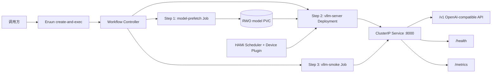
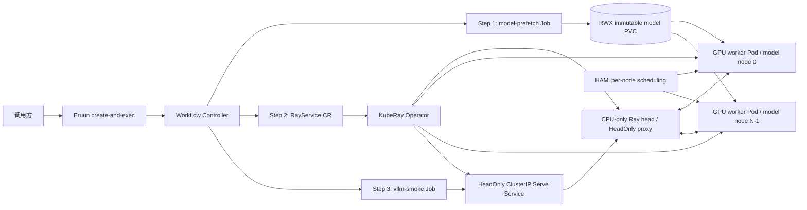

# vLLM + HAMi 单节点与跨节点分布式推理设计

> 状态：Draft / Proposal。本文描述 Eruun 后续支持 vLLM + HAMi 推理工作流的目标契约。文中标记为“目标能力”的字段和取消清理语义尚未在当前 `master` 实现，Profile A 示例请求当前不可直接提交；Profile B 还依赖 operator-backed workload 能力，不提供伪可执行请求。
>
> 设计基线：Eruun `master`（2026-07-27）、vLLM `v0.23.0`、HAMi `v2.9.0`。

## 1. 目标与边界

设计覆盖两种部署形态：

- **Profile A — 单节点 TP**：一个 Pod、一个节点、多块物理 GPU；HAMi 在 Pod 内分配 GPU 切片，vLLM 使用 Tensor Parallel。这是本文给出完整目标请求、公共字段契约和首轮实现测试的基线。
- **Profile B — 跨节点 TP + PP**：一个 CPU-only Ray head 与 `N` 个 GPU worker Pod 组成一个 distributed serving replica；每个 GPU 节点内部使用 Tensor Parallel，GPU 节点之间使用 Pipeline Parallel，由 KubeRay `RayService` + Ray Serve LLM 作为首选组控制器。本文固定架构、存储和 Workflow 边界，operator adapter 由后续实现 PR 提供。

Profile A 沿用 `POST /api/v1/applications/create-and-exec`、现有 `job`/`webservice` Component 和 Workflow JobType，不新增 vLLM 专用类型。Profile B 后续只增加通用 operator-backed workload 能力，不把 Ray rank、模型层或 vLLM 参数建成数据库实体。

共同目标是在不引入 vLLM 专用数据库实体的前提下，使用 Eruun Application 和 Workflow 完成：

- 单节点或跨节点、多块物理 GPU 的在线推理服务。
- HAMi 对每块 GPU 分配显存和算力切片。
- vLLM 使用 Tensor Parallel 和可选 Pipeline Parallel 在一个 serving replica 内完成模型并行。
- 模型预下载、服务部署和 API 语义检查按工作流顺序执行。
- 部署失败、超时或取消后清理运行资源，并保留可复用的模型缓存。

vLLM 官方建议模型可放入单节点多 GPU 时使用 Tensor Parallel；超出单节点容量时通常令 `tensor_parallel_size=每个 GPU worker 节点的 GPU 数`、`pipeline_parallel_size=GPU worker 节点数`。因此 Profile A 固定为 `replicas=1`、`TP=GPU 数量`、`PP=1`，Profile B 固定每个模型组为 `TP=每个 GPU worker 的 GPU 数`、`PP=GPU worker 数`。CPU-only Ray head 只承载 Ray 控制面和 HeadOnly Serve proxy，不申请模型 GPU，也不计入 PP。

本文档 PR 不包含：

- Profile B 的 KubeRay/LWS 安装、通用 CRD adapter 实现或可执行 CRD 示例。
- 使用普通 Deployment 副本或一组松散的 Eruun `webservice` Component 手工模拟 distributed serving group。
- 自动扩缩容、Ingress/Gateway、外部 TLS、租户鉴权和限流。
- 实时 GPU 容量预留、HAMi 安装升级或 GPU 资源池生命周期管理。
- vLLM 参数解析器或按镜像名称推断工作负载类型。

### 1.1 设计假设与部署输入

首版成立依赖以下显式假设：

- HAMi 是集群中唯一发布 `nvidia.com/gpu` 的 Device Plugin；若与 NVIDIA GPU Operator 共存，关闭 GPU Operator 的 device-plugin。
- HAMi 能为同一 Pod 请求的多个 vGPU 选择不同物理 GPU；每块物理 GPU 仍可按显存和算力切片与其他 Pod 共享。该假设必须在 GPU 环境验收中验证，不能仅凭 Node annotation 判定。
- Profile A 模型 PVC 为 RWO 且支持顺序 Pod 之间的 detach/attach；Profile B 使用满足本文一致性契约的 RWX/ROX 或每节点副本。模型 revision 不可变，下载器可安全重试并复用完整文件。
- Profile A 的 `VLLM_API_KEY` 只保护原生 vLLM server 的部分 HTTP 路径，集群仍提供 NetworkPolicy 或等价网络边界。Profile B 的 Ray Serve LLM endpoint 不假定该变量提供鉴权；不可信调用方必须经过独立 Gateway 或认证 middleware。

参考请求固定使用 `vllm/vllm-openai:v0.23.0`、Tensor Parallel 2、每块 GPU 16384 MiB 显存和 50% 算力。真实部署必须显式确定以下输入：

| 输入 | 参考值或约束 |
| --- | --- |
| Model ID | 参考请求固定 `Qwen/Qwen2.5-7B-Instruct`；替换时必须同步 server cache key，并使用本文 publisher 已校验的 safetensors 格式 |
| Model revision | 40 位小写十六进制 Hugging Face commit SHA；tag/branch 即使当前不漂移也不接受 |
| Model cache key | `sha256-<SHA-256(modelId)>`，由客户端/下载器确定性生成，不能直接把 modelId 拼入文件路径 |
| StorageClass | Profile A 使用目标节点可挂载的 RWO；Profile B 使用满足多客户端一致性契约的 RWX，或显式的每节点本地缓存方案 |
| Runtime image | Profile A 参考 `vllm/vllm-openai:v0.23.0`；Profile B 使用包含 vLLM 0.23.0 与兼容 Ray Serve LLM/KubeRay 依赖的联合验证镜像；生产部署都锁定批准 digest |
| Secret | 预先存在的 Hugging Face Token；Profile A 另需 vLLM API Key Secret，Profile B 的入口凭证由外部 Gateway/认证层定义 |
| 调度约束 | GPU 节点 taint、label、HAMi topology；Profile B 还需要跨节点 spread/gang scheduling |

## 2. 当前能力与缺口

### 2.1 当前可复用能力

当前 `master` 已经提供：

- `POST /api/v1/applications/create-and-exec` 创建并执行 Application。
- `job`、`webservice`、Service、standalone PVC、Secret 引用和三类 Probe。
- 顶层 Workflow Step 顺序执行；同一步内的 `DAG` 仅表示组件并行。
- `traits.resources.gpu` 到 `nvidia.com/gpu` 的映射。
- `traits.targetWorkEnv` 到 Pod `nodeSelector` 的映射。
- `failurePolicy=cleanup_all` 在部署 Job `failed` 或 `timeout` 时清理运行资源，同时保留 standalone PVC。
- `--workflow-default-job-timeout` 全局 Workflow Job 超时配置，当前默认值为 60 秒；但 Deployment 等部署 Job 会被固定覆盖为 20 分钟。

### 2.2 目标能力缺口

当前严格 JSON 契约尚不能表达以下 PodSpec：

| 缺口 | 对推理工作负载的影响 |
| --- | --- |
| 主容器和 init container 没有 `args` | 不能自然表达 `vllm serve ... --tensor-parallel-size 2` |
| Resources 只支持 CPU、Memory、GPU | 不能传递 HAMi `gpumem` 和 `gpucores` |
| 没有 PodTemplate annotations | 不能设置 HAMi topology 和 node scheduling policy |
| 组件只公开 `targetWorkEnv` | 不能表达 GPU 节点 taint toleration 或 affinity |
| ephemeral storage 没有 `medium/sizeLimit` | 不能生成 memory-backed `/dev/shm` |
| Try 响应没有 warnings | 不能区分静态配置错误与非阻断的集群环境告警 |
| Workflow cancel 不触发 `cleanup_all` | 已部署的推理运行资源可能在取消后继续存在 |
| 部署 Job 固定使用 20 分钟超时 | 即使配置全局 60 分钟，长时间模型加载仍会提前 timeout |

### 2.3 Profile B 的附加缺口

当前 `master` 只能生成内置 Kubernetes workload，不能把 `RayService`/`LeaderWorkerSet` 当成一个具备 Ready、失败、更新和 cleanup 语义的组件。跨节点实现还需要一个**通用 operator-backed workload adapter**，而不是 vLLM 专用 Component：

- 允许受 allowlist 约束的 CRD kind，并提供 schema、status condition、endpoint 和 owned-resource 映射。
- 能把通用 resources、Pod annotations、scheduling、storage、Secret 引用和 security policy 注入 CRD 的 leader/worker PodTemplate。
- Workflow 等待 adapter 定义的 composite deployment gate，而不是直接信任 CRD 的单一 Ready condition；任一 rank 失败时不得把部分 Pod 当成可服务状态。
- cleanup 只对顶层 CR 发出带 UID precondition、foreground propagation 的删除并等待 owner chain 消失；generic label sweep 必须跳过 operator-owned Pod/Service，不能与 Operator 竞争删除。Eruun 仍保留没有 ownerReference 或 managed label 的模型 PVC 和外部 Secret。
- Profile B 的 Try 必须验证 CRD/Operator、共享模型 PVC、节点与 GPU 数、跨节点网络以及 gang scheduler 能力。

该 adapter 的 API 形状需要独立设计评审。本文不通过任意 raw YAML 绕过严格 DTO，也不新增一个只服务 vLLM 的数据库实体。

## 3. 总体架构

### 3.1 Profile A：单 Pod、单节点



平台负责 HAMi、GPU 驱动、Container Runtime、StorageClass、Secret、NetworkPolicy 和监控系统。Eruun 只消费这些能力，负责应用契约校验、Kubernetes 资源渲染、工作流编排和状态投影。

### 3.2 Profile B：多 Pod、跨节点

Profile B 首选 KubeRay `RayService` 管理一个 Ray 集群和 vLLM serving group。Eruun Workflow 只编排稳定边界，不逐个创建或删除 rank Pod：



Ray head 的 `rayStartParams` 明确设置 `num-gpus: "0"` 和 `num-cpus: "0"`；后者只禁止 Ray 把带逻辑 CPU bundle 的 LLMServer replica 调度到 head，head Pod 仍保留 Kubernetes CPU request/limit 运行控制面。它不挂载模型 PVC，也不计入模型 world size。`N` 个 GPU worker Pod 各自挂载相同只读模型路径，并使用相同镜像和兼容的 Python/CUDA/NCCL 环境。`serveConfigV2` 显式设置 `proxy_location: HeadOnly`，所以 ClusterIP Service 只选择 CPU head 上的 Ray Serve proxy；worker 的 Ray、NCCL 和对象传输端口不暴露为推理入口。若平台已标准化 LWS + Kueue，也可以用 GPU leader + workers 的 LeaderWorkerSet 承担 group lifecycle 和 gang scheduling，但这是独立备选拓扑；同一部署只选择一种 owner，不能把 LWS 的 GPU leader 语义套到 RayService，也不能让两者管理同一组 Pod。

### 3.3 模型并行与服务副本

模型的“拆分”发生在 vLLM 运行时，不要求运维人员手工把 PVC 中的权重文件按节点拆开。Hugging Face 仓库中的多个 `safetensors` shard 是文件序列化分片，所有 rank 仍应看到完整 index 和同一不可变 revision；vLLM 再按 TP/PP 为各 rank 加载所需张量或层。

| 形态 | Pod / node | vLLM 参数 | 语义 |
| --- | --- | --- | --- |
| 单节点 | 1 Pod、1 node、每 Pod `G` GPU | `TP=G, PP=1` | 一个 distributed serving replica |
| 跨节点 | 1 个 CPU head + `N` 个 GPU worker Pod / `N` 个 GPU model node，每个 worker `G` GPU | `TP=G, PP=N` | 一个 distributed serving replica，总 GPU 数 `G × N`；head 不计 GPU |
| 多服务副本 | `R` 个完整模型组 | 每组各自满足上述 TP/PP | `R` 个独立 serving replica，由 Router/Service 负载均衡 |

普通 Deployment 的 `replicas=N` 只会创建 `N` 个互不协作的 vLLM 进程，既不会形成一个跨节点模型，也不能共享一次请求的 KV Cache。Profile B 必须用 Ray placement/group lifecycle；需要吞吐或高可用时，再复制完整模型组。首轮跨节点基线要求各 rank 的 GPU 型号、每节点 GPU 数、HAMi 显存/算力份额、镜像和模型 revision 一致；异构 rank 不在范围内。

## 4. 工作流与资源生命周期

### 4.1 Step 1：模型预下载

`model-prefetch` 是不申请 GPU 的一次性 Job：

- 输入为 `modelId` 和不可变 `revision`，禁止以漂移的 `main`/`latest` 作为生产 revision。
- 使用预先存在的 Secret 注入 `HF_TOKEN`；公开模型可移除该引用。
- 将模型下载到 standalone RWO PVC 的稳定路径。
- 使用 `runPolicy=recreate`。下载器必须幂等，已存在且 revision 相同的文件直接复用，不完整下载可续传或覆盖。
- Job 成功后 Workflow 才进入服务部署步骤。

Profile A 的 RWO PVC 在两个 Pod 之间顺序挂载。若存储后端要求节点间 detach/attach，StorageClass 必须支持该行为；该 Profile 不要求 RWX。

### 4.2 模型文件与 PVC 契约

#### 不可变目录

PVC 保存完整模型 revision，不按 TP/PP rank 手工拆层。建议目录：

```text
/models/
  sha256-<model-id-sha256>/
    <40-hex-commit-sha>/
      config.json
      model.safetensors.index.json
      model-*.safetensors
      tokenizer*
      .eruun-model-ready.json
```

`.eruun-model-ready.json` 使用 `schemaVersion=1`，记录 `modelId`、`revision`、下载器名称/版本、完整相对文件清单、大小和 SHA-256，以及 `complete=true`。读取方按必需字段和 schema 校验；version 1 允许增加顶层字段，但 `files[]` entry 固定为 `path/size/sha256`，扩展 entry 必须提升 schema 后再支持。读取方不对整个顶层 JSON 对象做脆弱等值比较。prefetch 的发布协议是：

1. 校验 revision 为 40 位小写十六进制 commit SHA，以 `sha256(modelId) + revision` 派生稳定目录和 PVC 内文件锁；原始 modelId/revision 不直接作为未校验路径。
2. 若 ready manifest 完整匹配，直接成功；同一 revision 不覆盖。
3. 下载到同一 PVC 的临时目录，校验必需的 config、tokenizer、weight index/shards，并为发布清单计算文件大小和 SHA-256。
4. 写 manifest；所有 publisher 必须遵守同一可靠 `flock` 或外部 Lease 单写者协议，在持锁期间再次确认目标不存在，再执行同文件系统原子 rename。普通 `os.rename` 本身不提供 `RENAME_NOREPLACE`，安全性来自协作式单写者约束；若后端不能保证该约束，后续实现必须改用 `renameat2(RENAME_NOREPLACE)` 或等价机制。若最终目录已存在但 manifest 无效，直接失败并等待人工隔离，永不主动覆盖已发布目录。失败只删除/复用该 revision 的临时目录。
5. server/worker 只读挂载最终目录，绝不从正在写入的路径启动。

模型升级创建新的 revision 目录和新的 serving group；新组 smoke 成功后再切流，不能原地修改正在服务的目录。模型 PVC 默认跨 Workflow 保留，revision 垃圾回收和容量配额属于独立生命周期策略。

#### Profile A：RWO

Profile A 的 prefetch Job 与 server Pod 顺序使用一个 standalone RWO PVC。Eruun 可以按现有 `claimName + tmpCreate=false` 创建或复用该 PVC；server 以 `readOnly=true` 挂载。创建前应确认容量、StorageClass 和目录权限满足 vLLM 容器用户，避免启动时对整个大模型目录递归 `chown`。

#### Profile B：RWX 或每节点副本

一个 RWO PVC 不能作为跨节点模型共享卷。Profile B 提供两种明确模式：

| 模式 | 行为 | 适用场景 |
| --- | --- | --- |
| 共享 RWX（基线） | prefetch 一次写入，每个 GPU worker 都以 `readOnly=true` 在同一路径挂载 | 简化首次实现；后端还必须满足下述多客户端一致性契约和并发读吞吐 |
| 每节点本地缓存（优化） | 先 admission `N` 个目标 GPU 节点，再由 cache CR/DaemonSet/operator 把同一 revision 预热到各节点 RWO/local PV；全节点 barrier 通过后启动模型组 | 大模型启动或 RWX 吞吐成为瓶颈；需要节点身份固定、缓存清单和 gang admission |

Kubernetes `RWX`/`ROX` access mode 只描述挂载能力，不证明文件系统语义。共享卷的 StorageClass/CSI/backend 必须经平台验收：所有客户端看到同一文件系统命名空间，临时目录到最终目录支持同文件系统原子 rename，写后读一致，且 `flock` 在多客户端可靠；如果不能保证分布式文件锁，则用外部单写者 Lease 串行化 publisher。共享 RWX 基线要求 PVC 在创建 Workflow 前已由平台预置，Profile B adapter 只引用并校验它，不能在 claim 不存在时静默创建默认 RWO。预填充且只读的 ROX 卷可以跳过 publisher，但其 manifest 仍须匹配。

无论底层模式为何，每个 GPU worker 必须从自己的挂载视角在模型 actor 启动前完成校验：manifest 的 modelId/revision/schema、`config.json`、tokenizer、weight index 引用的全部 shard，以及所有清单文件的大小和 SHA-256 都匹配。任一 worker 校验失败时整个模型组不得进入 Eruun composite Ready。每节点缓存还必须确保所有已 admission 节点使用相同绝对模型路径和 manifest，并把 RayService worker 约束到这批节点；不能用一个普通 `model-prefetch-rwx` Job 代表 `N` 个本地缓存已经就绪。

### 4.3 Step 2：vLLM 服务

#### Profile A：`webservice`

`vllm-server` 是单副本 `webservice`：

- 请求两个 GPU，HAMi 为同一 Pod 分配两块不同的物理 GPU；每块 GPU 分配 16384 MiB 显存和 50% 算力。
- `--tensor-parallel-size=2` 必须与 `traits.resources.gpu=2` 一致。
- 模型 PVC 在无 GPU 的 `verify-model-cache` init container 和主容器中都以只读方式挂载到 `/models`；init container 先校验 manifest identity、完整文件集、index/shards、大小和 SHA-256，成功后才允许 vLLM 启动。内存型 EmptyDir 挂载到 `/dev/shm`。
- 使用 `VLLM_API_KEY` 环境变量保护 `/v1` API；Secret 不写入 Application JSON 或日志。
- 设置 `GPU_CORE_UTILIZATION_POLICY=force`，让 `nvidia.com/gpucores=50` 表示严格上限；HAMi 默认策略允许空闲时突发，不能用于“固定 50%”验收。
- 仅创建 ClusterIP Service，不创建 Ingress。
- startup、readiness 和 liveness 均调用 `/health`。参考 startup probe 允许最多 50 分钟模型加载时间，在 60 分钟 Workflow Job 超时前为 readiness 和 Workflow 状态收敛保留 10 分钟余量。

HAMi 的切片隔离属于 CUDA API 层软隔离。`--gpu-memory-utilization` 按 Pod 内可见的虚拟显存计算，不应超过 HAMi 分配值；参考配置使用 `0.9`，为 CUDA/NCCL 和运行时保留余量。

#### Profile B：`RayService`

Profile B 的部署步骤创建一个 operator-owned `RayService`，由一个 CPU-only Ray head 和 `N` 个 GPU worker Pod 组成固定大小的模型组。它使用 Ray Serve LLM，不在各 Pod 中直接拼装原生 `vllm serve` 命令：

- Ray head 的 `rayStartParams` 设置 `num-gpus: "0"` 和 `num-cpus: "0"`，只承载 GCS、Serve controller 和 HeadOnly HTTP proxy；Kubernetes 层仍给 head 配置足够 CPU/memory request/limit。`N` 个 GPU worker 各请求相同的 `G` 块 GPU 与 HAMi `gpumem/gpucores`，以 `readOnly=true` 挂载相同 revision，并挂载 16Gi 或经测量后的 memory EmptyDir `/dev/shm`。
- adapter 生成版本锁定的 `serveConfigV2`：`proxy_location: HeadOnly`，应用 `import_path: ray.serve.llm:build_openai_app`，`model_loading_config.model_source` 指向 PVC 中的不可变 revision 路径，模型配置的 engine kwargs 包含 `distributed_executor_backend=ray`、`tensor_parallel_size=G` 和 `pipeline_parallel_size=N`。总 world size 为 `G × N`，不把 CPU head 重复计为模型 GPU。
- “TP 节点内、PP 跨节点”是必须验证的放置目标，不是 Ray 默认 `PACK` 策略的天然保证。adapter 必须定义 placement-group bundle、worker 自定义资源/节点约束和 rank-to-node 验证合同；启动后确认每个 TP group 的 `G` 个 rank 位于同一 GPU worker、`N` 个 PP stage 位于不同的已 admission worker。无法证明映射时不得进入 composite Ready。
- GPU worker 使用 `hami.io/gpu-scheduler-policy=topology-aware`；跨节点使用 `hami.io/node-scheduler-policy=spread`、required pod anti-affinity/topology 约束和平台 gang admission，不能沿用 Profile A 的 node `binpack`。CPU head 不申请 HAMi 资源。
- Ray head/worker 的 Ray、vLLM、PyTorch、CUDA、NCCL 版本必须来自经联合验证的镜像 digest；所有 GPU worker 的模型路径和 manifest 必须一致。组内端口只允许同一模型组和必要的 Operator 访问。
- 原生 `RayService Ready=True` 不是充分条件。Eruun adapter 的部署门必须同时确认：CR `observedGeneration` 已追上目标 generation；active RayCluster 的 head Ready 且期望/可用 GPU worker 均为 `N`；每个 worker 自己的模型校验完成；Ray 报告的 GPU 总量和 vLLM world size 均为 `G × N`；Serve application 为 `RUNNING`、目标 LLM deployment/replica 为 `HEALTHY`；实际 rank-node 映射符合合同；HeadOnly proxy 的 `/-/healthz` 成功且 ClusterIP endpoint 已发布。这里的“worker 可用”使用经版本验证的 raylet/节点注册 probe，不能使用要求每个 worker 都存在本地 Serve ProxyActor 的默认 probe。
- 第三步再从独立 smoke Pod 访问 `/v1/models`；只有该语义检查成功，Eruun 才把整个 Workflow 投影为可服务。operator adapter 必须包含 Workflow 完成后仍运行的 status reconciler，持续重算 composite Ready；一次性 deploy Job 只负责首次等待，不能独自兑现运行期健康。任一 worker/rank 缺失或重启时，Eruun 状态立即移除该 distributed replica 的 Ready；多组 Router 也必须消费该状态并摘流。
- Ray Serve LLM endpoint 不自动继承原生 vLLM `VLLM_API_KEY` 鉴权。裸 ClusterIP 只允许可信内部网络；不可信调用方必须先经过带认证、TLS、限流和路径策略的 Gateway 或自定义 middleware。
- 单个 distributed replica 的任一节点失败都会中断该实例；需要服务容量高可用时部署至少两个完整模型组，并由 Router 只向 composite Ready 的组转发。

HAMi 的 50% 算力切片可以用于功能基线，但同步 rank 会被最慢节点拖住。生产跨节点 SLO 的默认建议是各 rank 使用一致的 100% `gpucores` 或独占 GPU；若仍使用 50%，必须保留 `GPU_CORE_UTILIZATION_POLICY=force` 并做共租户尾延迟压测。

### 4.4 Step 3：语义检查

`vllm-smoke` 是不申请 GPU 的一次性 Job：

- Profile A 在 Deployment Ready 后请求 `http://vllm-api:8000/v1/models`，并使用同一 `VLLM_API_KEY` 发送 Bearer Token。
- Profile B 在 adapter 的 composite deployment gate 通过后，请求 HeadOnly Ray Serve ClusterIP 的 `/v1/models`。可信内部基线不发送虚假的 vLLM API Key；若部署了 Gateway/认证 middleware，则使用该安全层定义的凭证。
- HTTP 200 且响应包含至少一个模型时成功。
- 连接失败、鉴权失败、空模型列表或超时都使 Workflow 失败，并进入 `cleanup_all`。

Profile A 用 vLLM `/health` 作为 Kubernetes 进程/引擎健康判断；Profile B 用 Ray Serve proxy `/-/healthz`、Serve application/deployment status 和 Ray/vLLM actor 状态形成部署门。两者都以独立 `/v1/models` smoke 作为 Workflow 的业务可用门。

### 4.5 成功、失败与取消

| 事件 | 目标行为 | Workflow 终态 | 保留资源 |
| --- | --- | --- | --- |
| 基线步骤全部成功 | 保留 Profile A Deployment 或 Profile B RayService 及其 ClusterIP Service | `completed` | 模型 PVC、外部 Secret、服务资源；已完成 Job 由 Kubernetes TTL Controller 后续回收 |
| 模型准备/部署/smoke 失败或超时 | `cleanup_all` 删除运行资源；Profile B 只直接删除顶层 RayService 并等待 Operator 回收 children | `failed`；具体 Job 保留 `failed` / `timeout` | standalone/shared/external local-cache 模型 PVC、外部引用且非 Eruun 管理的 Secret |
| `cleanup_all` Workflow 被取消 | 先取消运行中 Job，再执行同一全量清理 | `cancelled` | standalone/shared/external local-cache 模型 PVC、外部引用且非 Eruun 管理的 Secret |
| 取消后的 cleanup 部分失败 | 继续尝试其他清理项，把聚合错误追加到 reason/callback | `cancelled` | 未清理成功资源和上述保留资源 |
| 重复取消 | 不重复生成冲突的清理任务 | 保持 `cancelled` | 与首次取消一致 |

取消触发 cleanup 是所有 `failurePolicy=cleanup_all` Workflow 的通用目标语义，不以 vLLM 镜像、组件名或 annotation 识别特殊工作负载。failed/timeout 场景下，`cleanup_failed` 保持当前只清理失败 Job 的局部行为。

当前 Job/CronJob 模板固定 `ttlSecondsAfterFinished=3600`。因此成功的 prefetch/smoke Job 在完成后约一小时由 Kubernetes TTL Controller 删除；Workflow/Job 持久化记录仍用于审计。首版不新增 Job TTL 契约。

上述 `cleanup_all` 只作为**首次部署**基线。Profile B 升级不能在包含稳定 `RayService` 的同一 Application 上复用该 Workflow 并宣称零停机，因为 application-wide cleanup 会删除健康旧组；现有 `cleanup_failed` 也只清理失败 Job，不能回滚前一步已成功的 candidate。

零停机升级的后续实现必须把不同名称的 candidate RayService 放在独立 candidate Application 中，使其 `cleanup_all` 只能触及 candidate 资源，并在开始前确认至少 `2 × G × N` 模型 GPU 及对应 HAMi/Kueue quota 可让新旧两组并存。升级协调器持久化 `pre_cutover`、`cutover_committed`、`old_retired` phase 和 Router resourceVersion：先直接 smoke candidate Service；切流前失败/取消可清理 candidate；Router CAS 成功后先核对实际 target 并持久化 `cutover_committed`，此后默认把 candidate 视为新稳定组，不再自动删除它。若策略选择回滚，则必须先 CAS Router 回旧组并验证成功，之后才允许删除 candidate。旧组退役失败只记录待重试清理，不能删除当前 Router 指向的 candidate。Router/升级协调器不在本 PR 实现范围内；资源只够一组或未具备该状态机时，只能执行有停机升级。

### 4.6 取消清理状态机

本设计明确接受 `cleanup_all` 的既有 application-wide 含义：取消时基于 Application 数据库中的全部组件生成清理快照，而不是只清理本 Task 已创建或触碰的资源。它适用于 queued/pre-start、approval wait、任一步运行中、步骤边界和已有 Application 的更新 Workflow。因而取消一个 `cleanup_all` 更新任务可能删除该 Application 先前健康的运行资源；不接受该风险的 Workflow 必须显式选择非 `cleanup_all` policy，但这只避免全量回滚，不会自动补偿此前已成功的步骤。此行为属于兼容性风险，发布说明和 API 文档必须突出标注。

目标实现不新增公开状态或数据库实体，但需要在现有 `WorkflowQueue` 上增加内部 `state_version` 乐观锁，并把 `CleanupInfo` 升级为向后兼容的 versioned envelope：

- 旧的 `source=version_update_remove, version=1` payload 继续可读，并映射到 envelope 的 `versionUpdate` 分区。
- 新的 `cancelCleanup` 分区记录 `cleanupEpoch`、原始取消 reason、`signal_pending/draining/cleaning/callback_pending/done` phase、application-wide 资源快照、每个资源的 UID/generation、清理结果和 callback outbox 状态。
- Cancel 必须 merge 而不是覆盖 `versionUpdate` 快照；已从 Application DB 删除、只存在于 version-update cleanup 中的组件仍保留原插入位置和清理信息。两个来源按稳定 resource key 去重。

目标状态机：

1. Cancel API 先校验 Redis backend，再复用所有 Exec/Version Update enqueue 路径使用的 `schedulelock.WithAppScheduleLock`。在同一锁域内，以 `taskID + expected state_version/status` 做事务 CAS：把 Task 置为 `cancelled`、递增 `state_version`、写入/合并 cleanup envelope，并创建 application-level cleanup fence。所有 enqueue 路径也必须在持锁且即将插入队列前重查 fence；这样 cancel 建 fence 与 `EnsureAppWorkflowIdle + enqueue` 不存在穿透窗口。API 在持久化取消意图后返回，集群清理异步完成。
2. `signal_pending` 是持久化 outbox 阶段。后台 reconciler 发布原 Task cancel marker 后再 CAS 到 `draining`；进程在 DB commit 后、Redis publish 前崩溃或 publish 失败时会重试。原 Controller 在每个 Step/Job 启动前重新读取 status/version，所有进度与终态更新改为字段级条件更新；陈旧的整行 `Store.Put` 不得覆盖 `cancelled`、`CleanupInfo` 或 `state_version`。
3. `draining` 阶段停止新 Job 并等待已运行 Job 终止。queued/pre-start 或 approval wait 没有活动 Job，可直接进入 `cleaning`。对于 `cleanup_all` cancel，Service、approval 分支和 `WorkflowCtl.Run` defer 等所有 callback callsite 都必须读取 `cancelCleanup.phase` 并跳过直接发送；cleanup 完成前逻辑 callback 数量必须为零，唯一出口是第 7 步 outbox。
4. `cleaning` 不复用已被终态化为 `cancelled/failed/timeout` 的旧 Job 记录。它为每个 resource key 创建新的、可审计的 cleanup attempt，使用 `cleanupEpoch + resourceKey + attempt` 做原子 get-or-create 和 lease/CAS；先前已成功的资源直接跳过。runner 不继承请求 context，也不注册原 `eruun:workflow:cancel:<taskID>` watcher。
5. workload create 前先持久化不可变 operation token，并把它作为 Controller 管理 annotation 写入顶层资源；create 成功后持久化 UID/generation，并在运行期记录已观察到的 operator child UID/owner chain。若进程在 API create 成功、UID 落库前崩溃，恢复时可以按确定性名称 GET，但只有 operation token/Application identity 完全匹配才收养并落库 UID；不匹配记为 conflict，绝不按名称盲删。`draining` 完成后以该事实快照执行 delete；GET 为 NotFound 且从未观察到匹配 token/UID 才可记为 absent。若已记录 root UID 但 root 正在 terminating 或已 NotFound，仍须按 owner UID/已记录 child UID 等待 RayCluster、Pod、Service 消失，不能仅因 root 查询不到就提前完成。每个 delete 使用 UID precondition；同名资源 UID 已变化时不删除新对象，而是记录冲突。cleanup 未封存前，`EnsureAppWorkflowIdle` 必须读取 cleanup fence 并拒绝同一 Application 的新 Workflow，避免旧清理删除刚重建的资源。
   - 普通 Eruun workload 继续按既有 owner/label 规则清理。
   - operator-backed workload 绕过 generic child label sweep，只对顶层 CR 发出带 UID precondition 和 foreground propagation 的 DELETE，然后等待属于该 CR owner chain 的 active/pending RayCluster、Pod、Service 全部消失。Eruun 不直接 DELETE 这些 children，避免与 Operator 竞争。
   - 保留的外部模型 PVC/Secret 必须既没有该 CR 的 ownerReference，也没有 Eruun managed label；测试需要断言 operator-backed 路径只发出顶层 CR DELETE。
6. 所有清理项均被尝试；每项最多 5 次指数退避，并受 resolved `workflow-default-job-timeout` 总清理时限约束。它们最终封存为 `succeeded`、`absent`、`uid_conflict` 或 `failed_exhausted`，部分失败从持久化 Job `error` 聚合进 logical terminal callback 的 `reason`；Task 公开终态始终是 `cancelled`。当前 `WorkflowQueue` 没有独立 terminal-reason 字段，本阶段不伪造新的 Task 响应字段。重复 Cancel 可在未封存时唤醒重试；封存后不会创建新 epoch，残留资源改由现有 Application 删除流程或后续显式 retry-cleanup 能力处理。
7. 所有清理项到达封存终态且该 epoch 不会再发起 DELETE 后，在一个事务性 phase CAS 中同时释放 application-level cleanup fence、写入 `callback_pending` 和持久化 callback outbox。outbox 的内部幂等键可由 `<taskID>:cancelled` 派生，但不新增外部 `eventId` 字段；发送 context 同样不注册原 cancel watcher。传输语义为可重试的 at-least-once，接收方使用现有 callback payload 的 `(taskId,event)` 去重，不能承诺网络层 exactly-once。
8. Reconciler 按持久化 phase 恢复所有未到 `done` 的 Task，包括零清理项、全部 cleanup Job 已终态但 callback 未发送，以及 callback HTTP 发送前后崩溃的情况。`cleanupEpoch` 只是内部字段；重复 Cancel 保持现有 `CancelWorkflowResponse`，复用同一内部 epoch 并重新唤醒 reconciler，不新增公开响应字段，也不创建第二套逻辑清理。

`origin/master` 的 cancel 路径当前不按 failurePolicy 分流。目标实现仅让 `cleanup_all` cancel 进入上述状态机；其他 failurePolicy 的 cancel 继续沿用现有通用取消/callback 路径且不创建 application-wide fence。`cleanup_failed` 对 failed/timeout Job 的当前局部清理语义不变。

“外部 Secret 保留”仅指本例通过 `valueFrom` 引用、且不带 Eruun managed label 的预置 Secret。Eruun `secret` Component 或其他 Eruun 管理的 Secret 仍属于 `cleanup_all` 的普通清理范围。

## 5. 目标公共契约

以下字段通过现有 Component `properties`/`traits` JSON 持久化，不新增 Component 数据库 column，足以完成 Profile A。Profile B 的 operator-backed adapter 必须复用这些字段并映射到 CRD 内的 PodTemplate，但 adapter 自身的 allowlist/status schema 另行评审。

### 5.1 `properties.args`

```json
{
  "properties": {
    "command": ["vllm"],
    "args": ["serve", "/models/qwen", "--tensor-parallel-size", "2"]
  }
}
```

目标行为：

- `args` 类型为 `[]string`，按原顺序映射到 Kubernetes `Container.Args`。
- 支持 Deployment、StatefulSet、Job、CronJob 和 init container。
- sidecar 继续使用已有 `args` 字段。
- 模板克隆、版本更新、Kubernetes YAML Convert/Import 必须保留该字段。
- `command` 和 `args` 保持 Kubernetes 原生覆盖语义，不自动拼接 shell。

### 5.2 `traits.resources.extendedResources`

```json
{
  "traits": {
    "resources": {
      "gpu": "2",
      "extendedResources": {
        "nvidia.com/gpumem": "16384",
        "nvidia.com/gpucores": "50"
      }
    }
  }
}
```

目标行为：

- 类型为 `map[string]string`。
- 每个键和值同时渲染到 Container resources `requests` 和 `limits`。
- 键必须是带 DNS vendor-domain 前缀的 Kubernetes extended resource name；拒绝原生资源、`kubernetes.io`/`k8s.io` 及其子域和平台保留资源。
- 值必须是十进制正整数；首版不接受小数、负数、零或单位后缀。
- `cpu`、`memory`、`ephemeral-storage` 和 `nvidia.com/gpu` 不允许重复出现在该 map；GPU 数量继续使用已有 `gpu` 字段。
- 主容器、init container 和 sidecar 的 Resources 都使用同一结构；HAMi 组合约束适用于实际申请 GPU 的每个 Container。
- 已有 `gpu` 字段无论是否同时声明 HAMi 资源都必须是十进制正整数。

HAMi 已知键增加以下组合校验：

| 键 | 规则 |
| --- | --- |
| `nvidia.com/gpumem` | 每块 GPU 的 MiB，必须为正整数 |
| `nvidia.com/gpumem-percentage` | 每块 GPU 的显存百分比，范围 1–100 |
| `nvidia.com/gpucores` | 每块 GPU 的算力百分比，范围 1–100 |

- `gpumem` 与 `gpumem-percentage` 互斥。
- 任一 HAMi 显存或算力键存在时，`gpu` 必须是正整数。
- HAMi 资源只校验声明契约；实时剩余容量由 HAMi Scheduler 决定。

### 5.3 `traits.podAnnotations`

```json
{
  "traits": {
    "podAnnotations": {
      "hami.io/gpu-scheduler-policy": "topology-aware",
      "hami.io/node-scheduler-policy": "binpack"
    }
  }
}
```

目标行为：

- 类型为 `map[string]string`，只允许出现在组件顶层。
- 映射到 Deployment/StatefulSet/Job/CronJob 的 PodTemplate annotations。
- annotation key 必须通过 Kubernetes qualified-name 校验；value 允许任意合法 UTF-8 字符串，但合并后的 annotations 必须满足 Kubernetes 总大小限制。
- 允许 HAMi 调度策略 annotation。
- 拒绝用户设置 Eruun、Kubernetes 或 HAMi Controller 管理的运行时 annotation，包括 `hami.io/bind-time`、`hami.io/vgpu-devices-to-allocate` 和 `hami.io/vgpu-devices-allocated`。
- Controller 管理键的最终拒绝集合应集中维护，不通过处理器顺序静默覆盖。
- `podAnnotations` 只允许用于 `ComponentTypeUsesPods` 判定为 true 的组件；config、secret、cloudjob 等无 Pod 类型显式报错，不能静默持久化。

### 5.4 `traits.scheduling`

复用已有 `NodeSelectionSpec`，不新增等价类型：

```json
{
  "traits": {
    "scheduling": {
      "nodeSelector": {
        "kubernetes.io/os": "linux"
      },
      "affinity": {},
      "tolerations": [
        {
          "key": "nvidia.com/gpu",
          "operator": "Exists",
          "effect": "NoSchedule"
        }
      ]
    }
  }
}
```

目标行为：

- 只允许出现在组件顶层，直接映射 PodSpec 的 nodeSelector、affinity 和 tolerations。
- `targetWorkEnv` 保持向后兼容，并与 `scheduling.nodeSelector` 合并。
- 同一个 selector key 值相同可以去重；值冲突时在 Try 和 Create 阶段报错，不允许 last-write-wins。
- tolerations 按 Kubernetes 等值去重；用户提供的 affinity 不被平台默认值覆盖。
- nodeSelector key/value、affinity 的 label selector/operator/values/topologyKey，以及 toleration 的 operator/effect/value/tolerationSeconds 使用 Kubernetes 原生校验；`Exists` 不允许 value，`tolerationSeconds` 只允许非负值并与 `NoExecute` 搭配。
- Try 环境预检使用合并后的调度约束筛选节点。
- `scheduling` 只允许用于 `ComponentTypeUsesPods` 判定为 true 的组件。

### 5.5 ephemeral storage `medium/sizeLimit`

```json
{
  "traits": {
    "storage": [
      {
        "name": "shm",
        "type": "ephemeral",
        "mountPath": "/dev/shm",
        "medium": "Memory",
        "sizeLimit": "16Gi"
      }
    ]
  }
}
```

目标行为：

- `medium` 只允许空值或 `Memory`。
- `sizeLimit` 必须是合法且大于零的 Kubernetes Quantity。
- 两个字段只允许用于 `type=ephemeral`；其他 storage type 显式传入时直接报错。
- memory EmptyDir 的实际使用计入 Pod 内存，示例的 Container memory limit 必须为 `/dev/shm` 和进程内存留下总量余量。
- Kubernetes YAML Convert/Import 必须保留 EmptyDir 的 `medium` 和 `sizeLimit`。

### 5.6 Try warnings 与资源回显

`TryApplicationResponse` 目标增加：

```json
{
  "valid": true,
  "warnings": [
    "HAMi preflight: no currently observable node satisfies 2 physical GPUs with 16384 MiB each"
  ]
}
```

- `warnings` 类型为 `[]string`，使用 `omitempty` 保持无告警响应兼容。
- 只有 warnings 时 `valid=true`；静态契约错误继续写入 `errors` 并使 `valid=false`。
- 创建接口不因环境 warning 阻断。Try 不是容量预留，创建后仍可能因并发竞争进入 Pending。

组件资源详情中的 `ComponentResourceConfig` 目标增加名为 `ExtendedResources`、类型为 `map[string]string`、JSON tag 为 `extendedResources,omitempty` 的字段，完整回显用户资源意图并避免旧组件出现 `null` 字段。assembler 的“是否存在资源配置”判断必须包含该 map；即使组件没有 CPU/memory/gpu、只有 extended resources，也要生成对应 resource config entry。应用汇总响应保持现有 CPU/Memory/Replicas 结构，避免不兼容变更。

### 5.7 部署 Job 超时

不新增组件级超时字段，复用现有 `--workflow-default-job-timeout` 配置：

- 所有当前经过 `setDeployTimeout` 的 deployment-related Workflow Job 都使用 `max(config.DeployTimeout=20m, resolved workflow-default-job-timeout)`，包括 Deployment、StatefulSet、即时 Job/CronJob、PVC/Service/Ingress/additional object，以及相应 resource-action/cleanup Job。Profile A 的 prefetch 和 smoke 因而也能使用显式 60 分钟配置，不能仍被截断为 20 分钟。
- 因此未显式配置时，全局默认 60 秒不会把现有部署等待缩短，仍保持 20 分钟；显式配置 60 分钟时，部署 Job 使用 60 分钟。
- 参考部署设置 `--workflow-default-job-timeout=60m`，或等价环境变量 `ERUUN_WORKFLOW_DEFAULT_JOB_TIMEOUT=60m`。
- Version Update 已有的显式 image-ready timeout 继续拥有更高优先级，不改变其校验上限和现有语义。
- 50 分钟 startup probe 给 readiness 和 Workflow 状态收敛保留 10 分钟余量；后续 cleanup attempt 是独立 Job，但按同一 resolved timeout 计算自己的截止时间。

### 5.8 组件范围与 round-trip

- `properties.args`、`extendedResources`、`podAnnotations`、`scheduling` 和 EmptyDir `medium/sizeLimit` 都必须经过严格 DTO、持久化、模板克隆与 Version Update；这些 Eruun 原生路径保持字段结构不变。
- Kubernetes YAML 已丢失 Eruun 输入字段的来源信息，因此 Convert/Import 承诺**语义保真和确定性 canonicalization**，不承诺反演出原 JSON 形状：
  - PodSpec `nodeSelector` 继续 canonicalize 到已有 `targetWorkEnv`；affinity/tolerations 写入 `scheduling`。两者再次渲染出的调度语义必须相同。
  - 用户可配置且安全的 Pod annotations 写入 `podAnnotations`；HAMi/Kubernetes Controller 运行时分配结果等管理键过滤并返回 conversion warning。
  - extended resource 只在 requests/limits 相同（或符合 Kubernetes 明确定义的默认等价）时写入 `extendedResources`；单边或冲突值不得静默选择，必须返回 conversion warning/error。
  - `args` 和 EmptyDir `medium/sizeLimit` 按 Kubernetes 原生结构导入。
- `args`、container resources 和 container storage 可用于主容器及已有嵌套 init/sidecar 结构；PodTemplate 级 annotations/scheduling 只允许组件顶层。
- 任何只对 Pod 生效的新增字段出现在非 Pod Component 时，Try 和 Create 返回静态错误。

## 6. Profile A 目标 create-and-exec 请求草案

以下 JSON 固定单 Pod/单节点 Profile A 的目标契约和实现测试输入。它包含尚未实现的字段，因此当前 `master` 的严格 JSON binder 会拒绝该请求。Profile B 不得通过简单增加本请求的 `replicas` 实现。提交到未来实现版本前必须：

1. 将 `REPLACE_WITH_40_HEX_COMMIT_SHA` 替换为模型仓库的 40 位小写十六进制 commit SHA。
2. 将 `REPLACE_WITH_MODEL_ID_SHA256` 替换为 `MODEL_ID` UTF-8 字节的 64 位小写 SHA-256；参考 Qwen Model ID 的值为 `0311af13fabfa2c5a1a80117d046eec3f520ab5d76ef71819f0f5f9c56f135c1`。若改模型，必须同步 publisher 的 `MODEL_ID`、verifier 的 `MODEL_ID/MODEL_PATH`、vLLM serve path，并按需修改 `--served-model-name`。
3. 参考 publisher 只接受带完整 tokenizer/config 和 safetensors（单文件或 index + 全部 shards）的模型；其他 vLLM 支持的权重格式必须先扩展并测试 manifest validator，不能只替换 Model ID。
4. 将 `REPLACE_WITH_STORAGE_CLASS` 替换为集群可用 StorageClass。
5. 在 `inference` namespace 预先创建 `vllm-hf-token` 和 `vllm-api-key` Secret。
6. 生产环境把镜像 tag 替换为已批准的 digest。
7. API Server 设置 `--workflow-default-job-timeout=60m`（或等价环境变量）。

```json
{
  "name": "vllm-hami-qwen",
  "namespace": "inference",
  "version": "1.0.0",
  "project": "platform-ai",
  "description": "Single-pod multi-GPU vLLM inference with HAMi",
  "component": [
    {
      "name": "model-prefetch",
      "type": "job",
      "image": "vllm/vllm-openai:v0.23.0",
      "namespace": "inference",
      "replicas": 1,
      "properties": {
        "command": ["python", "-c"],
        "args": [
          "import fcntl, hashlib, json, os, pathlib, re, shutil\nimport huggingface_hub\nfrom huggingface_hub import snapshot_download\nmodel_id = os.environ['MODEL_ID'].strip()\nrevision = os.environ['MODEL_REVISION']\nif not model_id:\n    raise ValueError('MODEL_ID is required')\nif not re.fullmatch(r'[0-9a-f]{40}', revision):\n    raise ValueError('MODEL_REVISION must be a 40-character lowercase commit SHA')\nmount = pathlib.Path('/models').resolve()\nroot = (mount / ('sha256-' + hashlib.sha256(model_id.encode()).hexdigest())).resolve()\nif root.parent != mount:\n    raise ValueError('derived model cache path escapes /models')\nfinal = root / revision\nstage = root / ('.' + revision + '.partial')\nmarker_name = '.eruun-model-ready.json'\ndef inventory(path):\n    path = path.resolve()\n    entries = sorted(path.rglob('*'), key=lambda item: item.as_posix())\n    if any(item.is_symlink() for item in entries):\n        raise RuntimeError('model snapshot must not contain symlinks')\n    if not (path / 'config.json').is_file():\n        raise RuntimeError('model snapshot has no config.json')\n    if not any((path / name).is_file() for name in ('tokenizer.json', 'tokenizer.model', 'vocab.json')):\n        raise RuntimeError('model snapshot has no tokenizer vocabulary')\n    index_path = path / 'model.safetensors.index.json'\n    if index_path.is_file():\n        index = json.loads(index_path.read_text())\n        shards = sorted(set(index.get('weight_map', {}).values()))\n        if not shards:\n            raise RuntimeError('weight index has no shards')\n        for shard in shards:\n            candidate = (path / shard).resolve()\n            if path not in candidate.parents or not candidate.is_file():\n                raise RuntimeError('weight index references a missing or unsafe shard')\n    elif not list(path.glob('*.safetensors')):\n        raise RuntimeError('model snapshot has no safetensors weights')\n    def describe(item):\n        digest = hashlib.sha256()\n        with item.open('rb') as source:\n            for chunk in iter(lambda: source.read(8 * 1024 * 1024), b''):\n                digest.update(chunk)\n        return {'path': item.relative_to(path).as_posix(), 'size': item.stat().st_size, 'sha256': digest.hexdigest()}\n    return [describe(item) for item in entries if item.is_file() and item.name != marker_name]\ndef ready(path):\n    try:\n        manifest = json.loads((path / marker_name).read_text())\n        downloader = manifest.get('downloader')\n        return manifest.get('schemaVersion') == 1 and manifest.get('modelId') == model_id and manifest.get('revision') == revision and manifest.get('complete') is True and isinstance(downloader, dict) and bool(downloader.get('name')) and bool(downloader.get('version')) and manifest.get('files') == inventory(path)\n    except (OSError, ValueError, TypeError, json.JSONDecodeError):\n        return False\nroot.mkdir(parents=True, exist_ok=True)\nwith (root / ('.' + revision + '.lock')).open('w') as lock:\n    fcntl.flock(lock, fcntl.LOCK_EX)\n    if final.exists():\n        if ready(final):\n            raise SystemExit(0)\n        raise RuntimeError('existing immutable model directory has no valid ready manifest')\n    shutil.rmtree(stage, ignore_errors=True)\n    snapshot_download(repo_id=model_id, revision=revision, local_dir=stage)\n    files = inventory(stage)\n    manifest = {'schemaVersion': 1, 'modelId': model_id, 'revision': revision, 'downloader': {'name': 'huggingface_hub', 'version': huggingface_hub.__version__}, 'files': files, 'complete': True}\n    (stage / marker_name).write_text(json.dumps(manifest, sort_keys=True))\n    os.rename(stage, final)"
        ],
        "env": {
          "MODEL_ID": "Qwen/Qwen2.5-7B-Instruct",
          "MODEL_REVISION": "REPLACE_WITH_40_HEX_COMMIT_SHA"
        },
        "runPolicy": "recreate"
      },
      "traits": {
        "envs": [
          {
            "name": "HF_TOKEN",
            "valueFrom": {
              "secret": {
                "name": "vllm-hf-token",
                "key": "token"
              }
            }
          }
        ],
        "storage": [
          {
            "name": "model-cache",
            "type": "persistent",
            "claimName": "vllm-model-cache",
            "mountPath": "/models",
            "tmpCreate": false,
            "size": "100Gi",
            "storageClass": "REPLACE_WITH_STORAGE_CLASS"
          }
        ],
        "resources": {
          "cpu": "2",
          "memory": "4Gi",
          "cpuLimit": "4",
          "memoryLimit": "8Gi"
        }
      }
    },
    {
      "name": "vllm-server",
      "type": "webservice",
      "image": "vllm/vllm-openai:v0.23.0",
      "namespace": "inference",
      "replicas": 1,
      "properties": {
        "ports": [
          {
            "port": 8000
          }
        ],
        "env": {
          "VLLM_NO_USAGE_STATS": "1",
          "GPU_CORE_UTILIZATION_POLICY": "force"
        },
        "command": ["vllm"],
        "args": [
          "serve",
          "/models/sha256-REPLACE_WITH_MODEL_ID_SHA256/REPLACE_WITH_40_HEX_COMMIT_SHA",
          "--served-model-name",
          "qwen2.5-7b-instruct",
          "--tensor-parallel-size",
          "2",
          "--host",
          "0.0.0.0",
          "--port",
          "8000",
          "--gpu-memory-utilization",
          "0.9"
        ]
      },
      "traits": {
        "init": [
          {
            "name": "verify-model-cache",
            "image": "vllm/vllm-openai:v0.23.0",
            "properties": {
              "command": ["python", "-c"],
              "args": [
                "import hashlib, json, os, pathlib, re\nroot = pathlib.Path(os.environ['MODEL_PATH']).resolve()\nmount = pathlib.Path('/models').resolve()\nif mount not in root.parents or not root.is_dir():\n    raise RuntimeError('MODEL_PATH is not a published directory under /models')\nmarker_name = '.eruun-model-ready.json'\nmanifest = json.loads((root / marker_name).read_text())\ndownloader = manifest.get('downloader')\nif manifest.get('schemaVersion') != 1 or manifest.get('modelId') != os.environ['MODEL_ID'] or manifest.get('revision') != os.environ['MODEL_REVISION'] or manifest.get('complete') is not True or not isinstance(downloader, dict) or not downloader.get('name') or not downloader.get('version'):\n    raise RuntimeError('model ready manifest identity mismatch')\nentries = manifest.get('files')\nif not isinstance(entries, list) or not entries:\n    raise RuntimeError('model ready manifest has no files')\nexpected = {}\nfor entry in entries:\n    if not isinstance(entry, dict) or set(entry) != {'path', 'size', 'sha256'}:\n        raise RuntimeError('schemaVersion 1 file entry must contain path, size and sha256')\n    rel = entry['path']\n    if not isinstance(rel, str) or not rel or pathlib.PurePosixPath(rel).is_absolute() or '..' in pathlib.PurePosixPath(rel).parts:\n        raise RuntimeError('unsafe manifest path')\n    if rel in expected or isinstance(entry['size'], bool) or not isinstance(entry['size'], int) or entry['size'] < 0 or not re.fullmatch(r'[0-9a-f]{64}', entry['sha256']):\n        raise RuntimeError('invalid manifest file metadata')\n    expected[rel] = (entry['size'], entry['sha256'])\nitems = list(root.rglob('*'))\nif any(item.is_symlink() for item in items):\n    raise RuntimeError('model snapshot must not contain symlinks')\nactual = {item.relative_to(root).as_posix() for item in items if item.is_file() and item.name != marker_name}\nif actual != set(expected):\n    raise RuntimeError('model file set does not match manifest')\nfor rel, (size, digest) in expected.items():\n    item = (root / rel).resolve()\n    if root not in item.parents or not item.is_file() or item.stat().st_size != size:\n        raise RuntimeError('model file size or path mismatch')\n    value = hashlib.sha256()\n    with item.open('rb') as source:\n        for chunk in iter(lambda: source.read(8 * 1024 * 1024), b''):\n            value.update(chunk)\n    if value.hexdigest() != digest:\n        raise RuntimeError('model file checksum mismatch')\nif not (root / 'config.json').is_file() or not any((root / name).is_file() for name in ('tokenizer.json', 'tokenizer.model', 'vocab.json')):\n    raise RuntimeError('model config or tokenizer is missing')\nindex_path = root / 'model.safetensors.index.json'\nif index_path.is_file():\n    shards = set(json.loads(index_path.read_text()).get('weight_map', {}).values())\n    if not shards or not shards.issubset(expected):\n        raise RuntimeError('weight index references missing shards')\nelif not list(root.glob('*.safetensors')):\n    raise RuntimeError('model snapshot has no safetensors weights')"
              ],
              "env": {
                "MODEL_ID": "Qwen/Qwen2.5-7B-Instruct",
                "MODEL_REVISION": "REPLACE_WITH_40_HEX_COMMIT_SHA",
                "MODEL_PATH": "/models/sha256-REPLACE_WITH_MODEL_ID_SHA256/REPLACE_WITH_40_HEX_COMMIT_SHA"
              }
            },
            "traits": {
              "storage": [
                {
                  "name": "model-cache",
                  "type": "persistent",
                  "claimName": "vllm-model-cache",
                  "mountPath": "/models",
                  "readOnly": true
                }
              ],
              "resources": {
                "cpu": "1",
                "memory": "1Gi",
                "cpuLimit": "2",
                "memoryLimit": "2Gi"
              }
            }
          }
        ],
        "envs": [
          {
            "name": "VLLM_API_KEY",
            "valueFrom": {
              "secret": {
                "name": "vllm-api-key",
                "key": "api-key"
              }
            }
          }
        ],
        "resources": {
          "cpu": "8",
          "memory": "32Gi",
          "cpuLimit": "16",
          "memoryLimit": "64Gi",
          "gpu": "2",
          "extendedResources": {
            "nvidia.com/gpumem": "16384",
            "nvidia.com/gpucores": "50"
          }
        },
        "podAnnotations": {
          "hami.io/gpu-scheduler-policy": "topology-aware",
          "hami.io/node-scheduler-policy": "binpack"
        },
        "scheduling": {
          "nodeSelector": {
            "kubernetes.io/os": "linux"
          },
          "tolerations": [
            {
              "key": "nvidia.com/gpu",
              "operator": "Exists",
              "effect": "NoSchedule"
            }
          ]
        },
        "storage": [
          {
            "name": "model-cache",
            "type": "persistent",
            "claimName": "vllm-model-cache",
            "mountPath": "/models",
            "tmpCreate": false,
            "size": "100Gi",
            "storageClass": "REPLACE_WITH_STORAGE_CLASS",
            "readOnly": true
          },
          {
            "name": "shm",
            "type": "ephemeral",
            "mountPath": "/dev/shm",
            "medium": "Memory",
            "sizeLimit": "16Gi"
          }
        ],
        "service": [
          {
            "name": "vllm-api",
            "type": "internal",
            "ports": [
              {
                "name": "http",
                "port": 8000,
                "targetPort": 8000,
                "protocol": "TCP"
              }
            ]
          }
        ],
        "probes": [
          {
            "type": "startup",
            "periodSeconds": 10,
            "timeoutSeconds": 5,
            "failureThreshold": 300,
            "httpGet": {
              "path": "/health",
              "port": 8000
            }
          },
          {
            "type": "readiness",
            "periodSeconds": 5,
            "timeoutSeconds": 3,
            "failureThreshold": 3,
            "httpGet": {
              "path": "/health",
              "port": 8000
            }
          },
          {
            "type": "liveness",
            "periodSeconds": 10,
            "timeoutSeconds": 3,
            "failureThreshold": 6,
            "httpGet": {
              "path": "/health",
              "port": 8000
            }
          }
        ]
      }
    },
    {
      "name": "vllm-smoke",
      "type": "job",
      "image": "vllm/vllm-openai:v0.23.0",
      "namespace": "inference",
      "replicas": 1,
      "properties": {
        "command": ["python", "-c"],
        "args": [
          "import json, os, urllib.request; request = urllib.request.Request('http://vllm-api:8000/v1/models', headers={'Authorization': 'Bearer ' + os.environ['VLLM_API_KEY']}); payload = json.load(urllib.request.urlopen(request, timeout=30)); assert payload.get('data'), payload"
        ],
        "runPolicy": "recreate"
      },
      "traits": {
        "envs": [
          {
            "name": "VLLM_API_KEY",
            "valueFrom": {
              "secret": {
                "name": "vllm-api-key",
                "key": "api-key"
              }
            }
          }
        ],
        "resources": {
          "cpu": "250m",
          "memory": "256Mi",
          "cpuLimit": "1",
          "memoryLimit": "1Gi"
        }
      }
    }
  ],
  "workflow": {
    "failurePolicy": "cleanup_all",
    "steps": [
      {
        "name": "prepare-model",
        "mode": "StepByStep",
        "components": ["model-prefetch"]
      },
      {
        "name": "deploy-vllm",
        "mode": "StepByStep",
        "components": ["vllm-server"]
      },
      {
        "name": "verify-api",
        "mode": "StepByStep",
        "components": ["vllm-smoke"]
      }
    ]
  }
}
```

推荐执行：

```bash
export ERUUN_API_URL=http://127.0.0.1:8000
export API_ADDR="${ERUUN_API_URL}/api/v1"

curl -fsS -X POST "${API_ADDR}/applications/try" \
  -H "Content-Type: application/json" \
  -d @vllm-hami-request.json

curl -fsS -X POST "${API_ADDR}/applications/create-and-exec" \
  -H "Content-Type: application/json" \
  -d @vllm-hami-request.json
```

第一条命令必须在包含本设计目标契约的未来版本中执行；当前 `master` 预期返回未知字段错误。

## 7. Profile B 跨节点目标工作流

### 7.1 固定参考拓扑

跨节点参考值用于后续 adapter 和集成测试，不是当前可提交 JSON：

| 参数 | 参考值 |
| --- | --- |
| Ray head | 1 个控制面 Pod，Ray logical `num-gpus: "0", num-cpus: "0"`；Kubernetes 仍申请 CPU/memory，不计入 PP/world size |
| `gpuNodeCount` / `N` | 2 个 GPU 节点，各运行 1 个 GPU worker Pod |
| `gpuPerNode` / `G` | 每个 GPU worker 2 块物理 GPU |
| `tensorParallelSize` | 2 |
| `pipelineParallelSize` | 2 |
| `servingGroupReplicas` | 1 个完整分布式模型组 |
| 总 GPU 数 | `2 × 2 × 1 = 4` |
| 模型卷 | 预置且满足一致性契约的 RWX PVC；每个 GPU worker 显式只读挂载并自行校验同一 revision |
| 执行后端 | KubeRay `RayService` + Ray Serve LLM + vLLM Ray backend |
| HTTP 入口 | `serveConfigV2.proxy_location=HeadOnly`，ClusterIP 只选择 CPU head proxy |

约束必须静态校验：

- `tensorParallelSize == gpuPerNode`。
- `pipelineParallelSize == gpuNodeCount`。
- 单组总 GPU 数为 `TP × PP`，总资源再乘 `servingGroupReplicas`。
- CPU head 的模型 GPU 请求必须为零；每个 GPU worker 的 GPU 型号选择、`gpumem`、`gpucores`、memory、镜像 digest 和模型 manifest 必须一致。
- `gpuNodeCount > 1` 时模型 PVC 必须为满足多客户端一致性契约的 RWX/ROX，或显式选择并完成每节点缓存模式；RWO 共享卷直接拒绝。
- 上述公式只校验请求意图；实际 rank-to-node 映射必须在运行时验证后才能 Ready。

### 7.2 两种 Workflow

共享 RWX 基线保持三个顺序步骤：

1. `model-prefetch-rwx`：由唯一 publisher 把 `modelId + immutable revision` 原子发布到预置 RWX PVC；预填充 ROX 则把该步骤替换为来源 manifest 校验。
2. `vllm-rayservice`：通过通用 operator-backed adapter 创建一个 CPU-only head + `N` 个 GPU worker 的 `RayService`，等待 4.3 节定义的 composite deployment gate。Eruun 不直接拥有 rank Pod。
3. `vllm-smoke`：从独立 Pod 对 HeadOnly Serve Service 的 `/v1/models` 做语义检查。可信内部基线不伪造 `VLLM_API_KEY`；若入口前置 Gateway/认证 middleware，则使用该层定义的凭证。

每节点本地缓存是独立的四步 Workflow，不能把第一步换成一个普通 prefetch Job：

1. `model-cache-admission-prewarm`：Eruun Job 向平台独立生命周期的 cache service/operator 发起幂等请求并等待其 admission `N` 个 GPU 节点，把同一不可变 revision 预热到各节点的 RWO/local PV。cache CR/DaemonSet/PV 由平台预置或在独立 Application 中管理，不是本推理 Application 的 Component，不带 Eruun managed label/ownerReference。
2. `model-cache-barrier`：逐节点读取并校验 manifest、index、全部 shard、大小和 SHA-256；记录 admitted node identity 与 cache volume identity，全部成功才继续。
3. `vllm-rayservice-local-cache`：RayService 的 `N` 个 GPU worker 必须绑定到同一批 admitted nodes，并在自身挂载视角再次校验模型；任何节点漂移先重新通过 cache admission/barrier。
4. `vllm-smoke`：执行与 RWX 基线相同的独立语义检查。

首次部署 Workflow 使用 `failurePolicy=cleanup_all`。失败或取消时只对顶层 `RayService` 发出带 UID precondition 的 foreground delete，等待 KubeRay 回收 RayCluster、Pod 和 Service，再清理 Eruun 自有的 prewarm/barrier/smoke Job；generic label sweep 不得直接删除 operator children。共享模型 PVC、外部 local-cache control/PV 和外部 Secret 保留，Operator child 删除超时或残留必须进入聚合 cleanup reason。若平台把 cache control object 纳入本 Application 或让其 owner policy 级联删除 PV，则不得声称缓存保留。升级使用 4.5 节的独立 candidate Application + phase-aware Router 切换流程，不能复用稳定 Application 的首次部署 `cleanup_all`。

### 7.3 调度、网络与恢复

- HAMi 负责每个 GPU worker 内的 GPU 选择与切片；KubeRay/Ray placement group 负责 distributed actors，Kueue/Volcano 或平台等价能力负责整组 admission。三者的资源键和拓扑标签必须一致。Ray 默认 `PACK` 只表达偏好，不能替代 rank-to-node 的显式合同和启动后验证。
- 跨节点默认 `node-scheduler-policy=spread` 并要求每个 GPU Pod 落到不同节点；节点内 `gpu-scheduler-policy=topology-aware`。
- 若使用 Kueue，HAMi 的 `gpumem/gpucores` 是**每个 vGPU**的值；Kueue manager `Configuration.resources.transformations` 必须把 `nvidia.com/gpu × nvidia.com/gpumem` 转换为 `nvidia.com/total-gpumem`，把 `nvidia.com/gpu × nvidia.com/gpucores` 转换为 `nvidia.com/total-gpucores`。RayService 设置正确 queue label，ClusterQueue 对转换后的 total resources 配置 quota；否则 `G>1` 时 admission 会低估资源。
- 组内 Ray、GCS、NCCL 和 rendezvous 流量使用隔离的私有网络。跨节点通信是未加密的可信计算面，NetworkPolicy 必须只放行同一 serving group 和 Operator 所需 peer。
- 上线前运行 NCCL all-reduce/点对点基准并确认实际网络路径。只有实际 rank 映射验证为 TP 节点内、PP 跨节点后才接受该拓扑。RDMA/GPUDirect 是性能能力，不满足时允许功能验收但不得宣称达到生产 SLO。
- 任一 rank 重启时，持久 status reconciler 将单个 serving group 整体标记 NotReady；KubeRay 负责恢复 Ray 节点/集群，Ray Serve controller 负责重建 LLMServer replica。不能继续把剩余 rank 标记 Ready；需要无中断容量时使用至少两个完整 serving group，并由 Router 消费 composite Ready。
- 升级使用新 revision、独立 candidate Application 和不同名称的 RayService/完整模型组；对 candidate Service smoke 通过后由升级协调器执行 4.5 节的 phase-aware Router CAS，再退役旧组。零停机切流前必须证明稳定组与 candidate 可同时 admission，至少具备 `2 × G × N` 模型 GPU 及对应 HAMi/Kueue 总量；资源只够一组时明确降级为有停机升级。不能在原组内逐 Pod 滚动不同模型或镜像，也不能依赖同一 RayService generation 的 `cleanup_all` 保住旧容量。

### 7.4 LWS 备选

当平台已经统一使用 LeaderWorkerSet + Kueue 时，可以用 GPU leader + workers 的 LWS group 取代 KubeRay `RayService`，并使用原生 vLLM multi-node multiprocessing 或经验证的 Ray 启动脚本。LWS 原生 vLLM HTTP 入口可以使用 `/health` 和 `VLLM_API_KEY`，但不能把这些语义反向套到 Ray Serve LLM。它仍必须满足相同 TP/PP、PVC、group readiness、gang admission、cleanup 和 endpoint 契约。Eruun 的首个跨节点实现只选择并验证一种 owner；本文推荐 KubeRay，避免同时维护两套生命周期。

## 8. HAMi 环境预检

### 8.1 静态校验

Try 和真实 Create 共用静态校验：

- 字段类型、Kubernetes 名称/Quantity、互斥规则和范围错误直接进入 `errors`。
- `valid=false` 时不执行环境预检，避免用环境 warning 淹没配置错误。
- Eruun 不根据镜像名解析 vLLM 参数，因此 Profile A 的 `tensor-parallel-size=GPU 数量` 是本方案和示例的验收规则，不是通用 Component API 的服务端特判。Profile B adapter 有显式 topology 字段，可以校验 TP/PP 公式。

### 8.2 非阻断环境检查

当请求包含 HAMi 已知资源键时，`/applications/try` 执行只读、best-effort 检查：

1. 列出 Ready 且未设置 `spec.unschedulable` 的 Node。
2. 应用合并后的 nodeSelector、required nodeAffinity 和 tolerations 约束。
3. 检查 `hami.io/node-nvidia-register` 注册信息。
4. 在可解析时，检查同一 Node 是否理论上存在足够数量的健康物理 GPU，且每块 GPU 的 `devmem`/`devcore` 上限覆盖请求。
5. 未找到候选、RBAC 不足、HAMi annotation 缺失或格式无法解析时返回 warning。

预检不读取或推导实时可用切片，不承诺调度结果，也不尝试从 annotation 猜测 HAMi 版本。HAMi Scheduler 才是实时分配事实源。

Profile B adapter 在上述逻辑上检查理论上是否存在 `gpuNodeCount` 个不同候选节点、每个节点至少满足 `gpuPerNode`，并检查 Operator CRD、gang admission class、共享 PVC access mode/StorageClass 能力声明、模型 manifest、HeadOnly worker readiness probe compatibility，以及 Kueue 使用时的 HAMi ResourceTransformation。它还检查候选节点是否发布 HAMi topology score，并确认全局或 Pod 级策略选择 `topology-aware`。容量、无法从 CSI 元数据证明文件系统一致性或环境不可观测等问题返回 warning；TP/PP 公式、明确的 RWO 跨节点和 revision 不一致属于确定性契约错误。真正的逐 worker 文件校验与 rank-node 映射仍是部署期硬门，不由 Try 伪装成容量保证。

后续实现若需要读取 Node，必须同步校验 Eruun ServiceAccount 的只读 `get/list/watch nodes` 权限；权限缺失只能产生 warning，不能让 Try 请求失败。

## 9. 平台前置条件

### 9.1 HAMi

- HAMi 由平台独立安装和运维，最低版本为 `v2.9.0`。
- 多 GPU Tensor Parallel 场景必须启用可用的 HAMi multi-GPU 支持。
- topology-aware 需要同时满足两个条件：
  1. HAMi Device Plugin 以 `ENABLE_TOPOLOGY_SCORE=true` 发布 topology score，候选节点可观察到 `hami.io/node-nvidia-score`。
  2. HAMi Scheduler 通过全局配置或 Pod annotation `hami.io/gpu-scheduler-policy=topology-aware` 选择 topology-aware policy；本例使用 Pod annotation。
  二者不是任选其一。Try preflight 只能在 RBAC/信息可见范围内检查 score publication 与 policy selection，缺失或不可解析时返回 warning。
- HAMi 必须是集群中唯一发布 `nvidia.com/gpu` 的 Device Plugin。与 NVIDIA GPU Operator 共存时关闭 GPU Operator 的 device-plugin；DCGM Exporter 可以保留。
- `nvidia.com/gpumem` 单位为每块 GPU 的 MiB，`nvidia.com/gpucores` 单位为每块 GPU 的 1% 算力。
- `nvidia.com/gpucores` 是调度份额；只有容器同时设置 `GPU_CORE_UTILIZATION_POLICY=force` 时才按该份额限制上限，本参考请求已设置。
- Kueue 管理 Profile B admission 时必须使用 7.3 节的 `nvidia.com/total-gpumem`/`nvidia.com/total-gpucores` 转换和配额；不能直接把每 vGPU 的原始值当整 Pod 总量。

HAMi 官方说明：vLLM `tensor_parallel_size>1` 且 vLLM 版本高于 0.18 时需要 HAMi 2.9.0 或更新版本，旧版本可能发生 NCCL 初始化失败。遇到 CUDA Graph capture 问题时，可把 `--enforce-eager` 作为诊断回退，但不作为默认配置。

### 9.2 存储与 Secret

- Profile A 的 `vllm-model-cache` 使用 RWO PVC；Profile B 基线使用满足多客户端 rename/lock/read-after-write 一致性契约的预置 RWX PVC，或使用已完成 admission 的每节点本地缓存。容量至少 100Gi，真实值按模型、revision、临时下载和并存升级版本估算。
- PVC 中必须存在与请求一致的 `.eruun-model-ready.json`；所有 GPU worker 使用同一绝对路径，从各自挂载点校验全部文件大小和 SHA-256。Profile B 不能把一个 RWO claim 挂到多个节点。
- `vllm-hf-token/token` 只供下载 Job 使用。
- `vllm-api-key/api-key` 只供 Profile A 原生 vLLM server 和 smoke Job 使用。Profile B Ray Serve LLM 的凭证由独立 Gateway/认证 middleware 定义。
- Secret 由外部平台创建，不作为 Eruun `secret` component 提交，避免凭证进入 Application 请求和持久化数据。

Profile B 还要求平台安装并固定联合验证的 KubeRay、Ray 与 gang admission/scheduler 版本；不要在生产清单中跟随浮动 `latest`。使用 `proxy_location: HeadOnly` 时，adapter 必须覆盖可能要求 worker 本地 ProxyActor 的默认 readiness probe，让 worker PodReady 只基于 raylet/节点注册与模型挂载校验；Kueue `waitForPodsReady` 只有在该 probe 语义通过兼容性测试后才能启用，否则会永久等待没有 proxy 的 worker。

### 9.3 网络与安全

- Profile A vLLM Service 与 Profile B HeadOnly Ray Serve Service 都仅为 ClusterIP。
- 使用标准 NetworkPolicy 将 8000 端口限制到明确的 namespace 和稳定 Pod label。标准 `networking.k8s.io/v1` NetworkPolicy 不能直接按 ServiceAccount 匹配；按身份授权需要特定 CNI 扩展或由受信准入机制注入 label。
- `/health`、`/metrics`、`/invocations`、`/generative_scoring`、`/pause`、`/resume`、`/abort_requests` 等路径不受 `VLLM_API_KEY` 完整保护，其中部分端点可执行推理或改变服务状态。NetworkPolicy 也不能按 HTTP path 过滤，不能把 API Key 或仅限制 8000 端口视为完整安全边界。
- 首版裸 ClusterIP 只适用于完全可信的内部调用方。存在多租户或任何不可信调用方时，带路径白名单和统一鉴权的 Gateway/Envoy/Nginx 是部署前置条件；该安全层的 Eruun 自动化仍属于第二阶段。
- Ray Serve LLM 不自动采用原生 vLLM `VLLM_API_KEY`。不得因为环境中存在该变量就把 Profile B endpoint 标记为已认证。
- 外部暴露必须通过统一 Gateway 提供 TLS、用户鉴权、租户隔离、限流和审计。
- 分布式通信端口不得暴露到不可信网络。

## 10. 可观测性与故障定位

| 信号 | 来源 | 用途 |
| --- | --- | --- |
| Workflow/Job status | Eruun DB 与 Workflow API | 判断下载、部署、smoke 所在阶段 |
| Pod events/status | Kubernetes | 定位镜像拉取、PVC 挂载、调度和 Probe 失败 |
| RayService/RayCluster/Serve status | KubeRay 与 Ray Serve | 判断 Profile B generation、head/worker 数、application/deployment/proxy 状态 |
| Model ready manifest | PVC | 确认所有 rank 的 modelId/revision/文件集一致 |
| `/health` | 原生 vLLM | Profile A Kubernetes startup/readiness/liveness |
| `/-/healthz` | Ray Serve proxy | Profile B HeadOnly proxy 健康 |
| `/v1/models` | vLLM 或 Ray Serve LLM OpenAI endpoint | 两个 Profile 的 Workflow 语义验收 |
| `/metrics` 与 Ray Serve metrics | vLLM / Ray | 请求量、吞吐、KV Cache、proxy/deployment health 和延迟 |
| HAMi Pod allocation annotations | HAMi | 确认物理 GPU、显存和算力分配结果 |
| HAMi scheduler/device-plugin metrics | HAMi | 资源池容量、调度失败和虚拟 GPU 使用率 |

常见失败：

| 现象 | 优先检查 | 处理 |
| --- | --- | --- |
| Pod 长期 Pending | HAMi scheduler event、node registration、taint/toleration | 修正资源或调度约束，不扩大 Eruun 超时掩盖问题 |
| RayService 只有部分 worker/rank | gang admission、Ray placement group、节点 spread、实际 rank mapping | composite gate 保持 NotReady，不向部分 group 切流 |
| worker 找不到或校验模型失败 | CSI 一致性、mount readOnly、manifest/index/shard/哈希 | Profile B 拒绝 RWO 跨节点；修复 RWX 后端或重新预热缺失 revision |
| NCCL 初始化失败 | HAMi 版本、GPU 拓扑、`/dev/shm` | 升级 HAMi 至 2.9.0+，确认 topology 和共享内存 |
| 跨节点吞吐或延迟异常 | NCCL network path、最慢 HAMi slice、RWX 读吞吐 | TP 限制在节点内，测量 PP/RDMA，并统一 rank 资源 |
| CUDA OOM | HAMi `gpumem`、模型大小、KV Cache | 增加每卡显存或降低 max model length/concurrency |
| CUDA Graph capture 失败 | HAMi/vLLM 日志 | 临时追加 `--enforce-eager` 验证兼容性 |
| Probe 反复重启 | 模型实际加载耗时、startup probe | 先测量加载时间，再调整 threshold |
| Profile A smoke 返回 401 | Secret key 和 `VLLM_API_KEY` | 修正 Secret 引用，禁止把明文写入 args |
| Profile B 未授权访问成功 | Gateway/middleware 与 NetworkPolicy | Ray Serve 不继承 vLLM API Key；补齐独立鉴权层后才能接入不可信调用方 |
| smoke 模型列表为空 | 模型路径、served model name、引擎日志 | 保持 Workflow 失败并触发 cleanup |

## 11. 后续实现路径与测试矩阵

### 11.1 推荐实现顺序

1. 通用 PodSpec 契约：`args`、extended resources、Pod annotations、scheduling、memory EmptyDir，以及部署 Job 尊重现有全局超时配置。
2. 严格校验、模板克隆、Version Update、Convert/Import 和组件资源回显。
3. Try warnings 和 HAMi Node best-effort preflight。
4. `cleanup_all` 的 cancel 清理状态机与 callback 时序。
5. Profile A 可执行示例、Current 文档和单节点 GPU 环境验收。
6. 通用 operator-backed workload adapter、KubeRay allowlist/status/cleanup 和 RWX 模型卷预检。
7. Profile B 固定规模 RayService、gang admission、跨节点网络与整组 GPU 环境验收。

每个实现 PR 都必须沿以下路径核对：

```text
route
  -> strict request DTO
  -> domain/spec
  -> application validation
  -> trait processor / workload generator
  -> workflow job and cleanup
  -> persistence / response assembler
  -> tests
  -> docs/examples
  -> docs/README.md
```

### 11.2 自动化测试

| 测试面 | 必须覆盖 |
| --- | --- |
| Strict JSON / scope | 新字段接受、类型错误拒绝、非 Pod Component 拒绝、旧请求保持兼容 |
| Args rendering | Deployment、StatefulSet、Job、CronJob、init container，command/args 顺序不变 |
| Extended resources | requests/limits 一致、vendor-domain/保留键、正整数、`gpu` 始终为正整数及 HAMi 组合校验 |
| Pod annotations | key/总大小、策略键接受、Controller 管理键拒绝、所有 workload PodTemplate 生效 |
| Scheduling | nodeSelector 合并/冲突、affinity/toleration Kubernetes 语义、嵌套 trait 拒绝 |
| EmptyDir | `Memory`/sizeLimit 渲染、非法类型/Quantity 拒绝 |
| Round-trip | 原生 DTO 经 persistence/clone/version 结构保真；Convert/Import 对 nodeSelector、extended resources、annotations 和 EmptyDir 按 5.8 节 canonicalize、过滤并产生预期 warning，重新渲染语义一致 |
| Try preflight | 候选节点、无候选、annotation 无法解析、RBAC 失败均按 warning 处理 |
| Model cache | manifest 命中、partial 重试、单写者锁/Lease、revision 隔离、同文件系统原子发布、文件大小/SHA-256、每 worker 挂载视角校验、RWO/RWX/每节点缓存约束 |
| Profile A Workflow | 成功为 `completed`；prefetch/deploy/smoke 各自 failed/timeout；cleanup 部分失败继续聚合；Job TTL |
| Timeout | 全局 60s 仍取 20m 部署下限；显式 60m 对 Deployment/StatefulSet、prefetch/smoke 即时 Job、附属资源和 cleanup 生效；Version Update override 优先 |
| Cancel cleanup | queued、approval、所有步骤运行中/边界、已有 App 更新、cleanup Workflow、`state_version` CAS/旧 Controller fence、Cancel 与 enqueue 共享 app lock、并发/重复取消、DB commit/Redis publish 和 callback crash window、独立 cleanup context；cleanup 完成前零 callback，之后 at-least-once + `(taskId,event)` 去重 |
| Cleanup retry/ownership | 5 次/总时限耗尽、封存与 fence/outbox 事务；standalone/RWX/外部 local-cache PVC 与未管理 Secret 保留；managed 资源删除；create 成功但 UID 未落库时按 operation token 收养；UID precondition；root terminating/NotFound 但 children 尚存；operator-backed 路径只 DELETE 顶层 CR 并等待 owner chain；非 `cleanup_all` cancel 与 `cleanup_failed` 回归 |
| Response | `extendedResources,omitempty`；只有 extended resources 时仍生成组件 resource config，旧组件不新增 `null`；应用汇总保持兼容 |
| Profile B adapter | CRD allowlist/schema、head Ray logical CPU/GPU 均为 0 但保留 K8s CPU、worker readiness probe override、trait 注入、`serveConfigV2`/HeadOnly proxy、持久 status reconciler/composite gate、endpoint、顶层删除与 child 回收、残留聚合 |
| Profile B topology | `TP=G`、`PP=N`、CPU head 不计 GPU、总 GPU 公式、N 个不同 GPU 节点、实际 rank-node mapping、rank 资源一致、部分 group 不 Ready |
| Profile B storage/workflow | RWX backend 一致性前置、RWO 拒绝、三步共享卷路径、四步 external local-cache admission/barrier/绑定路径、节点漂移重验、推理 cleanup 不删除 cache control/PV |
| Profile B security/admission | Ray Serve 不继承 VLLM_API_KEY、Gateway 鉴权、HAMi topology score + policy、Kueue manager ResourceTransformation、ClusterQueue total-resource quota 与 G 倍总量、HeadOnly + waitForPodsReady 兼容性 |
| Profile B upgrade | 独立 candidate Application，双组 `2 × G × N` 容量前检，`pre_cutover/cutover_committed/old_retired` 恢复；Router CAS 前后失败/取消、回滚先切回再删除、默认 cutover 后保留新稳定组 |

### 11.3 GPU 环境验收

GPU 端到端验收属于后续实现 PR，不属于本文档 PR。实现完成后至少验证：

1. Profile A：HAMi 2.9.0+ 节点可运行 TP=2，Pod 内可见两块不同物理 GPU，单卡显存和 `force` 算力限制与请求一致。
2. Profile A：`/dev/shm` 为 16Gi memory EmptyDir；`/health`、`/v1/models`、一次最小 chat completion 和 `/metrics` 均可用。
3. Profile B：一个 CPU-only head 和两个 GPU worker 节点可运行 `TP=2, PP=2`；head 不申请 GPU，每个 worker 从自身只读挂载校验同一 revision，Ray/NCCL 实际看到四块 GPU。
4. Profile B：观测实际 actor/rank mapping，确认每个 TP group 的两个 rank 同节点、两个 PP stage 跨不同 GPU worker；`/-/healthz`、Serve status 和 `/v1/models` composite gate 全部通过。
5. Profile B：Workflow 完成后杀死任一 worker，持久 reconciler 仍能把整组标记 NotReady；KubeRay 恢复节点且 Ray Serve 重建 LLMServer replica 后重新 Ready，两个完整 serving group 时 Router 只向其余健康组服务。
6. Profile B：NCCL 与模型加载基准记录 TCP/RDMA 路径、RWX 或本地缓存耗时和最慢 rank 延迟。
7. 相邻 HAMi 切片工作负载继续运行，确认共享资源不会因 serving group 退出被破坏。
8. smoke 失败和用户取消只直接删除顶层 RayService，并确认 Operator children 最终消失、模型 PVC 和外部 Secret 保留。

### 11.4 本文档 PR 验收

- 所有 Markdown 外链可访问，vLLM 行为链接优先固定到 `v0.23.0`。
- 所有 fenced JSON 均可解析，完整 Profile A 请求中的 prefetch Python 可编译。
- “当前能力”“目标能力”“Profile B 后续 adapter”标签与 `origin/master` 一致。
- route、当前 DTO 缺口、现有 StepByStep 顺序执行机制、`completed`/`failed`/`cancelled` 终态和 Job TTL 描述与 `origin/master` 一致；本文的具体 vLLM 步骤与新增字段仍是目标能力。
- `git diff --check` 通过；变更范围只有本文和 `docs/README.md`。
- 本 PR 不新增 `examples/`、不修改 Go 运行时、不执行 GPU 端到端测试，也不升级 `version/version.go`。

## 12. 后续演进

完成固定规模 Profile B 后再演进：

- Ray Serve 自动扩缩容、多个模型组的容量路由和上述零停机升级状态机的实现。
- Kueue/Volcano 的高级配额分层、优先级、抢占和实时 GPU 容量预留；基础 gang admission 与 HAMi total-resource quota 属于 Profile B 前置条件。
- LWS adapter（仅在平台确定需要第二种 group owner 时）。
- 大模型本地 NVMe cache operator、revision 配额与垃圾回收。
- MoE 的 Expert Parallel、Data Parallel attention、disaggregated prefill/decode。

## 13. 官方参考

- [vLLM v0.23.0 Parallelism and Scaling](https://docs.vllm.ai/en/v0.23.0/serving/parallelism_scaling/)
- [vLLM v0.23.0 Kubernetes Deployment](https://docs.vllm.ai/en/v0.23.0/deployment/k8s/)
- [vLLM v0.23.0 Online Serving](https://docs.vllm.ai/en/v0.23.0/serving/online_serving/)
- [vLLM v0.23.0 Security](https://docs.vllm.ai/en/v0.23.0/usage/security/)
- [vLLM Releases](https://github.com/vllm-project/vllm/releases)
- [vLLM KubeRay integration](https://docs.vllm.ai/en/stable/deployment/integrations/kuberay/)
- [Ray Serve on Kubernetes with RayService](https://docs.ray.io/en/latest/serve/production-guide/kubernetes.html)
- [Ray Serve config and proxy location](https://docs.ray.io/en/latest/serve/production-guide/config.html)
- [Ray Serve monitoring and health](https://docs.ray.io/en/latest/serve/monitoring.html)
- [KubeRay RayService without Serve replicas on the head](https://docs.ray.io/en/master/cluster/kubernetes/user-guides/rayservice-no-ray-serve-replica.html)
- [LeaderWorkerSet](https://lws.sigs.k8s.io/)
- [LWS topology-aware vLLM example](https://lws.sigs.k8s.io/docs/examples/tas/)
- [HAMi FAQ](https://project-hami.io/docs/faq)
- [HAMi configuration](https://project-hami.io/docs/userguide/configure)
- [HAMi GPU memory allocation](https://project-hami.io/docs/userguide/nvidia-device/specify-device-memory-usage)
- [HAMi GPU core allocation](https://project-hami.io/docs/userguide/nvidia-device/specify-device-core-usage)
- [HAMi GPU topology-aware scheduling](https://project-hami.io/docs/developers/gpu-topology-scheduling)
- [HAMi scheduling policies](https://project-hami.io/docs/userguide/nvidia-device/scheduling-policy)
- [HAMi with Kueue ResourceTransformation](https://project-hami.io/docs/next/userguide/kueue/how-to-use-kueue)
- [Kubernetes NetworkPolicy](https://kubernetes.io/docs/concepts/services-networking/network-policies/)
