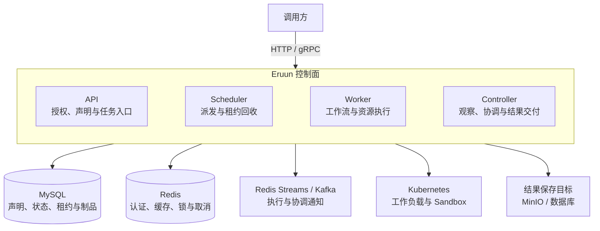
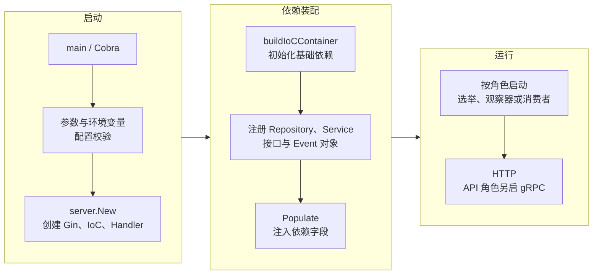
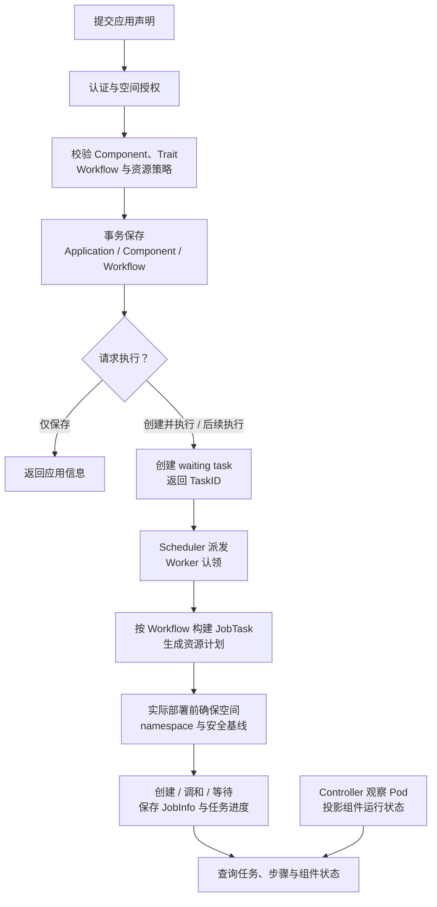
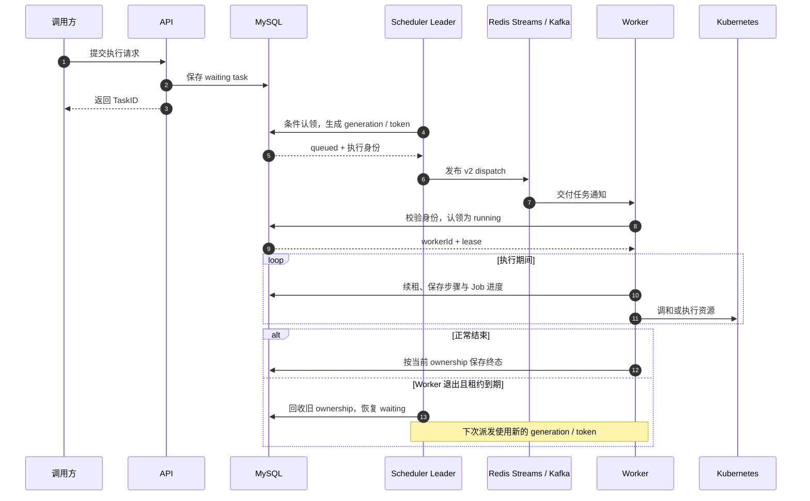
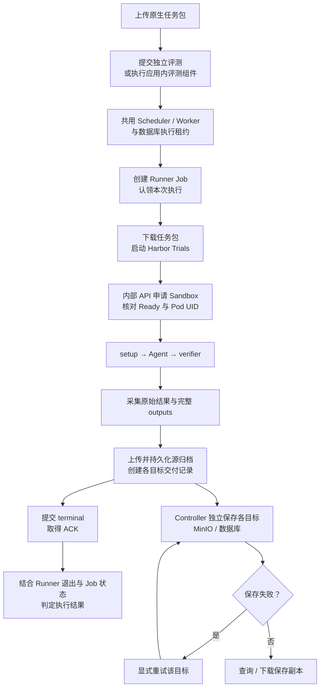

# Eruun 架构设计

> 状态：Implemented Reference。本文描述已实现的系统架构、模块边界和主要业务流程。代码基线为 [`52db1234`](https://github.com/PixelCores/Eruun/tree/52db123490ac8c8490ca827c63356bce6bfb4337)（2026-10-05）；未来能力见 [AI Runtime 愿景](ai-runtime-vision.md)。

## 1. 系统定位

Eruun 是面向 Agent、模型和 AI 工作负载的分布式运行时。当前实现以 **Kubernetes 应用部署、工作流执行和 Harbor 评测** 为核心，通过 HTTP/gRPC 提供服务。

设计围绕三个边界展开：

- **业务声明与实际运行分开**：Application、Component 和 Workflow 保存在 MySQL；Kubernetes 承载实际资源。
- **调度与执行分开**：Scheduler 选择待执行任务，Worker 执行任务，Controller 观察资源并协调后台工作。
- **状态与消息分开**：数据库保存任务状态和执行身份；消息队列传递执行通知，允许重复交付。

当前面向单 Kubernetes 集群，不提供客户端 CLI。通用 Agent 生命周期、MCP 管理、模型服务和跨集群调度仍属于后续方向。

## 2. 总体架构

### 2.1 运行架构图

图中展示系统组成与主要外部依赖；HTTP/gRPC 由 API 角色提供，入口代理按部署配置接入。各角色的协作流程见第 5 节，图中未展开完整网络访问矩阵。

### 2.2 四类运行角色

同一 `eruun-server` 二进制通过 `--role` / `ERUUN_ROLE` 选择一个角色，默认 `api`。

| 角色 | 核心职责 | 协作方式 |
| --- | --- | --- |
| `api` | HTTP/gRPC、账号与空间授权、声明校验、任务创建、状态查询、评测内部传输 | 业务变更落库，交由后台执行 |
| `scheduler` | 扫描到期 waiting task、派发执行、回收过期租约、处理 Workflow 定时计划 | 独立 Scheduler Lease 选主 |
| `worker` | 消费 dispatch、认领数据库租约、构建和执行 Job、维护心跳 | 多副本并行，每个 Worker 有本地 workload observer |
| `controller` | 全局 Pod 观察、组件状态投影、延迟 Job、结果/outbox、评测结果保存与清理、导入运行期协调 | 独立 Controller Lease 选主 |

Controller 和 Scheduler 使用不同的 Kubernetes Lease。API 与 Worker 不参加这两类选主；非 API 角色只暴露健康检查 HTTP。角色副本数独立配置，无 `all` 聚合角色。

## 3. 模块与依赖注入

### 3.1 模块边界

| 模块 | 职责 | 代码入口 |
| --- | --- | --- |
| 启动与配置 | 参数、环境变量、依赖装配、角色生命周期 | [cmd/server/app](../cmd/server/app)、[config](../pkg/apiserver/config) |
| 传输层 | 路由、请求绑定、鉴权入口、响应与错误映射 | [HTTP](../pkg/apiserver/interfaces/api)、[gRPC](../pkg/apiserver/interfaces/grpc) |
| 领域层 | 应用生命周期、工作流提交、账号/空间规则、资源导入 | [domain/service](../pkg/apiserver/domain/service) |
| 规格与持久化契约 | 共享规格、领域模型、查询与事务接口 | [spec](../pkg/apiserver/domain/spec)、[model](../pkg/apiserver/domain/model)、[repository](../pkg/apiserver/domain/repository) |
| 工作流运行时 | 调度、执行身份、步骤推进、资源生成与清理 | [event/workflow](../pkg/apiserver/event/workflow) |
| Trait 转换 | 将组件能力声明转换为 workload 变更 | [workflow/traits](../pkg/apiserver/workflow/traits) |
| 空间 Job | command、Harbor Runner、Sandbox、制品与交付 | [jobs](../pkg/apiserver/jobs) |
| 基础设施 | MySQL、Redis、Kafka、Kubernetes、观察器、锁、可观测性 | [infrastructure](../pkg/apiserver/infrastructure) |

HTTP Handler 和 gRPC Adapter 调用相同的业务服务；gRPC 不经过进程内 HTTP 转发。HTTP DTO 与 assembler 负责传输结构、派生字段及约定的脱敏，业务校验与状态变化由领域层和运行时负责。

### 3.2 启动与装配流程

依赖注入由 [server_assembly.go](../pkg/apiserver/server_assembly.go) 统一装配，[container.go](../pkg/apiserver/utils/container/container.go) 封装 `github.com/barnettZQG/inject`：

1. `Provides` 按类型注册依赖，`ProvideWithName` 按名称注册依赖。
2. Repository、Service、Handler 和 Event 通过导出字段的 `inject` 标签声明依赖。
3. 所有对象注册后调用 `Populate()`，一次完成字段注入；注册或注入失败使启动失败。

例如应用服务的 `Store` 使用 `inject:"datastore"`，`AppRepo` 使用 `inject:""` 按类型匹配。账号服务、空间管理器和部分 Repository 则在装配点通过构造函数显式传入依赖。

各角色共同装配 MySQL、Redis、账号、空间、Jobs 和领域对象，再按角色创建队列、观察器和接口。**对象被注册不等于对应后台工作已启动**。只有角色生命周期入口启动消费者或 Leader 工作。

进程配置的优先级为：显式命令行参数 → `ERUUN_*` 环境变量 → 默认值。账号与 Jobs 运行配置由指定 JSON 文件加载；业务系统设置由数据库中的 `SystemSetting` 管理。

## 4. 领域与数据模型

### 4.1 核心概念

| 概念 | 表达什么 | 关联关系 |
| --- | --- | --- |
| Workspace | 权限、资源配额与 namespace 边界 | 个人或团队空间拥有应用和独立任务 |
| Application | 一组部署声明及其生命周期 | 属于一个空间，包含 Component 和 Workflow |
| Component | 要部署或执行的对象 | 保存类型、镜像、properties 和 traits |
| Trait | 组件的附加能力 | 嵌入 Component，不形成独立调度实体 |
| Workflow | 步骤、执行模式、审批和失败策略 | 定义执行计划，可多次执行 |
| WorkflowQueue | 一次执行任务 | 保存 TaskID、状态、代次、Token、Worker 与租约 |
| JobTask / JobInfo | 内部动作 / 持久化执行明细 | 属于任务，以 executionKey 区分执行动作 |
| JobArtifact / ArtifactChunk / JobDelivery | 制品元数据 / 内容 / 保存目标状态 | 将评测执行与结果交付分开管理 |

应用任务通过 AppID 追溯空间；独立 Job 和资源导入任务直接保存 WorkspaceID。一次独立 Job 不需要创建占位 Application 或 Workflow 定义，但复用 `WorkflowQueue` 的调度与租约。

### 4.2 Component 与 Trait

组件支持 `webservice`、`store`、`job`、`scheduledjob`、`config` 和 `secret`，分别映射到长期工作负载、一次性/定时 Job、ConfigMap 和 Secret。引擎保留 `cloudjob` 扩展，但当前空间业务路径拒绝提交和执行。

| Trait 类别 | 主要字段 | 落地位置 |
| --- | --- | --- |
| 容器配置 | `envs`、`envFrom`、`resources`、`probes`、`securityPolicy` | Container |
| 容器组合 | `init`、`sidecar` | PodTemplate 中的附加容器 |
| 存储与调度 | `storage`、`targetWorkEnv` | Volume/PVC、nodeSelector |
| 更新与入口 | `rollout`、`ingress`、`service` | workload 更新策略、Ingress、Service |
| 身份与生命周期 | `rbac`、`share` | Kubernetes 身份、共享资源调和与清理 |
| 评测 | `eval` | 顶层 job 的 Harbor 评测构建路径 |

`ApplyTraits()` 按显式顺序处理共享 `spec.Traits`，聚合 `TraitResult` 后统一修改 workload，并返回附加资源。同一资源身份发生内容冲突时失败。init/sidecar 的嵌套能力受限制；默认容器名稳定生成，避免重复渲染改变 PodTemplate。

`service`、`share` 和 `eval` 由各自资源/任务构建路径处理，不经过通用 PodTemplate Processor。字段存在也不代表空间用户具有使用权限，安全限制见第 7 节。

## 5. 主要业务流程

### 5.1 应用保存与部署

保存应用只持久化声明，不创建 Kubernetes 资源。执行时完成空间安全基线，再按步骤处理资源。Workflow 按步骤数组顺序推进；`StepByStep` 按序处理组件或子步骤，`DAG` 将同一步骤的组件或子步骤组合为并行执行组。资源优先级组仍依次执行。审批步骤在数据库中保存等待状态。

任务进度由 Workflow 运行时写入；组件运行状态由 Controller 的 Pod 观察结果投影，经 `SyncComponentStatus()` 条件更新状态、就绪副本和异常信息，并失效相关缓存。投影不会改写用户的镜像或 Trait 声明，也会保护停止、清理等业务状态。

**Workflow 步骤完成、Kubernetes workload 就绪和异步 Job 完成是不同事实。** 对允许异步分发的步骤，父任务可以先完成；判断后台 Job 和评测结果时，还需读取 JobInfo 和结果状态。

入口与细节：[应用创建与执行](create-and-exec-application-api.md)、[Workflow 架构](workflow-architecture-guide.md)、[组件状态](application-status-api.md)。

### 5.2 调度、执行与恢复

消息可重复投递。Worker 的认领、续租和执行状态写入校验 `taskId + runGeneration + runToken + workerId`；过期 Worker 无权覆盖新执行。租约到期判断使用 MySQL 时间，避免不同节点时钟影响 ownership。

取消先写入持久化任务状态，再通过 Redis 通知正在执行的 Worker。审批等待会保存进度并结束本轮执行；批准继续后，任务恢复 waiting，由同一调度链继续推进。延迟 Job 则先将完整载荷和到期检查点写入 JobInfo，Controller 结合队列通知与数据库轮询恢复执行。

入口与细节：[dispatcher.go](../pkg/apiserver/event/workflow/dispatcher.go)、[controller.go](../pkg/apiserver/event/workflow/controller.go)、[workflow_lease.go](../pkg/apiserver/domain/repository/workflow_lease.go)、[分布式运行时](enterprise-distributed-runtime-design.md)。

### 5.3 独立 Job 与 Harbor 评测

独立 `command` Job 运行指定镜像和命令；独立评测使用 `type: job` + `traits.eval`。应用内评测使用同样的顶层 job 组件，沿用所属应用任务的 AppID/TaskID，以 executionKey 区分多个评测。

Runner Job 负责编排，Agent 和 verifier 在本集群按需创建的 Sandbox 中执行。新评测固定使用 ACK 环境；不开放任意 Pod、ServiceAccount 或环境后端选择，也不会在 Sandbox 失败后自动降级。Harbor 的 trial 步骤由 Harbor 自身管理，不拆成额外 Eruun Workflow。

评测成功需要完整采集、成功 terminal ACK、Runner 退出码为 0，以及 Kubernetes Job 成功。执行状态、采集状态和各目标保存状态分别记录；保存失败不抹去已完成的执行事实，重试保存不会重新运行 Agent。

源归档持久化后即可启动目标保存，无需等待 terminal ACK 或 Runner 退出。结果包含 `result.json` 与完整 `outputs/`。源归档默认保留 90 天；到期清理源字节，不删除元数据和已保存副本。未完整采集的 Sandbox 有单独的保留与回收流程。

入口与细节：[jobs/service.go](../pkg/apiserver/jobs/service.go)、[Runner](../pkg/apiserver/jobs/runners/harbor/runner.py)、[Sandbox](../pkg/apiserver/jobs/sandbox_runtime.go)、[空间 Job API](workspace-jobs-api.md)。

### 5.4 存量资源导入

导入分为两个持久化任务：**扫描 namespace → 保存候选快照 → 用户选择资源 → 提交纳管任务 → 核对资源身份与变更 → 应用纳管计划**。两类任务复用现有队列和 Worker；扫描不承担持续监听。

应用以 `native`、`observe` 或 `adopted` 表达管理边界。观察模式限制资源写入；纳管模式依据已保存的来源身份与计划执行受限变更，避免把外部资源当成新建资源处理。

入口与细节：[resourceimport/jobs.go](../pkg/apiserver/domain/service/resourceimport/jobs.go)、[存量资源导入](import-existing-namespace-api.md)、[应用管理模式](application-management-mode.md)。

## 6. 一致性与故障处理

### 6.1 数据所有权

| 数据 | 事实源 | 更新与读取原则 |
| --- | --- | --- |
| 应用声明、账号、空间、设置 | MySQL | 通过对应业务服务校验和持久化 |
| 任务状态、步骤、执行身份与租约 | MySQL | ownership 条件写入；队列消息不能覆盖数据库事实 |
| 实际 Pod、Job、Service 等资源 | Kubernetes | Worker/Controller 按职责操作，查询和观察反映实际运行 |
| 组件运行状态 | MySQL 中的观察投影 | Controller 条件更新，查询主要读取数据库与缓存 |
| 缓存、认证临时数据、锁、取消信号 | Redis | 按各自职责管理；缓存失效后回到持久化事实源 |
| 源制品与保存目标状态 | MySQL 制品记录及目标存储 | 元数据、完整字节和目标交付状态分别管理 |

TaskID 标识任务，generation/token 标识执行代次，executionKey 标识具体 Job 动作，Kubernetes UID 标识实际对象。恢复和结果接收须校验相应身份，不能只比较名称。

### 6.2 主要故障路径

| 场景 | 当前处理 |
| --- | --- |
| 重复 dispatch 或旧执行消息 | 数据库 claim/CAS 拒绝不匹配的 ownership |
| Worker 退出 | 心跳停止，Scheduler 在租约到期后回收并重新派发 |
| Controller/Scheduler Leader 切换 | 各自结束任期，后继从数据库检查点和队列恢复 |
| 延迟通知丢失 | Controller 扫描数据库中已到期的 Job 检查点 |
| 结果通知丢失或重复 | result outbox 与执行身份核对支撑重试和去重 |
| 数据库或关键认证依赖不可用 | 返回明确错误或未就绪，停止无法验证的状态变更/授权 |
| 结果目标保存失败 | 保留失败状态，支持单目标显式重试 |
| 资源执行失败 | 按失败策略清理；区分本次创建、已存在及共享资源 |

generation/token fencing 保护执行准入和持久化状态写入，不能撤销已经发生的 Kubernetes 或外部系统副作用。外部调用仍需要幂等或补偿；系统不承诺外部副作用 exactly-once。

Job 执行另有全局并发与空间并发策略，依据调度类、排队时间和 ownership 准入；它与任务 dispatch 分属不同阶段。同步 Job 的 OOM 重试受次数、期限和资源增长上限约束。细节见 [Job 全局调度](workflow-global-scheduler-design.md) 和 [失败策略](workflow-failure-policy.md)。

## 7. 安全与访问边界

| 边界 | 当前机制 |
| --- | --- |
| 登录身份 | Bearer 会话，撤销、刷新和过期由账号服务管理 |
| 业务授权 | 显式接口策略、Workspace 成员角色、请求 Scope 与 scoped datastore |
| Kubernetes 操作 | 固定空间 namespace，限制客户端访问与资源载荷 |
| 空间安全基线 | 首次部署初始化 Namespace、RBAC、Quota、LimitRange、NetworkPolicy |
| Runner 内部接口 | 执行能力凭据，结合 generation、attempt、claim 与 Pod/Job UID 校验 |
| 客户端 IP | `TrustedProxyCIDRs` 限定可信代理，默认忽略转发头 |
| 出站请求 | URL 安全策略与受约束的 HTTP 客户端 |
| Secret 与执行凭据 | 会话与 Runner 凭据限制暴露；HTTP 请求日志不记录 Authorization；制品与组件凭据受对应访问权限保护 |

认证或授权依赖失败时拒绝访问；未定义授权策略的业务入口默认拒绝。后台从持久化的应用/任务归属解析空间，不依赖用户传入的 namespace。

空间业务路径拒绝 CloudJob、额外 RBAC、任意 ServiceAccount、host namespace/hostPath/hostPort、跨 namespace 操作及 NodePort/LoadBalancer。Ingress 和存储类受部署配置限制。NetworkPolicy 的实际隔离效果仍依赖 CNI 和正确的集群网络配置。

`TrustedProxyCIDRs` 用于代理后的真实用户 IP 识别，影响 HTTP 认证与验证码的 IP 限流及请求日志。仅填写实际可信代理网段，入口应覆盖外部传入的转发头；该配置不改变成员权限。

入口与细节：[账号与空间](account-auth-workspaces.md)、[URL 安全策略](url-security-policy.md)、[HTTP 错误响应](api-error-response-contract.md)、[gRPC API](grpc-api.md)。

## 8. 部署与运行生命周期

### 8.1 部署拓扑与配置

Helm 固定生成四角色 Deployment，默认创建独立 ServiceAccount，也可指定已有账号；Service 只选择 API Pod。副本与 resources 分角色配置，PDB 和 topology spread 使用统一参数按角色应用。生产部署需要明确的镜像版本、依赖容量、权限和网络边界；内置 MySQL/Redis 用于开发与演示。

| 配置来源 | 管理内容 | 生效方式 |
| --- | --- | --- |
| flags / `ERUUN_*` | 角色、监听地址、连接、运行参数 | 进程启动时读取 |
| 账号配置 JSON | Origin、OAuth、可信代理、空间资源策略 | 所有角色读取，变更后滚动重启 |
| Jobs 配置 JSON | Runner 镜像与工作盘、内部 API、出站规则、可选 MinIO | 启动加载，按配置契约更新 |
| SystemSetting | URL 策略、监控和 Job 调度等业务设置 | 由所属模块读取或刷新 |

Schema 生命周期独立于正常任务执行：首次 Helm 安装由 API 在 MySQL 命名锁内初始化；升级先运行 `pre-upgrade` migration Job，新角色以 validate 模式核对 marker、表和列。`migrate-only` 只连接 MySQL，迁移成功后退出，不启动 Kubernetes、队列或 HTTP 运行时。

### 8.2 健康、就绪与关闭

| 阶段 | 行为 |
| --- | --- |
| 启动 | 配置校验、依赖装配、字段注入，再启动角色运行工作 |
| Liveness | `/api/v1/healthz` 表示 HTTP 进程仍能响应 |
| Readiness | `/api/v1/readyz` 检查数据库、角色运行状态与所需队列；API 另检查 Redis |
| Leader 就绪 | Controller/Scheduler 待机可就绪，成为 Leader 后须完成初始化 |
| Worker 就绪 | 本地观察器启动，dispatch 消费者运行并 ready |
| 关闭 | 停止 HTTP/gRPC 接入和选举，停止 Worker 领取，限时排空在途执行 |
| 超时退出 | 取消剩余执行，租约停止续期，后续由 Scheduler 接管 |

HTTP/gRPC 关闭和运行时排空各有时间预算。运行时先取消选举并等待任期内工作及回调结束；Worker 停止接单并限时排空；最后取消运行 context。HTTP/gRPC 同时开始各自的优雅关闭。

可观测性使用 klog、可选 OpenTelemetry tracing 与运行指标，帮助区分任务排队、执行、资源就绪和制品交付阶段。运行日志以 TaskID 等身份关联执行，新增日志应避免记录执行 Token；原始任务输出与组件凭据仍需按敏感内容管理。

部署参数见 [Helm 部署](helm-deployment.md)；恢复与选举细节见 [Leader/Informer 恢复](leader-informer-recovery.md)。

## 9. 扩展与验证边界

新增能力优先复用现有领域模块、任务队列、执行租约和资源控制器。新增 Trait 需同时明确共享规格、校验、生成/执行路径与权限；新增 API 需覆盖 HTTP/gRPC 契约、业务规则、持久化及文档。

Harbor 的可选 Codex/Claude Code 会话恢复已有实现，但仍属实验能力，真实 ACS 验收边界见 [Harbor 恢复说明](harbor-runtime-recovery.md)。它不等于通用 Agent 会话或记忆服务。

本架构说明以代码和已实现契约为依据。单元/race 测试与 Helm 渲染能验证本地行为；真实数据库、队列、CNI、Sandbox Controller 故障恢复与规模容量仍需对应环境验收。架构图不构成这些外部能力的验收证据。

继续阅读：[文档索引](README.md)、[架构图集](architecture-diagrams.md)、[跨层字段契约](core-module-boundary-and-cross-layer-contracts.md)、[AI Runtime 愿景](ai-runtime-vision.md)。
