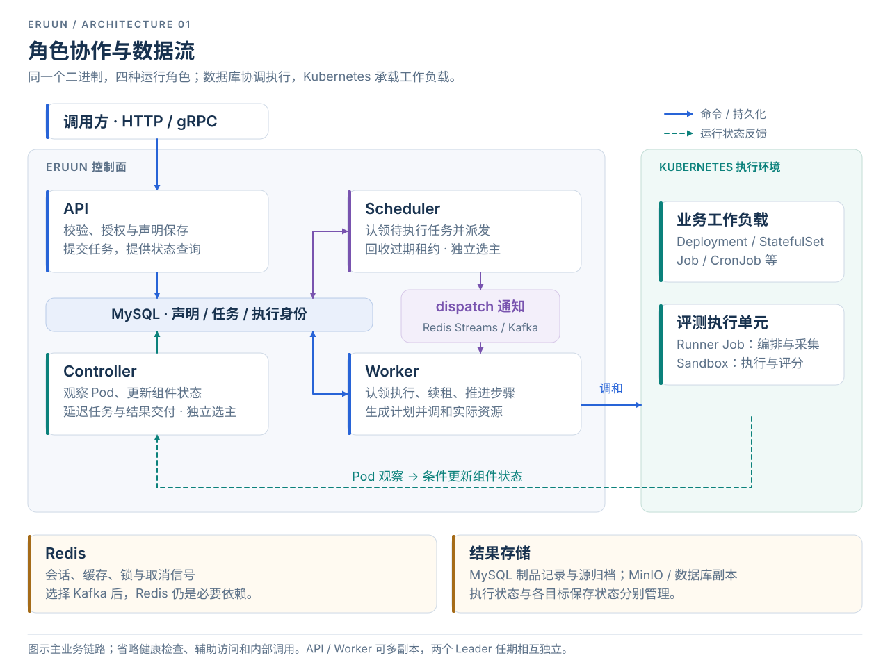
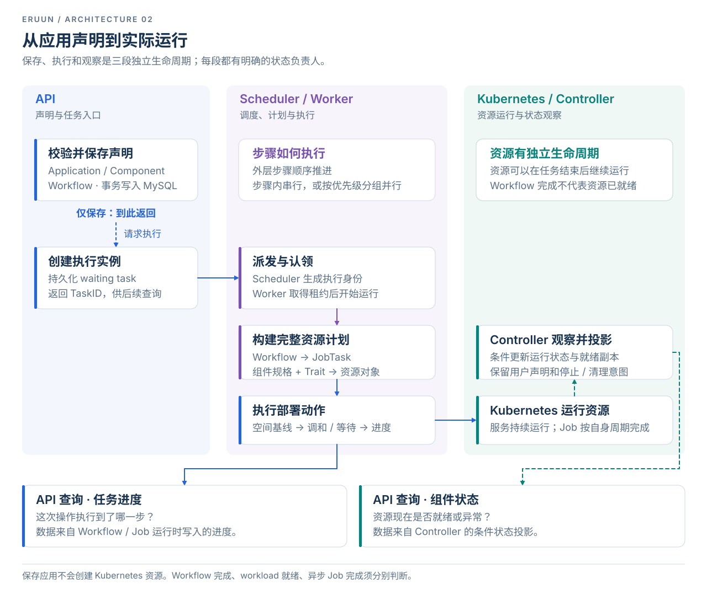
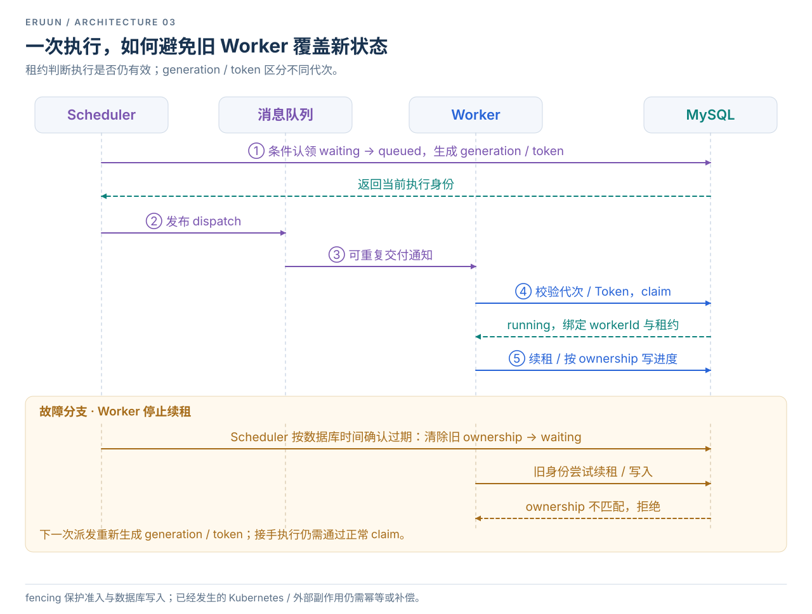
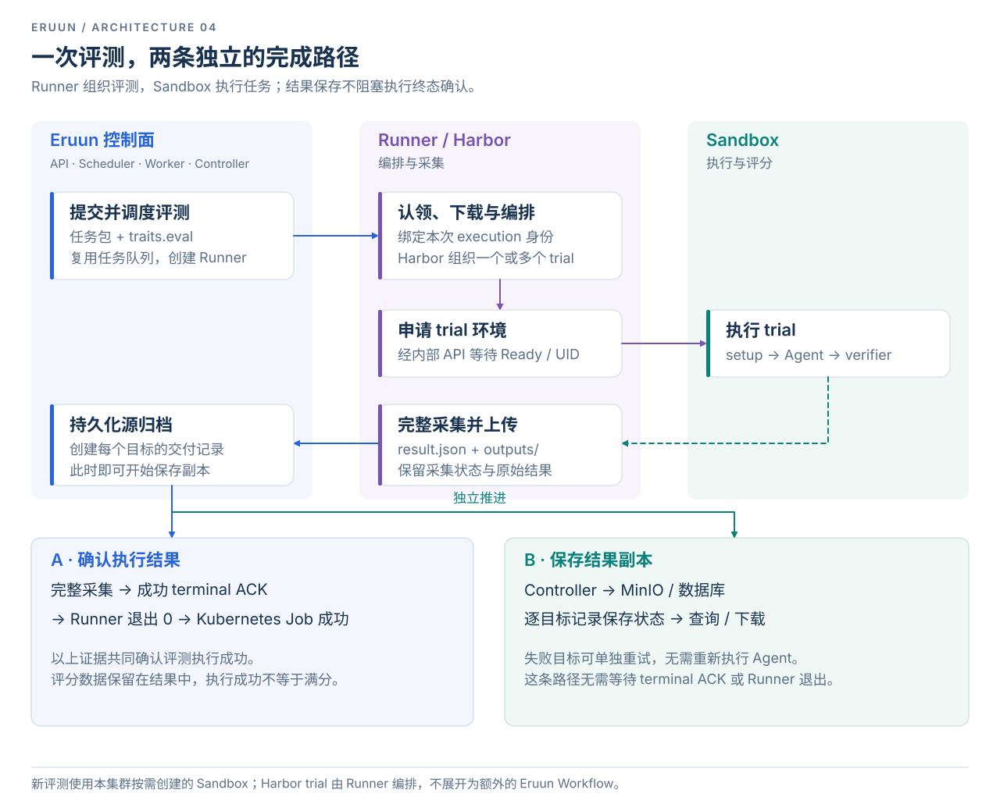

# Eruun 架构设计

> **状态：Implemented Reference** · 代码基线 [`52db1234`](https://github.com/PixelCores/Eruun/tree/52db123490ac8c8490ca827c63356bce6bfb4337) · 2026-10-06 复核。本文说明当前实现；未来方向见 [AI Runtime 愿景](ai-runtime-vision.md)。

Eruun 是面向 Agent、模型和 AI 工作负载的分布式运行时。当前产品以 **Kubernetes 应用部署、工作流执行和 Harbor 评测** 为核心：调用方提交声明或任务，控制面完成授权、调度和执行协调，Kubernetes 运行工作负载，调用方按任务身份查询进度与结果。

理解整个系统，先区分三个对象：**声明描述要做什么，任务记录某一次执行，资源反映实际运行。** 一份应用声明可以执行多次，一次任务可以生成多个资源，资源也可以在任务结束后继续运行。

本文按“系统边界 → 业务流程 → 一致性 → 代码落点”展开。图中蓝色表示请求与执行，紫色表示调度或编排，绿色表示运行状态与结果反馈。SVG 可直接打开查看细节。

## 1. 系统边界与角色协作

### 1.1 总体架构

系统沿三条主线工作：

1. **提交**：API 校验请求与空间权限，把声明和执行任务写入 MySQL。创建任务成功表示请求已持久化，后续执行通过 TaskID 跟踪。
2. **执行**：Scheduler 从数据库认领任务并发送通知；Worker 取得执行租约后推进工作流、生成资源并调用 Kubernetes。
3. **观察**：Controller 接收 Pod 变化，条件更新组件运行状态，并推进延迟任务、结果交付等后台工作。

MySQL 保存声明、进度、执行身份和恢复检查点；消息队列负责通知。Kubernetes 是实际资源的事实源，数据库中的组件状态是它的观察投影。Redis 承担会话、缓存、锁和取消信号；即使 dispatch 选择 Kafka，Redis 仍是必要依赖。

当前运行于单 Kubernetes 集群，通过 HTTP/gRPC 提供服务，不附带客户端 CLI。通用 Agent 生命周期、MCP 管理、模型服务与跨集群调度仍属于后续方向。

### 1.2 为什么拆成四个角色

四角色来自同一个 `eruun-server` 二进制，通过 `--role` / `ERUUN_ROLE` 选择，默认 `api`。这是按工作性质划分的运行角色：同步请求、任务派发、长时间执行、后台观察分别拥有自己的运行生命周期。

| 角色 | 负责什么 | 运行与扩容方式 |
| --- | --- | --- |
| API | HTTP/gRPC、账号与空间授权、声明保存、任务入口与查询、Runner 内部接口 | 多副本提供服务 |
| Scheduler | waiting task 派发、过期租约回收、Workflow 定时计划 | 独立 Kubernetes Lease，Leader 推进调度 |
| Worker | dispatch 消费、执行租约、步骤推进、资源执行与等待 | 多副本分担执行，各自运行 workload observer |
| Controller | 全局 Pod 观察、组件投影、延迟 Job、结果/outbox、制品交付与清理 | 独立 Kubernetes Lease，Leader 运行后台协调 |

这样可以按请求压力或执行量分别扩容，也使观察与结果处理拥有独立于任务派发的 Leader 任期。代价是进程之间必须依靠持久化状态协调，无法把任务安全性寄托在某个进程的内存中。

四角色仍共享数据库、Redis、业务模型和大部分依赖装配。非 API 角色只开放健康检查 HTTP；没有 `all` 聚合角色。代码中的 `WorkflowCtl`、`InstantJobCtl` 等控制对象也不等同于 `controller` 进程角色，它们按各自调用链运行。

## 2. 声明、任务与资源的关系

### 2.1 三种生命周期

| 层次 | 核心对象 | 生命周期与职责 |
| --- | --- | --- |
| 业务声明 | Workspace、Application、Component、Workflow | Workspace 定义权限与 namespace 边界；应用保存组件与执行计划，可以修改并重复执行 |
| 执行记录 | WorkflowQueue、JobTask、JobInfo | WorkflowQueue 表示一次任务；JobTask 是内部动作计划；JobInfo 保存动作执行明细与检查点 |
| 实际资源与结果 | Kubernetes 对象、JobArtifact、ArtifactChunk、JobDelivery | 资源按自身生命周期运行；制品记录内容，Delivery 分别记录各目标保存状态 |

应用任务通过 AppID 追溯所属空间；独立 Job 和导入任务直接保存 WorkspaceID。独立任务复用 `WorkflowQueue` 的调度与租约，无需先创建占位应用或 Workflow 定义。

**TaskID 标识一次任务，generation/token 标识一次执行代次，executionKey 标识具体 Job 动作，Kubernetes UID 标识实际对象。** 这些身份解决不同问题，恢复和结果接收不能只比较资源名称。

### 2.2 Component 与 Trait 如何形成资源

Component 决定资源的基本形态：`webservice`、`store`、`job`、`scheduledjob`、`config`、`secret` 分别对应长期服务、存储型工作负载、一次性/定时任务、ConfigMap 和 Secret。Trait 在这个形态上增加容器、存储、调度、入口或评测能力。

构建路径为 **组件规格 + Trait → JobTask/资源计划 → 具体资源操作**。通用 `ApplyTraits()` 按显式顺序处理共享 `spec.Traits`，汇总 `TraitResult`，集中修改 workload 并返回附加资源；同一 kind/namespace/name 的附加资源存在内容冲突时失败。

这个边界使一个 Trait 不必成为独立调度实体，能力组合也有统一的冲突处理点。`service`、`share`、`eval` 则由相应资源或任务构建路径处理。通用 Trait 采用显式处理顺序，不提供动态 Trait 注册入口；新增能力需要同时更新规格、校验、生成路径和空间权限。

源码入口：[共享规格](../pkg/apiserver/domain/spec)、[Job 构建](../pkg/apiserver/event/workflow/job_builder_steps.go)、[Trait 聚合](../pkg/apiserver/workflow/traits/processor.go)。

## 3. 业务流程：保存并部署一个应用

### 3.1 保存是声明操作，执行是一次任务

保存应用时，API 完成空间授权、组件/Trait/Workflow 校验，在事务中持久化 Application、Component 和 Workflow。**这一步不创建 Kubernetes 资源。** 调用方可以只保存，也可以请求创建并执行，或在之后单独执行。

执行入口经过应用锁与事务创建 waiting task。Scheduler 派发、Worker 认领后，先构建完整 JobTask 与资源计划；实际部署动作开始前，确保空间 namespace 及其安全基线，再调和资源并记录进度。构建阶段先暴露规格错误，也避免在计划尚未形成时就开始资源变更。

### 3.2 Workflow 如何推进

外层步骤按数组顺序执行。`StepByStep` 按序处理组件或子步骤；`DAG` 将同一步骤内的组件或子步骤组织为并行组，同一资源优先级组可以并行，不同优先级组仍依次推进。当前 `DAG` 的含义是步骤内部的分组并行，不提供任意依赖图调度。

审批步骤会保存 `CurrentStep` 和等待状态，结束本轮执行。批准继续时，通过条件更新恢复为 waiting，再进入同一调度链。延迟 Job 先保存完整载荷与到期检查点，再发送通知。两类等待都能跨越进程重启，而无需长期占用一轮执行。

### 3.3 “完成”需要看哪一种状态

| 状态 | 回答的问题 | 主要更新者 |
| --- | --- | --- |
| Workflow / JobInfo 进度 | 这次操作执行到哪里，哪个动作失败？ | Workflow 与 Job 运行时 |
| 组件运行状态 | 现在有多少副本就绪，是否异常？ | Controller 的 Pod 观察投影 |
| 异步 Job / 评测结果 | 后台任务是否结束，结果是否采集和保存？ | 对应 Job、Runner 与结果处理链 |

Controller 经 `SyncComponentStatus()` 条件更新状态、就绪副本与异常信息，并失效缓存。它不会把观察事件写回镜像或 Trait 声明；停止、清理等业务状态也受到保护，避免旧 Pod 事件覆盖用户意图。

允许异步分发的步骤可以先完成，因此 **Workflow 完成不等于 workload 就绪，也不等于异步 Job 完成**。查询和告警必须选择与业务问题对应的状态。

接口与细节：[应用创建与执行](create-and-exec-application-api.md)、[Workflow 架构](workflow-architecture-guide.md)、[组件状态查询](application-status-api.md)。

## 4. 一致性与故障恢复

### 4.1 为什么数据库决定谁能执行

进程可能在发送消息前后退出，队列也可能重复投递。Eruun 把执行身份和租约放在数据库中：收到消息只是开始尝试认领任务，是否能执行由数据库中的当前状态决定。

Scheduler 将 waiting 任务条件更新为 queued，生成 `runGeneration` 与 `runToken`。Worker 首次 claim 校验任务及该执行身份，成功后绑定 `workerId`、进入 running 并取得租约。后续续租和执行状态写入同时校验任务、代次、Token 与 Worker 身份。

Worker 停止续租后，Scheduler 按 **MySQL 时间**判断过期并清除旧 ownership，使任务回到 waiting。重新派发产生新身份；旧 Worker 即使恢复，也不能继续以旧身份写入当前执行状态。

数据库由此承担持久化协调中心的职责，执行推进依赖其可用性。租约和 fencing 保护执行准入与状态写入，**不能撤销已发生的 Kubernetes 或外部系统副作用**；外部操作仍需幂等或补偿，不能据此推导出 exactly-once。

### 4.2 恢复依赖什么证据

| 中断或故障 | 恢复依据与处理 |
| --- | --- |
| 重复通知、旧代次消息 | 数据库 claim / 条件写入拒绝无效身份 |
| Worker 退出或失联 | 租约到期后回收，再按新代次派发 |
| Scheduler / Controller 切主 | 结束旧任期，由新 Leader 从持久化记录继续协调 |
| 延迟通知丢失 | Controller 扫描 JobInfo 的到期检查点，完整载荷仍在数据库中 |
| 结果通知重复或丢失 | result outbox 与执行身份核对支持重试和去重 |
| 用户取消 | 先写持久化状态，再经 Redis 通知执行中的 Worker |
| 保存某个结果目标失败 | 保留独立失败状态，显式重试该目标 |

任务 dispatch 与 Job 执行准入是两个阶段。后者另有全局/空间并发限制、调度类与等待老化策略；同步 Job 的 OOM 重试也受次数、期限和资源上限约束。扩容 Worker 不能绕过这些限制。

源码与专题：[执行租约](../pkg/apiserver/domain/repository/workflow_lease.go)、[派发器](../pkg/apiserver/event/workflow/dispatcher.go)、[分布式运行时](enterprise-distributed-runtime-design.md)、[Job 调度](workflow-global-scheduler-design.md)、[失败策略](workflow-failure-policy.md)。

## 5. 业务流程：提交评测并取得结果

独立 `command` Job 执行指定镜像和命令；Harbor 评测以 `type: job` + `traits.eval` 提交。应用内的评测使用同样的顶层 job 组件，复用所属任务的 AppID/TaskID，并以 executionKey 区分具体动作。

### 5.1 Runner 与 Sandbox 的分工

Runner 是 Kubernetes Job，负责认领执行、下载任务包、调用 Harbor、采集结果与上传归档。Harbor 在本集群按需创建的 Sandbox 中执行 trial 的 setup、Agent 和 verifier；Runner 通过内部 API 等待 Sandbox Ready 并核对 Pod UID。

这个分工把编排/采集与实际执行环境分开。Harbor 自己管理 trial 细节，无需为每个内部阶段增加 Eruun Workflow。新评测固定使用 ACK 环境，不开放任意 Pod、ServiceAccount 或环境后端选择，也不会在 Sandbox 失败后自动降级。

### 5.2 执行结束与结果保存独立确认

源归档持久化时即创建各目标交付记录，Controller 可以立即开始保存副本，无需等待 terminal ACK 或 Runner 退出。

- **执行路径**：完整采集、成功 terminal ACK、Runner 退出码为 0，以及 Kubernetes Job 成功，共同确认评测执行成功。verifier 评分保存在结果中，执行成功不等于任务获得满分。
- **交付路径**：MinIO / 数据库等目标分别记录保存状态。某个目标失败可以单独重试，不需要再次运行 Agent，也不会抹去已经完成的执行事实。

这种拆分使较慢或临时不可用的结果存储能够独立处理。相应地，调用方需要分别展示执行状态、采集状态与目标保存状态，不能压缩成一个“成功/失败”。

结果包括 `result.json` 与完整 `outputs/`。源归档默认保留 90 天，到期清理源字节，保留元数据与已保存副本；未完整采集的 Sandbox 另有保留与回收流程。Codex/Claude Code 会话恢复已有实验实现，其真实 ACS 验收边界见 [Harbor 恢复说明](harbor-runtime-recovery.md)。

接口与实现：[空间 Job API](workspace-jobs-api.md)、[Jobs 服务](../pkg/apiserver/jobs/service.go)、[Runner](../pkg/apiserver/jobs/runners/harbor/runner.py)、[Sandbox](../pkg/apiserver/jobs/sandbox_runtime.go)。

## 6. 空间、安全与资源管理边界

### 6.1 权限沿调用链传递

HTTP 请求依次经过 **Bearer 身份 → 显式接口策略 → Workspace 成员权限 → 请求 Scope → scoped datastore**。未定义授权策略的业务入口默认拒绝；认证或授权依赖不可用时拒绝访问。后台执行再从持久化应用/任务归属解析空间，不能信任调用方传入的 namespace。

空间首次部署建立 Namespace、RBAC、Quota、LimitRange 与 NetworkPolicy；受限 Kubernetes 客户端和资源载荷校验共同约束操作范围。当前空间业务路径拒绝 CloudJob、额外 RBAC、任意 ServiceAccount、host namespace/hostPath/hostPort、跨 namespace 及 NodePort/LoadBalancer；Ingress 与存储类受配置限制。NetworkPolicy 的隔离效果仍依赖 CNI。

Runner 内部接口使用执行能力凭据，结合 generation、attempt、claim 和 Pod/Job UID 绑定本次执行。普通用户会话不能替代这类执行身份。

### 6.2 入口代理与敏感数据

`TrustedProxyCIDRs` 位于账号配置中，列出可信反向代理网段。它决定何时采信转发头以识别真实客户端 IP，影响认证/验证码的 IP 限流与请求日志。默认忽略转发头；应仅填写实际代理网段，并由入口覆盖外部传入的转发头。该设置不授予空间权限，也不是全 API 限流开关。

HTTP 请求日志不记录 Authorization，执行凭据也有独立暴露限制。但组件凭据与原始任务输出仍可能含敏感内容，需要依靠权限、存储和保留策略保护，不能假定所有结果都会自动脱敏。

### 6.3 存量资源导入

导入沿用现有任务机制，分两次执行：**扫描 namespace → 保存候选快照 → 用户选择 → 提交纳管任务 → 核对身份与变更 → 应用计划**。扫描是一次性工作，不承担持续监听。

应用以 `native`、`observe`、`adopted` 区分管理边界。observe 限制资源写入；adopted 按已保存的来源身份与计划执行受限变更，避免把外部资源当作新建资源覆盖。

专题：[账号与空间](account-auth-workspaces.md)、[URL 安全](url-security-policy.md)、[存量资源导入](import-existing-namespace-api.md)、[管理模式](application-management-mode.md)。

## 7. 代码组织与依赖注入

### 7.1 从入口追到执行

| 关注点 | 代码入口 | 在架构中的位置 |
| --- | --- | --- |
| 启动与装配 | [cmd/main.go](../cmd/main.go)、[server_assembly.go](../pkg/apiserver/server_assembly.go) | 读取配置、连接基础设施、注册对象、启动角色 |
| 协议适配 | [interfaces/api](../pkg/apiserver/interfaces/api)、[interfaces/grpc](../pkg/apiserver/interfaces/grpc) | 请求/响应、路由与授权入口 |
| 业务规则 | [domain/service](../pkg/apiserver/domain/service)、[domain/repository](../pkg/apiserver/domain/repository) | 应用生命周期、空间规则、事务与持久化契约 |
| 执行机制 | [event/workflow](../pkg/apiserver/event/workflow)、[workflow/traits](../pkg/apiserver/workflow/traits) | 调度、租约、步骤、资源计划与执行 |
| 平台任务 | [jobs](../pkg/apiserver/jobs) | command、评测、Sandbox、制品与交付 |
| 基础设施 | [infrastructure](../pkg/apiserver/infrastructure) | 数据库、队列、Kubernetes、Informer、锁与可观测性 |

HTTP Handler 与 gRPC Adapter 调用相同业务服务，gRPC 不在进程内转发成 HTTP。DTO 与 assembler 处理传输结构和响应映射；业务状态变化由领域服务和运行时推进。这里描述职责边界，不假定当前包之间已形成严格单向的分层依赖。

### 7.2 依赖注入在哪完成

装配入口在 **[server_assembly.go](../pkg/apiserver/server_assembly.go)**，容器封装在 [utils/container/container.go](../pkg/apiserver/utils/container/container.go)，底层使用 `github.com/barnettZQG/inject`。

启动链为 `main → NewAPIServerCommand → server.New → buildIoCContainer → Populate → 角色运行入口`：

1. 初始化基础设施与核心服务。部分对象通过构造函数显式接收依赖。
2. `Provides` 按类型、`ProvideWithName` 按名称注册 Repository、Service、Handler 与 Event 对象。
3. `Populate()` 根据导出字段的 `inject` 标签完成注入；注册或注入失败会使启动失败。
4. 按角色启动接口、消费者、观察器或选主工作。

例如应用服务的 `Store` 使用 `inject:"datastore"` 按名匹配，`AppRepo` 使用 `inject:""` 按类型匹配。各角色共同装配 MySQL、Redis、账号、空间、Jobs 与领域对象；队列和运行组件按角色选择。**注册对象与启动后台工作是两回事**，对象存在不代表其消费者已经运行。

配置优先级为显式 flags → `ERUUN_*` 环境变量 → 默认值。账号/Jobs JSON 管理对应启动配置；`SystemSetting` 管理由业务模块读取或刷新的数据库设置。

## 8. 部署、运维与实现取舍

### 8.1 部署与生命周期

Helm 生成四个角色 Deployment，Service 只选择 API Pod。各角色可分别配置副本和 resources；PDB 与 topology spread 使用统一参数按角色应用。默认创建独立 ServiceAccount，也可指定已有账号。

Schema 迁移与正常运行分开：首次 Helm 安装由 API 在 MySQL 命名锁内初始化；升级先运行 `pre-upgrade` migration Job，随后各角色校验 marker、表和列。`migrate-only` 只连接 MySQL，成功后退出。

| 运维信号 | 表达什么 |
| --- | --- |
| `/api/v1/healthz` | HTTP 进程仍能响应 |
| `/api/v1/readyz` | 数据库、所需队列与角色状态满足就绪条件；API 另检查 Redis |
| Leader 状态 | Controller/Scheduler 待机可就绪；成为 Leader 后需完成初始化 |
| Worker 状态 | 本地观察器与 dispatch 消费者已进入可工作状态 |

关闭时，HTTP/gRPC 启动各自的限时优雅关闭；运行时取消选举并等待任期内工作与回调结束，再停止 Worker 接单、限时排空在途任务，最后取消剩余执行。后续接手依靠租约恢复。

排障应沿 TaskID、执行代次、executionKey 与 Kubernetes UID 关联证据，分别检查排队、执行、资源就绪、采集和交付。klog、可选 OpenTelemetry tracing 与运行指标服务于这些阶段，不能只看一个最终状态。

### 8.2 关键选择及其代价

| 选择 | 获得的能力 | 必须接受的约束 |
| --- | --- | --- |
| 数据库保存执行身份，队列只通知 | 重复交付可校验，进程故障可恢复 | 数据库是执行协调的关键依赖 |
| 四角色共享模型、分开运行 | 按工作性质扩容与管理生命周期 | 共享数据契约与基础设施仍会耦合各角色 |
| 声明与观察投影分开 | 保留用户意图，反映资源的实时变化 | 查询会有观察延迟，任务与组件状态需分别理解 |
| 审批、延迟工作持久化 | 等待可跨进程，不长期占用一轮执行 | 检查点、唤醒与条件更新必须协同维护 |
| 执行与结果交付分开 | 单目标保存可重试，避免重跑 Agent | 调用方需要处理多个状态维度 |

本文以当前代码与实现契约为依据。真实数据库/队列故障、CNI 隔离、Sandbox Controller 恢复与容量上限仍需在对应环境验收；架构描述不替代这些证据。

进一步阅读：[Helm 部署](helm-deployment.md)、[Leader/Informer 恢复](leader-informer-recovery.md)、[跨层字段契约](core-module-boundary-and-cross-layer-contracts.md)、[专题架构图](architecture-diagrams.md)、[文档索引](README.md)。
